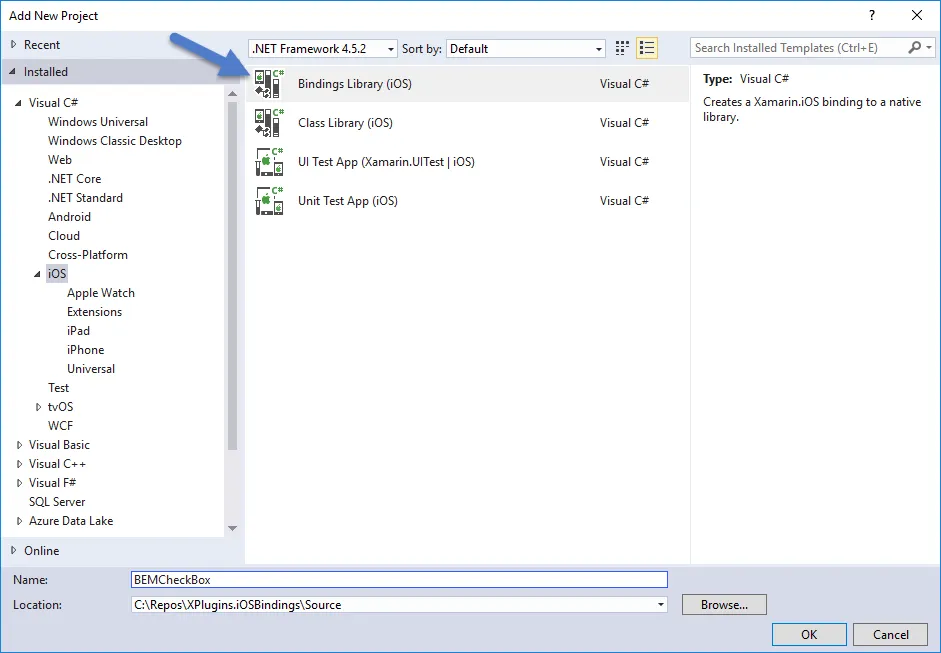
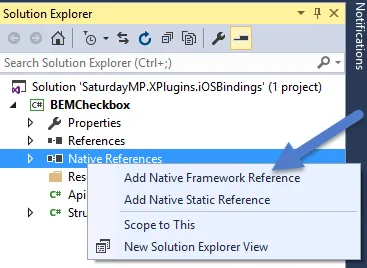
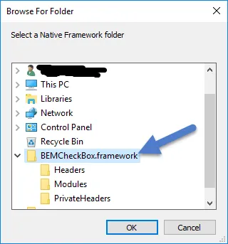
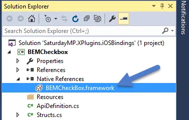
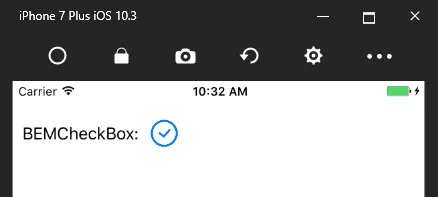

This is the 4th and final part about incorporating an objective-c library in Xamarin.  In my case I'm binding [BEMCheckBox](https://github.com/Boris-Em/BEMCheckBox).  In [part 3](https://nftb.saturdaymp.com/today-i-learned-how-to-create-a-xamarin-ios-binding-for-objective-c-libraries-part-3-using-sharpie-to-create-binding-interface/) we used Sharpie to create a C# interface for the BEMCheckBox.  In this post we will show how to use that interface. Finally you can find a working example of BEMCheckBox in Xamarin iOS [here](https://github.com/saturdaymp/XPlugins.iOS.BEMCheckBox).

First take the APIDefinitions.cs and Structs.cs files in a location accessible to Visual Studio.  Also take the BEMCheckBox.framework folder and move this location accessible to Visual Studio.  For me this means moving the files to my Windows computer.

Now open up the Xamarin project that will consume the objective-c library and add a new project.  When prompted for the type pick Bindings Library (iOS).

[](https://nftb.saturdaymp.com/wp-content/uploads/2017/07/AddBindingLibrary.png)

Next add a reference to the BEMCheckBox framework.  Use the special native reference just as you would a normal reference.

[](https://nftb.saturdaymp.com/wp-content/uploads/2017/07/AddNativeReference.png)

[](https://nftb.saturdaymp.com/wp-content/uploads/2017/07/AddBEMCheckBoxFramework.png)

[](https://nftb.saturdaymp.com/wp-content/uploads/2017/07/NativeReferenceAdded.png)

Next replace the ApiDefinition and Structs files with the ones we generated using Sharpie.  First up the the ApiDefinition which originally looked like:

```csharp
namespace BEMCheckBoxBinding
{
  // The first step to creating a binding is to add your native library ("libNativeLibrary.a")
  // to the project by right-clicking (or Control-clicking) the folder containing this source
  // file and clicking "Add files..." and then simply select the native library (or libraries)
  // that you want to bind.

  // More comments....
}
```

Now it should look like:

```csharp
namespace BEMCheckBoxBinding
{
  // @interface BEMCheckBoxGroup : NSObject
  [BaseType (typeof(NSObject))]
  interface BEMCheckBoxGroup
  {
    // @property (readonly, nonatomic, strong) NSHashTable * _Nonnull checkBoxes;
    [Export ("checkBoxes", ArgumentSemantic.Strong)]
    NSHashTable CheckBoxes { get; }

    // @property (nonatomic, strong) BEMCheckBox * _Nullable selectedCheckBox;
    [NullAllowed, Export ("selectedCheckBox", ArgumentSemantic.Strong)]
    BEMCheckBox SelectedCheckBox { get; set; }

    // More properties and methods...
  }

  // @interface BEMCheckBox : UIControl <CAAnimationDelegate>
  [BaseType (typeof(UIControl))]
  interface BEMCheckBox : ICAAnimationDelegate
  {
    [Wrap ("WeakDelegate")]
    [NullAllowed]
    BEMCheckBoxDelegate Delegate { get; set; }

    // @property (nonatomic, weak) id<BEMCheckBoxDelegate> _Nullable delegate __attribute__((iboutlet));
    [NullAllowed, Export ("delegate", ArgumentSemantic.Weak)]
    NSObject WeakDelegate { get; set; }

    // @property (nonatomic) BOOL on;
    [Export ("on")]
    bool On { get; set; }

    // More properties and methods...
  }

  // @protocol BEMCheckBoxDelegate <NSObject>
  [Protocol, Model]
  [BaseType (typeof(NSObject))]
  interface BEMCheckBoxDelegate
  {
    // @optional -(void)didTapCheckBox:(BEMCheckBox * _Nonnull)checkBox;
    [Export ("didTapCheckBox:")]
    void DidTapCheckBox (BEMCheckBox checkBox);

    // @optional -(void)animationDidStopForCheckBox:(BEMCheckBox * _Nonnull)checkBox;
    [Export ("animationDidStopForCheckBox:")]
    void AnimationDidStopForCheckBox (BEMCheckBox checkBox);
  }
}
```

The structs file originally looked like:

```csharp
namespace BEMCheckBoxBinding
{
}
```

Now it should look like:

```csharp
namespace BEMCheckBoxBinding
{
  [Native]
  public enum BEMBoxType : nint
  {
    Circle,
    Square
  }

  [Native]
  public enum BEMAnimationType : nint
  {
    Stroke,
    Fill,
    Bounce,
    Flat,
    OneStroke,
    Fade
  }
}
```

Now try to compile and in my case I got a couple of errors.  Depending on what Sharpie generated, or if you did manually, you might get different errors.  In my case I got the following errors:

```text
Type byte, sbyte, short, ushort, int, uint, long or ulong expected

The type or namespace name `NSHashTable' could not be found. Are you missing an assembly reference?

The type or namespace name `ICAAnimationDelegate' could not be found. Are you missing an assembly reference? NativeLibrary1
```

The first error is in the structs file.  Just delete the nint so it looks like:

```csharp
namespace BEMCheckBoxBinding
{
  [Native]
  public enum BEMBoxType
  {
    Circle,
    Square
  }

  [Native]
  public enum BEMAnimationType
  {
    Stroke,
    Fill,
    Bounce,
    Flat,
    OneStroke,
    Fade
  }
}
```

The second error occurs because there is no NSHashTable in Xamarin.  In this case I just deleted the method.  I'll have to figure out a better solution in the future.

```csharp
namespace BEMCheckBoxBinding
{
  // @interface BEMCheckBoxGroup : NSObject
  [BaseType (typeof(NSObject))]
  interface BEMCheckBoxGroup
  {
    // Delete this method.
    // @property (readonly, nonatomic, strong) NSHashTable * _Nonnull checkBoxes;
    //[Export ("checkBoxes", ArgumentSemantic.Strong)]
    //NSHashTable CheckBoxes { get; }

    // @property (nonatomic, strong) BEMCheckBox * _Nullable selectedCheckBox;
    [NullAllowed, Export ("selectedCheckBox", ArgumentSemantic.Strong)]
    BEMCheckBox SelectedCheckBox { get; set; }

    // More properties and methods...
  }
}
```

Finally to fix the last error just remove the ICAAnimationDelegate inheritance.  In this case we don't need it.  At least I don't think we do.  The checkboxes seem to work fine without it.

```csharp
namespace BEMCheckBoxBinding
{
  // @interface BEMCheckBox : UIControl <CAAnimationDelegate>
  [BaseType(typeof(UIControl))]
  interface BEMCheckBox
  {
    [Wrap("WeakDelegate")]
    [NullAllowed]
    BEMCheckBoxDelegate Delegate { get; set; }

    // @property (nonatomic, weak) id<BEMCheckBoxDelegate> _Nullable delegate __attribute__((iboutlet));
    [NullAllowed, Export("delegate", ArgumentSemantic.Weak)]
    NSObject WeakDelegate { get; set; }

    // More properties and methods...
  }
}
```

Now everything should compile.  When the compile succeeds you should find a couple generated files hidden in the obj/Debug/ios/BEMCheckBoxBinding folder.  In this case there are 3 files, one for each interface: BEMCheckBox.g.cs, BEMCheckBoxDelegate.g.cs, BEMCheckBoxGroup.g.cs.

What the Native Binding project does is parse the interface your created and creates an actual class.  The methods are all pass through methods to the underlying objective-c framework and look something like:

```csharp
[Export ("reload")]
[CompilerGenerated]
public virtual void Reload ()
{
  if (IsDirectBinding) {
    global::ApiDefinition.Messaging.void_objc_msgSend (this.Handle, Selector.GetHandle ("reload"));
  } else {
    global::ApiDefinition.Messaging.void_objc_msgSendSuper (this.SuperHandle, Selector.GetHandle ("reload"));
  }
}
```

The last thing to do is actually use the new method.  From a iOS project add a reference to the BEMCheckBoxBinding project.  Then create a checkbox as so:

```csharp
public override void ViewDidLoad()
{
  base.ViewDidLoad();

  Title = "Binding Example";
  var bemCheckBoxLabel = new UILabel()
  {
    Text = "BEMCheckBox:",
    Frame = new CoreGraphics.CGRect(10, 40, 125, 25)
  };

  var checkbox = new BEMCheckBoxBinding.BEMCheckBox(new CoreGraphics.CGRect(140, 40, 25, 25));

  View.AddSubview(bemCheckBoxLabel);
  View.AddSubview(checkbox);
}
```

And your checkbox should appear.

[](https://nftb.saturdaymp.com/wp-content/uploads/2017/07/BEMCheckBoxWorkingExample.png)

You have now successfully bound and objective-c library to and Xamarin project.  Get yourself a couple cookies.  Like a whole box.  Eat some and share them with your friends.

P.S. - This is my favourite cookie monster skit of all time.  No cookie, no guessing game, arrivederci frog.

https://www.youtube.com/watch?v=shbgRyColvE

Save
