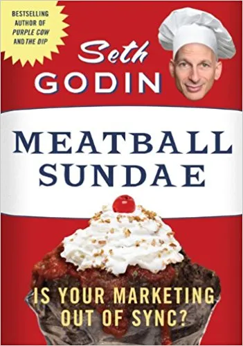

**Book:** [_Meatball Sundae: Is Your Marketing out of Sync?_](https://www.goodreads.com/book/show/2210223.Meatball_Sundae) **Author:** [Seth Godin](http://www.sethgodin.com)

My takeaway from Meatball Sundae is don't use a new marketing trend because it's the hip new thing to do.  Make sure the marketing you do aligns with your business.  If the new marketing you does not align either change your business or don't bother with the new marketing.

The book was written in 2007 and focuses mostly on marketing using the web but the basic idea applies to any new marketing technology.  Just because others companies use [dream ads](https://www.youtube.com/watch?v=XPGgTy5YJ-g) doesn't mean you need too.

For me personally it means I should understand the social media platforms I use.  My [Twitter](https://twitter.com/saturdaymp), [Facebook](https://www.facebook.com/saturdaymp), and [LinkedIn](https://www.linkedin.com/company/saturdaymp) post mostly links back to this blog.  Is that the best way to use these platforms?  Probably not.

For October I'll focus on Twitter and see if I can figure out if it aligns with my basement based business.  Do I need to change my business, change how I use Twitter, or give up on Twitter?
