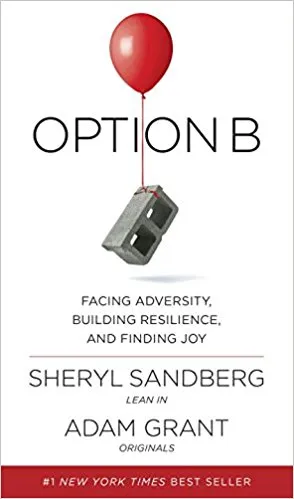

**Book:** [_Option B: Facing Adversity, Building Resilience, and Finding Joy_](https://optionb.org/book) **Author:** [Sheryl Sandberg](https://en.wikipedia.org/wiki/Sheryl_Sandberg), [Adam Grant](http://www.adamgrant.net/)

_Option B_ is not what I thought it would be about.  I thought it would be about what to do when your first plan fails for some reason.  Like plans you consciously made, such as a business plan, trip, etc.

Turns out the book is coming up with an option B for plans you didn't even think you where making.  Such as assuming your family won't die or won't get seriously ill.  It is Sheryl Sandberg's account of her husbands unexpected passing how she dealt with it.  She talks to others who dealt with death of loved ones and also what research says about dealing with death.  It does focus on other issues such as illness and other major life tragedies but mostly about death.

I have two takeaways from this book.  The first is that we have plans that we don't even know about.  I dubbed them default plans but they are still plans.  That same way not making a choice is still a choice.

The second is that you should acknowledge and talk to the survivor about the death of their loved one.  We are often afraid of hurting the survivor by bringing up the subject.  That and hurting ourselves by bring up the topic.  The takeaway is to talk to your friends and family about the traumatic events.  They will appreciate it more then ignoring the [elephant in the room](https://optionb.org/build-resilience/lessons/the-elephant-in-the-room-talking-about-loss-and-hardship).
