The notes I took when trying to upgrade the [NUnit Xamarin](https://github.com/nunit/nunit.xamarin) project to NUnit 3.8.1.  The reason I did this was to fix issue [#87](https://github.com/nunit/nunit.xamarin/issues/87).  When I try to us NUnit Xamarin on another project it fails with the following error:

```text
 
D/Mono ( 2233): Assembly Loader probing location: 'System.Runtime.Loader'. 
F/monodroid-assembly( 2233): Could not load assembly 'System.Runtime.Loader' during startup registration. 
F/monodroid-assembly( 2233): This might be due to an invalid debug installation.
```

Remember these are just notes and lack the polish \[what polish? --Ed\] of my other [technical articles](https://nftb.saturdaymp.com/category/software-development/today-i-learned/).

# Compile

First I forked the project to my personal GitHub account then I cloned the repo to my local machine.

Open and compile the application.  No errors on the first try, that is a good sign.

[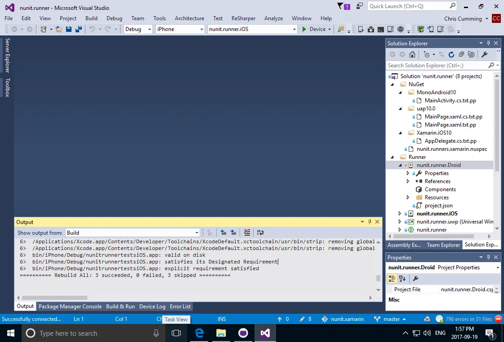](https://nftb.saturdaymp.com/wp-content/uploads/2017/09/NUnitXamarinCompileSuccessful.png)

For some reason ReSharper says there are 796 errors in 31 files.  The ReSharper "errors" are mostly in the shared projects.  I don't think ReSharper knows how to deal with Shared projects correctly.  I'll just ignore these errors for now.

# Run iOS Project

Try to run it on iOS.  Can't start the nunit.runner.iOS project because of the following error:

[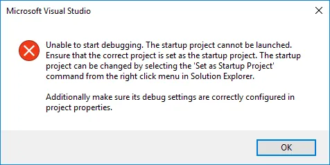](https://nftb.saturdaymp.com/wp-content/uploads/2017/09/NUnitXamarinErrorRunningNUnitRunneriOSProject.png)

Changed it to nunit.runner.tests.iOS and it ran with the following results:

[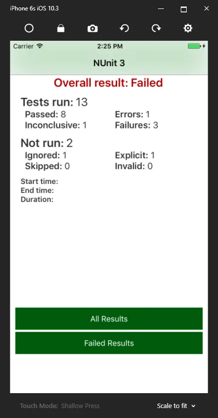](https://nftb.saturdaymp.com/wp-content/uploads/2017/09/NUnitXamariniOSTestResultSummary.png)

[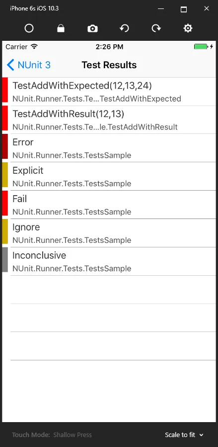](https://nftb.saturdaymp.com/wp-content/uploads/2017/09/NUnitXamariniOSTestResultFailedTests.png)

Some of the tests failed.  Are they supposed to fail?  One second while I take a look at the tests.  I see some of them are supposed fail.  Thanks deliberate failure comment.

[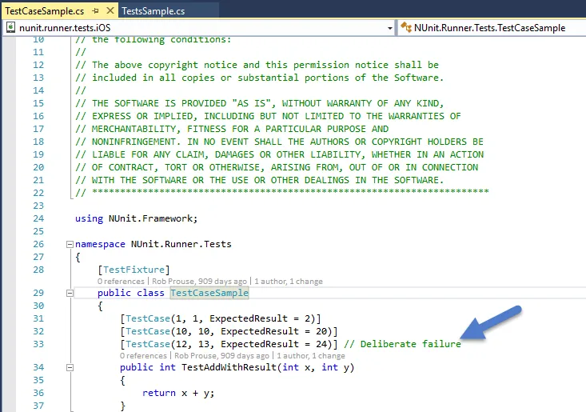](https://nftb.saturdaymp.com/wp-content/uploads/2017/09/NUnitXamarinDeliberateFailure.png)

# Run Droid Project

I assume everything works on iOS.  Lets try running the Droid project.  Bummer, it no work.

[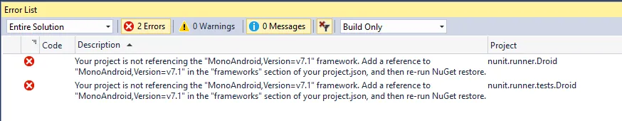](https://nftb.saturdaymp.com/wp-content/uploads/2017/09/NUnitXamarinDroidVersionError.png)

It appears that the Droid project file was updated to Android 7.1 but the json file still points to 6.0.  Why did VS auto update the project file to 7.1?  It appears that the project is set to use the latest Android version platform, which is currently 7.1 (Nougat).

[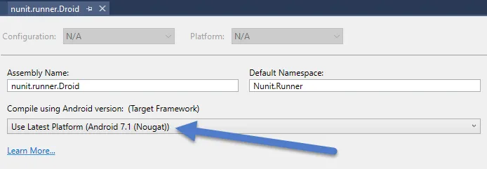](https://nftb.saturdaymp.com/wp-content/uploads/2017/09/NUnitXamarinDroidProjectUsesDefaultAndroidVersion.png)

Lets try switching it to 6.0 and see what happens.  It sill no work but I have seen this error message before.  It's the initial bug I experienced in another project.

```text
 
D/Mono ( 2233): Assembly Loader probing location: 'System.Runtime.Loader'.
F/monodroid-assembly( 2233): Could not load assembly 'System.Runtime.Loader' during startup registration.
F/monodroid-assembly( 2233): This might be due to an invalid debug installation.
```

Oh wait, there is a 3.8.1 branch in the repo that has already updated to Android 7.1.  At least there was an attempt but it looked like it [failed](https://github.com/nunit/nunit.xamarin/pull/101).  Do I stay with master or switch to the branch?

# Upgrade to NUnit 3.8.1

Lets stay on the master branch and work out a fix.  I'll then ask if it should be merged to master or the branch.  First things first lets updated to Android 7.1 and see what happens.  First in the project properties switch back to Use the Lastest Platform setting and then updated the json file.  I currently looks like:

```text
 
{
 "dependencies": {
 "NUnit": "3.6.1",
 "Xamarin.Forms": "1.5.0.6447"
 },
 "frameworks": {
 "monoandroid60": {}
 },
 "runtimes": {
 "win": {}
 }
}
```

It links to an old Xamarin.Forms but lets leave that for now.  Hopefully upgrading to Android 7.1 will work with old version of Xamarin.  Lets upgrade the framework then run it.

```text
 "frameworks": { 
   "monoandroid71": {} },
```

Well, got the same "Could not load assembly 'System.Runtime.Loader'" error.

[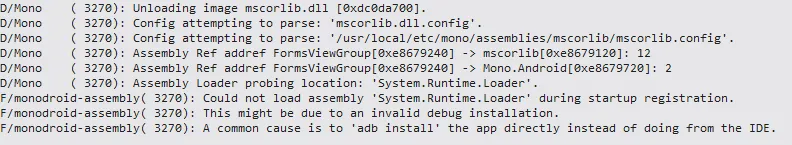](https://nftb.saturdaymp.com/wp-content/uploads/2017/09/NUnitXamarinCannotLoadAssemblySystemRuntimeLoader.png)

Lets see how NUnit.Xamarin links to NUnit.  How hard is it to upgrade to NUnit 3.8.1?

[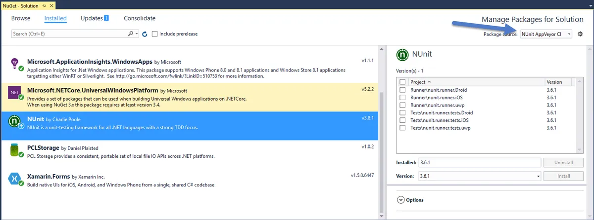](https://nftb.saturdaymp.com/wp-content/uploads/2017/09/NUnitXamarinNUnitNuget.png)

Notice that the packages come from NUnit AppVeyor CI.  I know [AppVeyor](https://www.appveyor.com/) is a continuous build system but not much else about it.  Do we have to use the packages only from AppVeyor?  I'll have to ask.

It appears that NUnit is linked to via Nuget package.  I heard that it might NUnit.Xamarin might be compiled against NUnit but it appears to just use the Nuget package.  That is promising.  Lets try upgrading it to 3.8.1 and see what happens.

[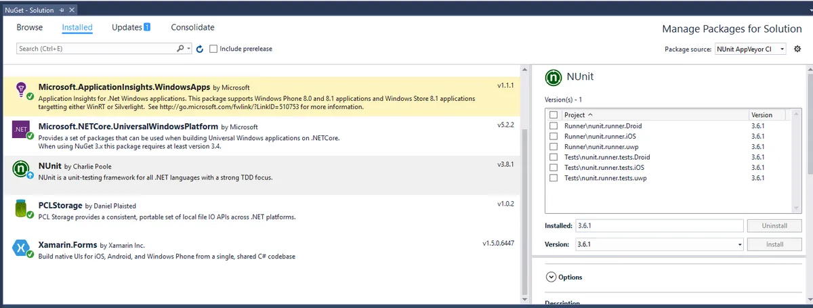](https://nftb.saturdaymp.com/wp-content/uploads/2017/09/NUnitXamarinNugetUpgradeTo381.png)

[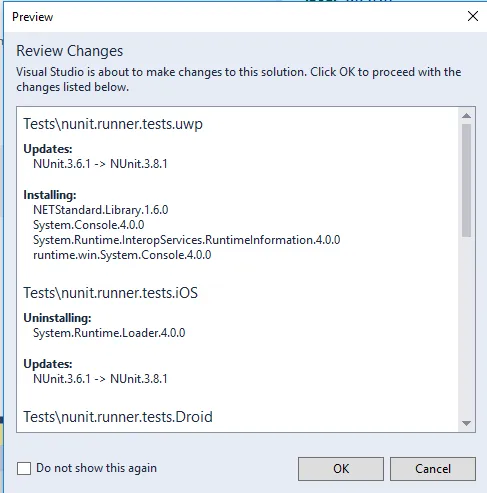](https://nftb.saturdaymp.com/wp-content/uploads/2017/09/NUnitXamarinNugetUpgradeTo381Changes.png)

After the upgrade everything seems to work.  That is good news.

[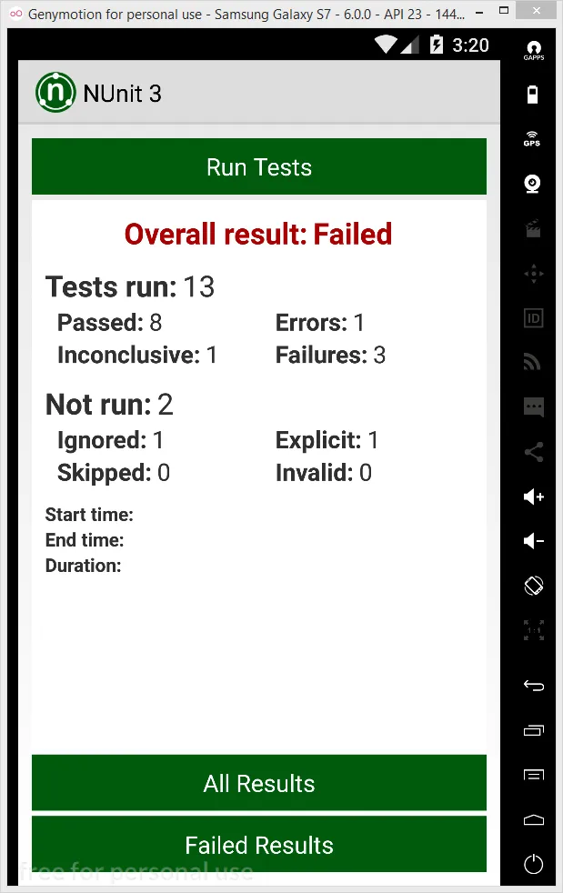](https://nftb.saturdaymp.com/wp-content/uploads/2017/09/NUnitXamarinDroidSuccess.png)

Now I just need to check with the NUnit.Xamarin team what branch they would like this pull request put into.  I wonder if it will pass automated build tests?
