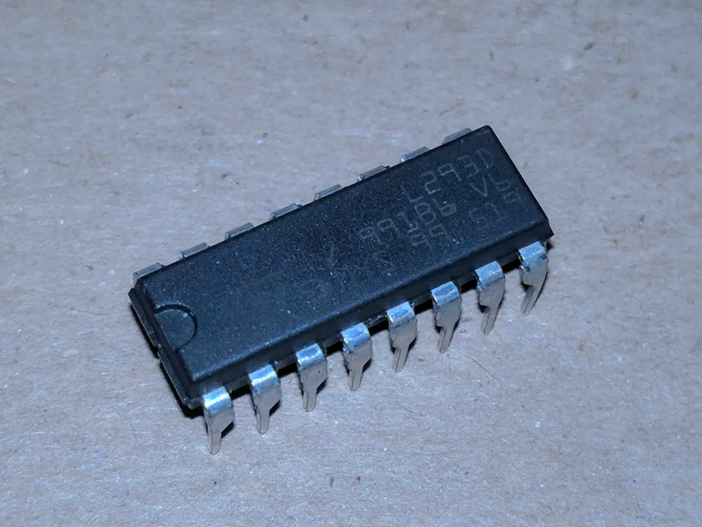
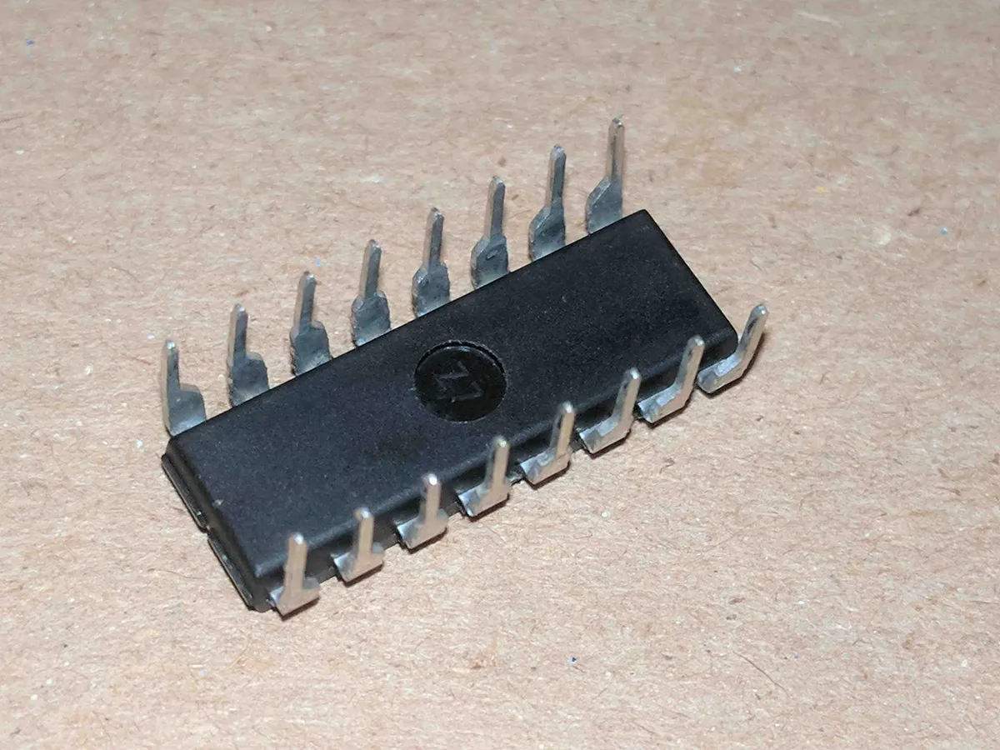
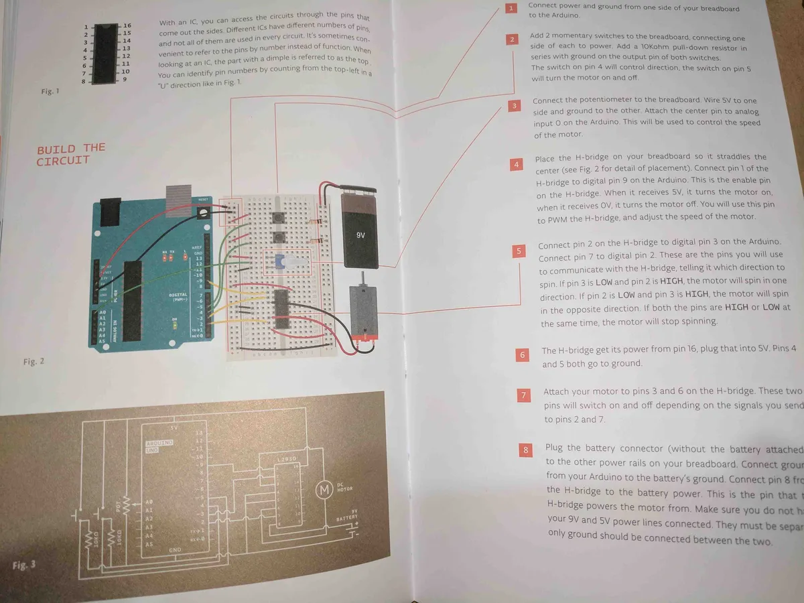

Just a quick public service announcement (PSA) that the Arduino H Bridge is sharp and pointy.  Both my daughter and myself hurt our fingers but only I was lucky enough to draw blood when one of the H Bridge pins got stuck under my finger nail.  I mean look at this insect looking pointy bastard.

All that pain and blood was worth it as we did finally get the lesson 10 (Zoetrope) from the [Arduino Start Kit](https://store.arduino.cc/usa/arduino-starter-kit) working.  We couldn't get the example as shown in the book to work because we didn't understand how the H Bridge worked.

With help from this [article (with a handy diagram)](https://itp.nyu.edu/physcomp/labs/motors-and-transistors/dc-motor-control-using-an-h-bridge/) we figured out the H Bridge and got the motor to spin.



Special thanks to [Startup Edmonton](http://www.startupedmonton.com/) for hosting us on their [Monthly Hack Day](http://www.startupedmonton.com/new-events/2017/9/9/monthly-hack-day).
