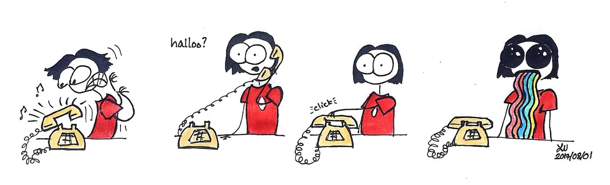
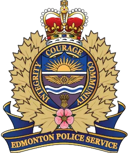

After almost a year hard work Liv has reached her goal and been accepted to the [Edmonton Police Service](http://www.edmontonpolice.ca/) (EPS).  Needless to say she was a bit excited when she got the call.

Unfortunately joining the EPS means Liv no longer has time to work with Saturday MP.  At least in the immediate future.  That means there will be a drought of cartoons and a decrees in qualty qulity quaity quality of the blog and social media posts.  We are as sad as you are but also happy Liv was able to accomplish her goal.

Everyone should admire Liv's dedication and hard work.  She [never gave up](https://nftb.saturdaymp.com/making-lemonade/).  We are very proud of her accomplishment and wish her all the best in her new career.  Hopefully our paths will cross again in the future.
