Several months ago I discussed how to [manually build an objective-c project](https://nftb.saturdaymp.com/today-i-learned-how-to-create-a-xamarin-ios-binding-for-objective-c-libraries-part-1-compiling-the-objective-c-library/) so it can be consumed by a [Xamarin Binding Project](https://developer.xamarin.com/guides/ios/advanced_topics/binding_objective-c/).  In this post I show how to automate the building of the objective-c project.  In my case I need to automate the building of the [BEMCheckBox](https://github.com/Boris-Em/BEMCheckBox) project but hopefully you can generalize this specific example for your own needs.

For this post I'll assume you have a [TeamCity](https://www.jetbrains.com/teamcity/) server setup along with a TeamCity build agent on a Mac.  For help installing a TeamCity server see the [official documentation](https://confluence.jetbrains.com/display/TCD10/Installation+Quick+Start).  For help installing a Mac build agent please see my [previous post](https://nftb.saturdaymp.com/today-i-learned-how-to-install-a-teamcity-build-agent-on-a-mac/) and/or the [official documentation](https://confluence.jetbrains.com/display/TCD10/Setting+up+and+Running+Additional+Build+Agents).

# Create the Project and Build in TeamCity

In my TeamCity setup I have a  Plugins project and under that a Native Libraries project.  Then under that I created the BEMCheckBox build as shown in the screen shot below.

[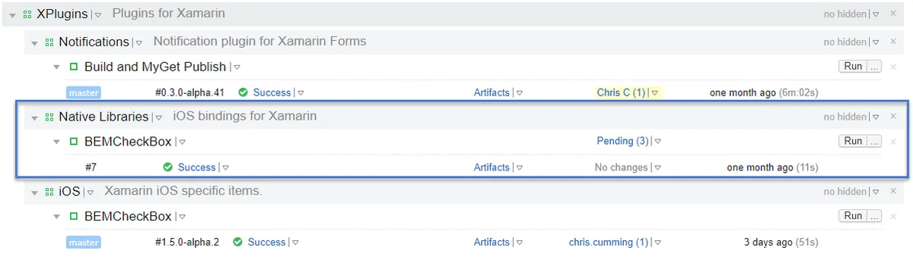](https://nftb.saturdaymp.com/wp-content/uploads/2017/09/BEMCheckBoxProjectLayout.png)

As you can see above the build already exists but I'll walk through creating it from scratch.  First choose the project you want the build to be in and choose Edit.

[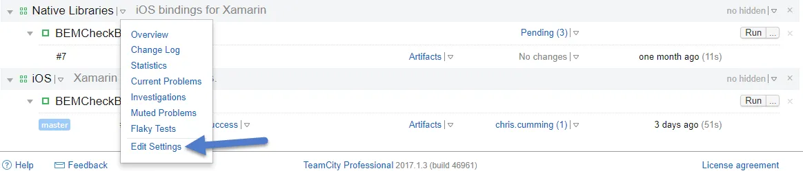](https://nftb.saturdaymp.com/wp-content/uploads/2017/09/TeamCityEditProject.png)

On this screen choose Create build configuration.  In the screen shot below I already have a build but you might not have any builds yet.

[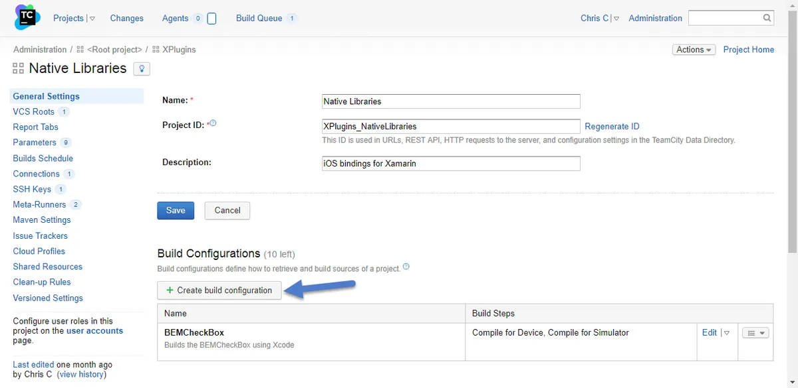](https://nftb.saturdaymp.com/wp-content/uploads/2017/09/TeamCityCreateBuild.png)

The BEMCheckBox exists on GitHub but not under my GitHub account so I have to link to the URL manually.  Copy the link to the [BEMCheckBox](https://github.com/Boris-Em/BEMCheckBox) in step 3.

[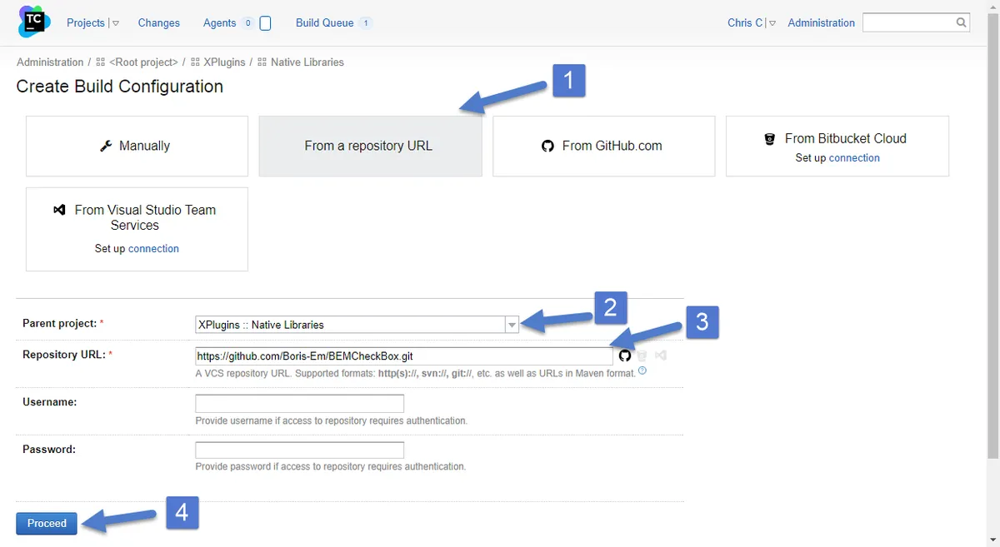](https://nftb.saturdaymp.com/wp-content/uploads/2017/09/TeamCityCreateBuildFromUrl.png)

Then set the name for your build.

[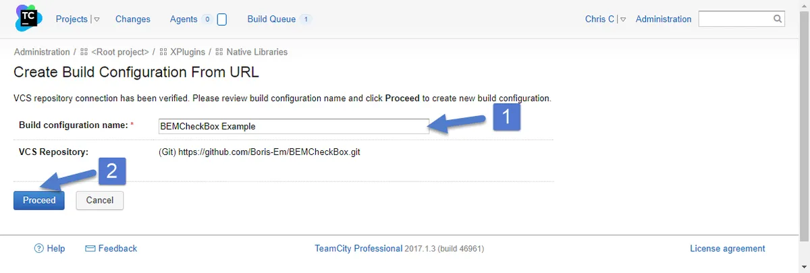](https://nftb.saturdaymp.com/wp-content/uploads/2017/09/TeamCitySetBuildConfigName.png)

Next I setup the build steps.  TeamCity might try to figure out the default build steps but you can ignore them and setup your own.

[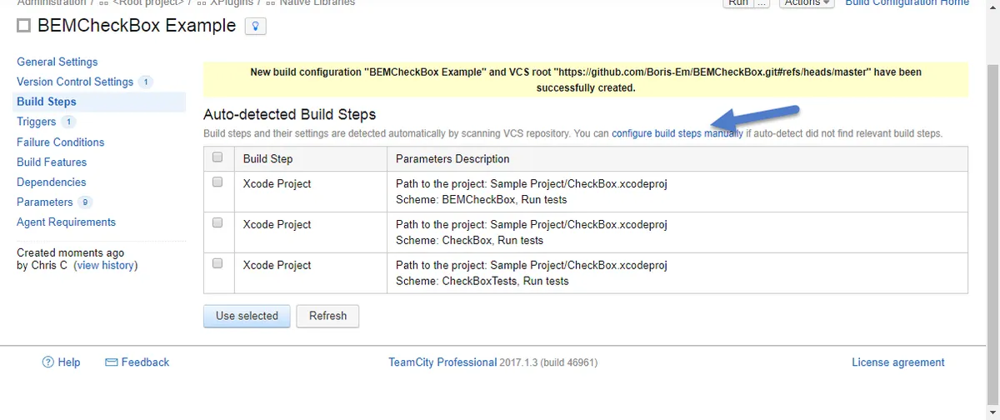](https://nftb.saturdaymp.com/wp-content/uploads/2017/09/TeamCityConfigureBuildStepsManually.png)

# Build Steps

We will need to compile the BEMCheckBox twice.  Once to build for the ARM architectures and once for the i386 architectures.  The ARM architecture lets the checkbox run on physical devices and  i386 for simulators.

## Build Step 1 - Compile to Device

_**Update (Dec 5, 2017)**: Please see this [post](https://nftb.saturdaymp.com/notes-on-fixing-incomplete-bitcode-error-in-teamcity-automated-objective-c-builds/) for updated build settings.  In summary you need to use the archive build step instead of build._

First up compiling for the iphone.  In my example we want a target based build to compile the BEMCheckBox framework, not the example program.  Make sure the platform is iOS (ARM).  You might have to click the Check/Reparse Project button to get the settings to show up correctly.

[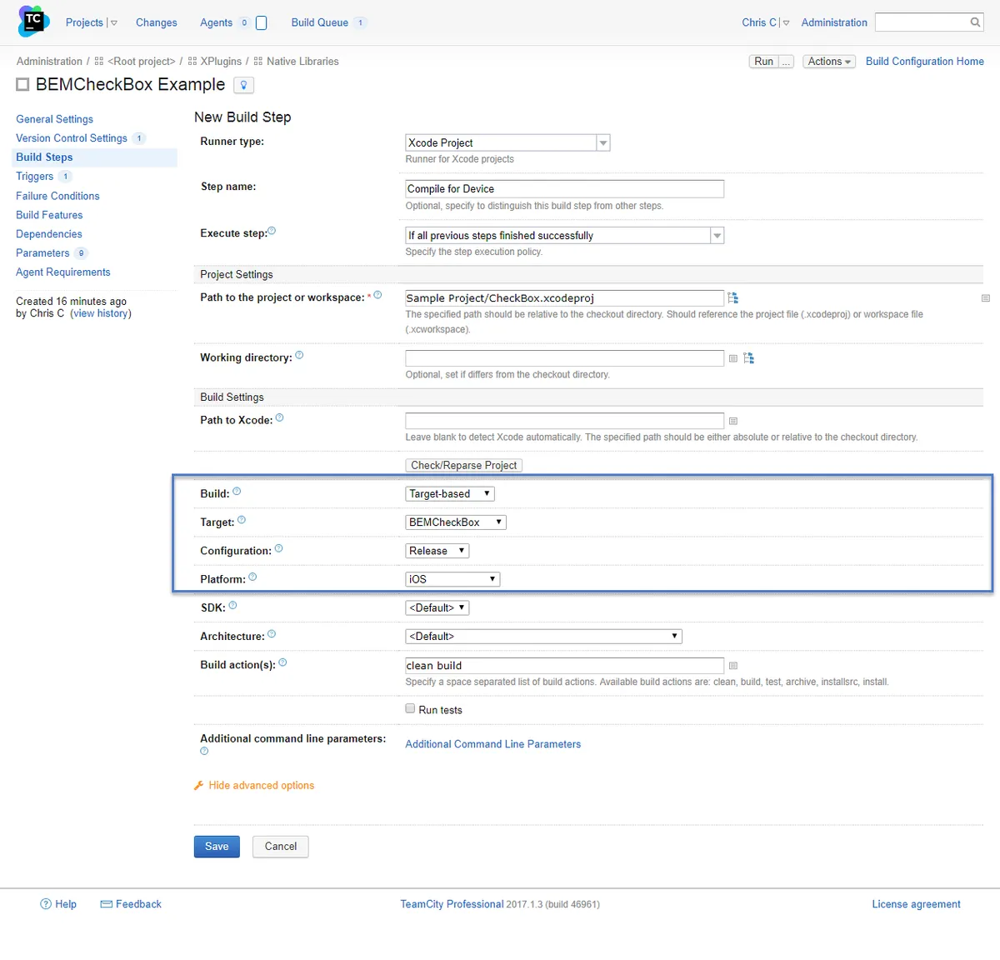](https://nftb.saturdaymp.com/wp-content/uploads/2017/09/TeamCityCompileForDevice.png)

To test this step run your build then look for a BEMCheckBox.framework folder in the build/Release-iphoneos folder on you Mac build machine.  The full path on my build machine is:

\[text\] /Users/username/BuildAgent/work/GUID/Sample Project/build/Release-iphoneos/BEMCheckBox.framework \[/text\]

## Build Step 2 - Compile to Simulator

Now create another build step for the simulator build.  It will be similar to the previous build step.

[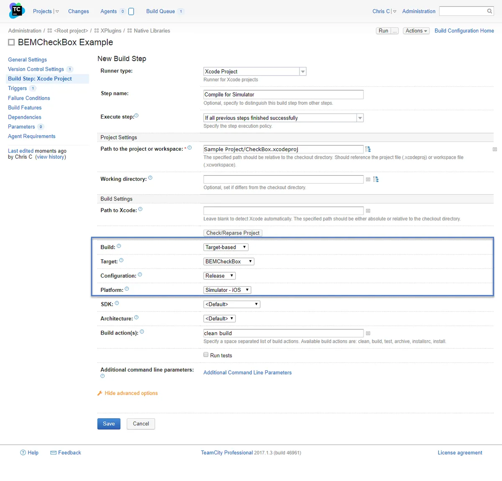](https://nftb.saturdaymp.com/wp-content/uploads/2017/09/TeamCityCompileForSimulator.png)

Again you can test this build step by looking for the BEMCheckBox.framework folder in the Release-iphonesimulator.

\[text\] /Users/username/BuildAgent/work/GUID/Sample Project/build/Release-iphonesimulator/BEMCheckBox.framework \[/text\]

## Build Step 3 - Combine Frameworks

_**Update (Dec 5, 2017)**: Please see this [post](https://nftb.saturdaymp.com/notes-on-fixing-incomplete-bitcode-error-in-teamcity-automated-objective-c-builds/) for updated build settings.  In summary some of the paths have changed because the Compile to Device step changed._

The final step is to combine the two builds into one so the framework can be consumed by Xamarin.  To do this use the [lipo command](https://ss64.com/osx/lipo.html).  The manual steps are outlined in my [previous post](https://nftb.saturdaymp.com/today-i-learned-how-to-create-a-xamarin-ios-binding-for-objective-c-libraries-part-2-combining-libraries/).  To automate this step create a command line build process as shown below:

[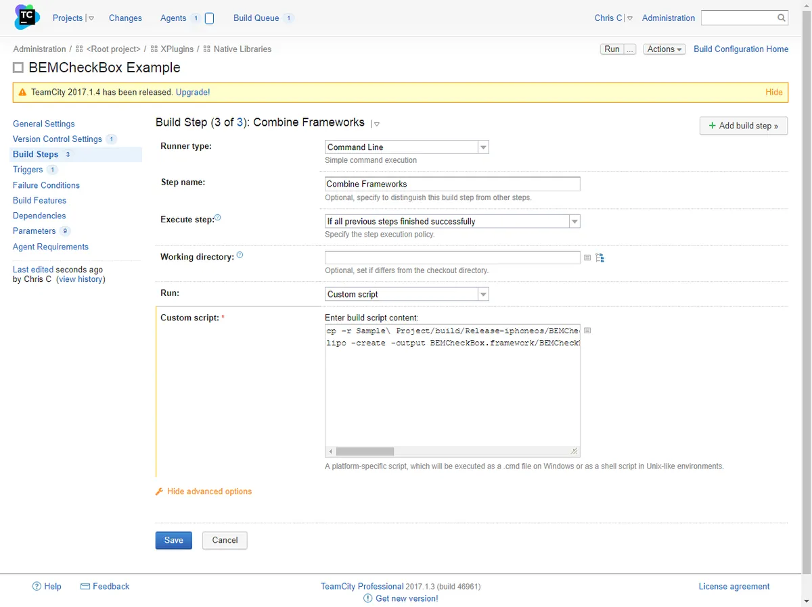](https://nftb.saturdaymp.com/wp-content/uploads/2017/09/TeamCityCombineFrameworksBuildStep.png)

The full command line looks like:

\[text\] cp -r Sample\\ Project/build/Release-iphoneos/BEMCheckBox.framework . lipo -create -output BEMCheckBox.framework/BEMCheckBox Sample\\ Project/build/Release-iphoneos/BEMCheckBox.framework/BEMCheckBox Sample\\ Project/build/Release-iphonesimulator/BEMCheckBox.framework/BEMCheckBox \[/text\]

To test this step run the build and look a BEMCheckBox.framework folder in root of the work/GUID folder.  In my case the folder can be found at:

\[text\] /Users/username/BuildAgent/work/GUID/BEMCheckBox.framework \[/text\]

Then run a file command to make sure all 4 architectures are supported.

\[text\] file BEMCheckBox.framework/BEMCheckBox \[/text\]

You should get the following output or something similar:

\[text\] BEMCheckBox.framework/BEMCheckBox: Mach-0 universal binary with 4 architectures: \[i386: Mach-0 dynamically lined shared library i386\]&amp;amp;nbsp;\[x86\_x64: Mach-0 dynamically lined shared library x86\_x64\]&amp;amp;nbsp;\[arm\_v7: Mach-0 dynamically lined shared library arm\_v7\]&amp;amp;nbsp;\[arm64: Mach-0 dynamically lined shared library arm64\] BEMCheckBox.framework/BEMCheckBox (for architecture i386): Mach-0 dynamically linked shared library i386 BEMCheckBox.framework/BEMCheckBox (for architecture x86\_x64): Mach-0 dynamically linked shared library x86\_x64 BEMCheckBox.framework/BEMCheckBox (for architecture arm\_v7): Mach-0 dynamically linked shared library arm\_v7 BEMCheckBox.framework/BEMCheckBox (for architecture arm64): Mach-0 dynamically linked shared library arm64 \[/text\]

You can also use the lipo command tool to check the library.

\[text\] lipo -info BEMCheckBox.framework/BEMCheckBox \[/text\]

You should see something like:

\[text\] Architectures in the fat file: BEMCheckBox.framework/BEMCheckBox are: i386, x86\_x64, arm7, arm64 \[/text\]

In both cases you should see 4 architectures listed.  If you only see two then there is something with this build step.

# Artifact

The end goal of all this work is to get a BEMCheckBox.framework that can be consumed by Xamarin.  Set this up as an artifact of the build by navigating the General Settings page.  Then click on the Artifacts Path directory icon and choose the BEMCheckBox.framework folder.

[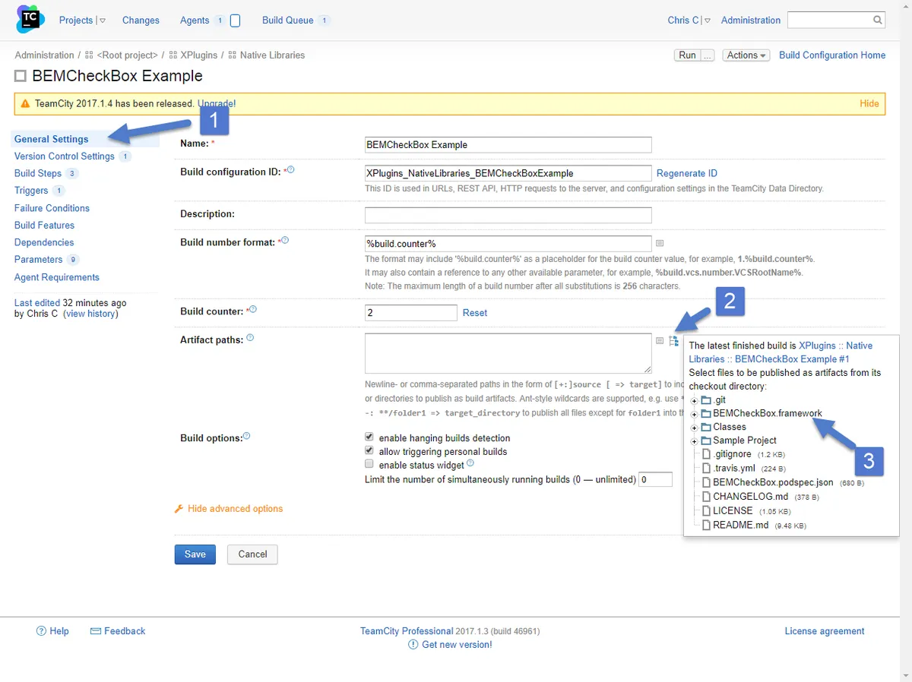](https://nftb.saturdaymp.com/wp-content/uploads/2017/09/TeamCityChooseArtifact.png)

 

Run the build one more time and you should see the BEMCheckBox.framework as a artifact.

[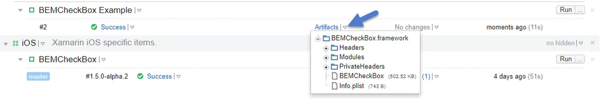](https://nftb.saturdaymp.com/wp-content/uploads/2017/09/TeamCityBEMCheckBoxArtifact.png)

That's it.  You are done.  You are a hero for automating a manual process.

Of course you can tweak the build triggers and other settings as needed but the core part of building a Xcode library using TeamCity is done.

You can read how to manually use BEMCheckBox in Xamarin in [part 3](https://nftb.saturdaymp.com/today-i-learned-how-to-create-a-xamarin-ios-binding-for-objective-c-libraries-part-3-using-sharpie-to-create-binding-interface/) and [part 4](https://nftb.saturdaymp.com/today-i-learned-how-to-create-a-xamarin-ios-binding-for-objective-c-libraries-part-4-the-actual-binding/) of the Today I Learned How to Create a Xamarin iOS Binding for Objective-C Libraries post series.  Maybe one day I'll do a post on how to automate consuming the BEMCheckBox framework in Xamarin.

P.S. - I'm re-watching [Stranger Things Season 1](https://www.youtube.com/watch?v=XWxyRG_tckY) in anticipation of [season 2](https://www.youtube.com/watch?v=vgS2L7WPIO4).  One of the more memorable scenes is the [end of episode 3 (spoilers)](https://www.youtube.com/watch?v=oqWKNn59JgQ) when the Heroes song plays.  In the show the song is preformed by [Peter Gabriel](https://en.wikipedia.org/wiki/Scratch_My_Back) but below is the original extended version sung by [David Bowie](https://en.wikipedia.org/wiki/%22Heroes%22_\(David_Bowie_song\)).

https://www.youtube.com/watch?v=jBuwC4VJi50
