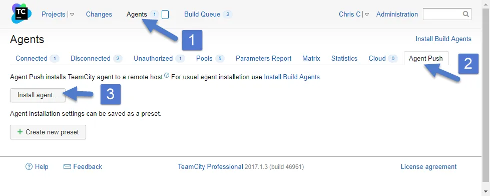
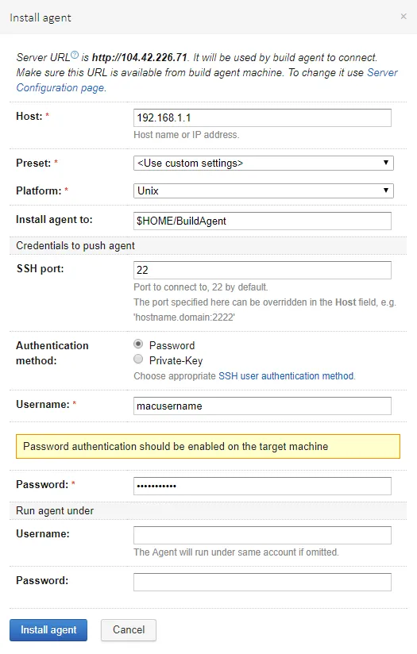
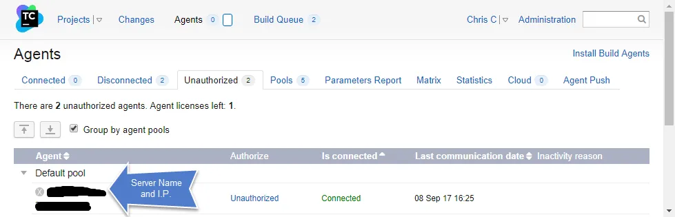

When I was first figuring out how to port the [BEMCheckBox](https://github.com/Boris-Em/BEMCheckBox) to [Xamarin](https://github.com/saturdaymp/XPlugins.iOS.BEMCheckBox) I built the [framework manually](https://nftb.saturdaymp.com/today-i-learned-how-to-create-a-xamarin-ios-binding-for-objective-c-libraries-part-1-compiling-the-objective-c-library/).  This is obviously not a good long term solution so I set about figuring out how to automate the build.  The first step was to install the TeamCity build agent on the Mac.  The official TeamCity documentation on how to do this can be found [here](https://confluence.jetbrains.com/display/TCD10/Setting+up+and+Running+Additional+Build+Agents).

First a little bit about my setup.  My TeamCity server is on a Azure virtual machine (i.e. it's in the cloud).  My Mac build machine (Mac Book Pro) is sitting beside me in my basement office.  Some of the steps below might differ if your setup is different, such as having the TeamCity server and Mac build machine on the same network.

The Mac build machine and TeamCity server need to talk to each other so make sure you have opened the correct firewall ports and the like.  In my case I had to open up ports on the router in my basement and also ports in Azure.  If you run into trouble try the [TeamCity documentation](https://confluence.jetbrains.com/display/TCD10/Setting+up+and+Running+Additional+Build+Agents#SettingupandRunningAdditionalBuildAgents-Server-AgentDataTransfersAgent-ServerDataTransfers) for port numbers.

To test that your TeamCity server and Mac can see each other try installing the build agent via Agent Push.  To do this login to your TeamCity server and click on Agents then Agent Push.

[](https://nftb.saturdaymp.com/wp-content/uploads/2017/09/TeamCityAgentPush.png)

When you click the Install Agent button you will get prompted for some config settings.  Enter them as required.

The Host field is the IP address to your Mac build machine, don't use the local host address in the example.  The Username and Password is an account on the Mac build machine with administrative rights.

A successful install should end with:

```text
 
Done [729], see log at /Users/username/BuildAgent/logs/teamcity-agent.log
WARNING: The TeamCity Agent installed as standalone application and will not start automatically on machine reboot.
Cleaning temporary installation's resources...
Removing './bootstrapper.sh'
Successfully installed build agent on 'computername.local' to '/Users/username/BuildAgent'
```

If you get any errors it's probably related to your firewall settings and/or user permissions.

Once the agent is installed you should take a quick look at the conf/buildAgent.properties file and make sure it's correct.  In my case I had to fix the serverUrl and set the name properties.  For some reason it's duplicated.  The initial file looked like:

```text
## TeamCity build agent configuration file

######################################
# Required Agent Properties #
######################################
## The address of the TeamCity server. The same as is used to open TeamCity web interface in the browser.
serverUrl=http://123.123.123.123serverUrl=http://123.123.123.123

## The unique name of the agent used to identify this agent on the TeamCity server
## Use blank name to let server generate it.
## By default, this name would be created from the build agent's host name
name=
```

I updated the file to:

```text
## TeamCity build agent configuration file

######################################
# Required Agent Properties #
######################################
## The address of the TeamCity server. The same as is used to open TeamCity web interface in the browser.
serverUrl=http://123.123.123.123

## The unique name of the agent used to identify this agent on the TeamCity server
## Use blank name to let server generate it.
## By default, this name would be created from the build agent's host name
name=MyMacBuildMachineName
```

Once you have updated the properties file create the logs folder.  Then get the build agent to connected to the TeamCity server and update it's self.  This might take several minutes and you can watch the progress in the log file.

```text
mkdir BuildAgent/logs
sh BuildAgent/bin/mac.launchd.sh load
tail -f BuildAgent/logs/teamcity-agent.log
```

If this command fails then it's likely the build agent can't connect to TeamCity.  Make sure the serverUrl property is correct and double check your firewall ports.  Once it's done the agent should appear in the TeamCity interface as a unauthorized agent.

[](https://nftb.saturdaymp.com/wp-content/uploads/2017/09/TeamCityNewUnauthorizedAgent.png)

To authorize this agent click on the Unauthorized link and it will be authorized.  Now you are good to go.  In a future post I'll describe how I actually build Xcode projects with TeamCity.

 

P.S. - Thought this [song](https://en.wikipedia.org/wiki/The_Rising_\(Bruce_Springsteen_song\)) might be appropriate [today](https://en.wikipedia.org/wiki/September_11_attacks).


