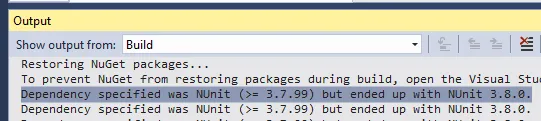
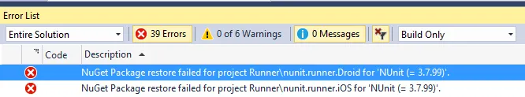
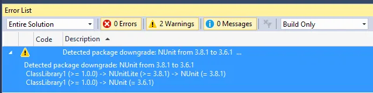

While upgrading the [NUnitXmarin](https://github.com/nunit/nunit.xamarin) project the project maintainers [asked me](https://github.com/nunit/nunit.xamarin/pull/102) lock the version of NUnit to a specific version.  They where also kind enough to provided a link to a [possible solution](https://stackoverflow.com/questions/39070297/project-json-specify-exact-version-of-nuget-dependency/42336241#42336241).  Lets test if it works.

First lets review how NuGet [resolves dependencies](https://docs.microsoft.com/en-us/nuget/consume-packages/dependency-resolution).  If you specify a dependency version the standard way, i.e. just listing the version number with not brackets, NuGet tries to find the version you specified of the next highest version.

For example the NuGet feed for NUnit has the following versions in it's feed:

\[text\] 3.6.1 3.7.0 3.7.1 3.8.0 3.8.1 \[/text\]

If you list version 3.7.1 in project.json file, as shown below, then NuGet uses version 3.7.1.  Duh.

\[xml\] "dependencies": { "NUnit": "3.7.1" } \[/xml\]

Now say you list version 3.7.99 as shown below.  Now 3.7.99 does not exist so NuGet find the next highest version, which is 3.8.0, and uses that version.

\[xml\] "dependencies": { "NUnit": "3.7.99" } \[/xml\]

When you compile you will see a message similar to the below.

\[text\] Dependency specified was NUnit (&amp;amp;gt;= 3.7.99) but ended up with NUnit 3.8.0. \[/text\]

To tell NuGet to only use the version you specified you need to put square brackets around the version number.  This changes the logic from ">= Version#" to "= Version#".

\[xml\] "dependencies": { "NUnit": "\[3.7.99\]" } \[/xml\]

Now when you try to build you will get an error because version 3.7.99 does not exist and NuGet will not try to find a newer version.

\[text\] NuGet Package restore failed for project Runner\\nunit.runner.Droid for 'NUnit (= 3.7.99)'. \[/text\]

That's great you say, but why would you link to a version that does not exist?  That is stupid.

Let's try something that might actually happen.  Your project references a project but another package links to a different version.  Say you have the following in your JSON file:

\[xml\] "dependencies": { "NUnit": "\[3.6.1\]", "NUnitLite": "3.8.1" } \[/xml\]

NUnitLite 3.8.1 references to NUnit 3.8.1.  If you compile you get the following warning:

\[text\] Detected package downgrade: NUnit from 3.8.1 to 3.6.1&amp;amp;nbsp;&amp;amp;nbsp; ClassLibrary1 (&amp;amp;gt;= 1.0.0) -&amp;amp;gt; NUnitLite (&amp;amp;gt;= 3.8.1) -&amp;amp;gt; NUnit (= 3.8.1)&amp;amp;nbsp;&amp;amp;nbsp; ClassLibrary1 (&amp;amp;gt;= 1.0.0) -&amp;amp;gt; NUnit (= 3.6.1) \[/text\]

That's good.  It's what we wanted.  Now what happens if we remove the square brackets from the NUnit dependency so our JSON file looks like:

\[xml\] "dependencies": { "NUnit": "3.6.1", "NUnitLite": "3.8.1" } \[/xml\]

Will it use NUnit 3.6.1 that we reference in the project or NUnit 3.8.1 referenced by NUnitLite?

\[text\] Detected package downgrade: NUnit from 3.8.1 to 3.6.1&amp;amp;amp;nbsp;&amp;amp;amp;nbsp; ClassLibrary1 (&amp;amp;amp;gt;= 1.0.0) -&amp;amp;amp;gt; NUnitLite (&amp;amp;amp;gt;= 3.8.1) -&amp;amp;amp;gt; NUnit (= 3.8.1)&amp;amp;amp;nbsp;&amp;amp;amp;nbsp; ClassLibrary1 (&amp;amp;amp;gt;= 1.0.0) -&amp;amp;amp;gt; NUnit (= 3.6.1) \[/text\]

Wait, that is exactly the same message we got last time.  What is going on?  It turns NuGet prefers the version of a package directly referenced by your project then one referenced by another package.  This is all explained in the [How NuGet resolves package dependencies](https://docs.microsoft.com/en-us/nuget/consume-packages/dependency-resolution#dependency-resolution-with-packagereference-and-projectjson) article but in summary NuGet tries to use the lowest version it can get away with with direct references overriding sub-references.

P.S. - I'm glad [Barenaked Ladies](http://www.barenakedladies.com/) (it's a Canadian band, link is SFW) where able to continue without [Steven Page](https://en.wikipedia.org/wiki/Steven_Page) but I miss his melancholy.  Plus him and [Ed](https://en.wikipedia.org/wiki/Ed_Robertson) harmonized really well together.  This is one of my favorite melancholy BNL songs.  Yes I like it more then [Brian Wilson](https://www.youtube.com/watch?v=Ch84fmOa414).  Just ignore the cheesy video.

> I couldn't tell you That I was wrong I chickened out grabbed a pen and a paper Sat down and I wrote this song
> 
> I couldn't tell you That you were right So instead I looked in the mirror Watched TV, laid awake all night

https://www.youtube.com/watch?v=\_i0yZTeTZ4Q
