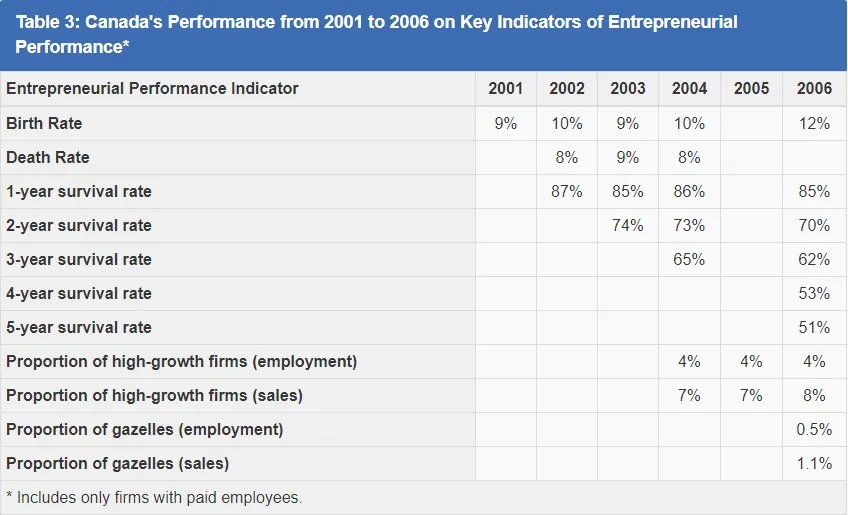
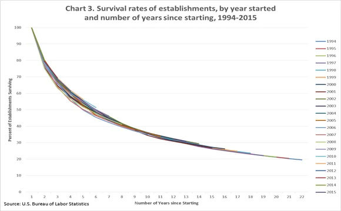

Starting a new business is hard.  In [2010 study](https://www.ic.gc.ca/eic/site/061.nsf/eng/h_rd02468.html#toc-04) just over half of new business in Canada survive 5 years or more and only 30% survive 10 years.  Similar [statics](https://www.bls.gov/bdm/entrepreneurship/entrepreneurship.htm) for our neighbours in the south.

[Saturday Morning Productions](https://www.saturdaymp.com/) has been around for 7 1/2 years, if [my maths are correct](https://nftb.saturdaymp.com/saturday-mp-turns-6-for-real/).  Our odds of surviving this long are about 45%.  Another way to look at it is if 100 business opened in 2009 then only 45 are still around today.

Why has Saturday MP survived when others business have faltered?  I think an important but often overlooked reason is my supportive spouse and business partner, Ada.  I know there are other reasons (i.e. hard work, grit, frugality, luck, etc) but when you start a business later in life when you are married with a young daughter then a supportive spouse is a requirement.  Well, I guess you could start a new business without the support of your spouse but I wanted to stay married and run a business.

I couldn't find any data but my guess is that most small business that survive for more then 5 years have a supportive spouse.  That or the owners are unmarried or divorced.  The closest data I could find was from [Thomas Stanley's](http://www.thomasjstanley.com/) Millionaire Mind book and quoted on his [blog](http://www.thomasjstanley.com/2011/06/unselfish-spouse-wife-for-life/):

> The typical millionaire couple has been together for nearly thirty years and their bond tends to be permanent as well as economically productive. . . . ask the husband or wife to explain their household’s productivity . . . . Each gives substantial credit to the other.
> 
> For every 100 millionaires who say that having a supportive spouse was not important in explaining their economic success, there are 1,317 who indicate their spouse was important. Of the 100 who did not give credit to their spouse, 22 were never married and 23 were either divorced or separated. That leaves only 55 in 1,317 \[4.2%\] who believed that their spouse did not play an important role in their economic success.

So before I thank my wife for her support I would like to thank the spouses of all the small business and hope you will join me.  Think of all the small business you have either worked for, I've worked for 5 and counting, or done business with.

Thank you to the spouse that looked after the home and kids while the small business owner was working 60+ hours a week.  The spouse that was willing to give up the security of regular pay checks, benefits, and pension for someone else's dream.  The spouse that became the companies first book keeper, janitor, and/or secretary.  The spouse that worked overtime or a 2nd job to help fund the new business.  The spouse that became a partner in the business.    The spouse that believed in their wife/husband and loved them through all the ups and downs.

Special thanks to my wife for helping me [start](https://www.saturdaymp.com/about) Saturday Morning Productions.  Thank you for being a business partner and a [great consultant](https://www.saturdaymp.com/consulting).  Thank you for looking after our home and daughter when you weren't consulting.  Thank you for continuing to the book keeping while working a full time job at the university.  Thank you for supporting me during my [summer sabbatical](https://nftb.saturdaymp.com/sabbatical-is-over-looking-for-work/).  Finally thank you for continuing to support and believe in me.  Love you lots.

P.S. - Happy Anniversary.

_I'm falling even more in love with you_ _Letting go of all I've held on to_ _I'm standing here until you make me move_ _I'm hanging by a moment here with you_

https://www.youtube.com/watch?v=tPnK39ax\_AM
