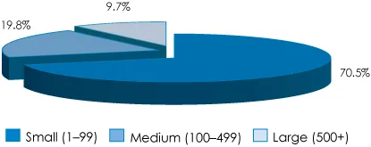

If I was a betting man I would bet you work for a small company (99employees or less).  Odds are I would be right half the time.  How did I come up with those numbers?  Using some math and stats I found on the Internet.

About [24%](http://www.greaterfool.ca/2017/09/25/the-overlords/) of the working population are public employees (i.e. employed by government).  The remaining [76%](http://www.ic.gc.ca/eic/site/061.nsf/eng/h_03018.html#point2-1) are employed by private companies with just a hair under 70% working for a company of less then 100 employees.

\[caption id="attachment\_1459" align="aligncenter" width="415"\] Share of Total Private Employment by Size of Business, 2015\[/caption\]

That means if 100 employed people are reading this blog post at the same time then:

- 24 are Public Employees
- 7 work at Large Companies (500+)
- 15 work at Medium Companies (100 - 499)
- 54 work at Small Companies (1-99)

Pro tip for job seekers: don't just apply to large companies.  Apply to small companies you never heard of because they hire a lot more people.
