In [TeamCity](https://www.jetbrains.com/teamcity/) you can't use the usual [NUnit Runner](https://confluence.jetbrains.com/display/TCD10/NUnit) to run .NET Core unit tests.  At least I couldn't get it to work.  I'm sure this will be fixed in the future but for now the below works for me.  I got lots of inspiration from [this](https://blog.jetbrains.com/teamcity/2016/11/teamcity-dotnet-core/) TeamCity blog post.

For this example I'll use the [NConstraints](https://github.com/saturdaymp/NConstraints) project.  It contains a .NET Standard project (SaturdayMP.Constraints) that we want to test and two .NET Core Test projects (SaturdayMP.Constratints.Test and TestClient).

[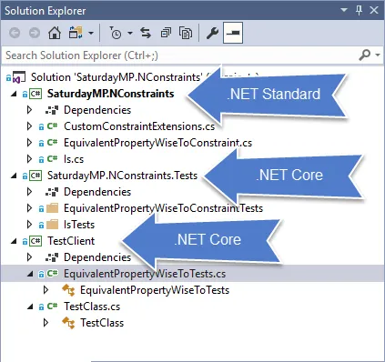](https://nftb.saturdaymp.com/wp-content/uploads/2017/10/NConstraintSolutionExplorer.png)

In TeamCity I created a project with the usual first two steps of NuGet Install and Compile.

[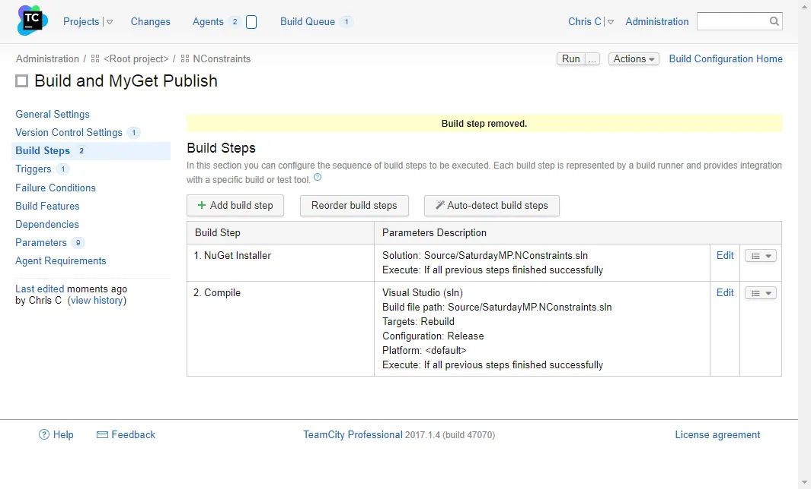](https://nftb.saturdaymp.com/wp-content/uploads/2017/10/TeamCityProjectBeforeAddingTestStep.png)

If you read the TeamCity blog [post](https://blog.jetbrains.com/teamcity/2016/11/teamcity-dotnet-core/), the one I got my inspiration from, then you probably noticed it used the [.NET Core Runner](https://plugins.jetbrains.com/plugin/9190--net-cli-support) to compile the project.  You might have had to do this when the TeamCity blog post was first written but now using the [Visual Studio Runner](https://confluence.jetbrains.com/pages/viewpage.action?pageId=74844955) will compile .NET Core projects.

Before we can add the .NET Core unit test build step we need to install the [TeamCity .NET CLI Plugin](https://github.com/JetBrains/teamcity-dotnet-plugin).  Do this by downloading the plugin zip file from [here](https://plugins.jetbrains.com/plugin/9190--net-cli-support).

[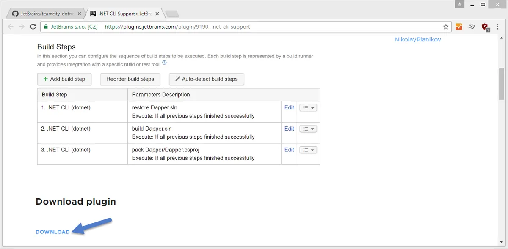](https://nftb.saturdaymp.com/wp-content/uploads/2017/10/TeamCityDotNetPluginDownload.png)

Then install the plugin by clicking on Administration in the top right then Plugins List on the bottom left.

[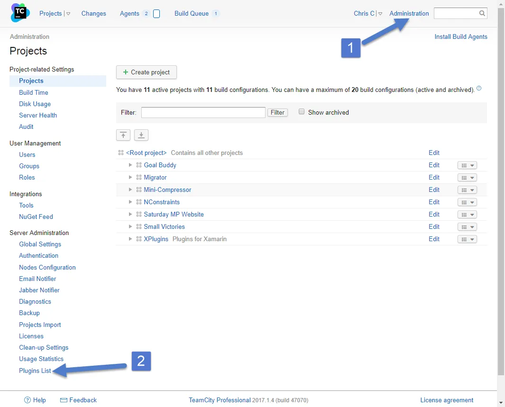](https://nftb.saturdaymp.com/wp-content/uploads/2017/10/TeamCityNavigateToPluginsList.png)

Then click Upload Plugin Zip link and choose the plugin zip file you just downloaded.

[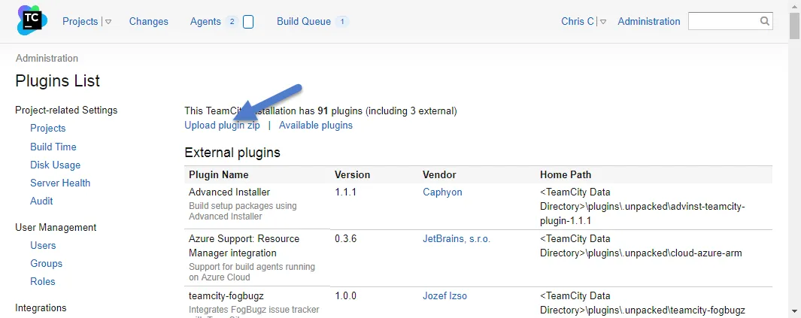](https://nftb.saturdaymp.com/wp-content/uploads/2017/10/TeamCityUploadPluginZip.png)

 

[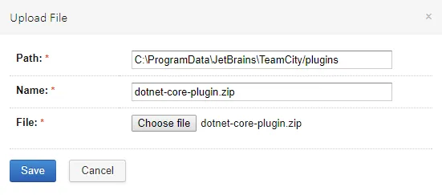](https://nftb.saturdaymp.com/wp-content/uploads/2017/10/TeamCityUploadDotNetCorePlugin.png)

Once the upload is complete you should see something similar to the screen shot below.

[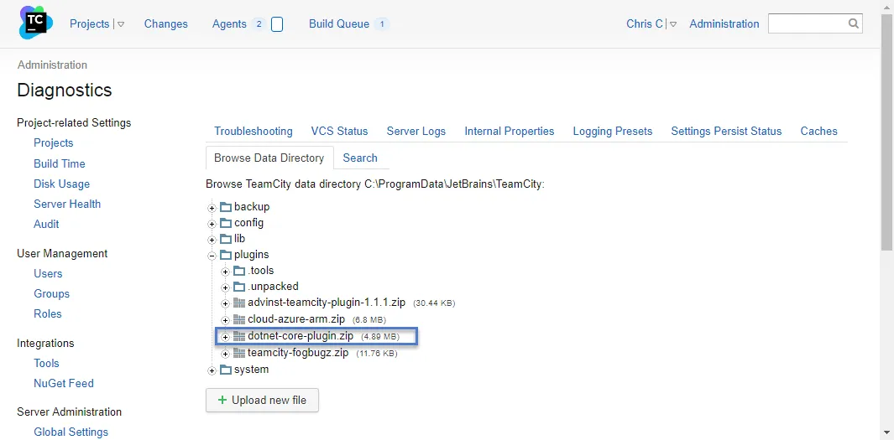](https://nftb.saturdaymp.com/wp-content/uploads/2017/10/TeamCityUploadSuccessful.png)

The plugin is uploaded but before it's active you need to reboot TeamCity.  In my case I just rebooted the server.

Once the reboot is complete you can check that the plugin installed correctly by going to an agent with Visual Studio 2017 installed.

[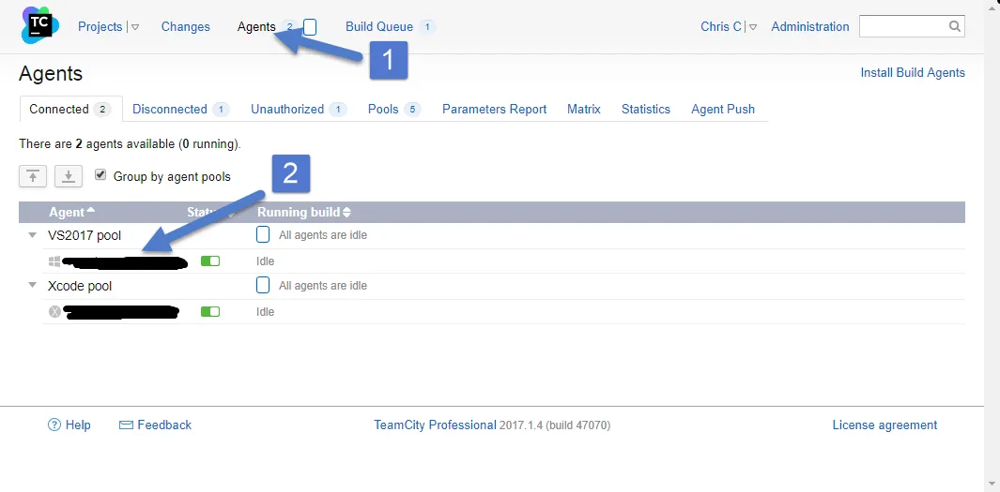](https://nftb.saturdaymp.com/wp-content/uploads/2017/10/TeamCityNavigateToAgentParameters.png)

Once on the agent navigate to the parameters page and you should see something similar to the below screen shot.

[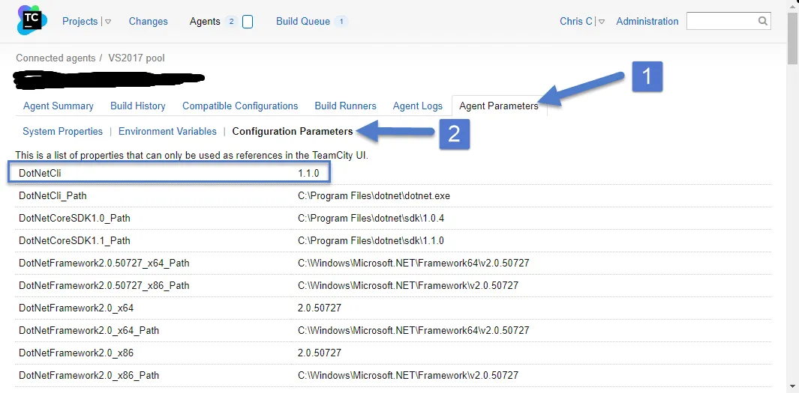](https://nftb.saturdaymp.com/wp-content/uploads/2017/10/TeamCityCheckDotNetCliPluginInstalled.png)

If you don't see the DotNetCli listed then you either forgot to reboot TeamCity, the plugin didn't install correctly, or you don't have .NET Core installed on you build agent.

Now that the plugin is installed we can go back to our project and add the unit test build step.  Add a new build step and in the runner type pick .NET CLI (dotnet).  Then in the command drop down pick test and finally enter the paths to your projects.  If you have several projects you can use wildcards.

[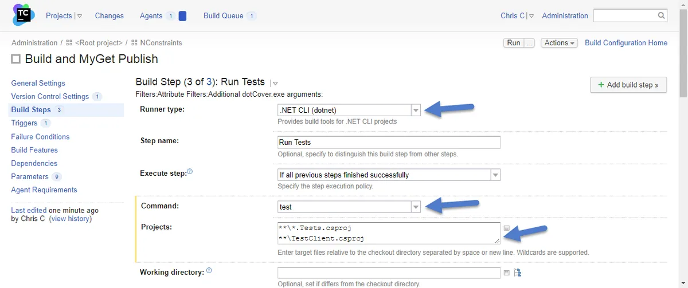](https://nftb.saturdaymp.com/wp-content/uploads/2017/10/TeamCityDotNetCliBuildStep.png)

If you don't see all the options in the screen shot above them make sure to click Show Advanced Options.  In my case I also enabled code coverage at the bottom of the list.

[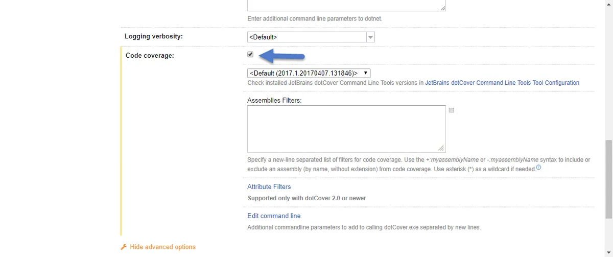](https://nftb.saturdaymp.com/wp-content/uploads/2017/10/TeamCityDotNetCliBuildStepEnableCodeCoverage.png)

 

Now when we build the tests should get executed.  You can see the results of the tests in the build log or the tests tab of the build results.

[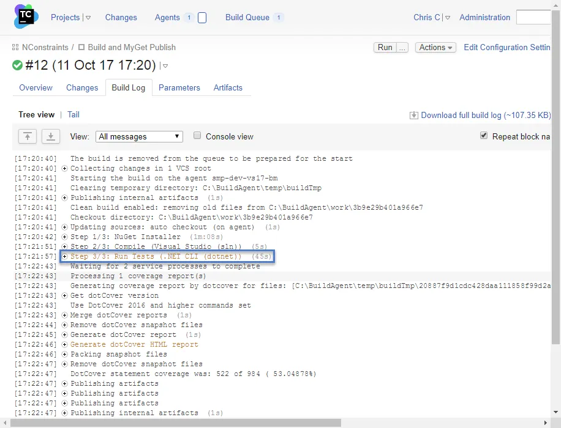](https://nftb.saturdaymp.com/wp-content/uploads/2017/10/TeamCityUnitTestBuildLog.png)

[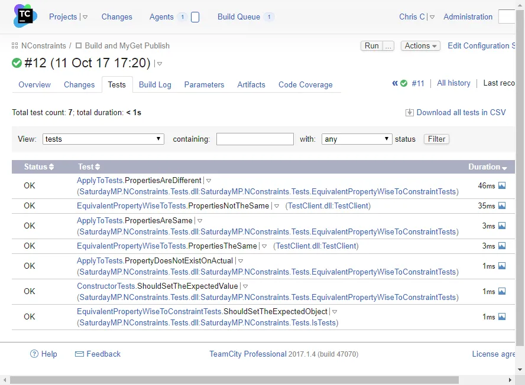](https://nftb.saturdaymp.com/wp-content/uploads/2017/10/TeamCityTestResults.png)

As I said at the beginning I'm sure the NUnit Runner will be updated to handle .NET Core but use the above for now.

P.S. - R.I.P. Tom Petty.

https://www.youtube.com/watch?v=Y1D3a5eDJIs
