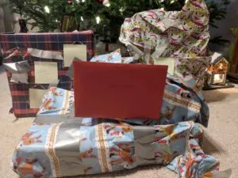

\[caption id="attachment\_1522" align="alignright" width="300"\] Gift wrapping skill is inversely correlated to software development skills.\[/caption\]

This morning I made my last shopping trip before Christmas, at least I hope it's my last trip.

Pro tip: the Costco near us officially opens at 10am but if you show up at 9:45ish they will let you in.  At least they let me in.  Then you can run, grab the salmon, and get out before the hoards descend.

Now the salmon is becoming [gravlax](http://www.seriouseats.com/recipes/2015/04/gravlax-cured-salmon-recipe.html) and the last of the gifts are wrapped.  All that's left is to write this blog post.  Actually there are a couple other Christmas chores to finish up but not many and then I can kick back and enjoy the holidays with friends and family.

Please note that kicking back means [Saturday Morning Productions](https://www.saturdaymp.com/) will be slow to respond to phone calls, e-mails, etc over the holidays.  We appreciate your understanding.

We hope that you have also wrapped up your Christmas chores and gifts and can enjoy this holiday long weekend.  We also hope you are looking forward to the grande adventures you will have in 2018.

# _Happy holidays and all the best in 2018!_

P.S. - Don't forget this is the season of sharing.  If you are in a position to do so share some of your good fortune with [others](https://bissellcentre.org/).  Like cooking the turkey for your wife while they are at the food bank.

https://soundcloud.com/cbc-radio-one/vinyl-cafe-dave-cooks-the
