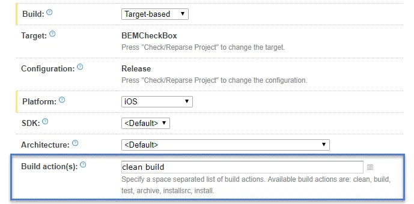
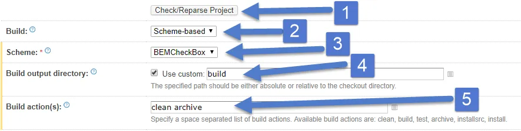

Notes I took while trying to fix the [Incomplete Bitcode error in submission](https://github.com/saturdaymp/XPlugins.iOS.BEMCheckBox/issues/2) bug.  Not sure if it's fixed yet as I haven't tried submitting an app to the App Store yet.  Hopefully someone else will try it and confirm it's fixed.

In summary when submitting an app to iTunes Connect that has the [XPlugins.iOS.BEMCheckBox](https://github.com/saturdaymp/XPlugins.iOS.BEMCheckBox) the user got the following error:

_ERROR ITMS-90668: "Invalid Bundle Executable. The executable file 'InstantApp.BoostOrder.Customer.Touch.app/Frameworks/BEMCheckBox.framework/BEMCheckBox' contains incomplete bitcode. To compile binaries with complete bitcode, open Xcode and choose Archive in the Product menu."_

For some more background please see the previous post [Today I Learned How to Automate Objective-c Builds in TeamCity](https://nftb.saturdaymp.com/today-i-learned-how-to-automate-objective-c-builds-in-teamcity/) for more information about how built the BEMCheckBox framework.

# Current Build Settings

My build settings for compiling the BEMCheckBox framework look like:

The look the same for compiling for both the device (ARM architecture) and the simulator (x86/x64 architecture).  I started with the build step that compiled the device and after some research I figured the problem was the build actions.  Instead of doing build I should do an [archive](https://stackoverflow.com/questions/23240651/what-is-difference-between-build-and-archive-in-xcode).

# Updating Compile for Device Settings

To create an archive requires change the build from Target-based to Schema-based.  There was a couple other changes required which are outlined below.

1. Make sure the project build settings are up to date by clicking the Check/Reparse Project.
2. Change to Scheme-based.
3. Set the scheme to BEMCheckBox.
4. Use the output directory or xCode will put the build god-knows-where.
5. Change the build action from build to archive.

Did a build and everything compiled.  Lets do the same for the simulator build.

# Updating Compile for Simulator Settings

Actually you don't need to change anything for the simulator build.  You can't create an archive for simulators.  As usual it took me some time to figure out nothing needs to be done.  Aren't you glad you are reading this instead of wasting time like I did?

# Update Script that Combines the Builds

After compiling for the device and the simulator the builds need to be combined into one package.  In my build this is done via a script and a minor update was required because the path changed when we built the archive for the device.

The current script looks like:

\[text\] cp -r Sample\\ Project/build/Release-iphoneos/BEMCheckBox.framework . lipo -create -output BEMCheckBox.framework/BEMCheckBox Sample\\ Project/build/Release-iphoneos/BEMCheckBox.framework/BEMCheckBox Sample\\ Project/build/Release-iphonesimulator/BEMCheckBox.framework/BEMCheckBox \[/text\]

It now looks like:

\[text\] cp -r build/Release-iphoneos/BEMCheckBox.framework . lipo -create -output BEMCheckBox.framework/BEMCheckBox build/Release-iphoneos/BEMCheckBox.framework/BEMCheckBox Sample\\ Project/build/Release-iphonesimulator/BEMCheckBox.framework/BEMCheckBox \[/text\]

Notice the path for the device build has been changed.  It no longer gets put in the Sample Project folder.  I couldn't figure out a way to get the paths the same for both build so I just gave up.

Anyway, there are my notes on the changes I did.  Not sure if my changes fixed the orginial problem.  If you use XPlugins.iOS.BEMCheckBox please let me know either way.  Thank you to [jjchoo](https://github.com/jjchoo) for originally reporting the problem.
