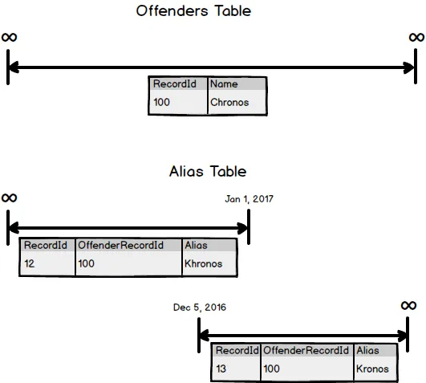

_This post is part of a larger discussion about temporal databases.  Hopefully it stands on it’s own but for more context see the [Temporal Database Design page](https://nftb.saturdaymp.com/temporal-database-design/)._  _You can read the official [Wikipedia definition](https://en.wikipedia.org/wiki/Temporal_database) but for our purposes a Temporal Database is a database where you can query for historical data using SQL.  This is work in progress and constructive feedback via e-mail, at [chris.cumming@saturdaymp.com](mailto:chris.cumming@saturdaymp.com), is most appreciated._

In the last [Temporal Database post](https://nftb.saturdaymp.com/temporal-database-timelines/) I introduced timelines.  In this post we will talk about the one rule you cannot break:

> ## **Timeline segments cannot overlap!**

That's it.  That is the one rule.  Breaking this rule leads to all sorts of problems when you try to actually implement timelines in a database.  Aside from creating problems at the database level it also creates theoretical headaches.  For example, if you have the following in your customer table:

What is Chronos's name on December 20th?  Is it Chronos or Kronos?  That said it is possible for people to have two names at the same time.  We have nicknames, aliases, and the like.  If you need to create a database that supports multiple names, say a police database, you can have an Aliases table that hangs off the Offenders table.  For example:

Chronos has an offender record with the name but also has two timelines in the Alias table with his over names.  Notice that alias table has two timelines, not one segment with overlapping segments.

How you design your temporal database will depend on your business logic but you must remember that there is one rule you can't break:

> ## [**When this baby hits 88mph you are going to see some serious $#%!**](https://www.youtube.com/watch?v=JFT7hNhop7w)

Sorry, wrong timeline.  I meant:

> ## **Timeline segments cannot overlap!**
