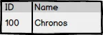
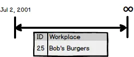
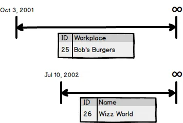

_This post is part of a larger discussion about temporal databases.  Hopefully it stands on it's own but for more context see the [Temporal Database Design page](https://nftb.saturdaymp.com/temporal-database-design/)._  _You can read the official [Wikipedia definition](https://en.wikipedia.org/wiki/Temporal_database) but for our purposes a Temporal Database is a database where you can query for historical data using SQL.  This is work in progress and constructive feedback via e-mail (chris.cumming@saturdaymp.com) is most appreciated._

In a non-temporal database a record dose not change over time.  For example say you have a Contacts table with a name field.

A record in that table does not change over time.  Record 100 either has the name Chronos of some other name.  If you think of this record from a temporal point of view it's a record starts at the beginning of time and goes to infinity.  If we where to represent this record using a timeline it would look like:

Now lets make the table effective-temporal.  The technical details of how we do this in the database is not important right now.  For now lets just focus on the timeline.  Say Chronos changes his name to Kronos on January 1, 2017 then our timeline would look like:

We are going to assume gods aren't born and don't die so the timeline still goes from start of time to infinity.  However, the timeline now consists of two segment.  The first segment goes from the start of time to Dec 31, 2016.  The second segment goes from Jan 1, 2017 to infinity.

Notice that the ID does not change.  It's still 100 in both segments.  Chronos changed his name to Kronos but he is still the same person, er god.

One more example.  In this case lets track where John Doe works as he goes through high school.  Lets start in grade 10 with his first job as a burger flipper.  He works in the weekend as he attends school.  The workplace timeline looks like:

In the summer John continues to work at Bob's Burgers but also gets a second job as a life guard at the water park Water Wizz.

Now John Doe has two timelines one for Bob's Burgers and one for Water Wizz.  When summer ends John leaves Wizz World but keeps his burger flipping job in Grade 11 so now his employment timelines look like:

Notice that the timeline for Wizz World has ended but Bob's Burgers continues.  In the summer between grade 11 and 12 John is again hired by Wizz World because he such a good worker.  Now his employment timelines look like:

One of the challenges when creating a temporal database is deciding when to create new timelines and when to create new segments.  In this case we decided to use the existing Wizz World timeline and add a segment to it.  If the employer stays the same keep the timeline, if the employer is different create a new timeline.

Also notice that the Wizz World timeline has a gap in the segments, which is just fine.  What you can't have is a timeline with overlapping segments.  You can have timelines that overlap but a timeline can't have overlapping segments.

Let's talk more about overlapping segments and other stuff in a future segment.  Ah, time jokes, they never get old.
