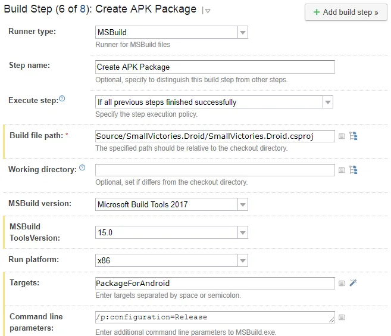
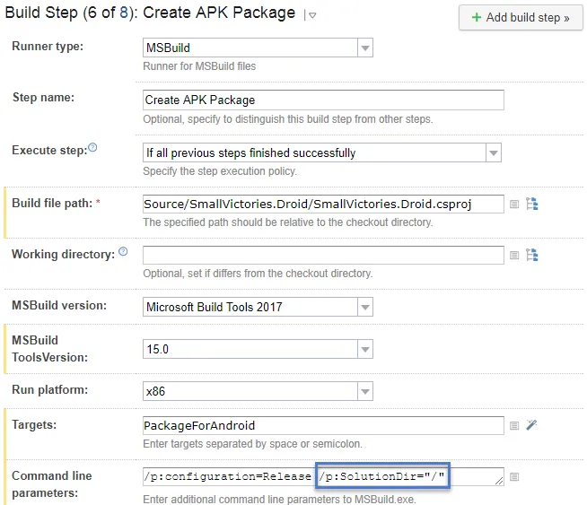

When building a Xamarin application one step is to build the Android APK file.  This is a MsBuild step in TeamCity that looks like:

[](https://nftb.saturdaymp.com/wp-content/uploads/2017/12/TeamCity-Create-APK-Package-Build-Step.png)

This step generates the following error:

```text
[15:55:53][Source\SmallVictories\SmallVictories.csproj] CopyRealmWeaver
[15:55:53][CopyRealmWeaver] CopyRealmWeaver
[15:55:53][CopyRealmWeaver] Copy
[15:55:53][Copy] Creating directory "*Undefined*Tools".
[15:55:53][Copy] C:\BuildAgent\temp\buildTmp\.nuget\packages\realm.database\2.1.0\build\Realm.Database.targets(28, 5): error MSB3021: Unable to copy file "C:\BuildAgent\temp\buildTmp\.nuget\packages\realm.database\2.1.0\build\..\tools\RealmWeaver.Fody.dll" to "*Undefined*Tools\RealmWeaver.Fody.dll". Illegal characters in path.
[15:55:53][Step 6/8] Error message is logged
```

Notice the "\*Undefined\*Tools" in the directory path.  To fix this step you need to add /p:SolutionDir="/" to the command line.  So now the build step looks like:

[](https://nftb.saturdaymp.com/wp-content/uploads/2017/12/TeamCity-Create-APK-Package-Build-Step-Fixed.png)

You can find more about the bug in this GitHub [issue](https://github.com/realm/realm-dotnet/issues/1429) and more about the fix in this blog [post](https://chrisrisner.com/Getting-Realm-to-Build-in-Xamarin-with-VSTS).
