_This is the part one of a lighting talk I'm giving at the [SQL Saturday Edmonton Speaker Idol Contest](https://www.meetup.com/EDMPASS/events/244468043/).   Imagine I'm actually speaking the words below and showing some of the images on slides and/or doing a demo._  _Code can be found_ _[here](https://github.com/saturdaymp/IntroductionToORMForDBAs)._

_This is a rough draft so constructive feedback at [chris.cumming@saturdaymp.com](chris.cumming@saturdaymp.com) is much appreciated._

_Skip ahead to [Part 2](https://nftb.saturdaymp.com/introduction-to-object-relational-mapping-for-dbas-part-2/) if don't feel like reading all of part 1._

Developer Bud wants to create a new application to track the board games he and his friends play.  He wants a simple website where him and his buddies can login to update the results from the board games they have played.  Being a .NET Developer he creates a ASP.NET MVC Core application with individual authentication.

[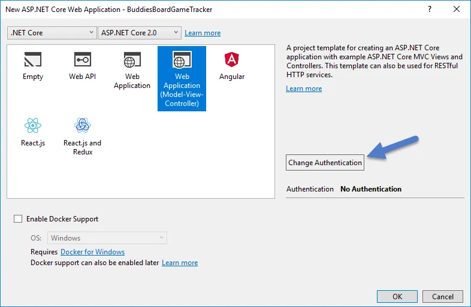](https://nftb.saturdaymp.com/wp-content/uploads/2018/01/CreatingNewASPNETMVC.png)

[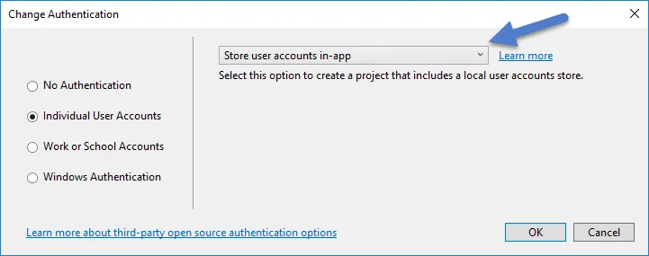](https://nftb.saturdaymp.com/wp-content/uploads/2018/01/CreatingNewASPNETMVCAuthentication.png)

By default this new application uses Entity Framework which is a object-relational mapping (ORM) framework.  Since he picked to use authentication the default ASP.NET application has a migration file that defines the authentication tables.

[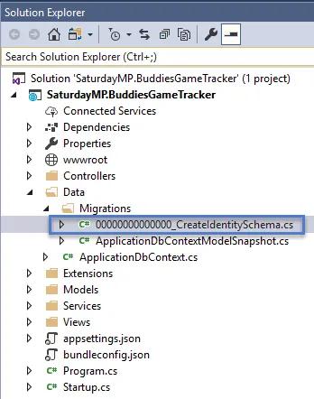](https://nftb.saturdaymp.com/wp-content/uploads/2018/01/AuthenticationMigrationFileLocation.png)

[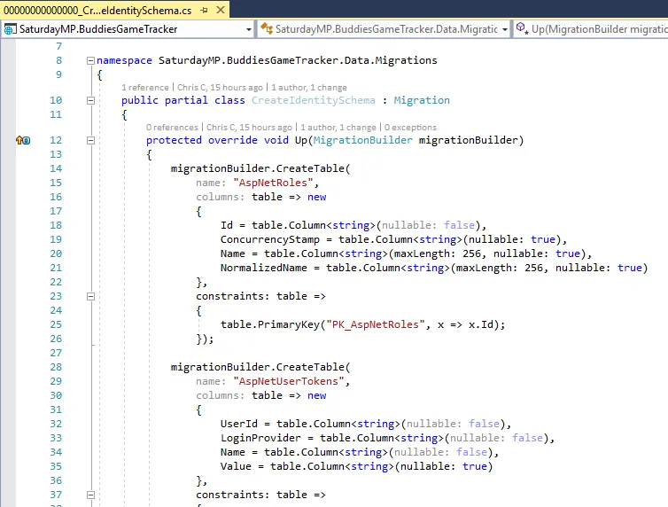](https://nftb.saturdaymp.com/wp-content/uploads/2018/01/AuthenticationMigrationFile.png)

Even if you don't understand C# you can probably see the above is describing a database but is not the usual SQL DDL.  We will return to this file later, for now lets continue to follow Bud.

Next he compiles and runs the application to make sure it works.  It loads up and looks like the below.

[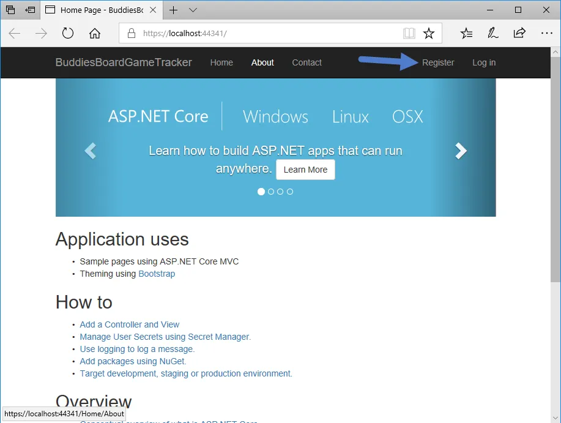](https://nftb.saturdaymp.com/wp-content/uploads/2018/01/AppRunningForFirstTime.png)

Everything looks good but when he tries to create a new user he gets the following error:

[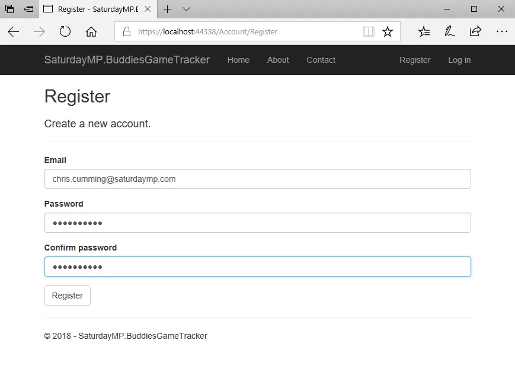](https://nftb.saturdaymp.com/wp-content/uploads/2018/01/TryingToRegister.png)

[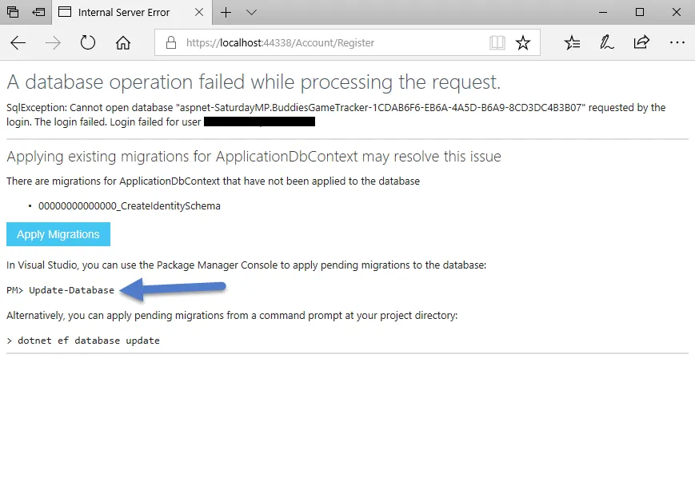](https://nftb.saturdaymp.com/wp-content/uploads/2018/01/ApplyMigrationsRegistrationError.png)

 

Following the advice he runs the migration.  Actually before he runs the migration he changes the connection string to point to his SQL Server instance instead of the SQL Server local DB:

[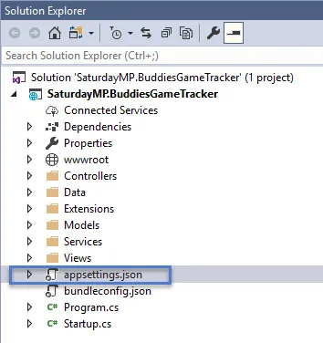](https://nftb.saturdaymp.com/wp-content/uploads/2018/01/AppSettingsJsonLocation.png)

[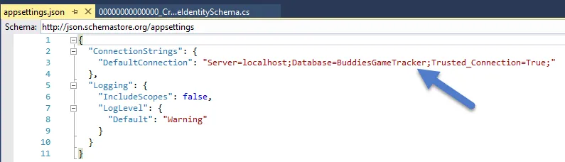](https://nftb.saturdaymp.com/wp-content/uploads/2018/01/ConnectionStringInApSettings.png)

```text
"Server=(localdb)\\mssqllocaldb;Database=aspnet-SaturdayMP.BuddiesGameTracker-1CDAB6F6-EB6A-4A5D-B6A9-8CD3DC4B3B07;Trusted_Connection=True;MultipleActiveResultSets=true"
```

```text
"Server=localhost;Database=BuddiesGameTracker;Trusted_Connection=True;"
```

Then Bud runs the command to update the database:

```text
Update-Database
```

 

[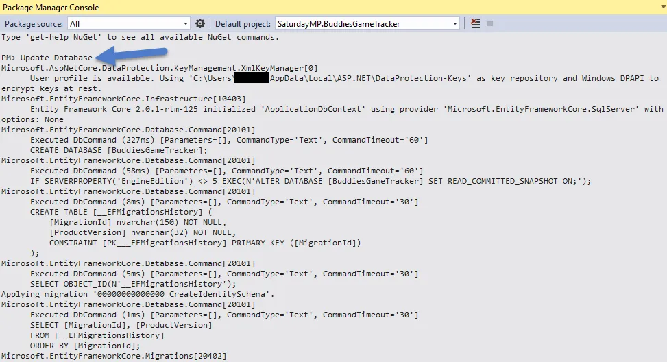](https://nftb.saturdaymp.com/wp-content/uploads/2018/01/UpdateDatabaseCommand.png)

_**Update (Dec 5th, 2018):**_ _Added the Bud successfully runs the application section below and changed some text at the end or part 1._

Bud runs the application again and this time when he registers there are no errors and he is successfully registered.

[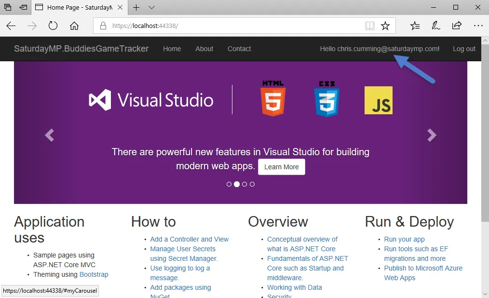](https://nftb.saturdaymp.com/wp-content/uploads/2018/01/RegisterSuccessfulAfterMigration-1.png)

 

Bud doesn't care about the underlying database that was created.  Well, that is not true, he does care about it but the same way most of us care about our car engine.  We only care about our care engine if the car won't start.  If the car gets us from point A to point B then we don't really care about the engine.

Bud doesn't do this but because we are omnipotent DBAs (are all DBAs omnipotent?) we will peek behind the curtains at the generated database.  And here it is, a new database with some authentication tables.

[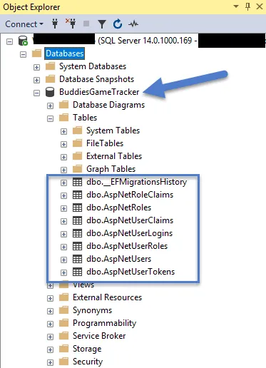](https://nftb.saturdaymp.com/wp-content/uploads/2018/01/BuddiesGameTrackerTablesCreated.png)

From a developer point of view this is great.  Bud didn't have to write a single line of SQL.  He didn't didn't even have to open up SQL Server, the database was just magically created.

This is just the beginning.  Later Bud will create more tables in code to track what buddies have which played which games.  He will do this without writing DDL and access the data with little to no SQL.

I imagine from a DBAs point of view this is a bit strange.  Don't you start a new application by creating the database ERD first?  How did Visual Studio create the database?  Is the created database any good?  What about the auto-generated CRUD SQL?  Wait, what about the indexes?

[](https://nftb.saturdaymp.com/wp-content/uploads/2018/01/wont-somebody-please-think-of-the-indexes.jpg)

_Continue to [part two](https://nftb.saturdaymp.com/introduction-to-object-relational-mapping-for-dbas-part-2/) of the talk.  You can find the code for this talk [here](https://github.com/saturdaymp/IntroductionToORMForDBAs).  As I said above, this is a rough draft so constructive feedback at [chris.cumming@saturdaymp.com](chris.cumming@saturdaymp.com) is much appreciated._
