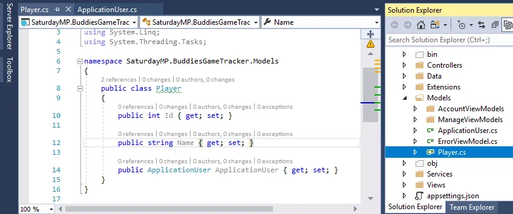
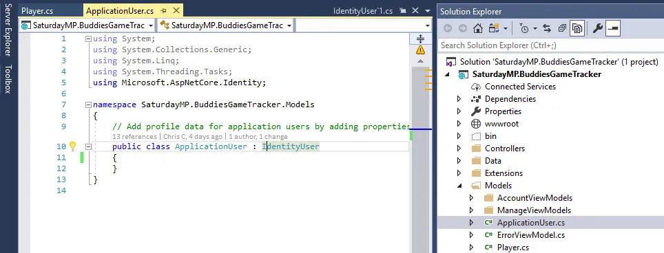
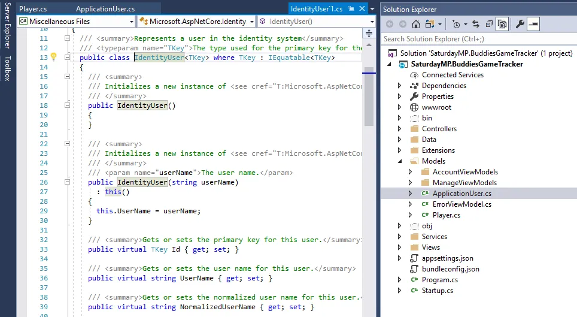
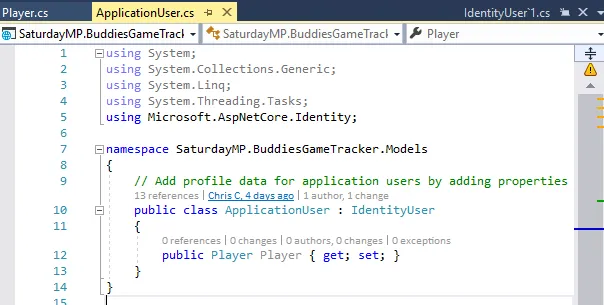
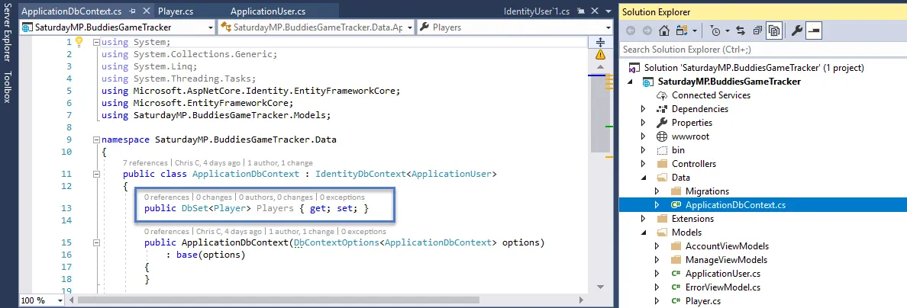
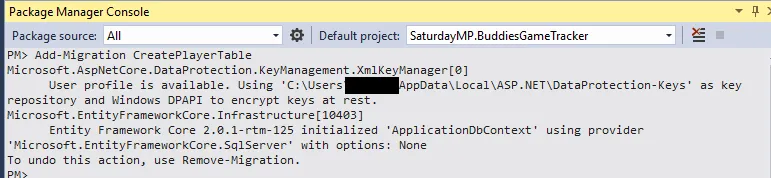
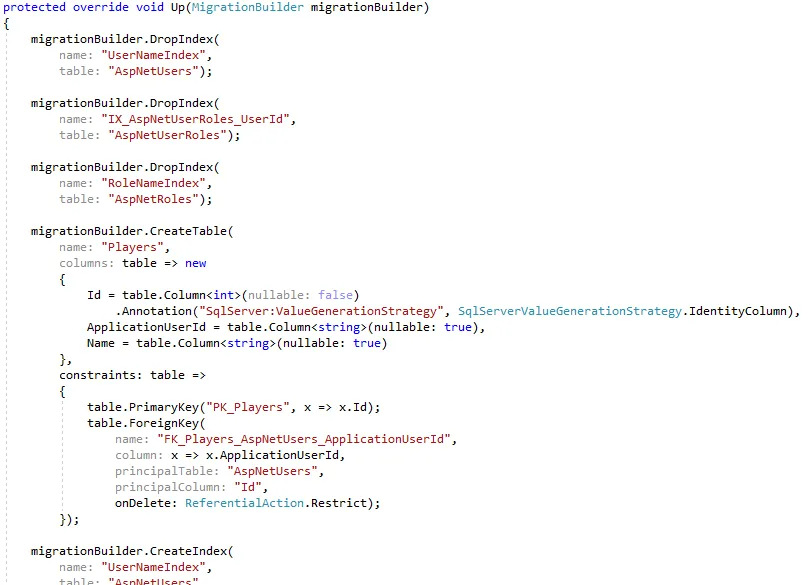
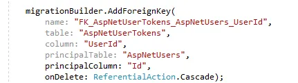
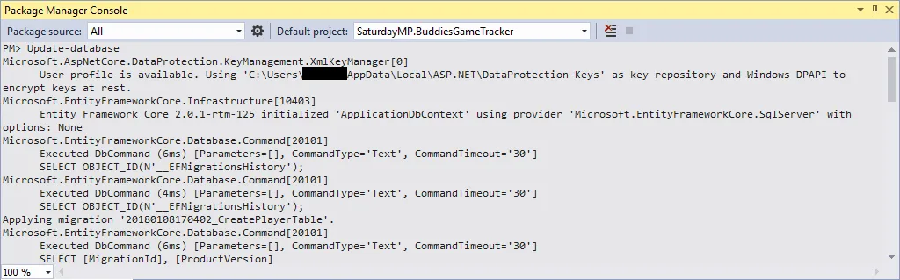
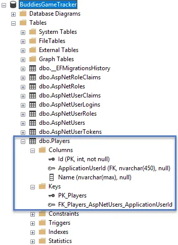

_This is part two of a lighting talk I'm giving at the [SQL Saturday Edmonton Speaker Idol Contest](https://www.meetup.com/EDMPASS/events/244468043/).   Imagine I'm actually speaking the words below and showing some of the images on slides and/or doing a demo._  _Code can be found_ _[here](https://github.com/saturdaymp/IntroductionToORMForDBAs)._

_If you don't want to read [Part 1](https://nftb.saturdaymp.com/introduction-to-object-relational-mapping-for-dbas-part-1/) it basically started the ORM example and ended in a panic over indexes._  

_This is a rough draft so constructive feedback at [chris.cumming@saturdaymp.com](chris.cumming@saturdaymp.com) is much appreciated._

Now that we have our initial panic out of our system lets get back to Bud.  The next thing he wants to do is link a logged in user to a player.  A player needs to have a name and be linked to the login.  Bud creates a model, really just a simple C# class, and puts in all the information he wants to store a player.

Looks kind of like a database table.  The one question you might have is what is a ApplicationUser?  It turns out a ApplicationUser is another model in the project that was auto-created when we choose to have authentication in our application.  It's the logged in user.

If we open that ApplicationUser class we see it does not define any fields.  It doesn't define any fields in the child class but the parent class does.  I'm not going to explain inheritance here but rest assured the fields are defined as shown below.

Because the relationship is one-to-one Bud does add a new property to the ApplicationUser model.

Now the application knows that ApplicationUser has a one-to-one relationship to Player.  One other thing Bud has to do is add his new class the DB context.  Entity Framework might find his new model but it's best if it's listed.

Now Bud can create a new migration for his new Player model.

\[text\] Add-Migration CreatePlayerTable \[/text\]

 

This creates the <timestamp>\_CreatePlayerTable file.  If we open it up we see it creates the Player table and also a foreign key relationship to the ApplicationUser which maps to the AspNetUsers table.

Now that the migration file is created Bud runs the migration to add the Players table to his database.

\[text\] Update-Database \[/text\]

 

Now if we look in the database we find the new Players table, notice it's plural, and it has a foreign key to the AspNetUsers table.

OK, enough of following Bud, we are running out of lightning time.  Lets talk about why Bud would want to use an ORM tool such as Entity Framework.

_You can find [part 1 here](https://nftb.saturdaymp.com/introduction-to-object-relational-mapping-for-dbas-part-1/). and [part 3 here](https://nftb.saturdaymp.com/introduction-to-object-relational-mapping-for-dbas-part-3/).  You can find the code for this talk [here](https://github.com/saturdaymp/IntroductionToORMForDBAs).  As I said above, t__his is a rough draft so constructive feedback at [chris.cumming@saturdaymp.com](chris.cumming@saturdaymp.com) is much appreciated._
