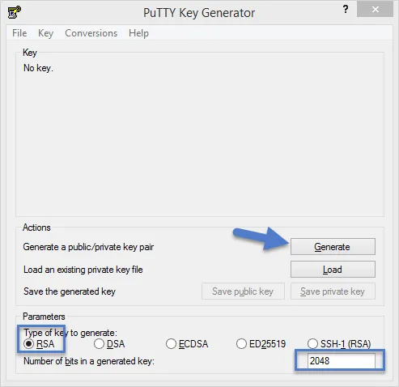
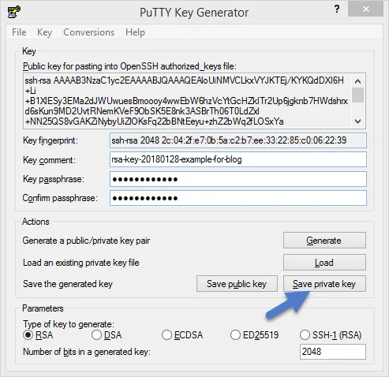
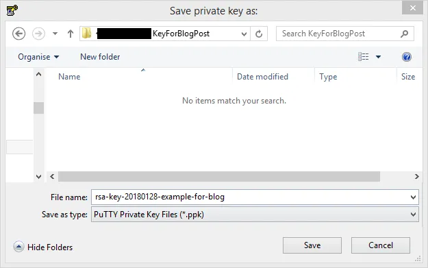
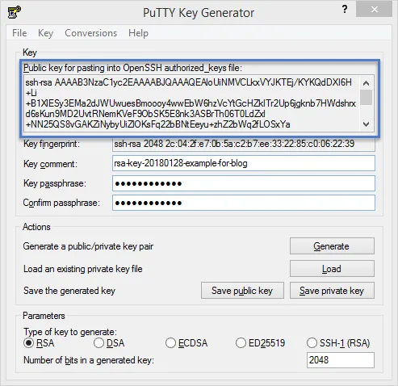
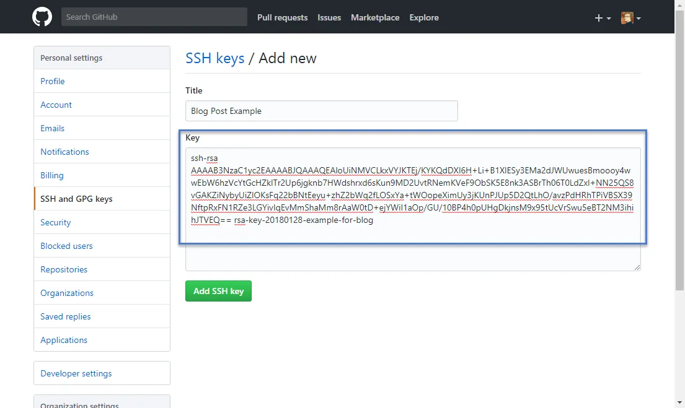
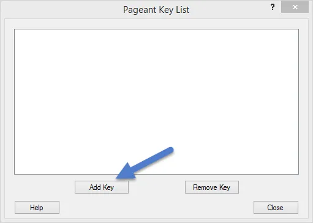
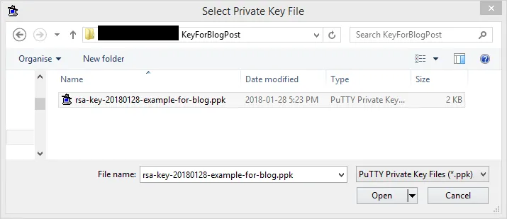
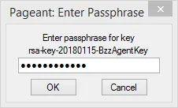
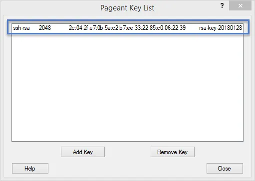

I recently had to generate a private/public key pair to access a Git repository.  While I've done this several times before I never do it enough to remember all the steps so this time I wrote it down.

Since my primary workstation runs [Windows](https://www.microsoft.com/en-us/windows) I use [PuTTY](https://www.putty.org/) to generate the keys.  If you thought PuTTY was just a SSH client then you are not alone (e.g. I used to think that too).  PuTTY's unofficial tag line should be:

> PuTTY.  It's more then a just a SSH client.

Once you have Putty installed run the PuTTYGen application.  Make sure the type of key to generate is RSA and it's 2048 bits then click the _Generate_ button.

Why RSA?  Because that is the type of key you want 99% of the time and works with most [clients and services](https://security.stackexchange.com/questions/23383/ssh-key-type-rsa-dsa-ecdsa-are-there-easy-answers-for-which-to-choose-when).  Same with the 2048 length.  You can generate a longer key, say 4096 for better security, but it might not work with some clients and/or services.  That said if your service uses a different key format then adjust the settings as needed.

Wiggle your mouse when prompted and a few seconds later you should have a new key generated.

Now change the key comment so you remember what this key is for.  I also recommend protecting you key with a passpharse, basically a password.  This prevents someone from using your private key if they are able to get a hold of it.  Then click _Save private key_ button and save the key to a secure place.

Remember this is your **private** key and if someone gets a hold of it they can pretend to be you.  Similar to someone knowing your password.  In my case I save it to an encrypted location.

You should also backup your new key to a secure location.  In my case my keys are backed up to an encrypted location as part of my nightly backup.

Most remote services, such as GitHub, will ask you for your public key which you can cut and paste.

**Important:** When using your key remember to only share the public part.  Never share your private key!

Now you are all excited to start using the service you uploaded your public key, such as cloning the Git repository.  Unfortunately you will get an error about the key not being valid, not found, or something similar.

On Windows you need to run the PuTTY Pageant application.  This application runs in the background and handles key authentication.  When you run it it will load in the windows [Notification Area](https://www.computerhope.com/jargon/n/notiarea.htm) (on the far right, used to be called the System Tray).

Open up Pageant and then click the _Add Key_ button.  Then navigate to where your private key is stored and load it.

If you put a passpharse on your key, which you should do, you will get prompted for it.

Now your key will appear in Pageant and be used by applications that need to do key authentication.  You won't have to enter your passpharse again while Pageant is running.  In practice this means you usually only have to reenter your passphrase when you reboot your computer.

 

That is all there is too it.  Enjoy using your new key pair.

 

P.S. - I couldn't find any good songs about keys but keys are encryption and encryption is complicated math.  Tool is known for songs with unique time signatures (i.e. hard music math) in their songs.  [Schism](https://en.wikipedia.org/wiki/Schism_\(song\)) is an excellent example of this with a 6 1/2 over 8 time signature.

_I've done the math enough to know the dangers of our second guessing Doomed to crumble unless we grow, and strengthen our communication_


