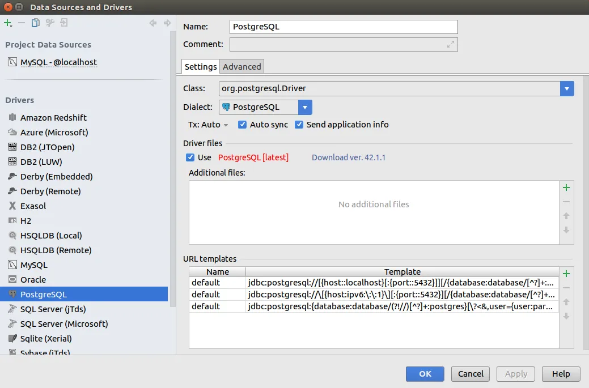
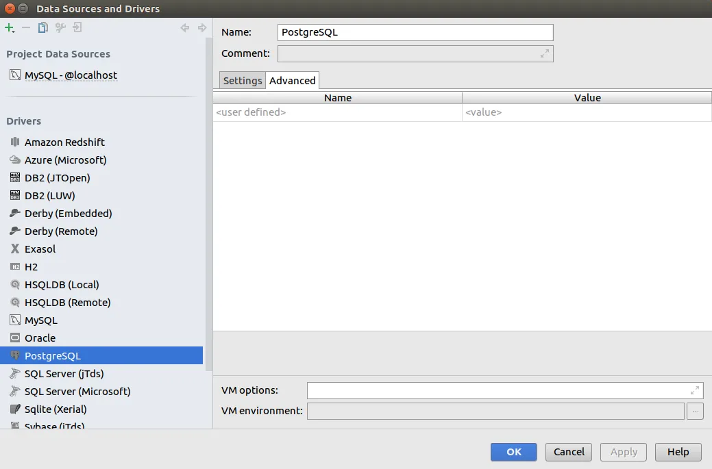
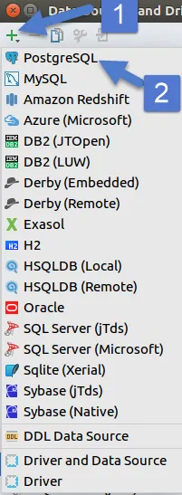
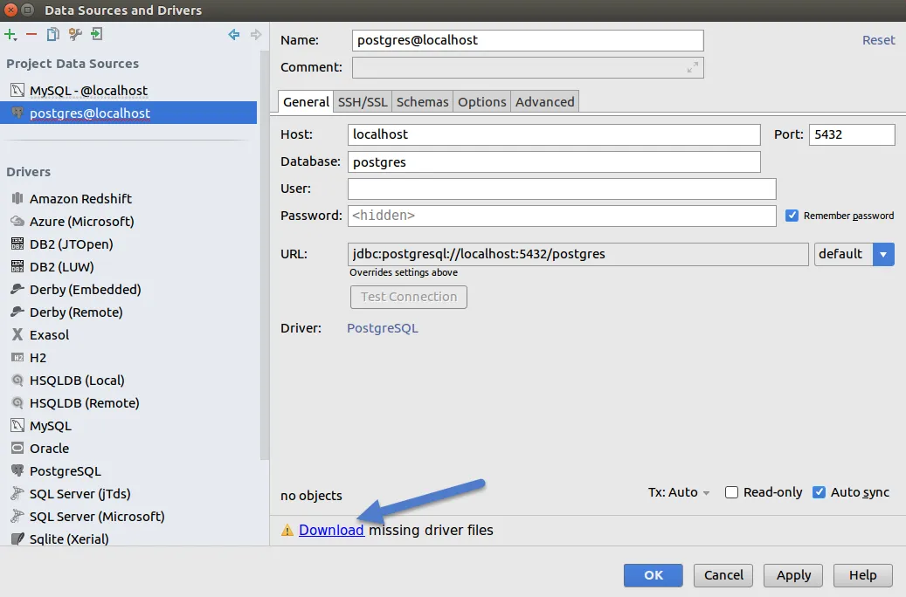
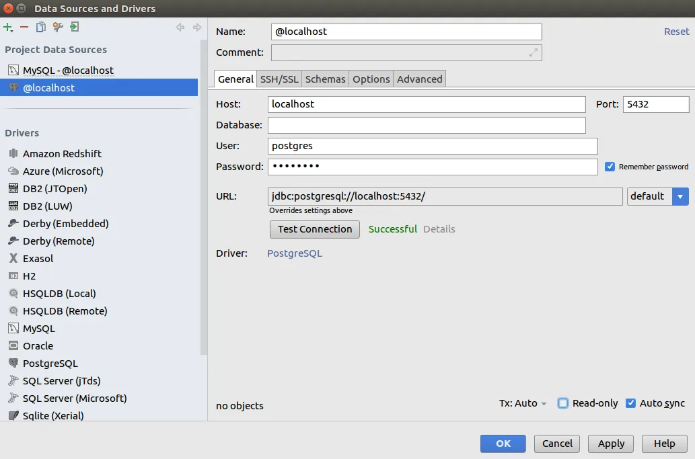
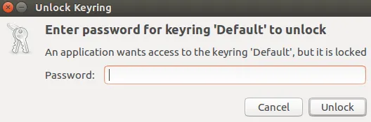
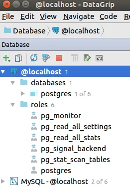

For an upcoming project I'm thinking of using PostgreSQL.  I've heard lots of great things about PostgreSQL in the past but have been too scared lazy busy to try it.

What changed my mind was JetBrains DataGrip database client.  I'm sure there are [other PostgreSQL clients](https://wiki.postgresql.org/wiki/Community_Guide_to_PostgreSQL_GUI_Tools) but DataGrip is included in my JetBrains subscription so why not give it a try.   I'm a sucker for GUI database clients.  As a generalist it's too hard to remember all the command lines for each individual database.  Plus it's really hard to view more then a few rows or columns of data in the command line.

Anyway, let's get to installing Postgresql in a Ubuntu development environment.  The initial installation instructions can be found [here](https://www.postgresql.org/download/linux/ubuntu/).  First lets add the PostgreSQL Apt Repository.  We do this so we can get he latest version of PostgreSQL and aren't stuck with the Ubuntu version.

First create a file that will point to the PostgreSQL Apt Repository:

\[text\] sudo nano /etc/apt/sources.list.d/pgdg.list \[/text\]

Then add the following to the file:

\[text\] deb http://apt.postgresql.org/pub/repos/apt/ -pgdg main \[/text\]

Finally import the repository signing key:

\[text\] wget --quiet -O - https://www.postgresql.org/media/keys/ACCC4CF8.asc | sudo apt-key add - \[/text\]

Now do a apt update and you should see the PostgreSQL listed:

\[text\] sudo apt update \[/text\]

Finally install it:

\[text\] sudo apt install postgresql \[/text\]

You can check if PostgreSQL was installed correctly by trying to connect to it:

\[text\] sudo su - postgres psql \[/text\]

Notice you had to switch to the postgres user before attempting to connect.  This is a new user that was created during the PostgreSQL installation and is the default user for new database installs.

By default PostgreSQL does not have a [default password](https://stackoverflow.com/questions/7695962/postgresql-password-authentication-failed-for-user-postgres/7696398#7696398) in Ubuntu.  You can only login via the above command and can't connect using other methods, such as DataGrip.  To change the postgres default user password run the following command when logged into PostgreSQL:

\[text\] ALTER USER postgres PASSWORD 'password'; \[/text\]

Once that is done you can logout of PostgreSQL by typing "\\q".

Now lets try to connect to our localhost PostgreSQL install in DataGrip.  Run DataGrip then choose File-->Data Sources.  Then click PostgresSQL and you should see something similar to the below.

If prompted download the driver files.  Now lets try to create a connection by clicking the green plus sign in the top right and choosing PostgreSQL:

You should see something similar to the below:

If there is a message saying a driver is missing then download it.  If this is your first time installing PostgreSQL there will be no database so leave that field blank but fill in the username and password.  The username is "postgres" and the password if the one you created in the above ALTER statement.  Click Test Connection to make sure everything works.

When you close this form you might be prompted to store the password in your keyring.  You don't have to but I like too so I don't have to keep entering it.

Now you should be able to see the PostgreSQL database in DataGrip:

 

P.S. - Spotify listed Bored to Death by Blink 182 as my most played song of 2017.  The second most played song was [Sober](https://www.youtube.com/watch?v=Fof6vYITQ3w) also by Blink 182.  I wonder what targeted ads I would get if that information feel into Google or Facebook's hands.

_Life is too short to last long_

https://www.youtube.com/watch?v=lic0oCDMfwk
