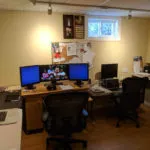
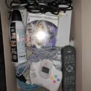
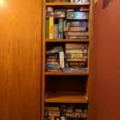

I'm on optimist and generally think things will work out for the best.  I like to say:

> ## The future is awesome!

That said it's easy to forget how awesome individual days can be.  How many small but amazing things occur each day that we gloss over.  Our day is 99% good and 1% bad but we focus on that one minor bad moment.

Think about your conversations at the end of the day.  Does it focus on the negatives of the day?  That boozo that cut me off in traffic.  The Internet was down for 5 minutes.  I had to stay at work 10 minutes late.  Etc.

Imagine changing the conversation to focus on all the good things that happened that day.  The person that let me merge into their lane.  Technology let send a e-mail to relative half-way around the world.  I solved several work problems with the help of my co-workers.  Etc.

My inspiration for this post was the last [Burnie Vlog](http://roosterteeth.com/show/burnie-vlog) at [Rooster Teeth](http://roosterteeth.com/).  It is a, heavily edited, example of his day.  It does a great job of showing how a normal day is full of awesomeness.  Awesomeness that we often take for granted.  At least that is what I got out of it.



The Vlog caused me reflect on my last Friday.  A day that contained many awesome moments that I didn't fully appreciate at the time:

- Woke up a bit late because I had a remote work meeting late the night before people from the United States and India.
- Still got up in time to make my family breakfast and see them off.
- Cleaned myself up.
- No commute because I'm lucky enough to work from my basement office.
- Had remote meeting with [co-workers](http://corgibytes.com/) in Eastern Canada and States.  Great group to work with.
- Worked on my first official code inspection.  I've done code reviews and informal code inspections but not a structured official one.  I'm really excited.
- Watched the end of [Altered Carbon](https://www.youtube.com/watch?v=dhFM8akm9a4) on my couch while eating lunch.
- Went for a walk because it was [nice winter day](http://climate.weather.gc.ca/climate_data/hourly_data_e.html?StationID=27214&Month=2&Day=23&Year=2018&timeframe=1&StartYear=1840&EndYear=2018) in Edmonton.
- Greeted my amazing daughter and beautiful wife when they got home from school and work.
- Had some time before dinner so my daughter and I packed up board games, old TV, and [Dreamcast](https://en.wikipedia.org/wiki/Dreamcast) in the car.  I have [Tony Hawk Pro Skater](https://www.youtube.com/watch?v=d0m4O2XJhb4) for the Dreamcast.
- Ate dinner with my family.  Talked about what live would be like if could move our conscious to other bodies like in Altered Carbon.
- Drove to the local community hall and setup for the monthly [Games Night](https://www.facebook.com/events/276596172844297/).  I bring a bunch of board games and setup a TV with a an old video game console.  This night was Dreamcast but previous months it's been [NES](https://en.wikipedia.org/wiki/Nintendo_Entertainment_System), [Super NES](https://en.wikipedia.org/wiki/Super_Nintendo_Entertainment_System), [Intellivision](https://en.wikipedia.org/wiki/Intellivision), etc.
- Played a new game [Terraforming Mars](http://www.fryxgames.se/games/terraforming-mars/).
- Visited with friends and neighbours.  Sang happy birthday to a neighbour and ate cake.  My beautiful wife dropped in for a bit as well which always makes me smile.
- Watched my daughter teach and play [Zombicide](https://zombicide.com/fr/black-plague/) and [The Dragon and Flagon](https://www.youtube.com/watch?v=YQ4pATAgV8g).  Still not used to seeing my daughter and her friends play complicated games without adults.
- Packed up a bit earlier then usual (i.e. before midnight) but for a good reason: we are going skiing the next day with friends.  Just to a [local Edmonton hill](https://www.rabbithill.com/home/) but it's to practice for our upcoming [mountain ski trip](https://www.skibanff.com/).
- Sent my daughter to bed then snuggled up with my wife and drifted off to sleep.

All in all it was great day.  Preceded by many great days before it and many great days to come.  Just enjoy the show and don't ask for your money back.  Also, the future is awesome.

 

P.S. - After watching the Final Vlog video above I had [The Show](https://www.youtube.com/watch?v=elsh3J5lJ6g) song stuck in my head and kept singing it much to my family's chagrin.  At least singing the couple lines I knew.  Below is the cover sung in the Final Vlog.

_I'm just a little bit caught in the middle_ _Life is a maze and love is a riddle_ _I don't know where to go; can't do it alone; I've tried_ _And I don't know why_

_I want my money back_ _I want my money back_ _I want my money back_ _Just enjoy the show_


