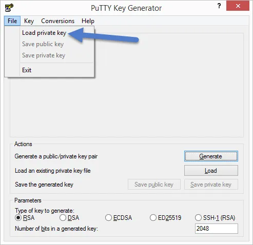
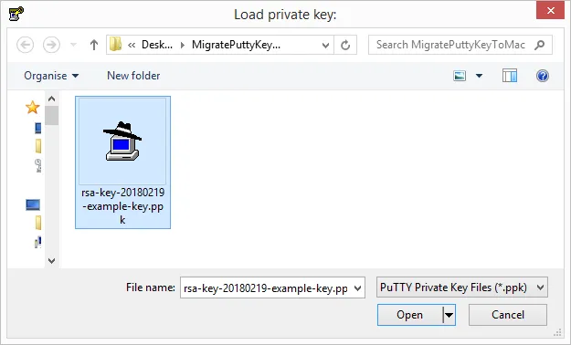
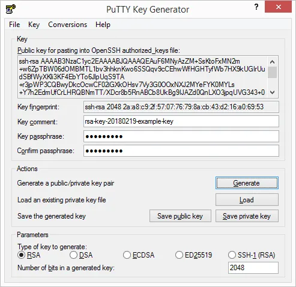
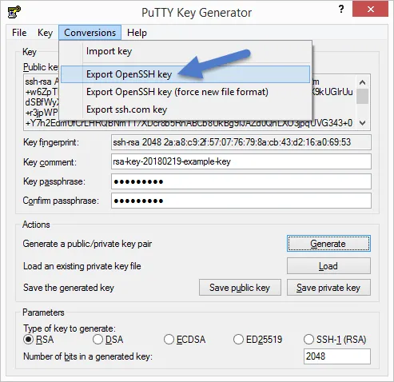
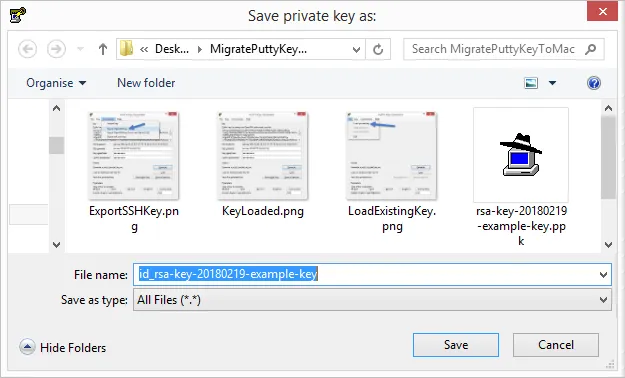
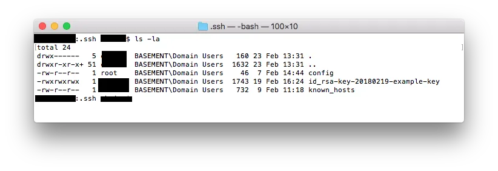
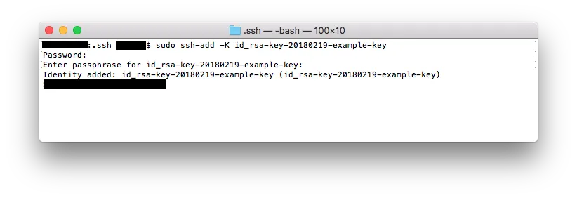
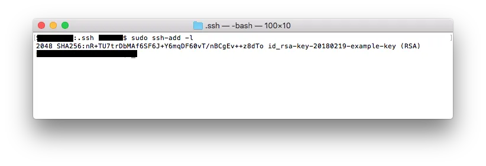
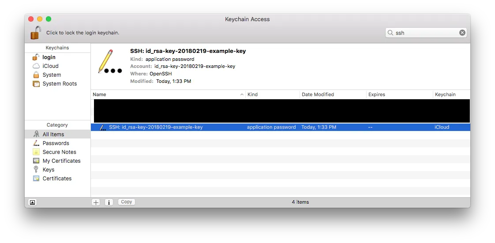

You created a private Putty key on Windows workstation to access a remote service but now you need to access that same remote service from a Mac workstation.  In my case I need to access the same Git repository from both machines.  I created the key using the steps outlined in a [previous post](https://nftb.saturdaymp.com/today-i-learned-how-to-create-a-key-pair-using-putty/).

**Quick aside:** Before we continue you need to decide if it's better to copy your private key or just generate a new private/public key pair on the Mac.  If the service you are connecting too does not support multiple keys then you have now choice but to copy it.  Assuming that the service does allow multiple keys then consider these [security implications](https://security.stackexchange.com/questions/10203/reusing-private-public-keys) of copying your private key.

The first thing to do is convert the key from a Putty key to a OpenSSH key.  Do this by opening the key in PuTTYGen then choosing File --> Load private key.  Then pick the key you want to transfer to your Mac.

[](https://nftb.saturdaymp.com/wp-content/uploads/2018/02/LoadExistingKey.png)

[](https://nftb.saturdaymp.com/wp-content/uploads/2018/02/SelectKeyToLoad.png)

[](https://nftb.saturdaymp.com/wp-content/uploads/2018/02/KeyLoaded.png)

Now convert the key to OpenSSH via the Conversions --> Export OpenSSH Key menu option.

[](https://nftb.saturdaymp.com/wp-content/uploads/2018/02/ExportSSHKey.png)

[](https://nftb.saturdaymp.com/wp-content/uploads/2018/02/SavingOpenSSHKey.png)

Now that the OpenSSH key is saved copy it over to your Mac.  Since this is a private key do it securely such as known LAN, USB, etc (e-mail is a bad idea).  Once the key is on your Mac copy it to the .ssh folder.

[](https://nftb.saturdaymp.com/wp-content/uploads/2018/02/CopyKeyDotSSHFolder.png)

Then run the command to add the key.  Use the capital -K option to add the key to the Mac KeyChain so you don't have to keep entering your passphrase.  The first password prompt is the Sudo password and the second is the passphrase for the private key.

```text
sudo ssh-add -K <key file>
```

[](https://nftb.saturdaymp.com/wp-content/uploads/2018/02/AddKeyToKeyChain-1.png)

Now you can see that the key has been added by running the following command.

```text
sudo ssh-add -l
```

[](https://nftb.saturdaymp.com/wp-content/uploads/2018/02/ShowAddedKey.png)

You can also find the key in the Mac Keychain.  In the Keychain application filter by SSH and you should see your key added.

[](https://nftb.saturdaymp.com/wp-content/uploads/2018/02/KeyInKeyChain.png)

 

Now your private key has been successfully copied.

 

P.S. - Another [key blog post](https://nftb.saturdaymp.com/today-i-learned-how-to-create-a-key-pair-using-putty/) and another [Tool](https://en.wikipedia.org/wiki/Tool_\(band\)) song because, you know, numbers.  This one is about the [Fibonacci sequence](https://en.wikipedia.org/wiki/Lateralus_\(song\)).

_And following our will and wind We may just go where no one's been. We'll ride the spiral to the end And may just go where no one's been._


