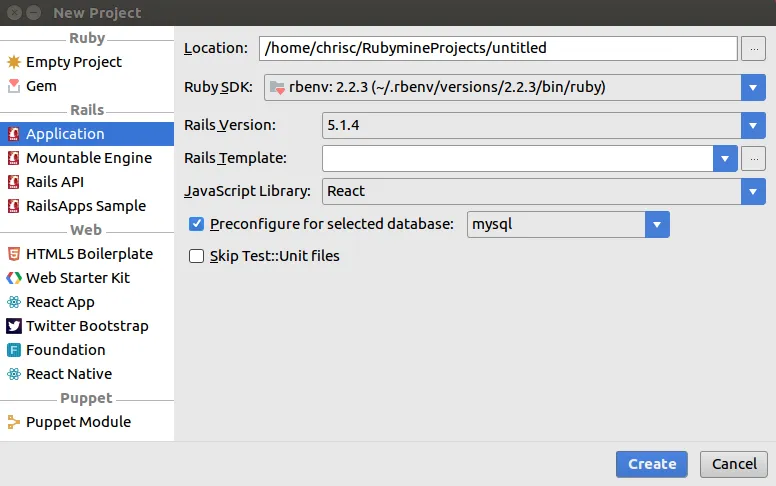
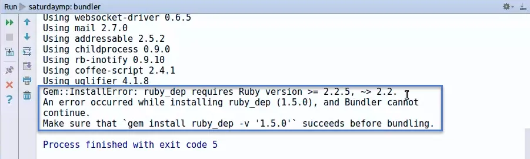
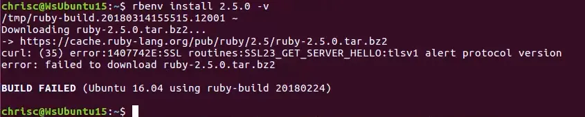
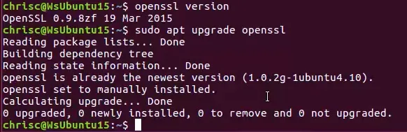
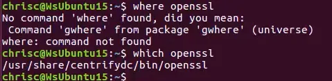
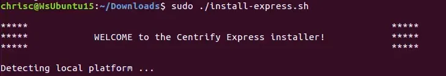
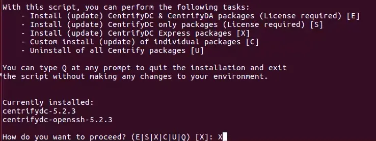
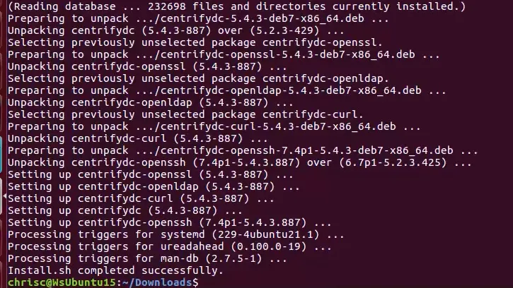
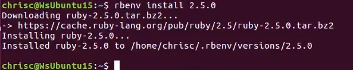



In the above video you can replace the question with:

> Chris, have created that Ruby on Rails 5 project?
> 
> What dose it look like I'm Doing!

**Scene 1:** Create new Ruby on Rails project using [Ruby Mine](https://www.jetbrains.com/ruby/).

**Scene 2:** Try to install the Gems find out I need Ruby 2.5.

**Scene 3:** Try to install Ruby 2.5 but it fails with a weird curl error message.

**Scene 4:** With help from the [world's greatest detective](http://google.com) I figure out my version of [OpenSSL](https://www.openssl.org/) is out of date.  Try running updates to get the latest version.

**Scene 5:** Didn't fix the problem.  Figure out the version of OpenSSL being used is the Centrify version.  Yes I always think the "which" command is "where".  Why is the command called "which"?

**Scene 6:** Investigate the best way to fix this problem.  Decide it's easiest to update Centrify.

**Scene 7:** Problem is fixed and I can install Ruby 2.5.

I still need to install and/or update a couple other packages, such as nodejs, but that is what I expected.  I didn't expect to have to waste an hour diagnosing an old OpenSSL issue.
