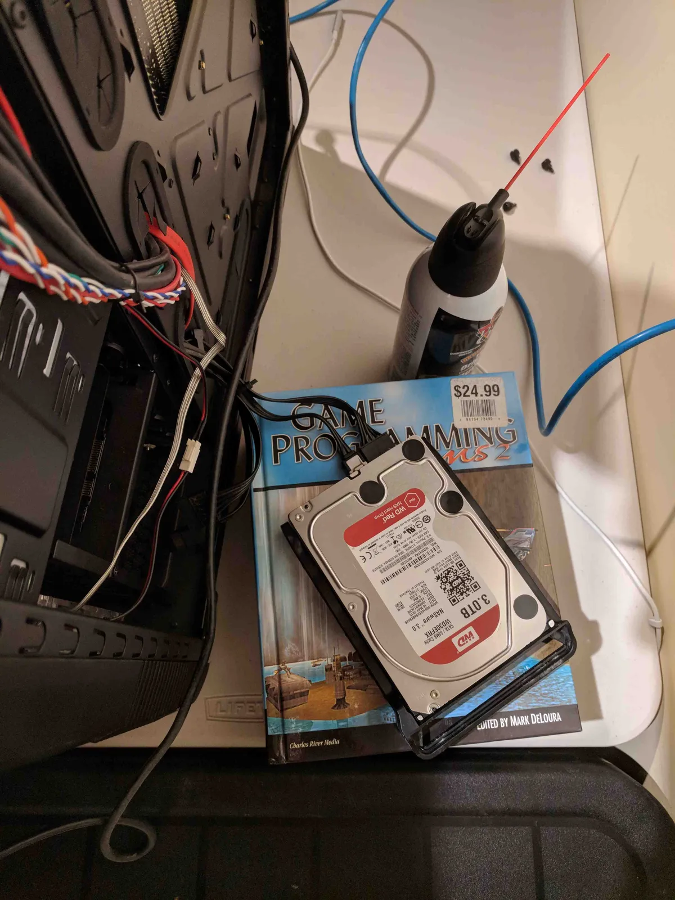
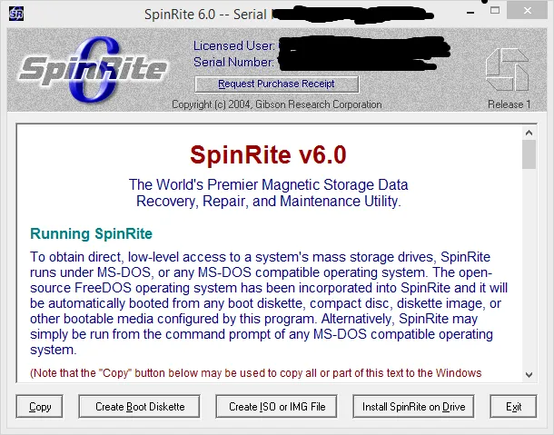
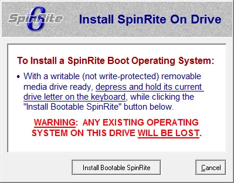
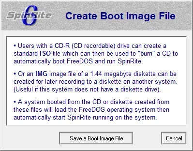
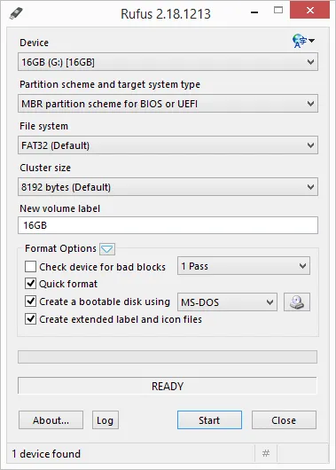
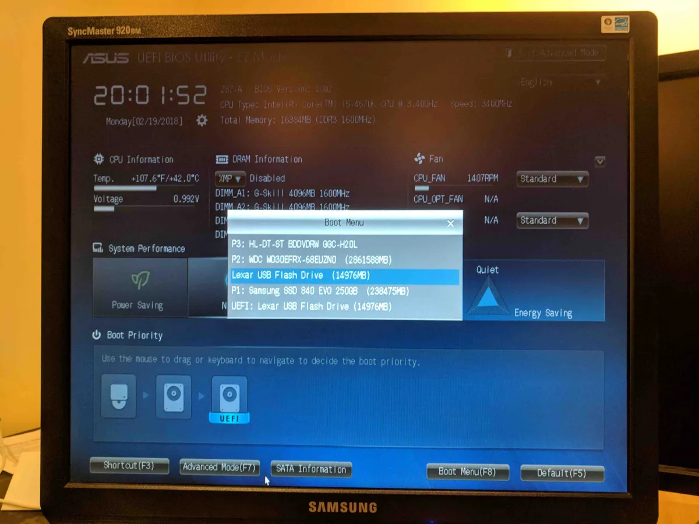
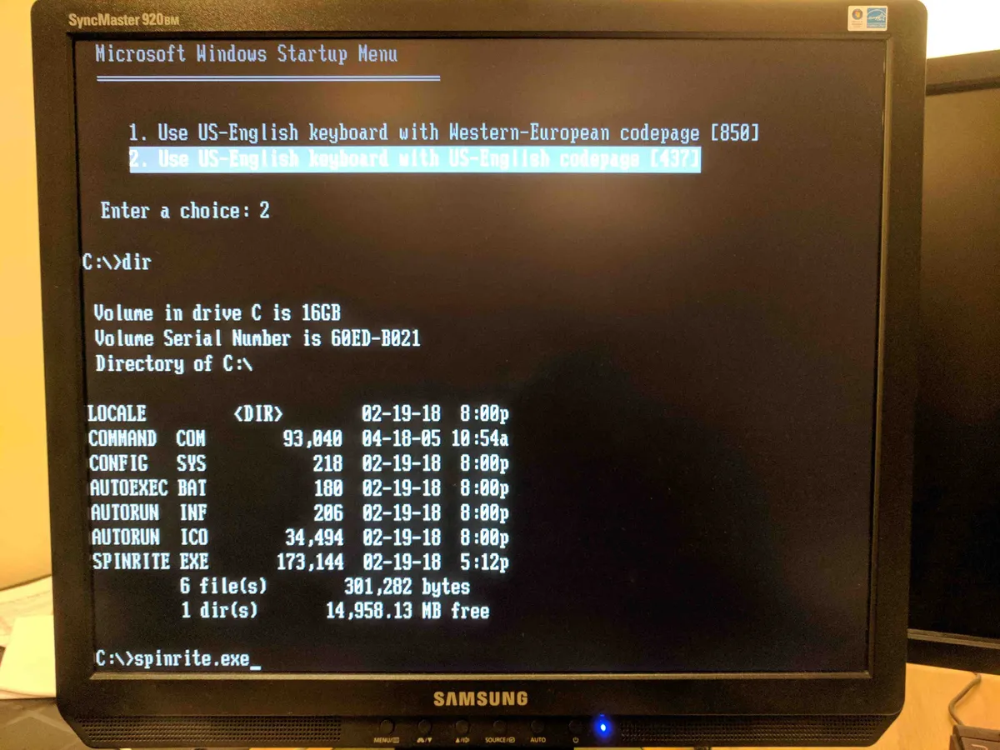
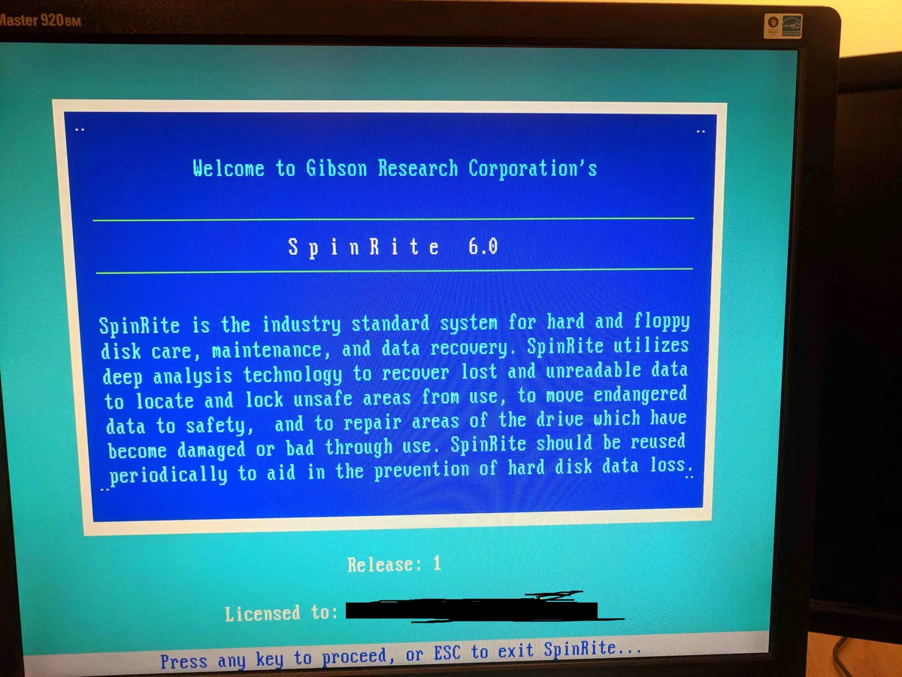
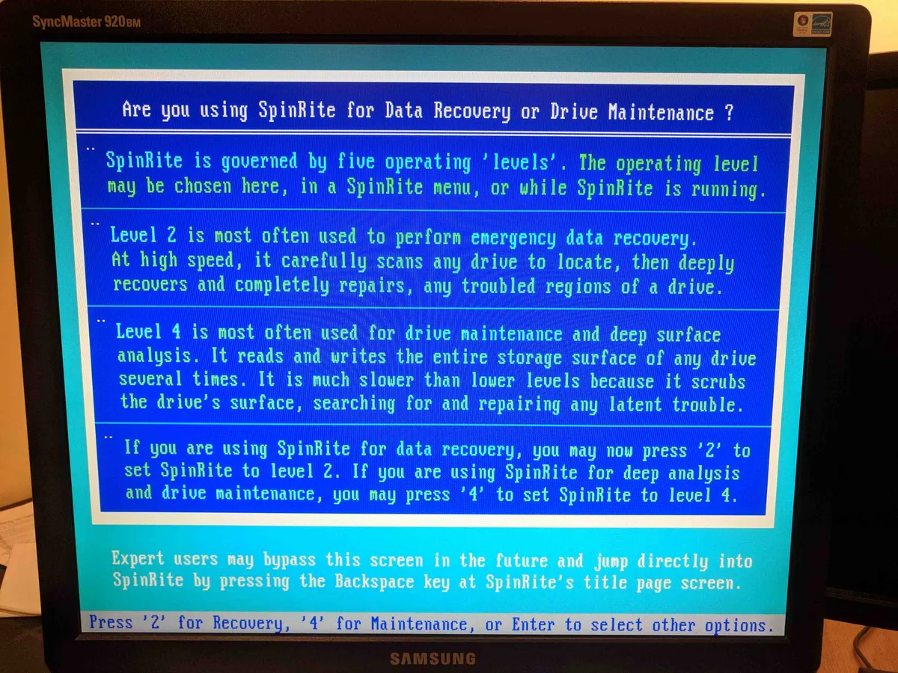
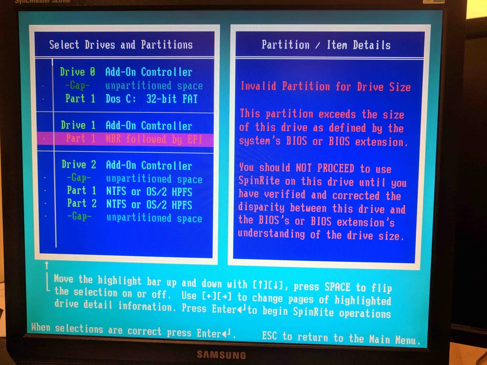

I have a [Synology NAS](https://www.synology.com) that has starting acting up.  By acting up I mean I can't connect to it and it requires a unplugged reboot to fix it.  Power button no work.  After doing some detective work I'm not sure if the problem is with the hard drives or the Synology it's self.

To help me narrow down the problem I thought I'd run SpinRite which is a hard drive diagnostic tool.  I heard about SpinRite from the [Security Now podcast](https://twit.tv/shows/security-now).  It was created by [Steve Gibson](https://www.grc.com/intro.htm), one of the hosts and they talk about it's virtues often on the podcast.

I bought and download the application and then was bit stumped on what to do next.  The documentation on the website is dated so it took me a while to figure out how to get the software to run.  I had an especially difficult time because the software was written before UEIF motherboards where common place and my mother board has UEIF enabled.  So I documented my steps so I remember and hopefully it will help others as well.

First off I couldn't just run SpinRite on my Synology.  I had to remove the hard drives from the Synology and connect them to a motherboard using a SATA cable.

Once connected I needed to create bootable USB drive.  This took some trial and error because at first I just created the bootable USB using the SpinRite program and tried disabling the UEIF on my mother board.  This didn't work.  I also tried creating a ISO image using SpinRite.  This also didn't work.  In both cases the USB drive would not boot, just a black screen.

In summary don't do the below screen shots.  Just ignore them.

I think the problem is the SpinRite application uses FreeDOS which does not play well with UEIF.  At least it didn't play well with my BIOS, your mileage might vary.

What did work was creating a bootable USB stick using the [Rufus](https://rufus.akeo.ie/) program.  The settings I used are outlined below.

Once you have the bootable USB stick copy over the SpinRite executable to the USB stick.  Then reboot your computer and make sure you boot from the USB stick.

This should load [MS-DOS](https://en.wikipedia.org/wiki/MS-DOS).  Select your keyboard and then run the SpinRite program.  For you young [wippersnapper](https://en.wikipedia.org/wiki/Whippersnapper) DOS was the first operating system developed by [Microsoft](https://www.microsoft.com/en-ca) before [Windows](https://www.microsoft.com/en-ca/windows/).

Press any key once you are done reading the SpinRite splash screen.

Then choose 4 for maintenance.

Then prepared to be really sad because your hard drive is 3TB and SpinRite 6 can't handle [drives larger then 2TB](https://superuser.com/questions/1107910/spinrite-6-mbr-followed-by-efi-error).

There has been talk of SpinRite 7 which should fix this issue but for now I'm out of luck.

So this is really a [BOGO](https://en.wikipedia.org/wiki/Buy_one,_get_one_free) Today I Learned.  Not only did I learn how to run SpinRite on a modern BIOS but I also learned that it can't handle drive sizes larger then 2TB.

Sorry for the surprise and somewhat sad ending.

 

P.S. - [A Boy Named Sue](https://en.wikipedia.org/wiki/A_Boy_Named_Sue) is great song with a surprise ending.  Not necessarily sad but still surprising.

P.S.S. - I just learned that this song was written by [Shel Silverstein](https://en.wikipedia.org/wiki/Shel_Silverstein).  You know, that scary guy at the [back](http://www.banterist.com/faq_the_back_co/) of your favourite children's book.

_And I think about him, now and then,_ _Every time I try and every time I win,_ _And if I ever have a son, I think I'm gonna name him..._


