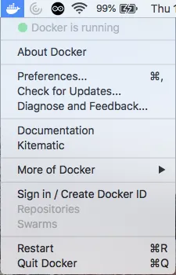
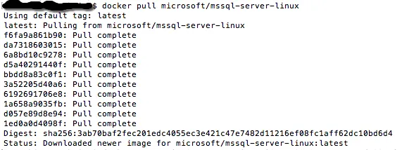
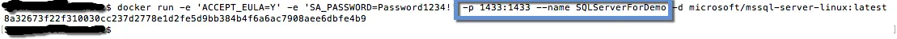
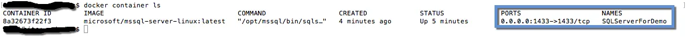
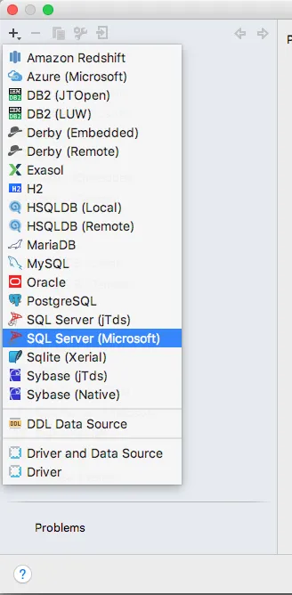
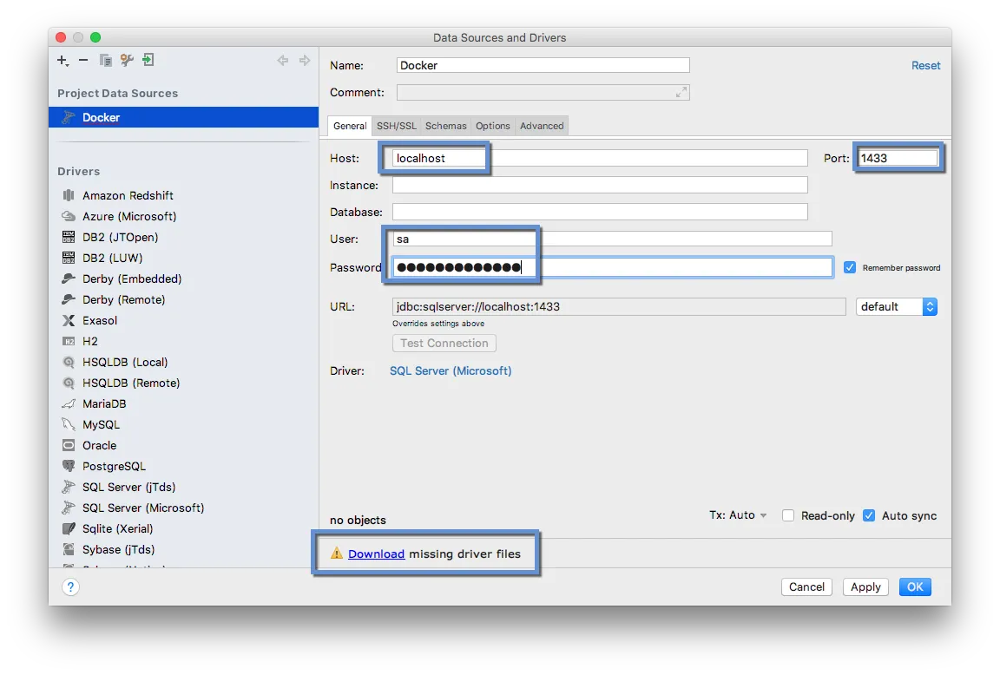
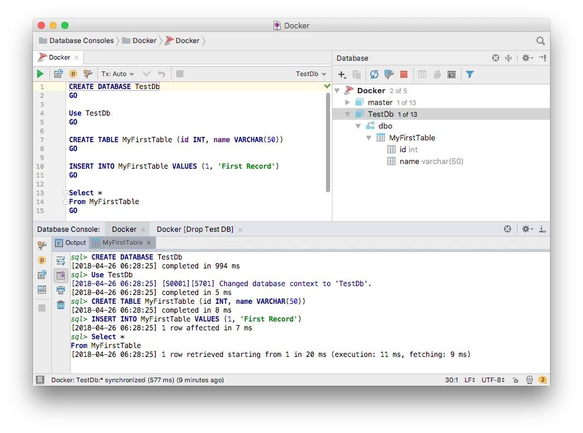

Working on my code example for my upcoming SQL Saturday 710 [talk](http://www.sqlsaturday.com/710/Sessions/Details.aspx?sid=74085) I ran into a performance issue.  My laptop is an older MacBook Pro and I was trying to run my example on a Windows virtual machine...

What is [SQL Saturday](http://www.sqlsaturday.com/)?  Good question.

[](http://www.sqlsaturday.com/710/eventhome.aspx)

SQL Saturday is an entire day of talks, training, and socializing about databases and data storage.  [SQL Saturday 710](http://www.sqlsaturday.com/710/eventhome.aspx) is on May 5th in Edmonton but there are SQL Saturdays, with different numbers at the end, all around the world on different dates.

Back to my problem which was running my example on a Windows virtual machine running on my older MacBook Pro. I've upgraded my MacBook Pro over the years with more RAM and a SSD hard drive the virtual machine is still not responsive enough for my liking with SQL Server and Visual Studio running on it.  I'll be doing some live coding and database querying and want a nice experience for the attendees.

My options were procure a Windows laptop for the presentation, dual boot my existing laptop, or see if I could run my example natively on my Mac.  I didn't want to borrow a laptop and setting up dual boot and installing Windows, Visual Studio, etc sounded like a lot of work.

I knew I could run the website part of my example on my Mac thanks to .NET Core but what about SQL Server?  I could use a different database but wanted to stick with SQL Server because it's the database most of the SQL Saturday attendees are familiar with.

Some Googling reviled that [SQL Server can run on a Docker](https://docs.microsoft.com/en-us/sql/linux/quickstart-install-connect-docker?view=sql-server-linux-2017) container and that Microsoft has a [SQL Server Docker image](https://hub.docker.com/r/microsoft/mssql-server-linux/).  I tried it an it worked.

First install Docker for MacOS which you can find [here](https://www.docker.com/docker-mac).  Once installed you should see a whale in the status menus at the top right.

[](https://nftb.saturdaymp.com/wp-content/uploads/2018/04/Docker-Running-on-Mac.png)

Next open up a terminal and pull down the SQL Server Docker image.

```text
 
$ docker pull microsoft/mssql-server-linux
```

[](https://nftb.saturdaymp.com/wp-content/uploads/2018/04/Pull-SQL-Server-Docker-Image.png)

Now run the Docker image.

```text
 
$ docker run -e 'ACCEPT_EULA=Y' -e 'SA_PASSWORD=Password1234!' -p 1433:1433 --name SQLServerForDemo -d microsoft/mssql-server-linux:latest
```

[](https://nftb.saturdaymp.com/wp-content/uploads/2018/04/Run-SQL-Server-Docker-Container.png)

[](https://nftb.saturdaymp.com/wp-content/uploads/2018/04/List-Running-Docker-Images.png)

Notice the port number and don't forget to set the name so it's easier to find your image.

Now you can access SQL Server via the command line but I prefer a GUI client.  Plus a GUI client would look better during the presentation.  You can't install [SQL Server Management Studio](https://docs.microsoft.com/en-us/sql/ssms/download-sql-server-management-studio-ssms?view=sql-server-2017) on a Mac but there [other clients](https://stackoverflow.com/questions/3452/sql-client-for-mac-os-x-that-works-with-ms-sql-server) you can use.  My preference is [DataGrip](https://www.jetbrains.com/datagrip/) because it works well and it's included in my JetBrains subscription.  If you use [ReSharper](https://www.jetbrains.com/resharper/) check your [subscription](https://www.jetbrains.com/store/#edition=commercial) level and see if it's includes DataGrip.

In DataGrip you need to add a new DataSource.

[](https://nftb.saturdaymp.com/wp-content/uploads/2018/04/DataGrip-add-SQL-Server-Data-Source.png)

For the address you can use localhost but you need to specify the port you used when running the SQL Server Docker container.  Your password is the one you used to run the Docker image.  Also install any missing drivers if prompted.

[](https://nftb.saturdaymp.com/wp-content/uploads/2018/04/DataGrip-Setup-SQL-Server-Data-Source.png)Now you should be able to see your SQL Server database server in DataGrip.  You can then add new databases as needed.

[](https://nftb.saturdaymp.com/wp-content/uploads/2018/04/DataGrip-Create-TestDb.png)

Any changes you make to the database will be persisted even when you start and stop the image.

P.S. - Picked this song because Docker has a whale as it's mascot and this video is about a whale and got a whale in the video.

_And we are far from home, but we're so happy_ _Far from home, all alone, but we're so happy_

https://www.youtube.com/watch?v=H7Gr6HBMDu0
