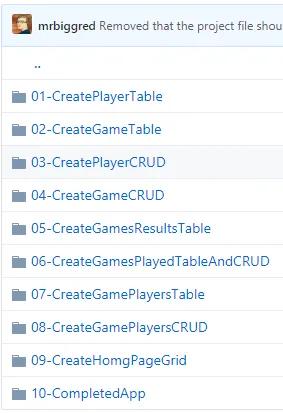

I gave a presentation at [SQL Saturday 710](http://www.sqlsaturday.com/710/eventhome.aspx) that didn't go as well as I liked (i.e. I had trouble getting my demo working).  For those that attended thank you for patience.  Hopefully it was still worth attending and the discussion without the live coding was worth while.

Since the demo didn't work live I thought I would show you what was supposed to happen during the demo.  The source code for the demo is [here](https://github.com/saturdaymp/IntroductionToORMForDBAs).

I used a MacBook pro for my presentation but the demo will also work on Windows.  Just be prepared for Mac screenshots.

First thing you need is [Visual Studio 2017](https://www.visualstudio.com/downloads/).  The community edition is free to use.  To install just keep clicking next.  It should install .NET Core 2.0, or higher for you.

Next you need to setup SQL Server.  You can find the steps to run SQL Server inside a Docker container [here](https://nftb.saturdaymp.com/today-i-learned-how-to-run-sql-server-on-a-mac-using-docker/).  If you are on Windows the steps are similar just use the [Windows SQL Server Docker image](https://hub.docker.com/r/microsoft/mssql-server-windows-developer/) instead.

I used DataGrip as my client to access SQL Server but you can use [Microsoft SQL Operations Studio](https://docs.microsoft.com/en-us/sql/sql-operations-studio/what-is?view=sql-server-2017) instead.

That is all you need to run the demo.  Future posts all walk through demo steps as outlined above.  If you have any questions open a [issue](https://github.com/saturdaymp/IntroductionToORMForDBAs/issues) in the GitHub repository.
