_I gave the [Introduction to ORMs for DBAs](https://github.com/saturdaymp/IntroductionToORMForDBAs) at [SQL Saturday 710](http://www.sqlsaturday.com/710/eventhome.aspx) but it didn’t go as well as I would have liked (i.e. I had trouble getting my demo working).  Since the demo didn’t work live I thought I would show you what was supposed to happen during the demo.  You can find the slides I showed before the demo [here](https://github.com/saturdaymp/IntroductionToORMForDBAs/blob/master/Slides/Introduction%20to%20Object-Relational%20Mapping%20for%20DBAs.pdf)._

_The goal of this demo is create a basic website that tracks the games you and your friends play and display wins and losses on the home page.  I used a MacBook Pro for my presentation so you will see Mac screen shots.  That said the demo will also work on Windows._

_This post creates a Player table and all the setup to for Entity Framework.  To follow along open up the [01 - Create Player Table](https://github.com/saturdaymp/IntroductionToORMForDBAs/tree/master/Source/01-CreatePlayerTable) project.  If you need a hand getting the tools installed check out [Part 0 - Setup](https://nftb.saturdaymp.com/introduction-to-orms-for-dbas-part-0-setup/)._

We start with a blank ASP.NET MVC application.  It's similar to what you get when you create a default ASP.NET MVC application in Visual Studio but I've deleted some unneeded files related to the About and Contacts pages.

[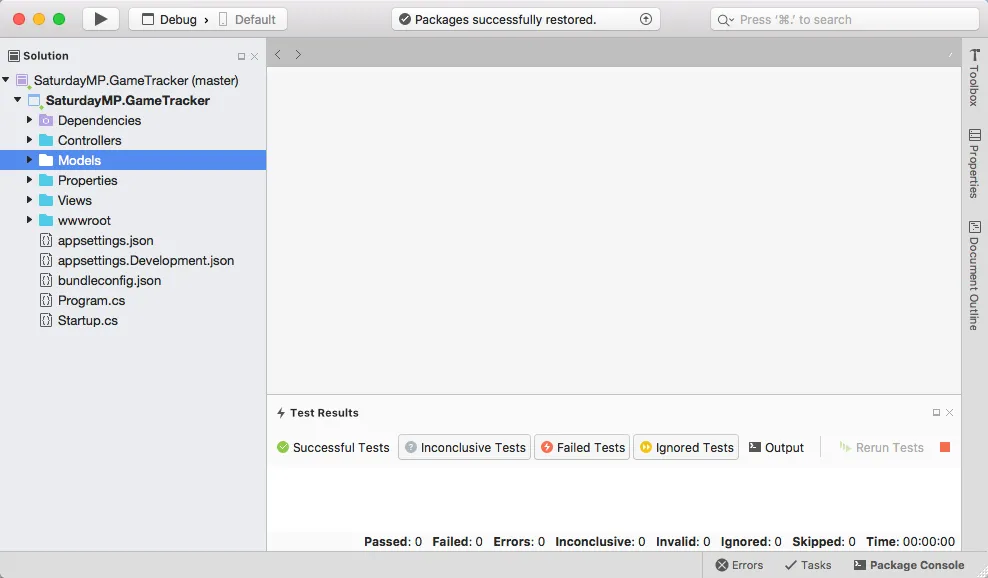](https://nftb.saturdaymp.com/wp-content/uploads/2018/05/EmptyAspNetVisualStudio.png)

If we run the application we will a home page where we eventually want to display the Win/Lose table for the players.

[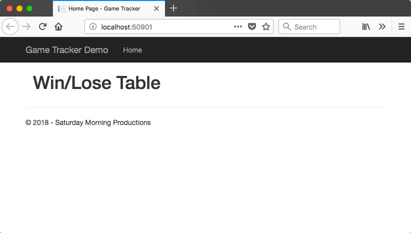](https://nftb.saturdaymp.com/wp-content/uploads/2018/05/StartingWebProjectHomePage.png)

Now lets make sure our database is up and running.  Since we running the demo on a Mac we need to run SQL Server inside Docker.  There is Docker Compose file in the root folder so we can run the below command to start SQL Server:

\[text\] $ docker-compose up \[/text\]

[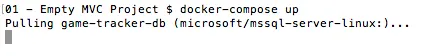](https://nftb.saturdaymp.com/wp-content/uploads/2018/05/BringUpSQLServer.png)

We will use DataGrip as our SQL Client because it runs on Mac.  You could also use [Microsoft SQL Operations Studio](https://docs.microsoft.com/en-us/sql/sql-operations-studio/what-is?view=sql-server-2017).  If we look at our database server we see it has nothing but the master database.

[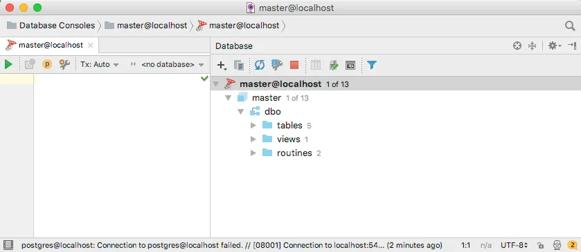](https://nftb.saturdaymp.com/wp-content/uploads/2018/05/EmptyDatabaseServer.png)

Everything seems to be working so lets start creating our application starting with the Player.

## Define Player Model

To track what games people have played we will need to store information about the player and games being played.  Lets start with the player.

If you are a DBA you are itching to open up your SQL Client and create the Players table but we aren't going to do that.  Instead we will use a feature in most ORMs called Code First.  You define your database model in code and let the ORM handle the database changes for you.

Define the Player model by creating a new class in the Models folder called Player.

[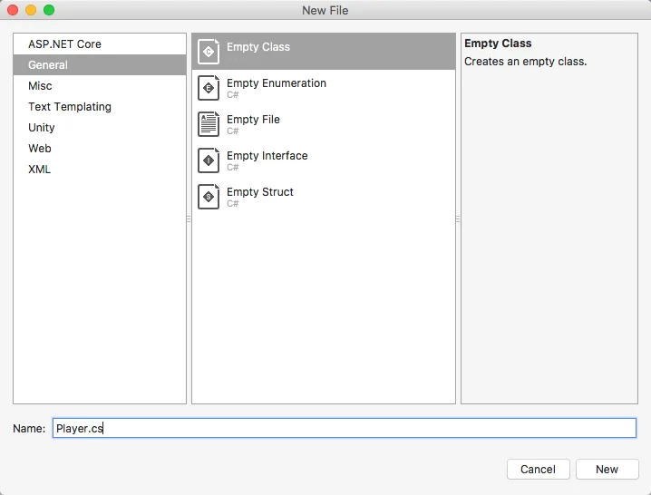](https://nftb.saturdaymp.com/wp-content/uploads/2018/05/AddPlayerModel.png)

This class is our model and represents the Players table in the database.  Since this is a simple application used by friends we only need their name.   So our model will look like:

\[csharp\] namespace SaturdayMP.GameTracker.Models { public class Player { public int Id { get; set; }

public string Name { get; set; } } } \[/csharp\]

 

[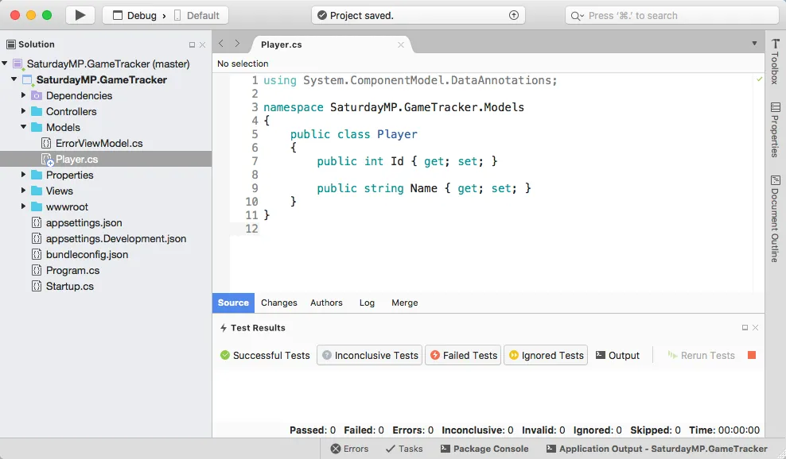](https://nftb.saturdaymp.com/wp-content/uploads/2018/05/PlayerModel.png)

This model defines that we have a Players table and it has two fields: Id and Name.  Notice I said the table name is Players with an "s" but the model name is singular.  Most ORMs have default conventions they use for dealing with names.  Entity Framework assumes your model name is singular and your table will be plural.  Entity Framework also assumes any field named Id will be a primary key.  Of course you can override the conventions if you want.

## Setup Connection to Database

The model is now defined but before we can create the table we need a way for our application to access the database.

The first step is to create the database context.  The database context is how most of our code will interact with the database.  We will put the context class in the a new folder called Data and call our context GameTrackerContext.  If your application accesses more then one database you will have multiple contexts.

\[csharp\] using SaturdayMP.GameTracker.Models; using Microsoft.EntityFrameworkCore;

namespace SaturdayMP.GameTracker.Data { public class GameTrackerContext : DbContext { public GameTrackerContext(DbContextOptions<GameTrackerContext> options) : base(options) { }

public DbSet<Player> Players { get; set; } } } \[/csharp\]

[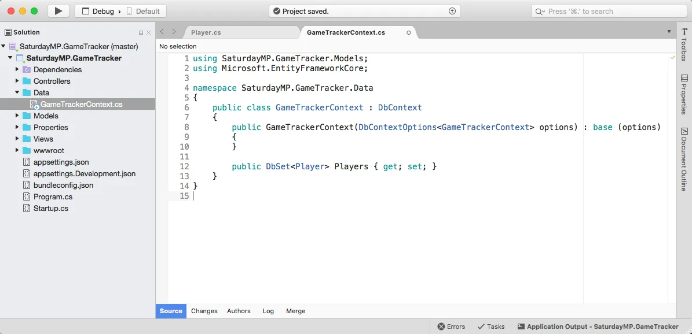](https://nftb.saturdaymp.com/wp-content/uploads/2018/05/GameTrackerContext.png)

The important part is the [DBSet](https://docs.microsoft.com/en-us/ef/core/api/microsoft.entityframeworkcore.dbset-1) line.  This tells the database context to map the Player model to the underlying Players table.  As we add more tables we will add additional DbSet lines.

Next lets set the connection string.  Do DBAs have to deal with connection strings or is it a developer thing?  Anyway, the connection string is set in the aspsettings.json file:

\[csharp\] "ConnectionStrings": { "DefaultConnection": "Server=(local);Database=GameTrackerDemo;Trusted\_Connection=False;User ID=sa;Password=Password1234!" } \[/csharp\]

[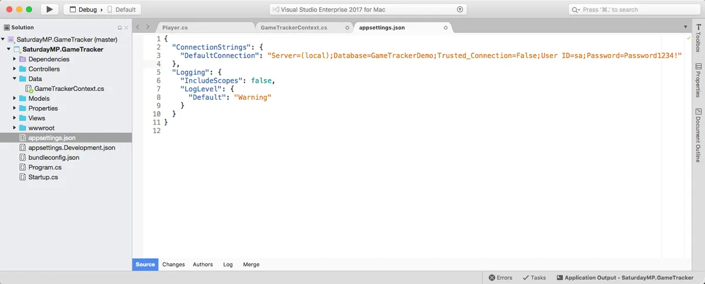](https://nftb.saturdaymp.com/wp-content/uploads/2018/05/SettingConnectionString.png)

We won't see the effects of this next step till later but we will do it now as we are doing all our setup now.  We need to tell the website that we have a database context and that it should automatically include it in controllers.  This is done in the Startup.cs file.  Add the following to the ConfigureServices method.

\[csharp\] services.AddDbContext&lt;SaturdayMP.GameTracker.Data.GameTrackerContext&gt;( options => options.UseSqlServer(Configuration.GetConnectionString("DefaultConnection"))); \[/csharp\]

[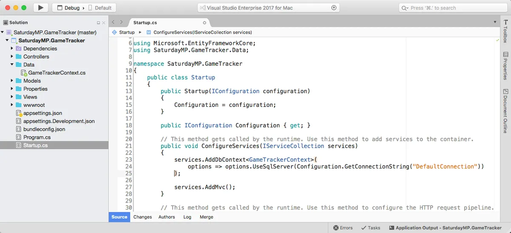](https://nftb.saturdaymp.com/wp-content/uploads/2018/05/AddingDbContextToService.png)

## Setup Command Line Tools

This next step is a bit of pain.  As of this writing all the cool menu items in Visual Studio on Windows are not available for Visual Studio for Mac.  We have to use the command line and this requires us to manually edit the project file.

Close Visual Studio then find the SaturdayMP.GameTracker project file and open it up in a text editor.

[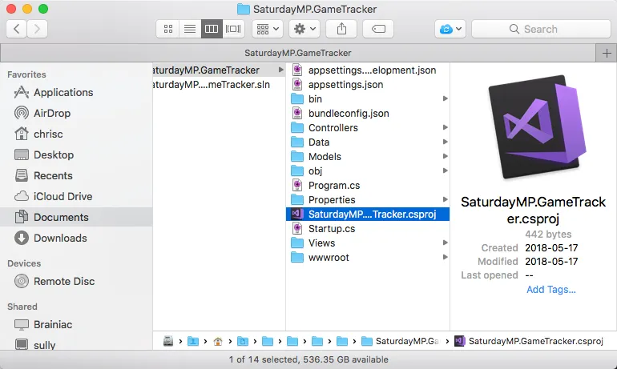](https://nftb.saturdaymp.com/wp-content/uploads/2018/05/GameTrackerProjectFile.png)

Then add the following two lines, one to the PackageReference ItemGroup and the other to the DotNetCliToolReference ItemGroup:

\[csharp\] <ItemGroup> <PackageReference Include="Microsoft.AspNetCore.All" Version="2.0.6" /> <PackageReference Include="Microsoft.EntityFrameworkCore.Design" Version="2.0.2" /> </ItemGroup>

<ItemGroup> <DotNetCliToolReference Include="Microsoft.VisualStudio.Web.CodeGeneration.Tools" Version="2.0.3" /> <DotNetCliToolReference Include="Microsoft.EntityFrameworkCore.Tools.DotNet" Version="2.0.2" /> </ItemGroup> \[/csharp\]

 

[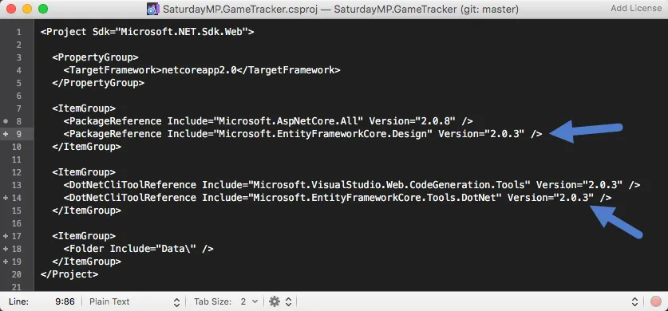](https://nftb.saturdaymp.com/wp-content/uploads/2018/05/AddEFCliToolToProjectFile.png)

Now reopen the the solution in Visual Studio and rebuild the solution.  If you got any errors check that you put the lines in the correct spot and didn't forget a double quote or greater/lesser then character.

Open up a new terminal and navigate to the folder where your project is located.  Then run the following command to make sure the command line tools are loaded and installed:

\[text\] $ dotnet restore \[/text\]

To test if everything works run the below command.  It should show something similar to the screenshot below.

\[text\] $ dotnet ef \[/text\]

 

## [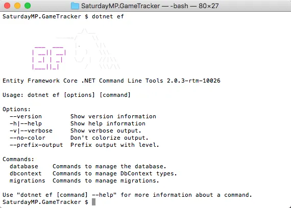](https://nftb.saturdaymp.com/wp-content/uploads/2018/05/DotNetEfCmdSucess.png)

## Generate Player Migration

Now we can generate the Player table.  Actually we will generate a migration that will generate the Player table.  A migration is file that contains changes we want to make to the database such as creating tables, add/removing columns on existing tables, adding indexes, etc.

\[text\] dotnet ef migrations add CreatePlayerTable \[/text\]

[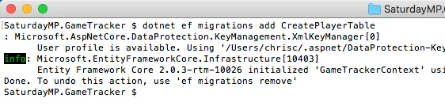](https://nftb.saturdaymp.com/wp-content/uploads/2018/05/CreatePlayerMigrationFile.png)

Make sure you are in the project folder when you try to run the command or it will fail.  Assuming it succeeded you should see a Migrations folder in Visual Studio and one file in it that ends in "CreatePlayerTable".

[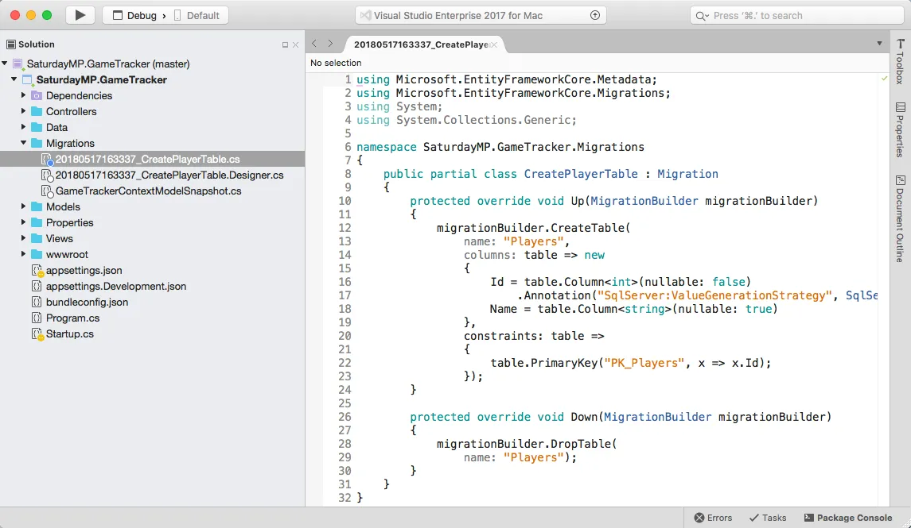](https://nftb.saturdaymp.com/wp-content/uploads/2018/05/PlayerTableMigrationFile.png)

If we open up the file we see it does not contain SQL but C# code.  The reason for using C# is so the same migration file can be run against different databases such as Oracle, PostgreSQL, etc.  Even if you don't understand C# it should be pretty clear that this file is creating the Player with the Id and Name fields.

A migration file contains contains changes you want to apply to a database.  They can be manually created but in this case we used Entity Framework to create it.  It created the migration file by comparing what the database currently looked like to what it should look like based on the models defined in code.  In this case the the database is empty (non-existent) but we have a Player model defined thus the thus the migration file creates the player table.

## Run the Player Table Migration

Now we can run the migration to create the table in the database.

\[text\] dotnet ef database update \[/text\]

[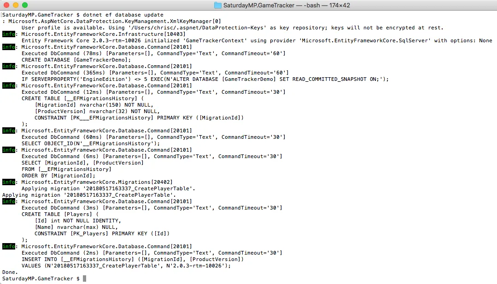](https://nftb.saturdaymp.com/wp-content/uploads/2018/05/RunPlayerTableMigration.png)

The above command will actually run all the migrations we have defined.  Currently we only have one so it only runs the one.  If we switch to our SQL client and refresh we should see the new Player table in the database.

[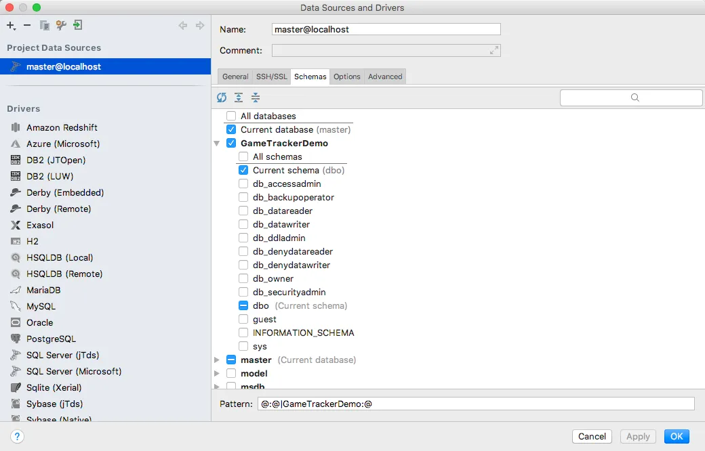](https://nftb.saturdaymp.com/wp-content/uploads/2018/05/ShowGameTrackerDemoDB.png)

[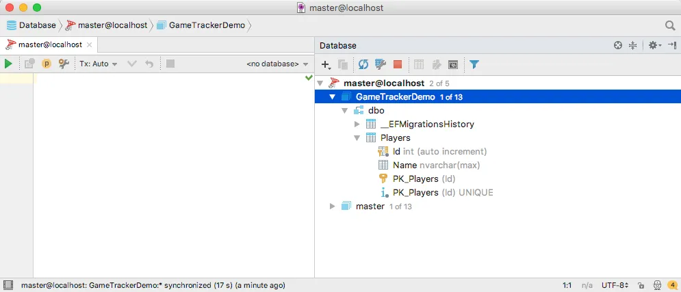](https://nftb.saturdaymp.com/wp-content/uploads/2018/05/PlayerTableInDataGrip.png)

Notice the \_EFMigrationHistory table?  This table tracks what migrations have been run on this database.  If a migration has already been run on the database it won't be run a second time.

## Drop and Recreate the Migration File

One thing you DBAs probably noticed is the Name field is set to max length, which is not good.  Lets change it to 50 characters.

In this case we haven't shared our migration with anyone else yet so we can delete the migration and try again.  If we had pushed this migration to our code repository we would have to create a new migration to undo our previous one.

If you remember the migration file had an up and a down.  The down part is run if you un-apply the migration.  In this case it will drop our table.

Lets ask Entity Framework to unapply our migration.  In the below example we say we want to undo all the migrations but you can specify specific migrations to undo.

\[text\] dotnet ef database update 0 \[/text\]

[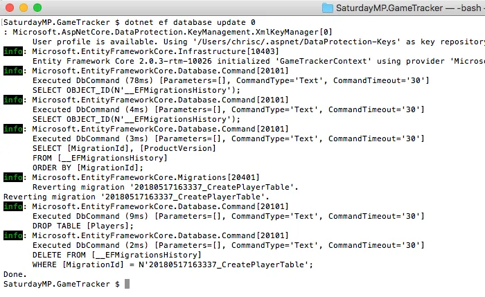](https://nftb.saturdaymp.com/wp-content/uploads/2018/05/ReversingCreatePlayerMigration.png)

Now if we refresh in our SQL Client the database still exists but the Players table has been dropped.

[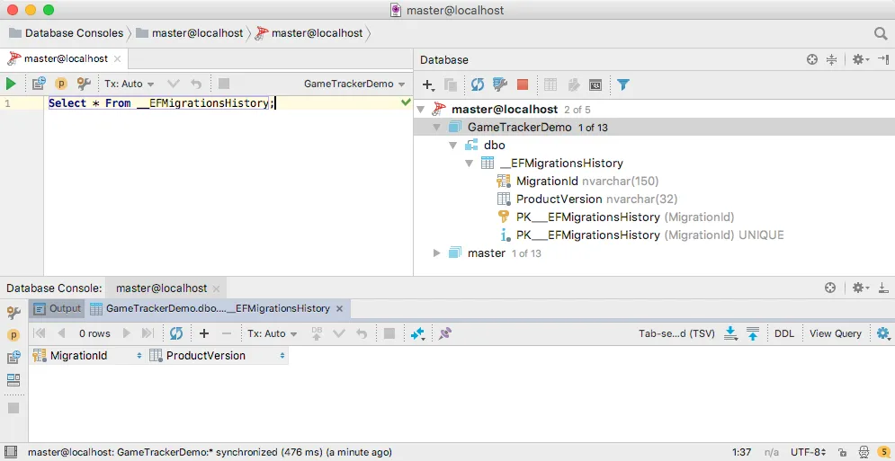](https://nftb.saturdaymp.com/wp-content/uploads/2018/05/PlayerTableDropped.png)

The Player table has been removed from the database but we still need to remove the migration.  It's best if we let Entity Framework remove the migration for us.  The below command will remove the last migration file created.

\[text\] dotnet ef migrations remove \[/text\]

[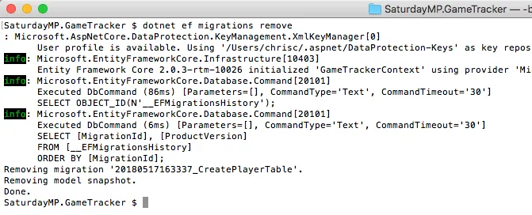](https://nftb.saturdaymp.com/wp-content/uploads/2018/05/RemoveCreatePlayerMigration.png)

[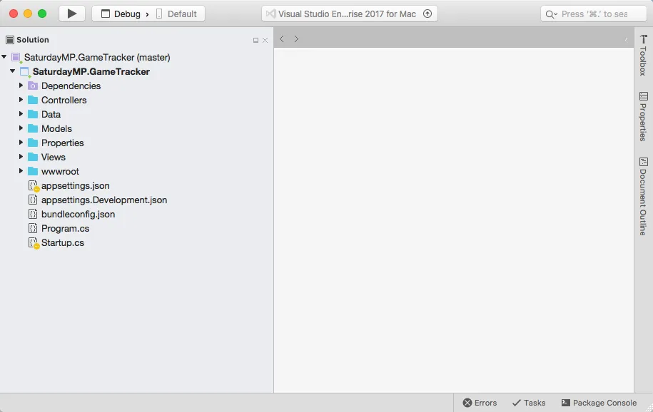](https://nftb.saturdaymp.com/wp-content/uploads/2018/05/MigrationsRemoved.png)

Since it was the only migration file the Migrations folder was also removed.  If we had other migrations the folder would not have been removed.

Now that we have cleaned everything up go to the Player model and set the max length to 50 and save your changes.

\[csharp\] \[MaxLength(50)\] public string Name {get; set; } \[/csharp\]

 

[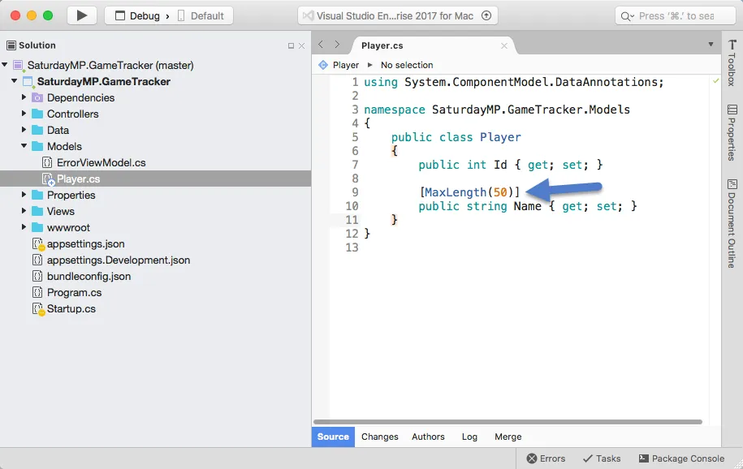](https://nftb.saturdaymp.com/wp-content/uploads/2018/05/AddMaxLengthToNameOnPlayerModel.png)

Now recreate the migration file.

\[text\] dotnet ef migrations add CreatePlayerTable \[/text\]

[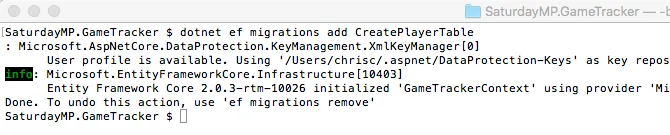](https://nftb.saturdaymp.com/wp-content/uploads/2018/05/CreatePlayerTableMigrationWithMaxLength-1.png)

[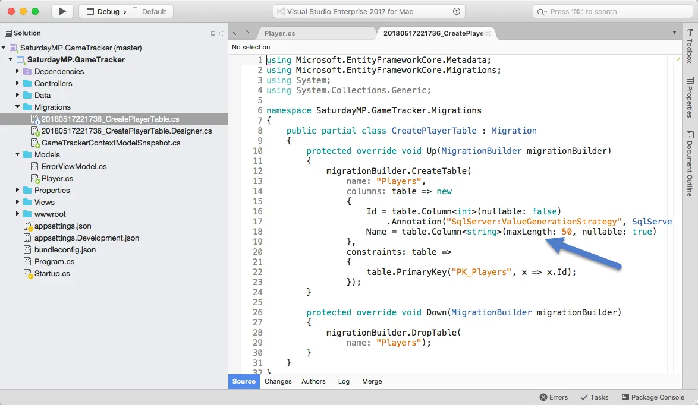](https://nftb.saturdaymp.com/wp-content/uploads/2018/05/CreatePlayerMigrationWithMaxLength.png)

Notice that the max length is set in the migration file?  Now apply this migration.

\[text\] dotnet ef database update \[/text\]

[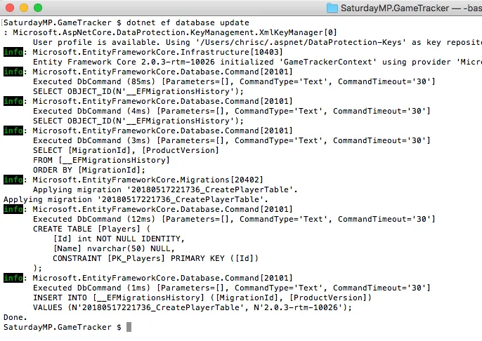](https://nftb.saturdaymp.com/wp-content/uploads/2018/05/RunCreatePlayerMigrationWithMaxLength.png)

Refresh our database client and you should see Players table with a correct Name length field.

_Whew, that was a lot of work.  The next part won't be as long as we can skip a lot of the first time setup._

_If you got stuck you can find completed Part 1 [here](https://github.com/saturdaymp/IntroductionToORMForDBAs/tree/master/Source/02-CreateGameTable) and the completed application [here](https://github.com/saturdaymp/IntroductionToORMForDBAs/tree/master/Source/10-CompletedApp)._  _In Part 2 we will create Games table similar to what we did above.  Finally if you have any questions or spot an issue in the code I would prefer if you opened a [issue](https://github.com/saturdaymp/IntroductionToORMForDBAs/issues) in GitHub but you can e-mail (chris.cumming@saturdaymp.com) me as well._
