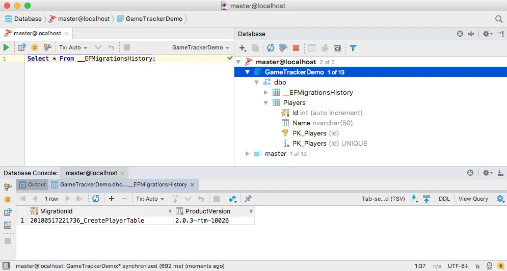
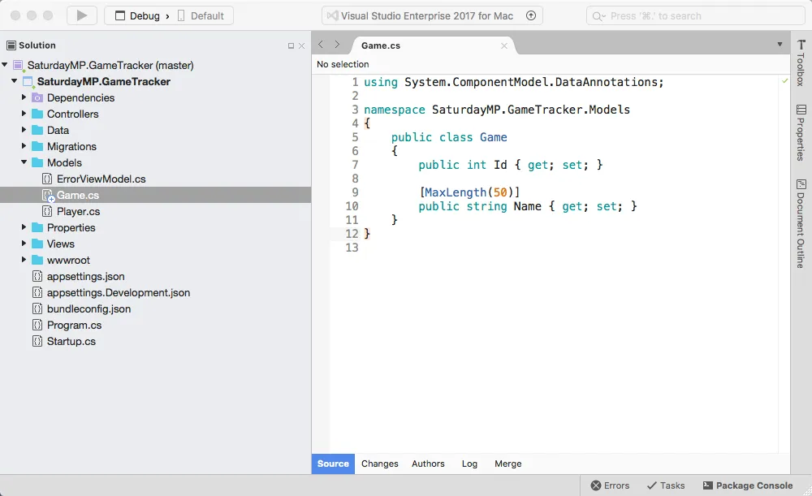
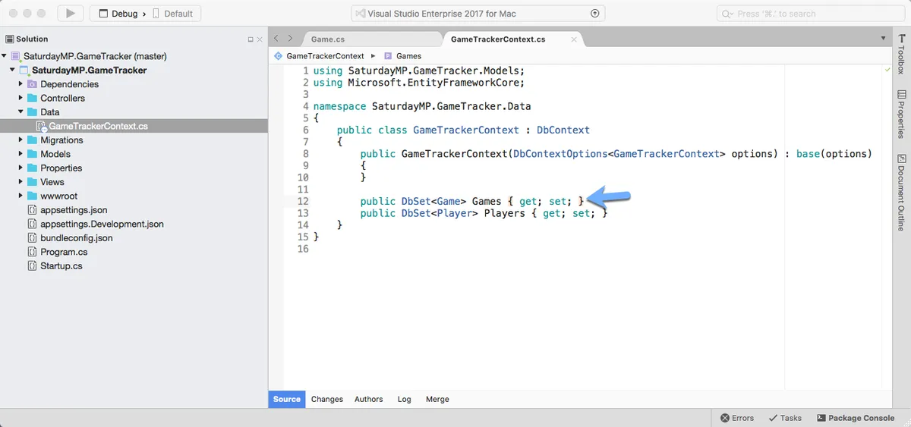
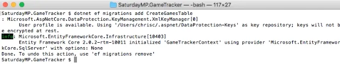
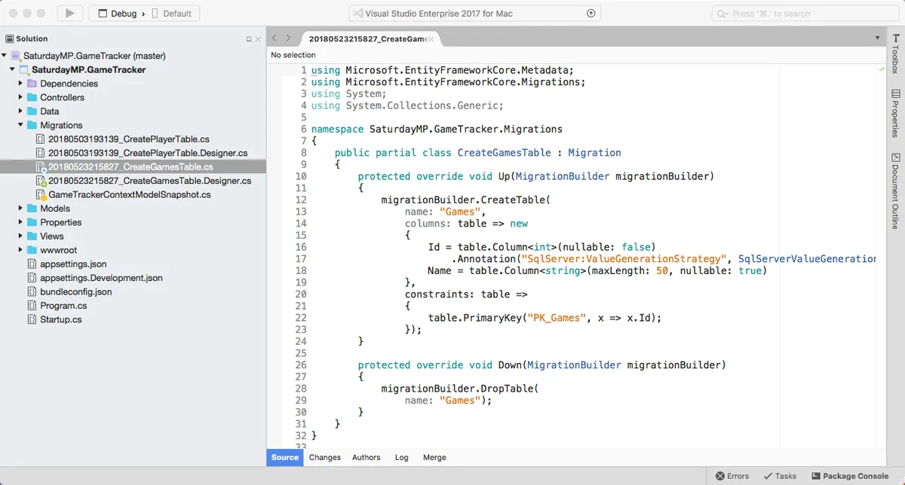
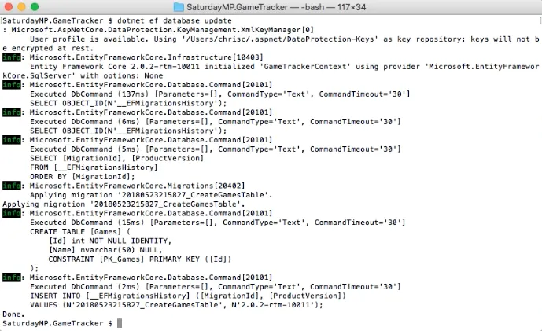
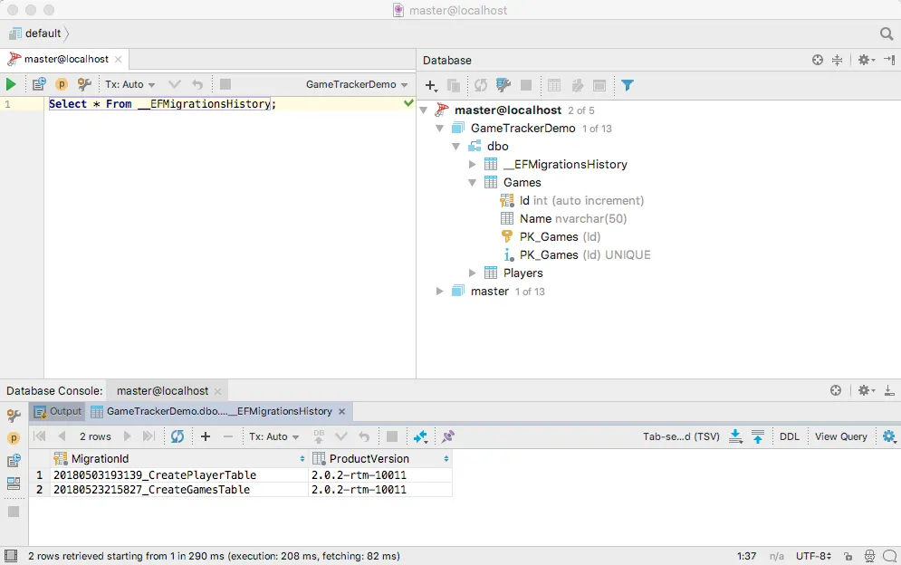

_I gave the [Introduction to ORMs for DBAs](https://github.com/saturdaymp/IntroductionToORMForDBAs) at [SQL Saturday 710](http://www.sqlsaturday.com/710/eventhome.aspx) but it didn’t go as well as I would have liked (i.e. I had trouble getting my demo working).  Since the demo didn’t work live I thought I would show you what was supposed to happen during the demo.  You can find the slides I showed before the demo [here](https://github.com/saturdaymp/IntroductionToORMForDBAs/blob/master/Slides/Introduction%20to%20Object-Relational%20Mapping%20for%20DBAs.pdf)._

_The goal of this demo is create a basic website that tracks the games you and your friends play and display wins and losses on the home page.  I used a MacBook Pro for my presentation so you will see Mac screen shots.  That said the demo will also work on Windows._

_In the [previous post](https://nftb.saturdaymp.com/introduction-to-orms-for-dbas-part-1-create-player-table/) we created the Players table and in this post we will create the Games table.  If you skipped the previous post but want to follow along open up [02 - Player Table](https://github.com/saturdaymp/IntroductionToORMForDBAs/tree/master/Source/02-CreateGameTable).  Then run the migrations to create the Players table in the database so your database similar to the below screen shot._

__

_Your migration IDs will be different but you should have a player table._

We will create the Games table the same way we created the Players table in part 1.  First create the Game model and add the Id and Name fields.  Since this is a simple database we will only track the name of the game.  No need to track the publisher, type, etc.

\[csharp\] using System.ComponentModel.DataAnnotations; namespace SaturdayMP.GameTracker.Models { public class Game { public int Id { get; set; }

\[MaxLength(50)\] public string Name { get; set; } } } \[/csharp\]

When setting up the Player table we intentionally forgot to set the max length of the field.  This time we won't forget and set it to 50 again.  If you get an error that MaxLength does not exist then make sure you have the following at the top your file:

\[csharp\] using System.ComponentModel.DataAnnotations; \[/csharp\]

Now that the model exists we need to tell the database context about it.  Open up the GameTrackerContext and add our new Game model.

\[csharp\] public DbSet&lt;Game&gt; Games { get; set; } \[/csharp\]

Compile the application just to make sure there are no typos.  Now switch to the terminal and create the migration like we did in part 1.

\[text\] dotnet ef migrations add CreateGamesTable \[/text\]

Take a quick look at the migration to make sure it was created and is what we expect.  Should be very similar to the Players migration.

Back in lets apply the migration on the database.

\[text\] dotnet ef database update \[/text\]

Remember this command will run all the migrations that have not already been run on the database yet.  So the CreatePlayersTable migration will be skipped because it has already been run.

Now open up your database client and check that the table was created.

_That was much shorter then creating the Player table in [part 1](https://nftb.saturdaymp.com/introduction-to-orms-for-dbas-part-1-empty-mvc-project/)._  _If you got stuck you can find completed Part 2 [here](https://github.com/saturdaymp/IntroductionToORMForDBAs/tree/master/Source/03-CreatePlayerCRUD)._  _In [Part 3](https://nftb.saturdaymp.com/introduction-to-orms-for-dbas-part-3-player-crud/) we will CRUD methods and pages to access the Player table.  Finally if you have any questions or spot an issue in the code I would prefer if you opened a [issue](https://github.com/saturdaymp/IntroductionToORMForDBAs/issues) in GitHub but you can e-mail (chris.cumming@saturdaymp.com) me as well._
