_I gave the [Introduction to ORMs for DBAs](https://github.com/saturdaymp/IntroductionToORMForDBAs) at [SQL Saturday 710](http://www.sqlsaturday.com/710/eventhome.aspx) but it didn’t go as well as I would have liked (i.e. I had trouble getting my demo working).  Since the demo didn’t work live I thought I would show you what was supposed to happen during the demo.  You can find the slides I showed before the demo [here](https://github.com/saturdaymp/IntroductionToORMForDBAs/blob/master/Slides/Introduction%20to%20Object-Relational%20Mapping%20for%20DBAs.pdf)._

_The goal of this demo is create a basic website that tracks the games you and your friends play and display wins and losses on the home page.  I used a MacBook Pro for my presentation so you will see Mac screen shots.  That said the demo will also work on Windows._

_In the [previous post](https://nftb.saturdaymp.com/introduction-to-orms-for-dbas-part-1-create-player-table/) we created the Games table and the post before that we created the Players table.  In this post we will create the CRUD methods to access the Players table._  

_If you skipped the previous post but want to follow along open up [03 - Player CRUD](https://github.com/saturdaymp/IntroductionToORMForDBAs/tree/master/Source/03-CreatePlayerCRUD).  Then run the migrations to create the Players and Games table in the database so your database similar to the below screen shot.  The migration IDs can be different but the tables should exist._

In this post we will create some Create, Retrieve, Update and Delete (CRUD) methods to access the Players table.  To quickly create the CRUD methods we will use auto-generated scaffolding.  Scaffolding, in this context, is basic CRUD code.  In production you would expand upon the scaffolding but for this demo we will mostly leave it as is.  It's a great way to get something up and running.

We will run the scaffolding from the command line but before we do that we need to add the Microsoft.VisualStuido.Web.CodeGeneration.Design NuGet package.

[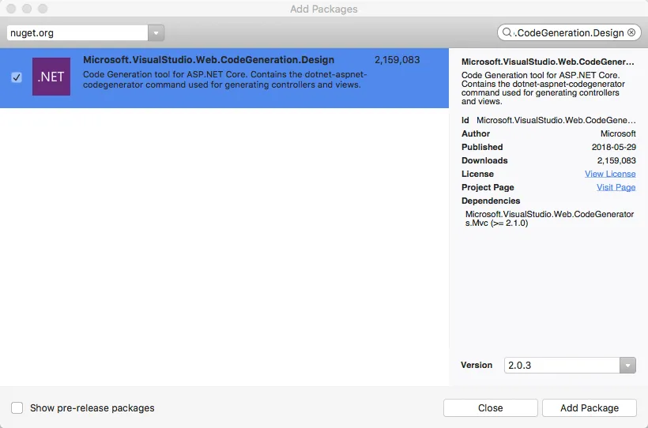](https://nftb.saturdaymp.com/wp-content/uploads/2018/06/AddingCodeGenerationNuGetPackage.png)

[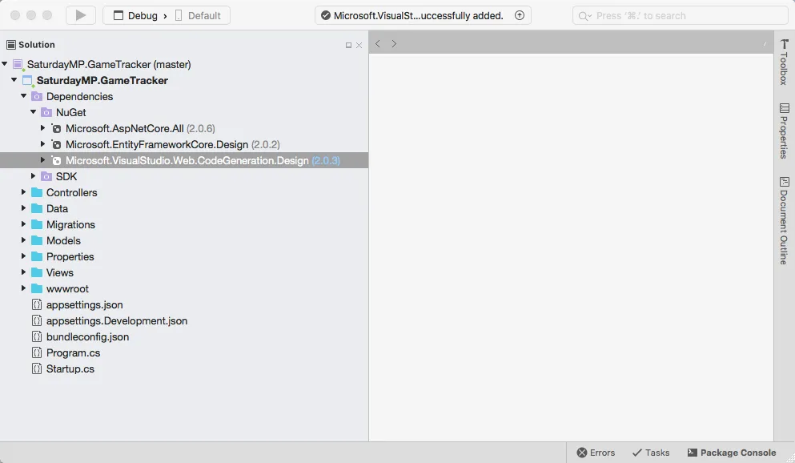](https://nftb.saturdaymp.com/wp-content/uploads/2018/06/CodeGenerationNugetPackageAdded.png)

Now that the package is added go the terminal and run the following command to make sure the new NuGet package is installed correctly.

\[text\] dotnet restore \[/text\]

Now we can run the scaffolding commands.  Lets run it to create the Players CRUD methods.

\[text\] dotnet aspnet-codegenerator controller -name PlayerController -outDir Controllers -m Player -dc GameTrackerContext -udl \[/text\]

[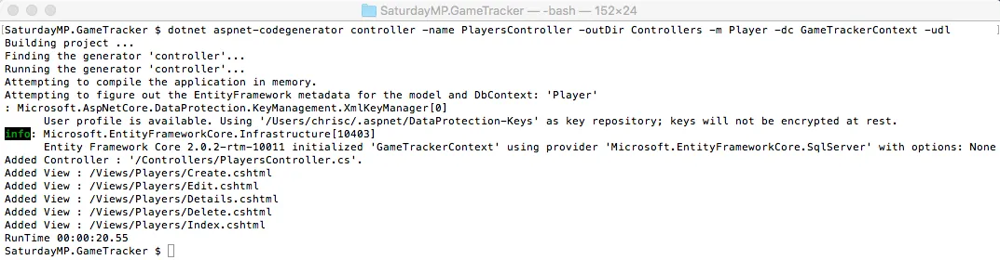](https://nftb.saturdaymp.com/wp-content/uploads/2018/06/AddPlayerControllerScaffolding.png)

Now go back to Visual Studio and you should see the PlayerController file and a bunch of Player views.  If you don't see the player views then you might need to close Visual Studio and reopen it.

[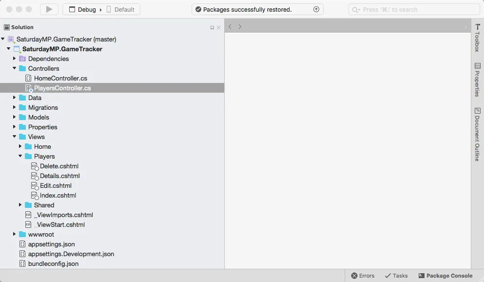](https://nftb.saturdaymp.com/wp-content/uploads/2018/06/PlayerControllerAndViews.png)

Now lets test the scaffold pages.  Run the application and you will get the home page.  You need to manually enter the URL for the Players page.

\[text\] http://localhost:port#/players \[/text\]

[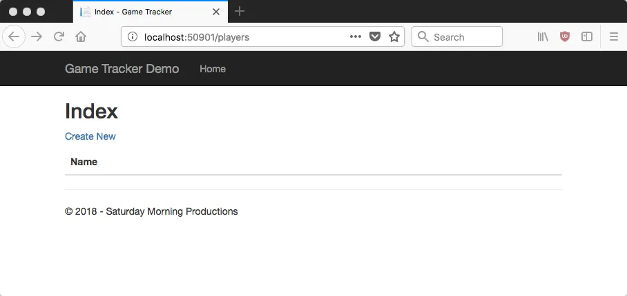](https://nftb.saturdaymp.com/wp-content/uploads/2018/06/PlayerIndexPage.png)

You should be able to add, edit, and delete players as you like.

[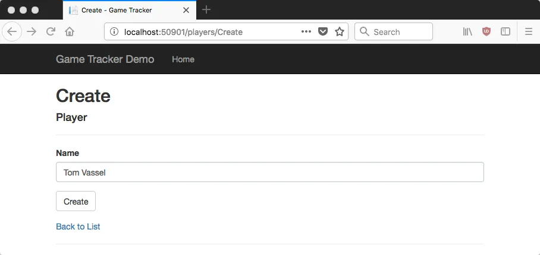](https://nftb.saturdaymp.com/wp-content/uploads/2018/06/CreatingPlayerPage.png)

Let's add a link to he Player pages on the home page.  Stop the application and open up the \_Layout.cshtml file and add the following line just under the Home menu item:

\[html\] <li><a asp-area="" asp-controller="Players" asp-action="Index">Players</a></li> \[/html\]

[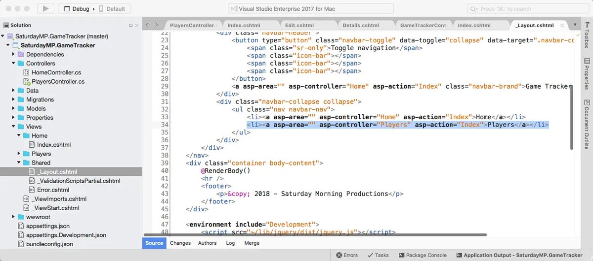](https://nftb.saturdaymp.com/wp-content/uploads/2018/06/AddingPlayerMenuItem.png)

Now run the application again you should see the Players link.  Click it to make sure it works.

[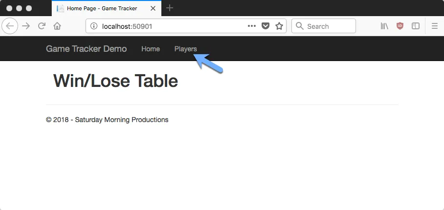](https://nftb.saturdaymp.com/wp-content/uploads/2018/06/HomePageWithPlayerMenuItem.png)

Now that the code is working we should talk about it a bit.  Since this is a ORM talk we will focus on the ORM code but we should quickly talk about the Model-View-Controller (MVC) pattern.

MVC is a software pattern that separates an application into three separate  parts.  You can probably guess what they are.  It's easiest shown in the below diagram.

[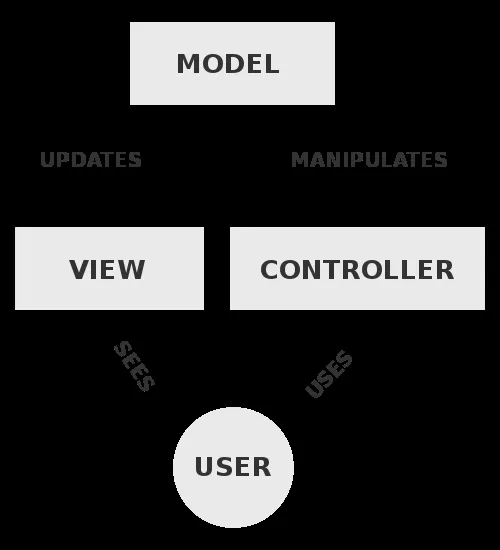](https://nftb.saturdaymp.com/wp-content/uploads/2018/06/MVC-Diagram.png)

In this demo the views are the web pages the end user will see.  The files names created by the scaffolding say what the page does.  If we open one up, say the Index.cshtml, we will see mostly HTML mixed with some C# code as shown below.

[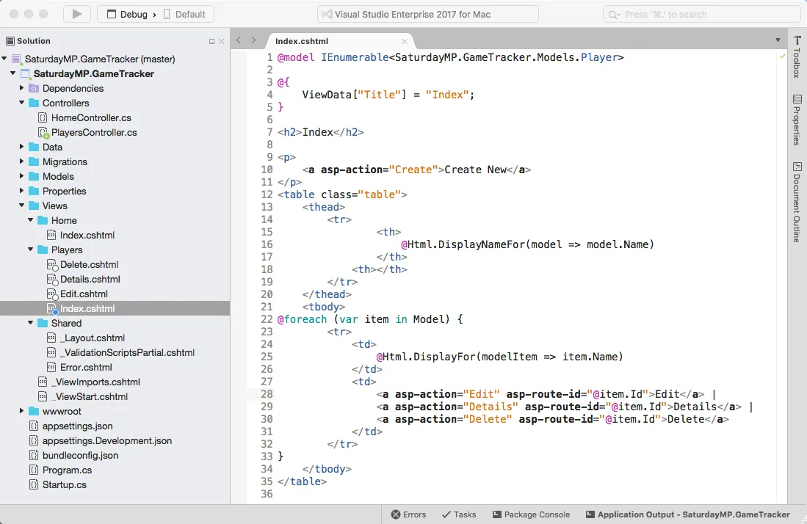](https://nftb.saturdaymp.com/wp-content/uploads/2018/06/PlayerIndexViewCode.png)

When a web page is requested all the C# code is run on the webserver and translated into HTML before being sent to the browser.  In this example the C# code creates a row in the HTML table for every record it finds in the Players table.

\[csharp\] @foreach (var item in Model) \[/csharp\]

The controller class are responsible for populating the views with data from the model.  They are also responsible for updating the model with new data submitted by the user.  If we look at the PlayerController we see there is scaffolding code to view all the players (the index method), create new players, view/edit existing players, and finally delete players.

[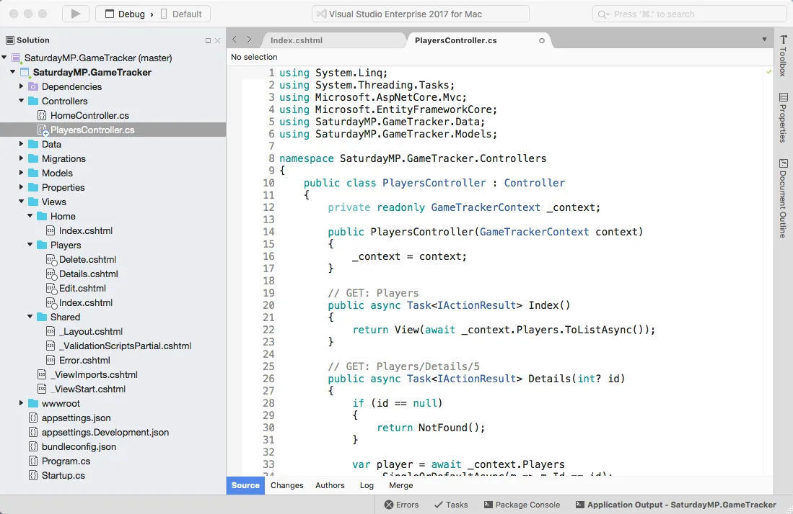](https://nftb.saturdaymp.com/wp-content/uploads/2018/06/PlayerControllerCode.png)

Do you remember the GameTrackerContext class?  It is the link between the database and the application.  You can see it it passed into the constructor, which is the first bit of code that is executed when a class is instantiated.

\[csharp\] public PlayersController(GameTrackerContext context) { \_context = context; } \[/csharp\]

In this case the constructor takes the context and saves it so other methods in the class can use the context.  For example, the Index method uses the context class to retrieve all the records from the Player table.

\[csharp\] // GET: Players public async Task<IActionResult> Index() { return View(await \_context.Players.ToListAsync()); } \[/csharp\]

[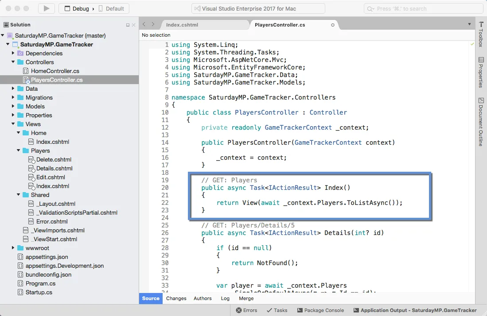](https://nftb.saturdaymp.com/wp-content/uploads/2018/06/PlayerControllerCodeIndexMethod.png)

It's the same as writing:

\[sql\] Select \* From Players \[/sql\]

The context takes the player data and maps it to the Player models.  The mapping is done by the ORM, in this case by Entity Framework.  The query is also generated by the ORM.  This is one on of the reasons developers like ORMs so much.  All this grunt work is handled for them.

Yes, I know selecting all the records from a table is not a feasible long term.  Remember this is scaffolding code.

Now let's take a short look at the Details method.

\[csharp\] // GET: Players/Details/5 public async Task<IActionResult> Details(int? id) { if (id == null) { return NotFound(); }

var player = await \_context.Players .SingleOrDefaultAsync(m => m.Id == id); if (player == null) { return NotFound(); }

return View(player); } \[/csharp\]

[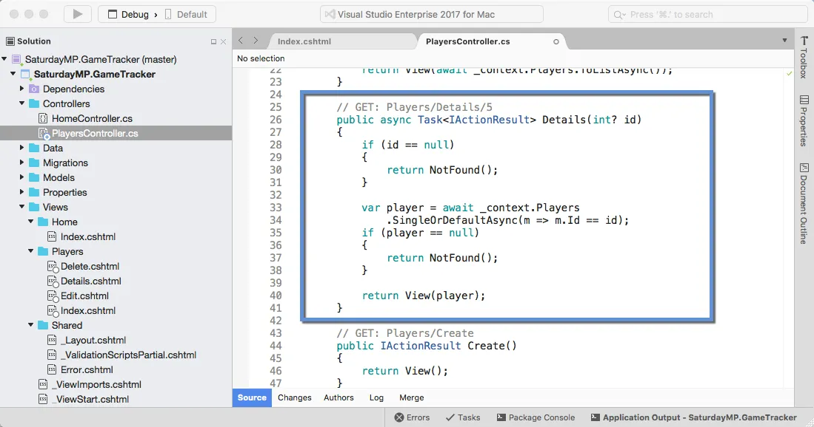](https://nftb.saturdaymp.com/wp-content/uploads/2018/06/PlayerControllerCodeDetailsMethod.png)

This little bit of code finds on particular Player based on their ID.  It's the same as writing:

\[sql\] Select \* From Players Where Id = # \[/sql\]

In this case it either finds the player in the database and maps it to the player model or it returns Null.  Again ORM did all the grunt work.  The developer didn't have to write the query or the mapping code.

You are starting to get the idea but let's look at one more, the Create method.  There are two Create methods, the first one simply returns the page for the user to enter the new player.  The second method is what is called when the user submits the create player page.  We are interested in the second method.

\[csharp\] // POST: Players/Create // To protect from overposting attacks, please enable the specific properties you want to bind to, for // more details see http://go.microsoft.com/fwlink/?LinkId=317598. \[HttpPost\] \[ValidateAntiForgeryToken\] public async Task<IActionResult> Create(\[Bind("Id,Name")\] Player player) { if (ModelState.IsValid) { \_context.Add(player); await \_context.SaveChangesAsync(); return RedirectToAction(nameof(Index)); } return View(player); }\[/csharp\]

[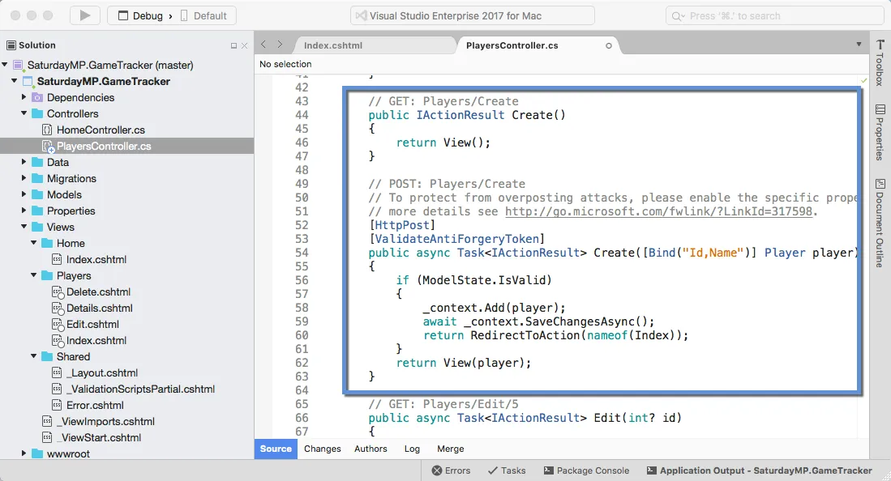](https://nftb.saturdaymp.com/wp-content/uploads/2018/06/PlayerControllerCodeCreateMethod.png)

This method creates a new player in the database.  In this case the ASP.NET MVC populates the model from the information the user entered on the web page.  Then the code adds the new player to the context.  The context does not actually save the new player to the database until the SaveChangesAsync method is called.

As a DBA you can probably guess why the context does not save the changes immediately to the database.  It would result in lots of connections and queries which is very inefficient.  Instead the context the takes note of the changes should be made and then batch executes them in one connection.  If possible the ORM will also minimize the number of queries it needs send.  This is known as the [Unit of Work pattern](https://martinfowler.com/eaaCatalog/unitOfWork.html).

In this example we are just adding a single record in a Unit of Work but I'm sure you can imagine more complex scenario where several records in several tables are updated in one unit of work.

_I think that is enough for now.  In the [next post](https://nftb.saturdaymp.com/introduction-to-orms-for-dbas-part-4-create-game-crud/) we will create the Games CRUD similar to above and discus the Edit and Delete methods.  If you got stuck you can find completed Part 3 [here](https://github.com/saturdaymp/IntroductionToORMForDBAs/tree/master/Source/04-CreateGameCRUD) .  Finally if you have any questions or spot an issue in the code I would prefer if you opened a [issue](https://github.com/saturdaymp/IntroductionToORMForDBAs/issues) in GitHub but you can e-mail (chris.cumming@saturdaymp.com) me as well._
