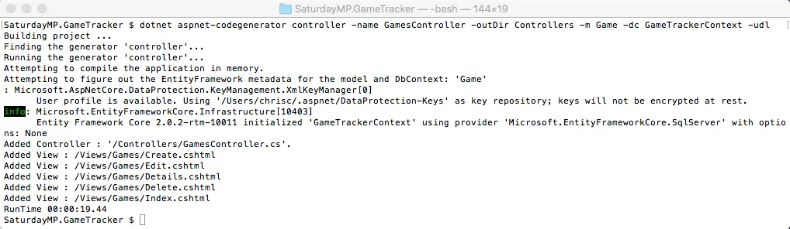
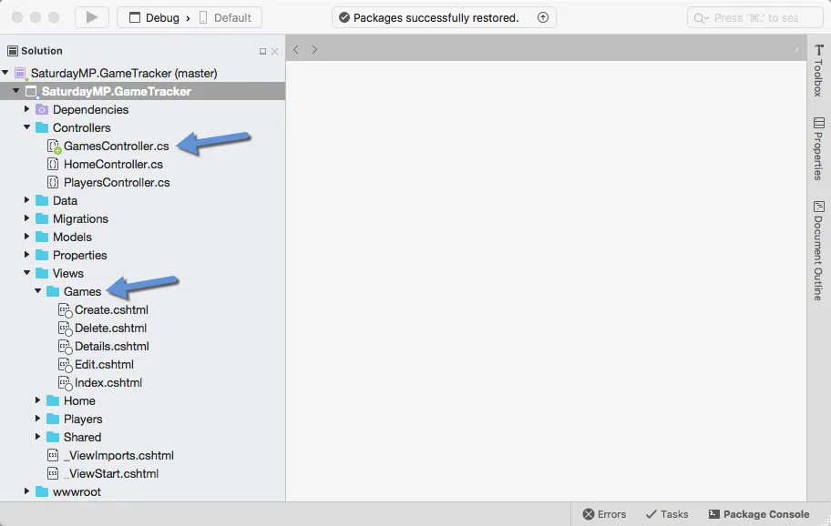
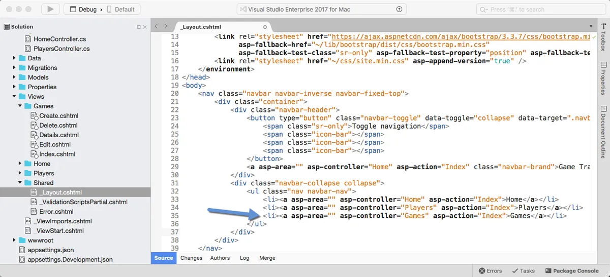
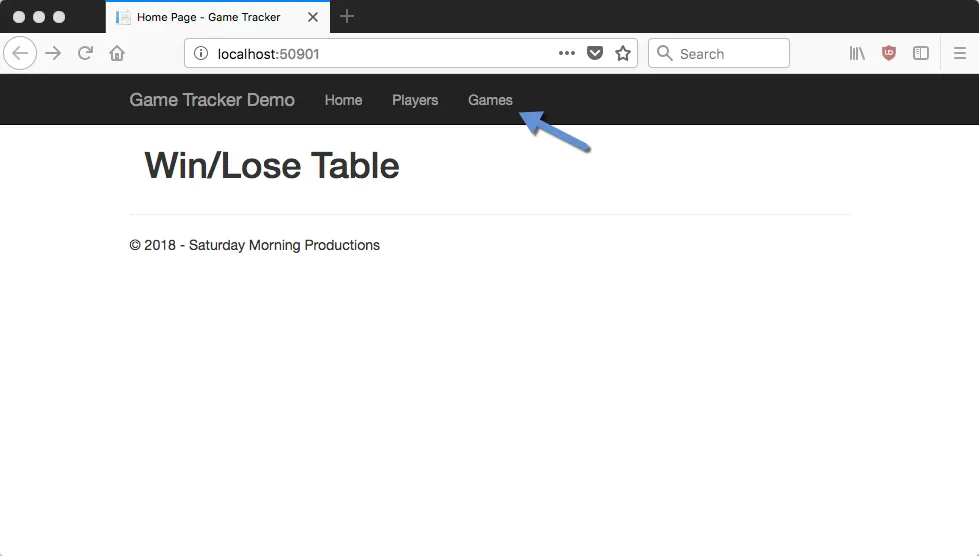
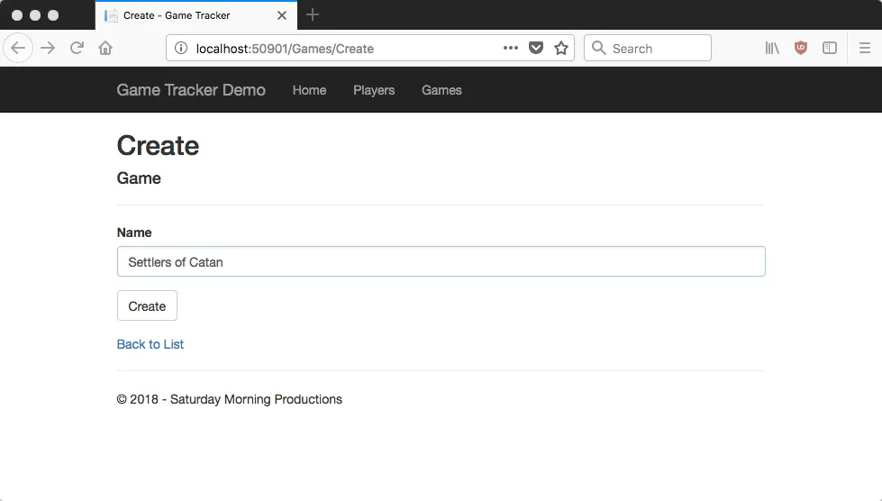
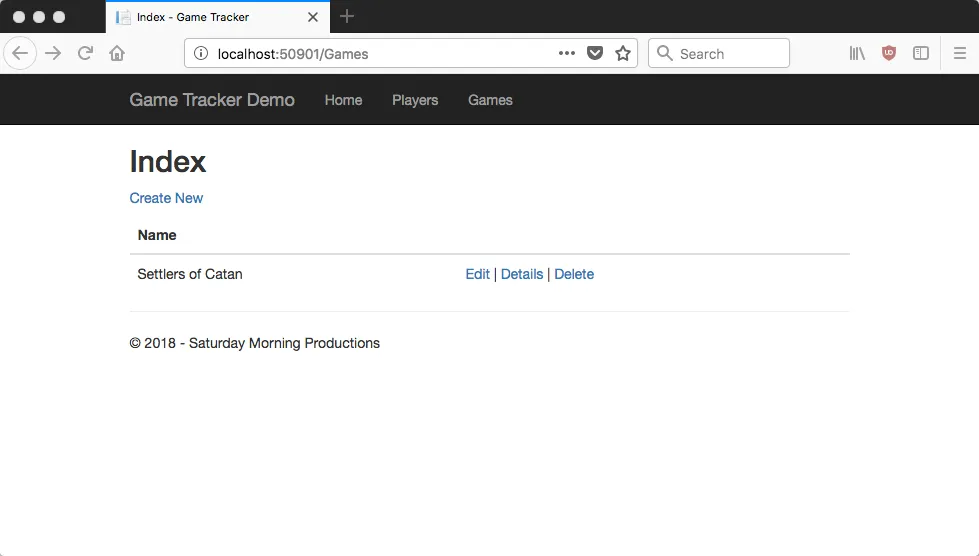
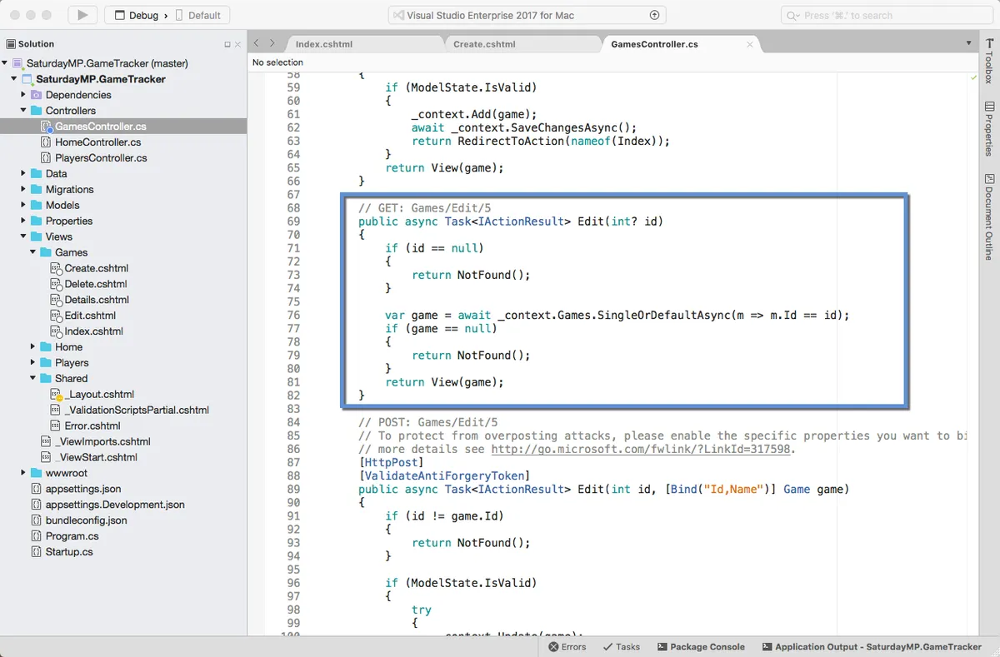
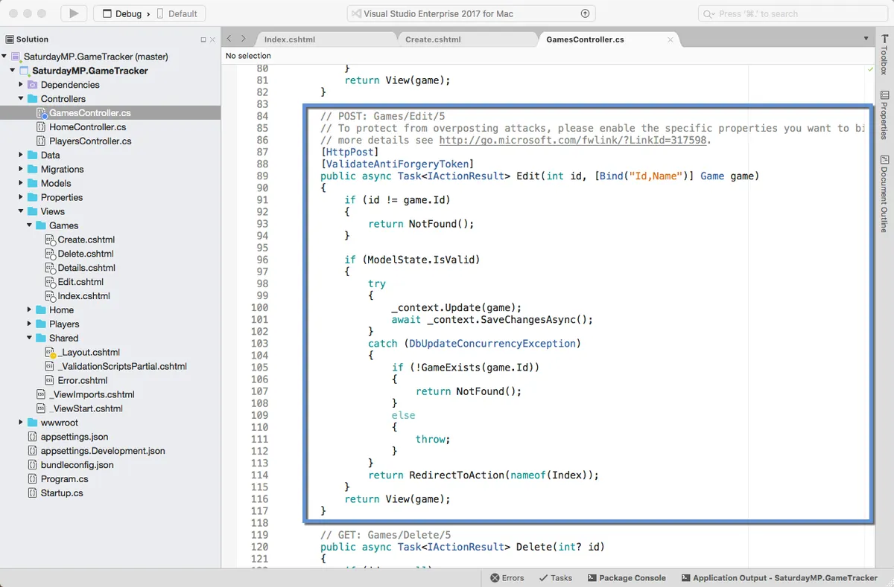
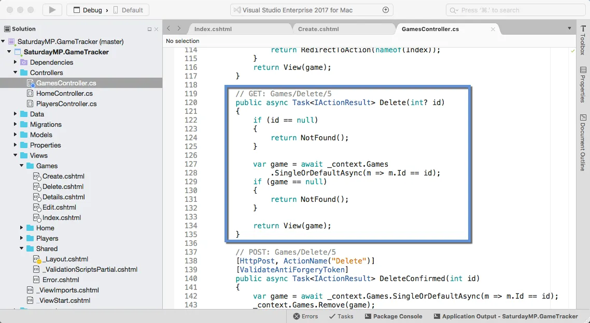
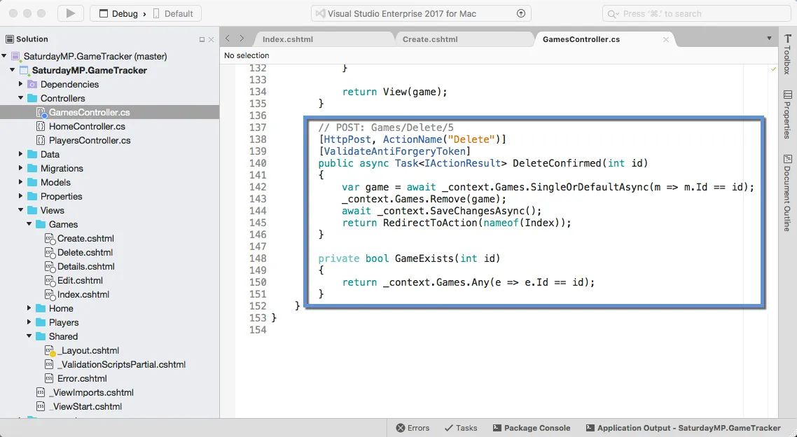

_I gave the [Introduction to ORMs for DBAs](https://github.com/saturdaymp/IntroductionToORMForDBAs) at [SQL Saturday 710](http://www.sqlsaturday.com/710/eventhome.aspx) but it didn’t go as well as I would have liked (i.e. I had trouble getting my demo working).  Since the demo didn’t work live I thought I would show you what was supposed to happen during the demo.  You can find the slides I showed before the demo [here](https://github.com/saturdaymp/IntroductionToORMForDBAs/blob/master/Slides/Introduction%20to%20Object-Relational%20Mapping%20for%20DBAs.pdf)._

_The goal of this demo is create a basic website that tracks the games you and your friends play and display wins and losses on the home page.  I used a MacBook Pro for my presentation so you will see Mac screen shots.  That said the demo will also work on Windows._

_In the [previous post](https://nftb.saturdaymp.com/introduction-to-orms-for-dbas-part-3-player-crud/) we created the Games table and the post before that we created the Players table.  In this post we will create the CRUD methods to access the Games table._  

_If you skipped the previous post but want to follow along open up [04 - Create Game CRUD](https://github.com/saturdaymp/IntroductionToORMForDBAs/tree/master/Source/04-CreateGameCRUD).  Then run the migrations to create the Players and Games table in the database so your database similar to the below screen shot.  The migration IDs can be different but the tables should exist._

Lets get right into it and create the CRUD scaffolding to access the games table.  I'll create the scaffolding using the same command line I used to the create the Players CRUD scaffolding.

\[text\] dotnet aspnet-codegenerator controller -name GamesController -outDir Controllers -m Game -dc GameTrackerContext -udl \[/text\]

Just like the Player CRUD scaffolding you should see a GamesController and a bunch of Games views.  If you don't see the views you might need to close Visual Studio and re-open it.

I just realized we never talked the specifics of this command when we created the player CRUD so let's do that now.  The first argument says we want to create a controller because the ASP.NET code generator can generate more then just controllers.  Then the "name" argument tells it the name of the controller.

Notice that we pluralize the name?  The model is singular because it represents on thing, in this case a game.  The Table is plural because it holds multiple games.  Finally the controller is plural because it's the controller for all the games.  Of course you can pick your own standard.  Just be consistent.

Back to the command.  The "outDir" argument says where we want the controller to be created.  The "m" argument tells the scafolding what model to base the controller and views on.  The "dc" argument tells the code generator what data context to use.  Remember you can have more then one data context.  Finally the "udl" argument tells the generator to use our default layout file when creating the views.

Back to our application, we should run it to make sure it works but before we do that lets add the menu item to the Games page.  Open up the \_Layout.cshtml file and add the following line:

\[html\] <li><a asp-area="" asp-controller="Games" asp-action="Index">Games</a></li> \[/html\]

Now that the menu item has been added run the application and you should see the Games menu on the home page.

Click it an will take you to the Games Page index which shows a list of all the games.  Since there are no games yet the list is empty.  Click the Create New link and add a new game to make sure everything works.

Now that everything works lets get back to talking about the code and the ORM methods the controller.  For the PlayersController we talked about the Index, Details, and Create methods.  That leaves the Edit and Delete methods.

First up the Edit methods.  Notice I said methods as there are two Edit methods.  One Edit method to get the information about the game to be edited and the other saves the changes.  Lets start with the Get Edit method.

\[csharp\] public async Task<IActionResult> Edit(int? id) { if (id == null) { return NotFound(); }

var game = await \_context.Games.SingleOrDefaultAsync(m => m.Id == id); if (game == null) { return NotFound(); } return View(game); } \[/csharp\]

 

The id argument passed into the method is the ID of the game to be displayed.  There is some error checking to make sure the id is not NULL.  Remember this is a website on the Internet and the Internet will often send you garbage (i.e. IDs that are not numbers).

\[csharp\] if (id == null) { return NotFound(); } \[/csharp\]

Assuming the id is a number we use Entity Framework to try and find the game in the database.

\[csharp\] var game = await \_context.Games.SingleOrDefaultAsync(m => m.Id == id); \[/csharp\]

This line of code tells Entity Framework to look in the games table and find any records that has the match the ID we are looking for.  The SingleOrDefaultAsync returns the game record if found or NULL if no record is found.  If multiple records are found then an exception is raised.  Basically it generates the following query:

\[sql\] Select \* From Games Where Id = # \[/sql\]

The found game record is then displayed to the user via the web page.  The user makes changes to the game, in this case changing the name, then submits the changes.  This submit calls the second Edit method which we call the Post Edit method.

\[csharp\] \[HttpPost\] \[ValidateAntiForgeryToken\] public async Task<IActionResult> Edit(int id, \[Bind("Id,Name")\] Game game) { if (id != game.Id) { return NotFound(); }

if (ModelState.IsValid) { try { \_context.Update(game); await \_context.SaveChangesAsync(); } catch (DbUpdateConcurrencyException) { if (!GameExists(game.Id)) { return NotFound(); } else { throw; } } return RedirectToAction(nameof(Index)); } return View(game); } \[/csharp\]

Quick aside, why am I calling the [methods Get and Post](https://www.w3schools.com/tags/ref_httpmethods.asp)?  They are terms used in the HTML protocal.  A GET request is used to retrieve data from the web server.  So in the case of the GET Edit method we want to "get" information about the game.  Post request is sending data to the webserver.  In this case we want to "post" the changes made to the game.

Back to the code.  First off what do these arguments mean?

\[csharp\] public async Task<IActionResult> Edit(int id, \[Bind("Id,Name")\] Game game) \[/csharp\]

 

This first argument is the ID of the game we want to edit.  The second argument is the new values of the game.  The Bind in square brackets tells our application what fields to map to the Game object.  In this case it's all the fields, the ID and Name.  In more complicated objects you might not want the user, especially a malicious user, to set certain fields.

Like the Get Edit method this method starts with some basic error handling.  First making sure the ID of the object to edit and the ID in the game object with the updated values are the same.  Remember we are dealing with Internet requests that might not be valid.

\[csharp\] if (id != game.Id) { return NotFound(); } \[/csharp\]

Then it checks to make sure the updated values in the Game object are valid.  This is where you could also do business logic checking.

\[csharp\] if (ModelState.IsValid) \[/csharp\]

Assuming all the error handling passes then the Game record in the database is updated.  The first line adds the updated Game object to the context.  Remember that changes to the context are written to the database when a save method is called.  In this case there is only one change.

\[csharp\] \_context.Update(game); await \_context.SaveChangesAsync(); \[/csharp\]

The actual saving is wrapped in a Try-Catch block to handle any errors in saving the edits.

That is it for the Edit methods.  Let us move on to the Delete methods.  First up the Get Delete method.

\[csharp\] public async Task<IActionResult> Delete(int? id) { if (id == null) { return NotFound(); }

var game = await \_context.Games.SingleOrDefaultAsync(m => m.Id == id); if (game == null) { return NotFound(); } return View(game); } \[/csharp\]

 

Similar to the Get Edit method the Get Delete method simply finds the game we want to delete and returns it.  Presumably so the user can view the game before it's deleted.  Nothing new to say so lets jump to the Post Delete method.

\[csharp\] \[HttpPost, ActionName("Delete")\] \[ValidateAntiForgeryToken\] public async Task<IActionResult> DeleteConfirmed(int id) { var game = await \_context.Games.SingleOrDefaultAsync(m => m.Id == id); \_context.Games.Remove(game); await \_context.SaveChangesAsync(); return RedirectToAction(nameof(Index)); } \[/csharp\]

 

Again the Post Delete method is very similar to the Post Edit method but in this case we don't check if the game exists before deleting it.  The delete method with remove the game if it exists and if it does not exist then there is nothing to delete and no error is raised.

The SQL generated would look something like:

\[sql\] Delete From Games Where Id = # \[/sql\]

_That is all for now.  In the next part we will create a table that has a one-to-many relationship and talk creating one-to-many ORM models.   If you got stuck you can find completed Part 4 [here](https://github.com/saturdaymp/IntroductionToORMForDBAs/tree/master/Source/05-CreateGamesResultsTable).  Finally if you have any questions or spot an issue in the code I would prefer if you opened a [issue](https://github.com/saturdaymp/IntroductionToORMForDBAs/issues) in GitHub but you can e-mail (chris.cumming@saturdaymp.com) me as well._
