I was curious to see if I could create a Docker container for a new Rails project without having Ruby or Rails installed on the host machine.  To do this I created a new [Ubuntu 18](https://www.ubuntu.com/download/desktop) virtual machine with the bare minimum installed for the OS.  I also install [Docker](https://www.docker.com/), [RubyMine](https://www.jetbrains.com/ruby/), and [DataGrip](https://www.jetbrains.com/datagrip/).

Initially I was hoping I could just create the new project inside RubyMine.  Unfortunately I couldn't get it working.  As you will see setting up the initial Docker container requires more then just running the "docker-compose up" command.

My main resource in setting up the image was [Docker Rails Quickstart Guide](https://docs.docker.com/compose/rails/).   The basic plan is:

1. Setup Ruby Docker container.
2. Add default Gemfile for Rails.  Required to create new Rails application.
3. Create a new Rails application but don't build the container yet.
4. Update the configuration files.
5. Build the docker container to install the Gems.

I started off as they recommended and created an empty folder with Dockerfile.

```text
FROM ruby:2.5
RUN apt-get update -qq && apt-get install -y build-essential libpq-dev nodejs
RUN mkdir /website
WORKDIR /website
COPY Gemfile /website/Gemfile
COPY Gemfile.lock /website/Gemfile.lock
RUN gem install bundler
RUN bundle install
COPY . /website
```

[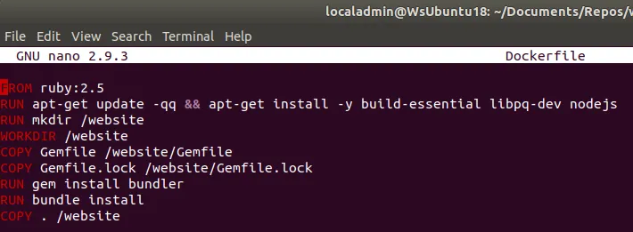](https://nftb.saturdaymp.com/wp-content/uploads/2018/07/Dockerfile.png)

I then created a basic Gemfile and empty Gemfile.lock file.

```text
source 'https://rubygems.org'
gem 'rails', '5.2.0'
```

[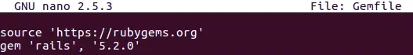](https://nftb.saturdaymp.com/wp-content/uploads/2018/07/Initial-Gemfile.png)

Finally I created the docker-compose file.

You might have noticed this file is a bit different then the one in the Docker Quickstart.  I made these changes after the contain failed to build and/or I couldn't connect to it with RubyMine.

```text
version: '2'
services:
  db:
    image: postgres
    ports:
      - "5432:5432"
    environment:
      POSTGRES_PASSWORD: password1234
    volumes:
      - ./tmp/db:/var/lib/postgresql/data
  web:
    build: .
    command: bundle exec rails s -p 3000 -b '0.0.0.0'
    volumes:
      - .:/website
    ports:
      - "3000:3000"
    depends_on:
      - db
```

[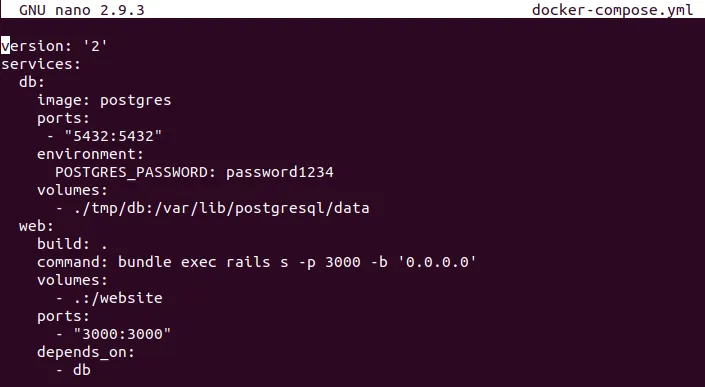](https://nftb.saturdaymp.com/wp-content/uploads/2018/07/Docker-Compose.png)

The first change I made was downgrading the version from 3 to 2 as RubyMine currently only supports 2.  I also added ports and a password for the Postgres database so I can access from DataGrip.  If you don't set the port and password your Rails application will be able to access the database but nothing else will.

I then created the rails application as recommended by the quickstart guide.  Since this is the first time running it pulls down the docker files.  Then I ran into the first of many permission errors.

```text
docker-compose run web rails new . --force --database=postgresql
```

[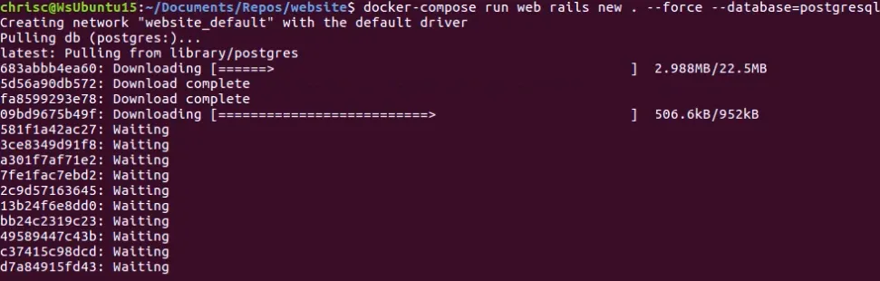](https://nftb.saturdaymp.com/wp-content/uploads/2018/07/Creating-new-Rails-App-Cmd.png)

[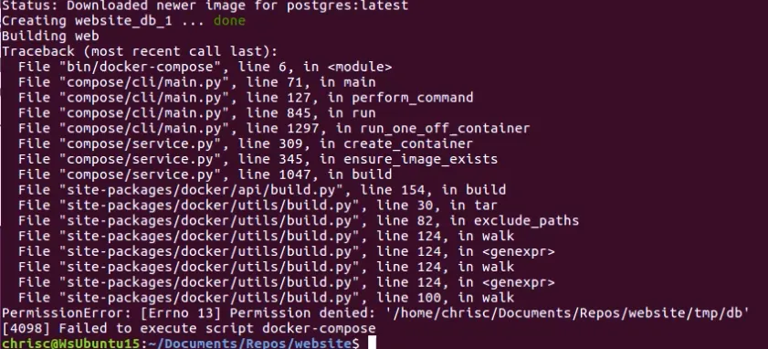](https://nftb.saturdaymp.com/wp-content/uploads/2018/07/Frist-Permission-Error.png)

This permission error was caused by the Postgres container.  The files created Docker images are usually owned by root but some of the temporary Postgres files where also owned by VBoxAdd.

[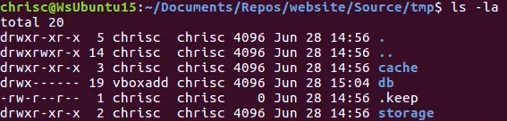](https://nftb.saturdaymp.com/wp-content/uploads/2018/07/Database-File-Owned-by-VBoxAdd.png)

After a while I figured out the way to fix this was to run the following command:

```text
sudo chown -R $USER:$USER .
```

I got several permission errors during my trails and error of setting up the Rails container.  Every time I would just run the above command to fix it.

Once the permission errors went away I was able to create a new rails application.  Before the files for the new rails application where created it needs to build the Docker container so don't be surprised to see the below.

[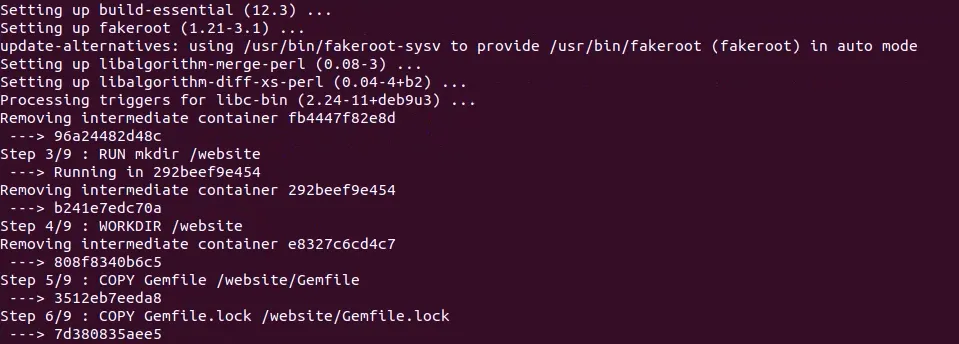](https://nftb.saturdaymp.com/wp-content/uploads/2018/07/Building-Rails-Container.png)

Your newly created rails files might be owned by root.  In this case run the command you have probably become very familiar with:

```text
sudo chown -R $USER:$USER .
```

Notice that the Gemfile has been updated and populated with all the Gems needed to run a new rails application.

[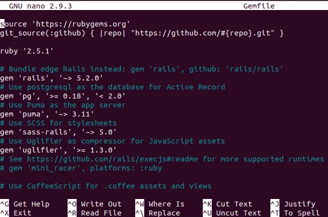](https://nftb.saturdaymp.com/wp-content/uploads/2018/07/Gemfile-Populated-by-Rails-New.png)

Since we just called run on the web Docker container non of the installed Gems where saved in the container.  To prevent having to re-install the gems every time the container is run we need to build it.

[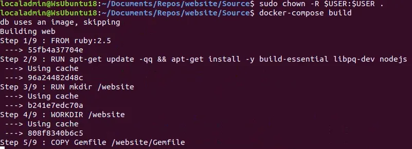](https://nftb.saturdaymp.com/wp-content/uploads/2018/07/Build-Containers.png)

Now the web container is ready but our database isn't.  Open up the database config file and set the host, username, and password.

[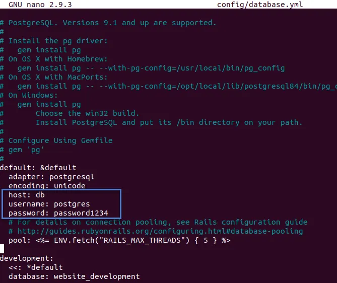](https://nftb.saturdaymp.com/wp-content/uploads/2018/07/Database-Config-File-Settings.png)

Now create the Rails databases.

```text
docker-compose run web rake db:create
```

[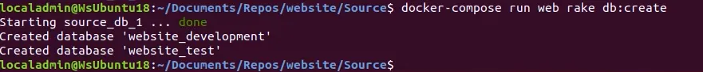](https://nftb.saturdaymp.com/wp-content/uploads/2018/07/Create-the-Rails-Databases.png)

Again if you get permission errors trying to create the databases run change permissions command.

```text
sudo chown -R $USER:$USER .
```

Now bring up the containers and you should be see the Welcome to Rails website.

```text
docker-compose up
```

[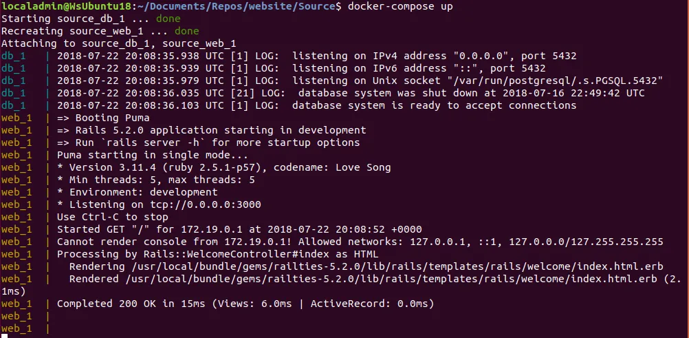](https://nftb.saturdaymp.com/wp-content/uploads/2018/07/Docker-Compose-Up.png)

[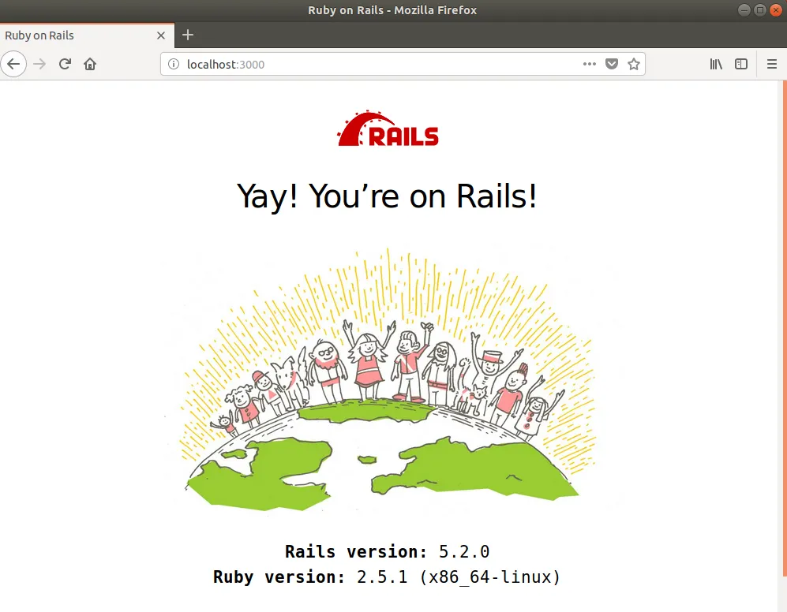](https://nftb.saturdaymp.com/wp-content/uploads/2018/07/Yay-Your-are-on-Rails-3.png)

The site is working but now we need to get it working with RubyMine.  If you use a different editor then your steps might be different.

First stop the containers using Ctrl-C.

[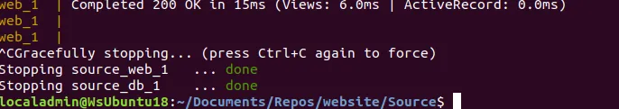](https://nftb.saturdaymp.com/wp-content/uploads/2018/07/Stopping-Containers.png)

To safe us some steps later lets update the Gemfile.  By default Rails installs the [Byebug](https://github.com/deivid-rodriguez/byebug) gem for debugging.  RubyMine likes the [Ruby Debug IDE](https://github.com/ruby-debug/ruby-debug-ide) gem.  Just don't run them both at the same time as they don't play well together.

Remove ByeBug from the Gemfile and add Ruby Debug IDE.  Your Gemfile will look like:

[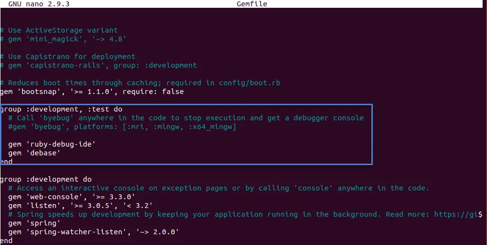](https://nftb.saturdaymp.com/wp-content/uploads/2018/07/Ruby-Debug-IDE-Added-to-Gemfile.png)

Now rebuild the Docker container so the new gems are installed.

```text
docker-compose build
```

Then open up RubyMine and open up your project.  Once it's open we need to tell RubyMine about our Docker containers.  To this go to File-->Settings.  Then go the Build, Execution, Deployment-->Docker in the Settings dialog and make sure Docker is setup correctly.  If it is you should see something similar to the below.

[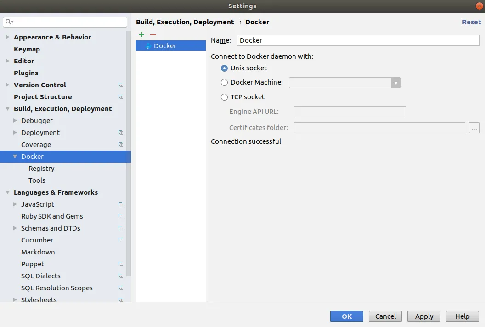](https://nftb.saturdaymp.com/wp-content/uploads/2018/07/Docker-Settings.png)

[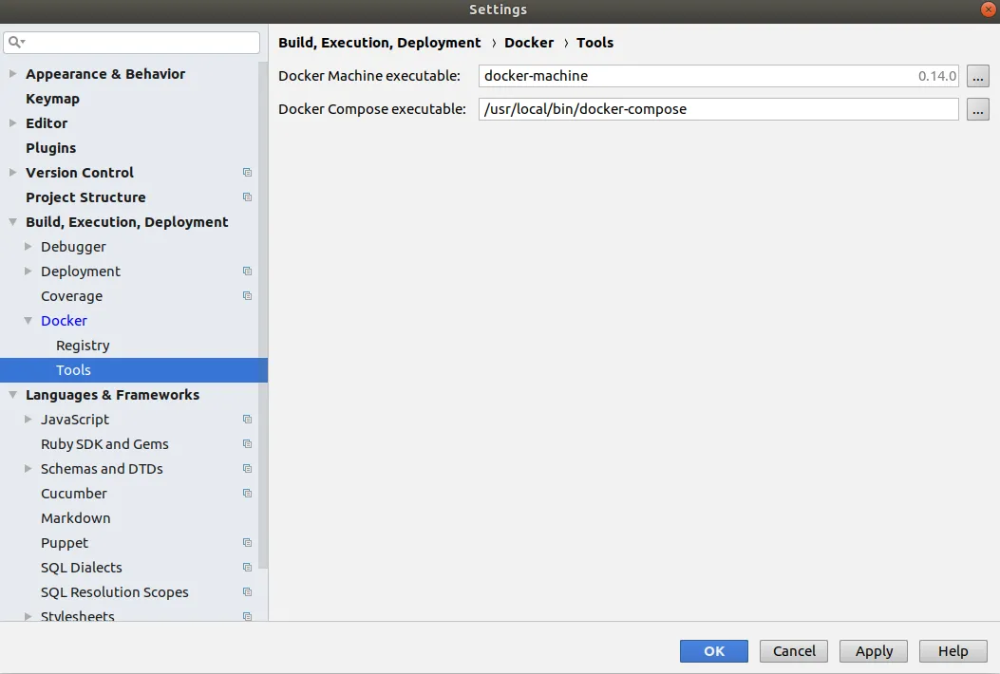](https://nftb.saturdaymp.com/wp-content/uploads/2018/07/Docker-Settings-Registry.png)

You might be missing Docker Machine in which case you can install it following [these instructions](https://docs.docker.com/machine/install-machine/).  Try re-opening RubyMine and if it still does not find Docker Machine then you will need to tell it the exact path.

Now that Docker is setup correctly in RubyMine we need to setup the Ruby SDK by going to Languages & Frameworks --> Ruby  SDK and Gems in the Settings dialog.  Assuming you don't have Ruby installed on your local workstation the list of Ruby SDKs should be empty.  Click the green plus sign to add one and choose New Remote.

[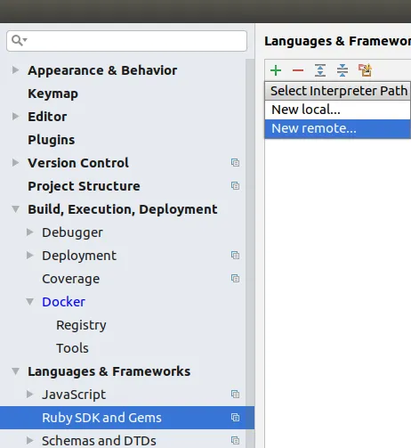](https://nftb.saturdaymp.com/wp-content/uploads/2018/07/Add-New-Remote-Ruby-SDK-in-RubyMine.png)

In the Configure Remote Ruby Interpreter select Docker Compose and enter in the settings shown below.  This tells RubyMine what Docker Compose file to use to build the containers and container is the website.

[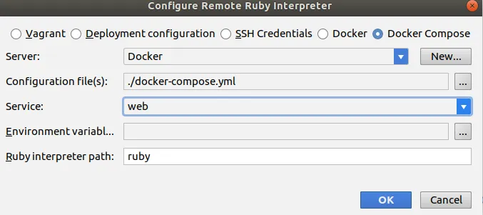](https://nftb.saturdaymp.com/wp-content/uploads/2018/07/Configure-Remote-Ruby-Interpreter-Dialog.png)

After you click OK RubyMine will run the Docker containers and attempt to find Ruby in the container.  It will also attempt to find all the gems installed on the container.  This can take a couple minutes but if everything works correctly you should see something like:

[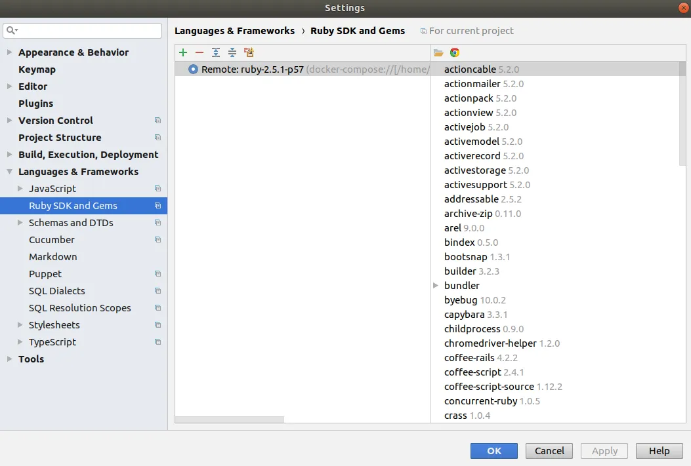](https://nftb.saturdaymp.com/wp-content/uploads/2018/07/Remote-Docker-Compose-Ruby-SDK-Correctly-Configured.png)

Sometime the correct Ruby version will be listed by the gems won't be shown.  To fix you might have to remove the newly added Ruby SDK by clicking the minus sign and try again.

If RubyMine can't load the Docker containers then it will probably display a very unhelpful error message.  Try going back to the terminal and running docker-compose up manually.  If you get any errors fix them then try configuring RubyMine again.

Assuming everything is working correctly you should be able to run and debug the application.  To test that debugging works put a break point then try debugging.

[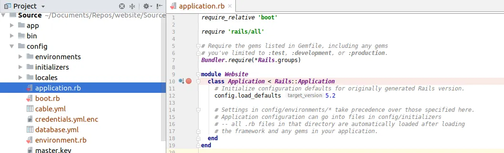](https://nftb.saturdaymp.com/wp-content/uploads/2018/07/Application-Breakpoint.png)

[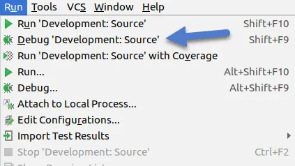](https://nftb.saturdaymp.com/wp-content/uploads/2018/07/Run-Debug-Development.png)

[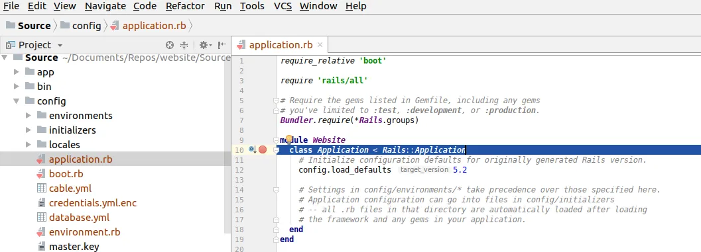](https://nftb.saturdaymp.com/wp-content/uploads/2018/07/Application-Breakpoint-Hit.png)

Now you can develop your new app without installing Ruby or Rails on your local workstation.  If you have any tips for dealing with the Docker Prostgres permission issues let me know at [chris.cumming@saturdaymp.com](mailto:chris.cumming@saturdaymp.com).

P.S. - My wife recently introduced me to the band Walk of the Earth which we get to see live shortly.  They are most famous for all the band members [covering](https://www.youtube.com/watch?v=d9NF2edxy-M) Gotye's "[Somebody That I used Know](https://www.youtube.com/watch?v=8UVNT4wvIGY)" a single guitar but my favourite song is an original called "[Rule the World](https://www.youtube.com/watch?v=ukigjUvwAR4)".

_They said no way_ _I say I rule the world_ _(Ain't afraid of the walls, I'mma break them down)_ _They stay the same_ _Well, I'm feelin' high as a bird_ _(Ain't afraid of the ground, I'mma stand up)_


