_I gave the [Introduction to ORMs for DBAs](https://github.com/saturdaymp/IntroductionToORMForDBAs) presentation at [SQL Saturday 710](http://www.sqlsaturday.com/710/eventhome.aspx) but it didn’t go as well as I would have liked (i.e. I had trouble getting my demo working).  Since the demo didn’t work live I thought I would show you what was supposed to happen during the demo.  You can find the slides I showed before the demo [here](https://github.com/saturdaymp/IntroductionToORMForDBAs/blob/master/Slides/Introduction%20to%20Object-Relational%20Mapping%20for%20DBAs.pdf)._

_The goal of this demo is create a basic website that tracks the games you and your friends play and display wins and losses on the home page.  I used a MacBook Pro for my presentation so you will see Mac screen shots.  That said the demo will also work on Windows._

_In the [previous post](https://nftb.saturdaymp.com/introduction-to-orms-for-dbas-part-4-create-game-crud/) we created the Games CRUD and the post before that we created the Games table.  In this post we will create both the GameResultTypes table CRUD methods._ 

_If you skipped the previous post but want to follow along open up [05 - Create GameResults Table](https://github.com/saturdaymp/IntroductionToORMForDBAs/tree/master/Source/05-CreateGamesResultsTable).  Then run the migrations to create the Players and Games table in the database so your database similar to the below screen shot.  The migration IDs can be different but the tables should exist._

[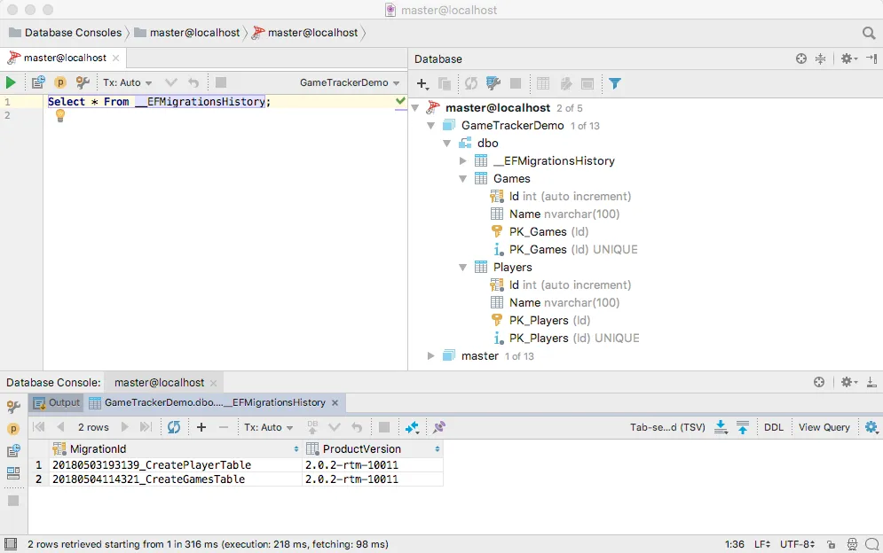](https://nftb.saturdaymp.com/wp-content/uploads/2018/06/PlayerAndGamesTableExist.png)

Now that we can store tables and players we can start thinking about how to store the games our players have played.  When a game is played we need to store the game that was played, who played in the game, and who won.  A first draft for our data model might look like:

[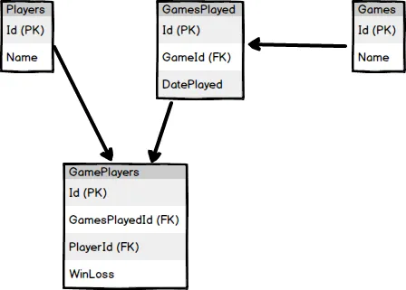](https://nftb.saturdaymp.com/wp-content/uploads/2018/07/GameTracker-ERD-Without-GameResultTypes.png)

Actually we can't just track who won as there are three possible outcomes for a game: win, loss, and tie.  Depending on the game it's possible to have multiple winners, losers, and ties.  For example, a cooperative game like [Sentinels of the Multiverse](https://sentinelsofthemultiverse.com/) either everyone wins or everyone loses.

We need a table that can track if a player lost, won, or tied a game.  A type table for the results of a game.  Our new data model looks like:

[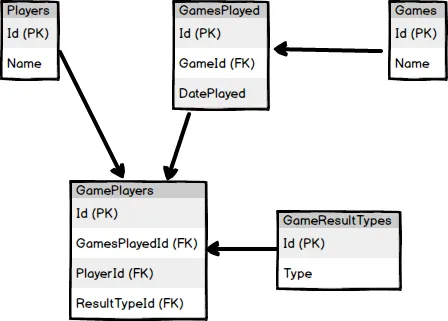](https://nftb.saturdaymp.com/wp-content/uploads/2018/07/GameTracker-ERD-Without-GameResultTypes-KeyCode.png)

One problem developers and report writers have with type tables is determine what record stands for what type.  For example, what record in the GameResultTypes represents a Win?  How would you query for all the games a player won?

One possible way is to query on the string column:

```sql
Select *
From GamesPlayed gp
Inner Join GameResultTypes grt On gp.GameResultTypeId = grt.Id
Where gp.PlayerId = #
And grt.Type = 'Won'
```

This is a bad idea as the text could change.  How about the ID?

```sql
Select *
From GamesPlayed gp
Inner Join GameResultTypes grt On gp.GameResultTypeId = grt.Id
Where gp.PlayerId = #
And grt.ID = 10
```

Using an auto-increment ID as the identifier is a bad idea as it is set by the database and can change.  This is especially problematic as the database is migrated between environments such as from test to production.

How about not auto-incrementing the ID field?  That would work but I'm not a fan.  I prefer all the ID columns in my database to consistent.  I also prefer not to hard code IDs.  It should be up to the database to decide what the ID value is.  The only time I reference an ID is after I've retrieved the record via a non-ID search.

My preference is to have a field called KeyCode.  This is a unique integer field with a value that is set when the record is entered and never changed.  It can then be used whenever you need to access that particular type.  For example, if we assign the Win Game Result Type a Key Code of 10 then we can find all the games a player won by:

```sql
Select *
From GamesPlayed gp
Inner Join GameResultTypes grt On gp.GameResultTypeId = grt.Id
Where gp.PlayerId = #
And grt.KeyCode = 10
```

That means our GameResultTypes table now looks like:

[](https://nftb.saturdaymp.com/wp-content/uploads/2018/07/GameTracker-ERD.png)

Lets create a Game Result Type model for what we have so far.

```csharp
using System.ComponentModel.DataAnnotations;

namespace SaturdayMP.GameTracker.Models
{
  public class GameResultType
  {
    public int Id { get; set; }

    public int KeyCode { get; set; }

    [MaxLength(10)]
    public string Type { get; set; }
  }
}
```

[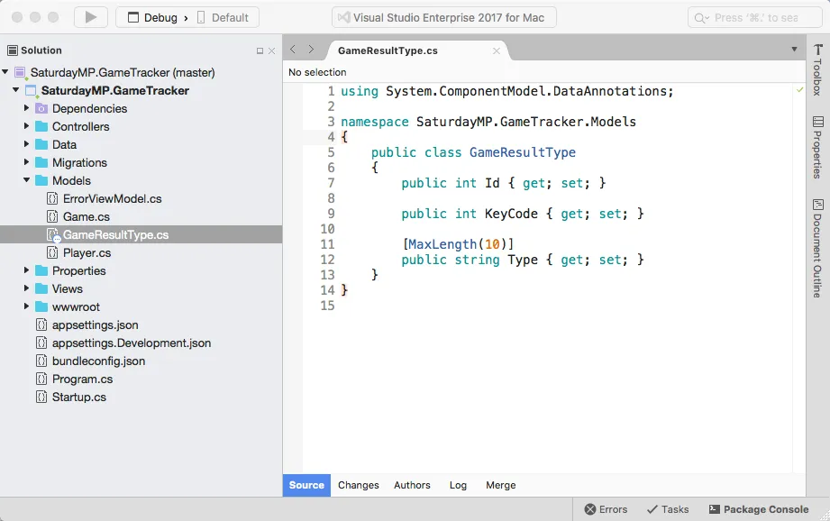](https://nftb.saturdaymp.com/wp-content/uploads/2018/07/Inital-Game-Result-Type-Model.png)

Another common feature of type table is we sometimes know all the records they will contain.  In this case they will only contain win, lose, and tie.

In software if we have a set amount of known types we can wrap them in an enum.  At it's core an enum is really an integer but it only allows certain values.  For example, we can have colour enum that only allows certain colours:

```csharp
public enum Colors
{
  Red,
  Blue,
  Green
}
```

Lets create an enum for our game result types in our model.  We could put in a seperate file but in this case the enum only exists because of the GameResultTypes so lets add it in the same file.

```csharp
public enum GameResultTypes
{
Win = 10,
Loss = 11,
Tie = 12
}
```

[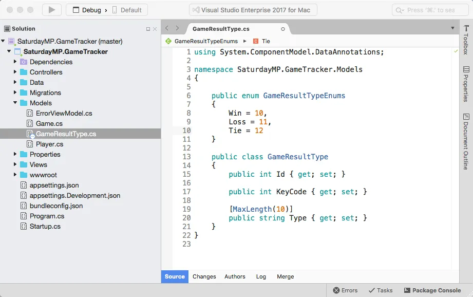](https://nftb.saturdaymp.com/wp-content/uploads/2018/07/Game-Result-Type-Model-with-Enum.png)

If we don't assign numbers to the enums they will be auto assigned.  In this case the enums will be set to the KeyCode field so we want to know what these values are.

Now that we have the enum lets update our model with some syntatic sugar to make it easier to work with the enums.

```csharp
using System.ComponentModel.DataAnnotations;

namespace SaturdayMP.GameTracker.Models
{
  public enum GameResultTypeEnums
  {
    Win = 10,
    Loss = 11,
    Tie = 12
  }

  public class GameResultType
  {
    public GameResultType()
    {
    }

  public GameResultType(GameResultTypeEnums @enum)
  {
    KeyCode = (int)@enum;
    Type = @enum.ToString();
  }

  public int Id { get; set; }

  public int KeyCode { get; set; }

  [MaxLength(10)]
  public string Type { get; set; }

  public static implicit operator GameResultType(GameResultTypeEnums @enum) => new GameResultType(@enum);

  public static implicit operator GameResultTypeEnums(GameResultType gameResultType) => (GameResultTypeEnums)gameResultType.Id;
  }
}
```

[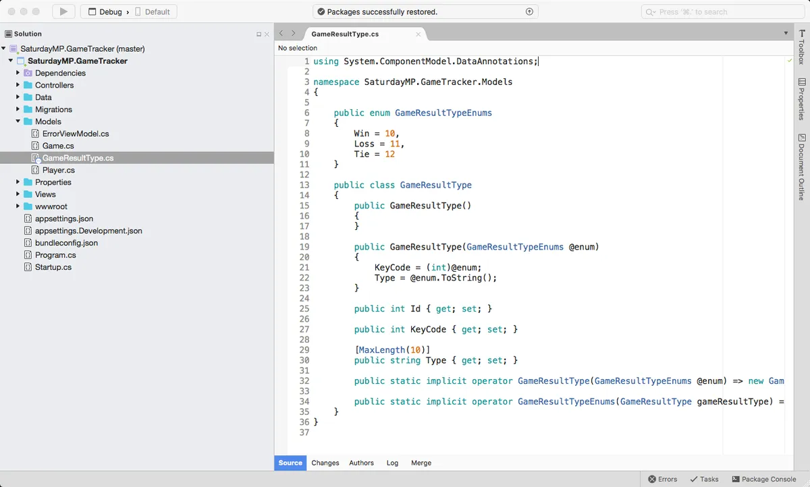](https://nftb.saturdaymp.com/wp-content/uploads/2018/07/Complete-Game-Result-Types-Model.png)

Notice that we still have the KeyCode field as a integer.  Some ORMs allow you to use enums but currently Entity Framework Core does not allow this.

The couple lines at the bottom simplify the conversion of the GameResultTypeEnums to the GameResultType object so we can write something like:

```csharp
// Convert enum to model object.
GameResultType gameResultObject = GameResultTypeEnums.Win;

// Convert model object to enum.
GameResultTypeEnums gameResultTypeEnum = gameResultObject;
```

Now that the model is complete we can create the actual table in the database using this now familiar commands to create the migration:

```text
dotnet ef migrations add CreateGameResultTypesTable
```

[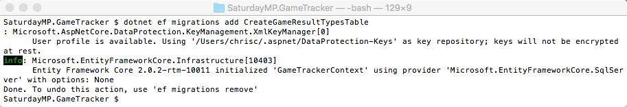](https://nftb.saturdaymp.com/wp-content/uploads/2018/08/Create-Game-Result-Types-Migration.png)

[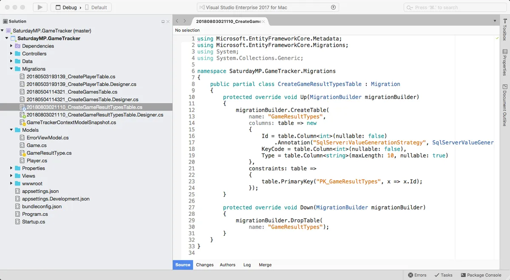](https://nftb.saturdaymp.com/wp-content/uploads/2018/08/Game-Result-Type-Migration.png)

Then apply the migration:

```text
dotnet ef database update
```

[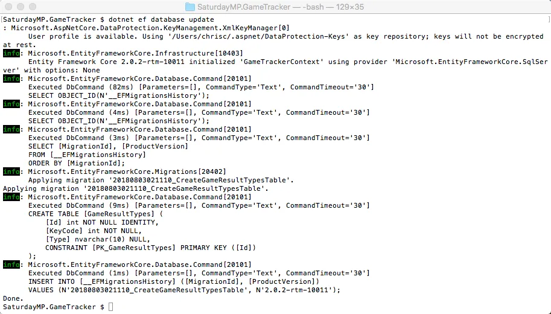](https://nftb.saturdaymp.com/wp-content/uploads/2018/08/Update-Database-with-Game-Result-Types-Table.png)

[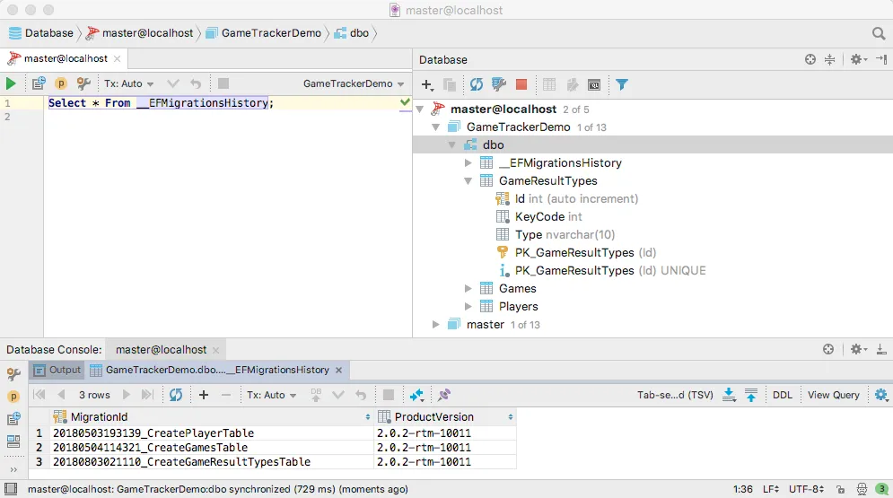](https://nftb.saturdaymp.com/wp-content/uploads/2018/08/GameResultTypes-Table-in-Database.png)

Since we know that this table will only hold 3 records and we know what they are lets seed them.  To do this create a new class in the Data folder and call it DbInitializer.  In our new class create the Initialize method that will seed the data.

```csharp
using System;
using System.Linq;
using SaturdayMP.GameTracker.Models;

namespace SaturdayMP.GameTracker.Data
{
  public static class DbInitializer
  {

    public static void Initialize(GameTrackerContext context)
    {
      if (context.GameResultTypes.Any())
      {
        // DB has already been seeded.
        return;
      }

      // Seed the Game Type Enums.
      foreach(GameResultTypeEnums result in Enum.GetValues(typeof(GameResultTypeEnums)))
      {
        context.Add<GameResultType>(result);
        context.SaveChanges();
      }

    }
  }
}
```

[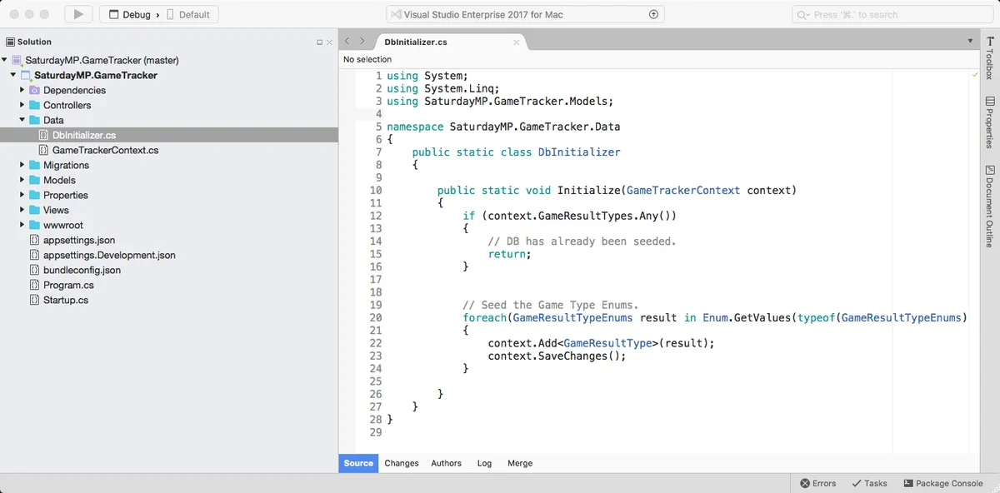](https://nftb.saturdaymp.com/wp-content/uploads/2018/08/DbInitializer-Class.png)

The first if statement checks if the data has already been seeded.  If it has, then don't seed it again.  The second part loops over all the GameResultTypeEnums and creates a record in the database.

Now we need to call our DbInitializer.  Lets do this when our application starts up in the Main:

```csharp
var context = services.GetRequiredService<SaturdayMP.GameTracker.Data.GameTrackerContext>();
DbInitializer.Initialize(context);
```

[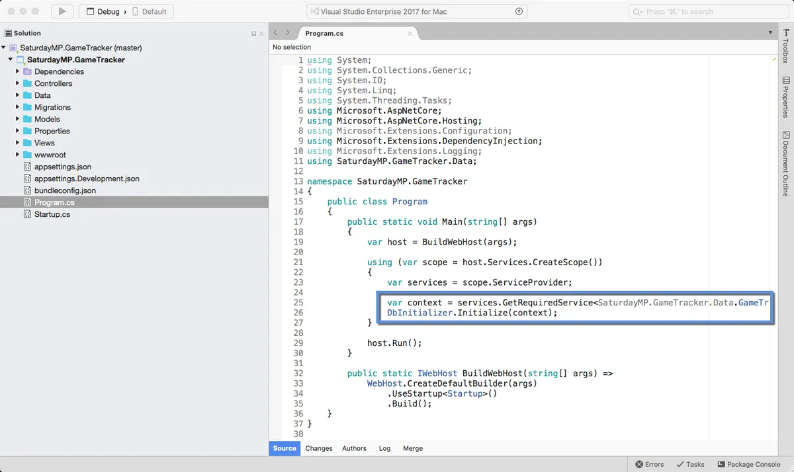](https://nftb.saturdaymp.com/wp-content/uploads/2018/08/Initialize-Database-in-Main.png)

Now if you start the application the GameResultTypes table will be populated.

[](https://nftb.saturdaymp.com/wp-content/uploads/2018/09/GameResultTypes-Table-in-Database.png)

Notice that we don't have any screens to edit GameResultTypes.  Lets stop the application and add our CRUD methods. Again this command should now be familiar:

```text
dotnet aspnet-codegenerator controller -name GameResultsTypeController -outDir Controllers -m GameResultType -dc GameTrackerContext -udl
```

[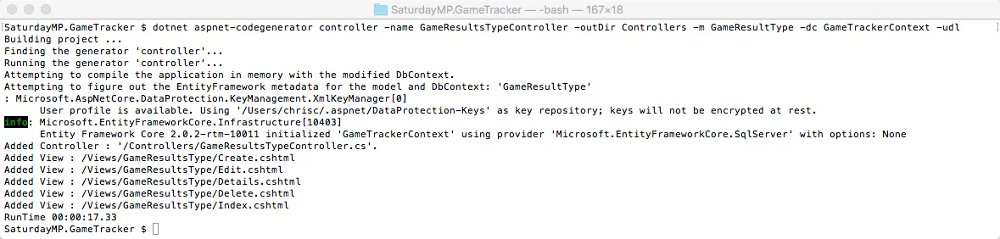](https://nftb.saturdaymp.com/wp-content/uploads/2018/09/Command-to-Add-Game-Result-Type-CRUD.png)

Unlike the other tables we have created we want to limit the actions that can be done to the GameResultTypes table.  Since we know it should only have 3 records which are seeded when the application is started we don't need the Insert or Delete controller methods.  Lets remove them:

[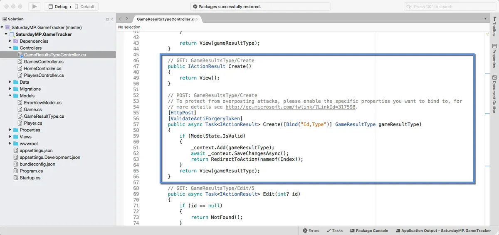](https://nftb.saturdaymp.com/wp-content/uploads/2018/09/Delete-Game-Result-Controller-Create-Method.png)

[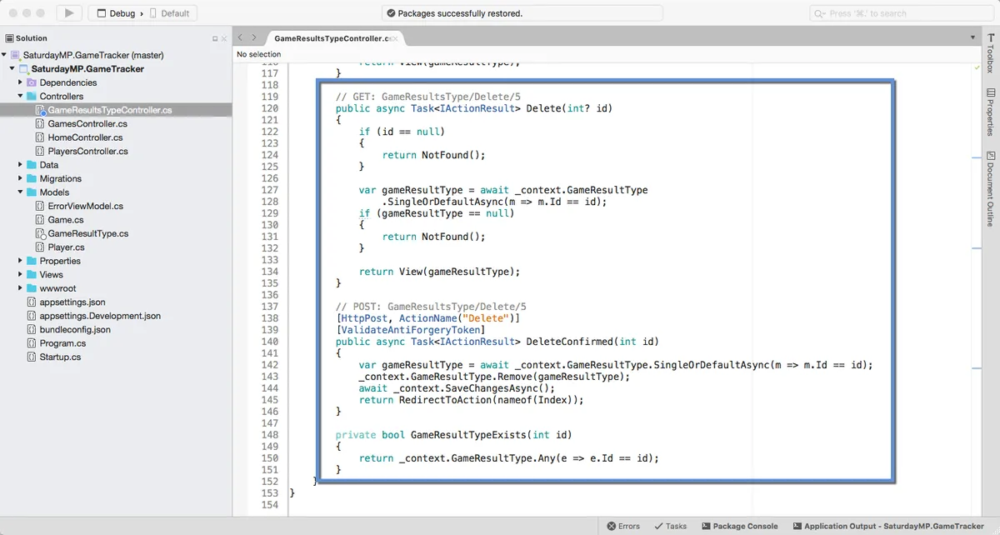](https://nftb.saturdaymp.com/wp-content/uploads/2018/09/Delete-Game-Result-Controller-Delete-Method.png)

We also need to remove the views for these methods:

[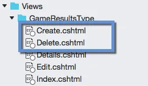](https://nftb.saturdaymp.com/wp-content/uploads/2018/09/Delete-Game-Results-Type-Create-and-Delete-Views.png)

Finally lets change the Edit view so the user can only change the description of the type.  The user shouldn't be able to change the KeyCode.  The quickest way to do this is make the input control for the KeyCode to be read-only in the Edit view:

[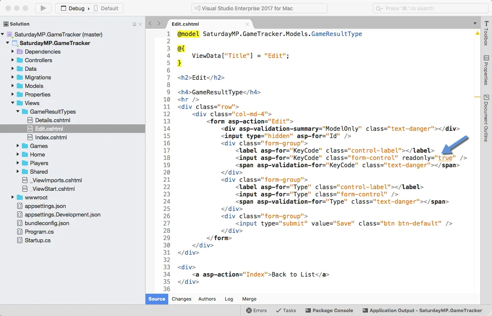](https://nftb.saturdaymp.com/wp-content/uploads/2018/09/Make-KeyCode-ReadOnly-in-Edit-View.png)

Finally lets add a menu item so we can easily get to the Game Results Type pages:

[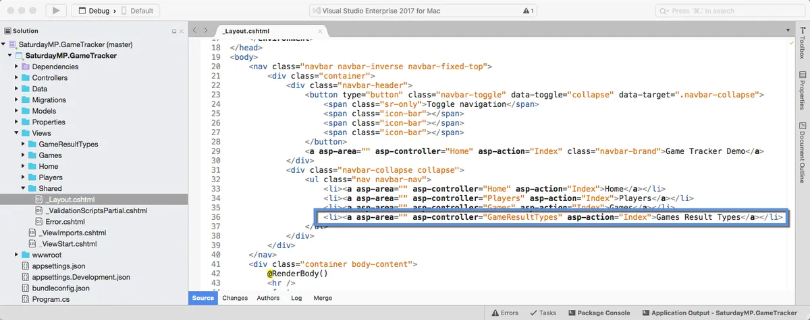](https://nftb.saturdaymp.com/wp-content/uploads/2018/09/Adding-Game-Result-Types-Menu.png)

Run the application and you should be able to edit just the text of the game results:

[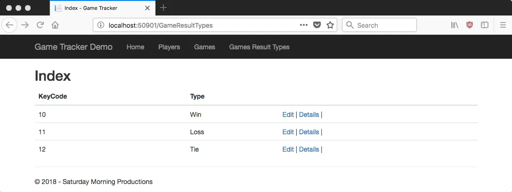](https://nftb.saturdaymp.com/wp-content/uploads/2018/09/Game-Results-Index.png)

[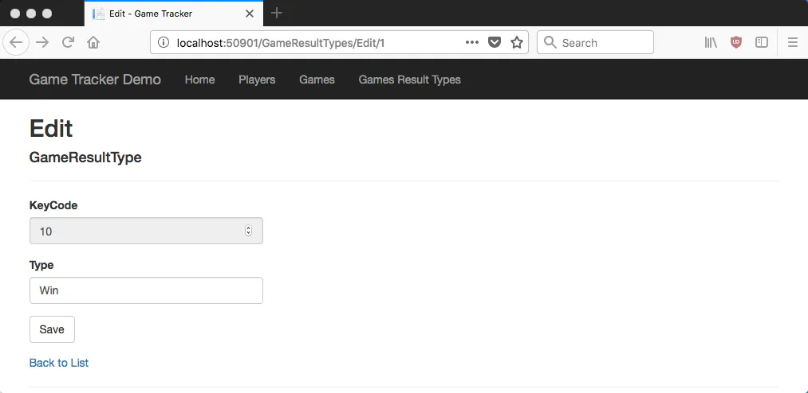](https://nftb.saturdaymp.com/wp-content/uploads/2018/09/Game-Results-Edit.png)

_In the next [post](https://nftb.saturdaymp.com/introduction-to-orms-for-dbas-part-6-create-games-played-table-and-crud/) we will create the Games Played table and CRUD methods.  This is one of the the central tables of the application, second only to the Game Players table._

_If you got stuck you can find completed Part 5 [here](https://github.com/saturdaymp/IntroductionToORMForDBAs/tree/master/Source/05-CreateGamesResultsTable).  If you have any questions or spot an issue in the code I would prefer if you opened a [issue](https://github.com/saturdaymp/IntroductionToORMForDBAs/issues) in GitHub but you can e-mail (chris.cumming@saturdaymp.com) me as well._
