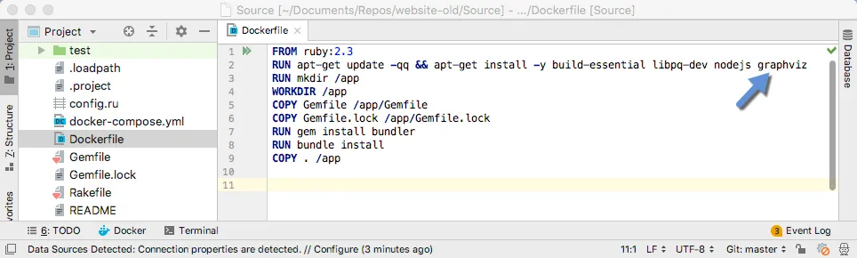
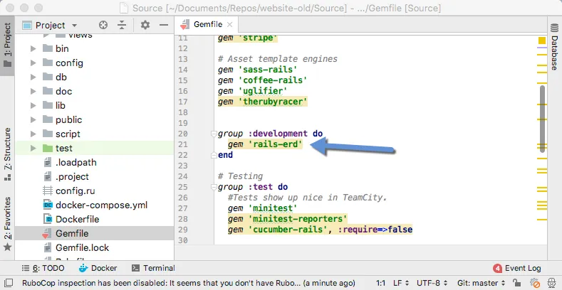
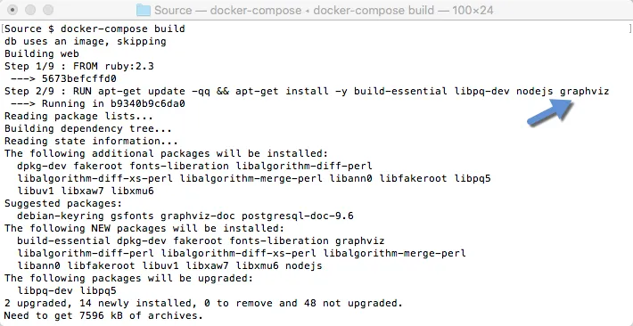
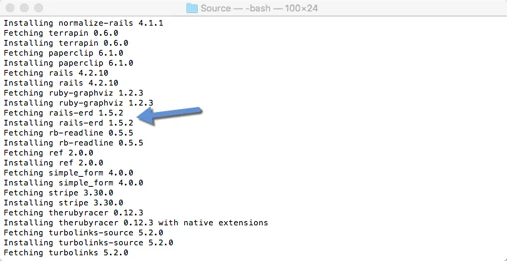
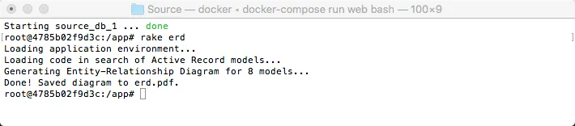
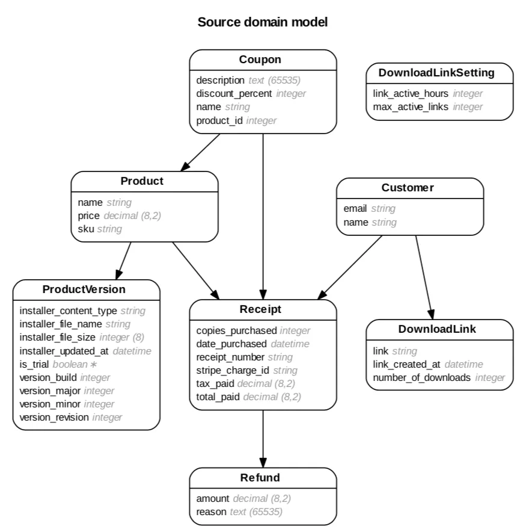
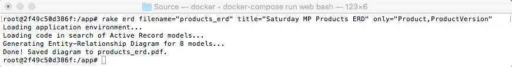
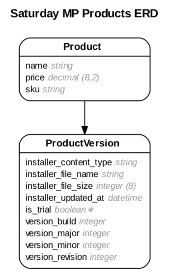
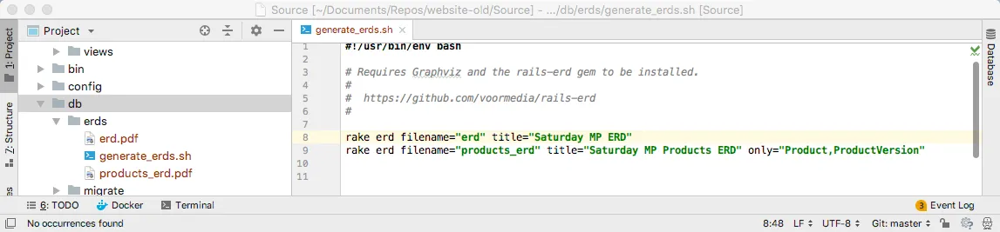
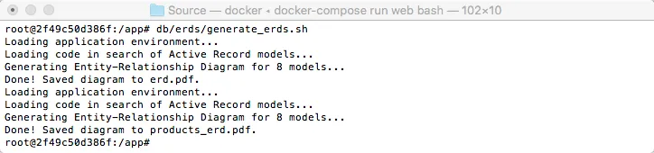

Back in the day Rails apps didn't add foreign keys to database tables.  Believe it or not this was a feature not a [bug](http://web.archive.org/web/20060418215514/http://www.loudthinking.com/arc/000516.html).  The idea was that you shouldn't "repeat" the relationship between you models in the code and in the database.  It wasn't until [Rails 4.2](https://guides.rubyonrails.org/4_2_release_notes.html#foreign-key-support) that support was added for foreign keys.  

As you can probably guess I think this was a mistake.  If you have worked with a database without any foreign key constraints you quickly run into data integrity issues.  I don't care how careful you think you are you will eventually screw up.  If not you then another person or application will corrupt your data.  Line items not attached to an order, address without customers, [cats and dogs living together](https://www.youtube.com/watch?v=SA1SxZoFmOU), etc.

It's also harder to use tools on a database without foreign keys.  [Reporting tools](https://en.wikipedia.org/wiki/List_of_reporting_software) often relay on foreign keys to help the user create queries and display data.

Finally without foreign keys it's hard to see how tables are related to each other.  You can't just generate a [ERD](https://en.wikipedia.org/wiki/Entity%E2%80%93relationship_model).  While you can, but you end up with just a bunch of tables with no idea how they are related to each other.  This is the problem I'm currently having with a database for a Rails 3.2 application.  How can see the relationships between the tables?

What I need is a tool that can read the relationships between the models in the application.  Lucky for me this tool exists and is called [Rails-ERD](http://voormedia.github.io/rails-erd/).

You can find the install instructions [here](http://voormedia.github.io/rails-erd/install.html).  In my case I had a Rails 3.2 application running in a Docker container but that was client code that I can't show here.  Instead my example will be the [Saturday MP](https://www.saturdaymp.com/) website which is Rails 4 with foreign keys but will work fine for this example. 

My website also uses Docker.  If you don't use Docker then just run the commands on you local machine.  First step is to update the Dockerfile to install [Graphviz](https://www.graphviz.org/).



Then add the rails-erd gem to the Gemfile.  Just add it to development as we don't need it for tests and production.



Then rebuild the container to install Graphviz and the Rails-ERD gem.





Since we are using Docker we first need to spin up our container then ran the rake command to create the ERD.

```text
docker-compose run web bash up

rake erd
```



This will create a PDF version of your ERD.  If you have a small ERD, like my website, then you are done. 



If you have a larger ERD, like the client code I can't show you, then you are not done as the ERD will be unreadably small if you print it.  Printing things is something old men with bad eyes like to do.  What you can do is break up the database into sections.  For example, we could just show the product part of my database with the following command:

```text
rake erd filename="products_erd" title="Saturday MP Products ERD" only="Product,ProductVersion"
```





What I like to do is create a batch file that will generate all the ERDs and but it in the databases folder.  Then you can run this batch file whenever you update the database to generate updated ERDs.

```bash
#!/usr/bin/env bash
rake erd filename="erd" title="Saturday MP ERD"
rake erd filename="products_erd" title="Saturday MP Products ERD" only="Product,ProductVersion"
```





Thanks for [Voormedia](https://github.com/voormedia) for creating [Rails-ERD](https://github.com/voormedia/rails-erd) and sharing it.

P.S. - About a month ago we saw [The Once](http://www.theonce.ca/) live and they sang the below song.  Actually, they got the the audience to sing the "By the glow of the kerosene light" part.  Weirdly it got really dusty in the theater at the end of the song because everyones eyes where watery, including the bands.

_And sometimes love bloomed and sometimes dreams die  
By the glow of the kerosene light._  
_By the glow of the kerosene light._


