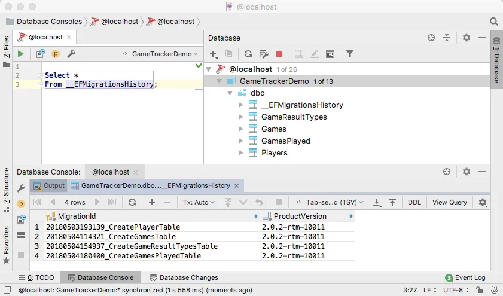
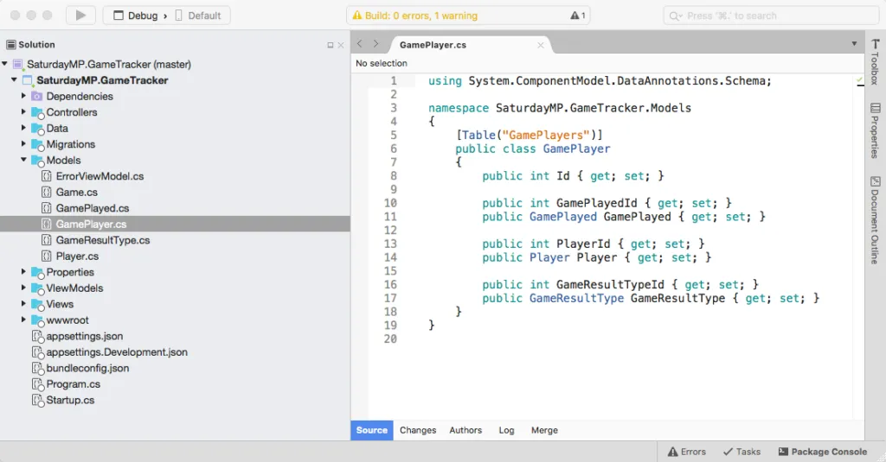
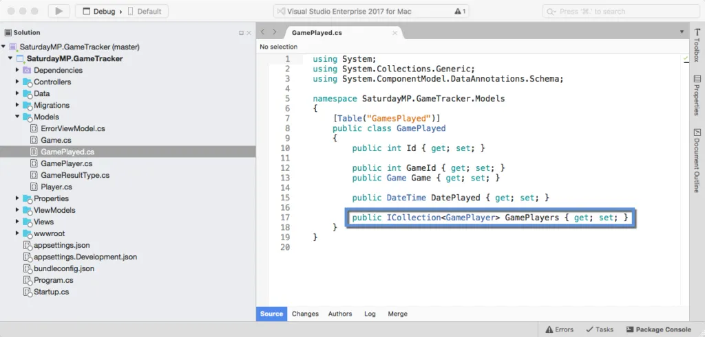
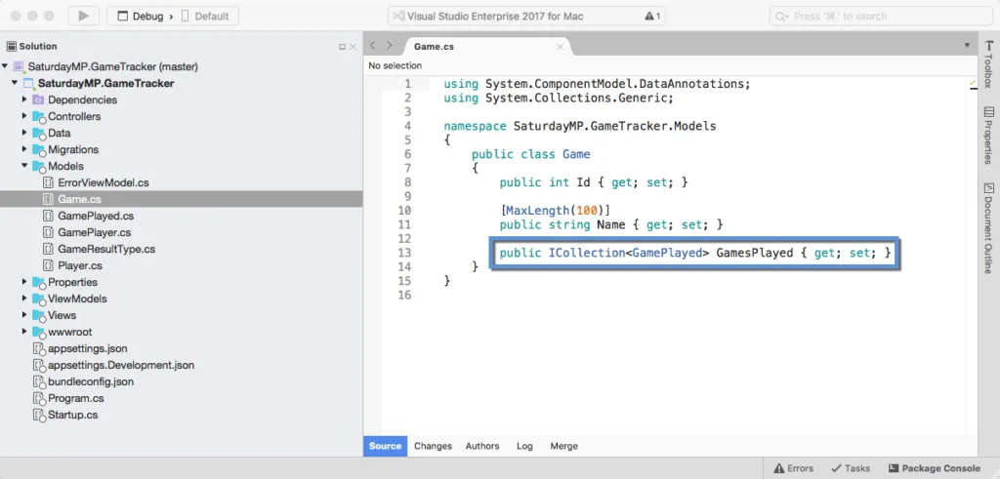
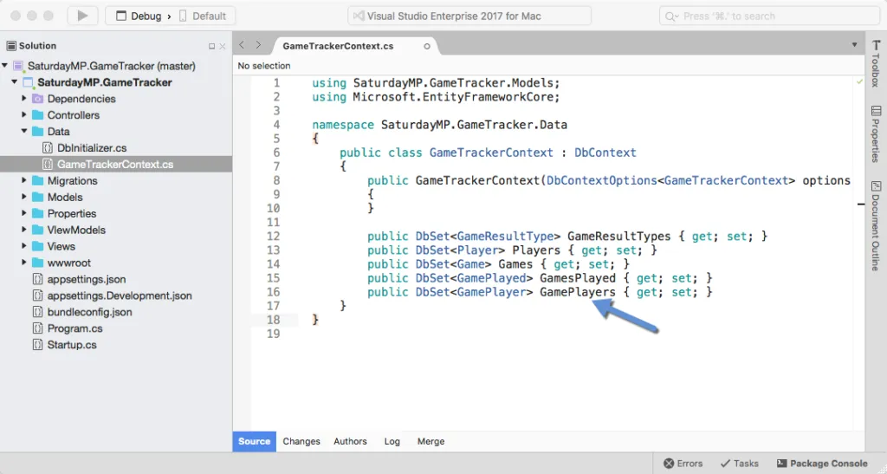
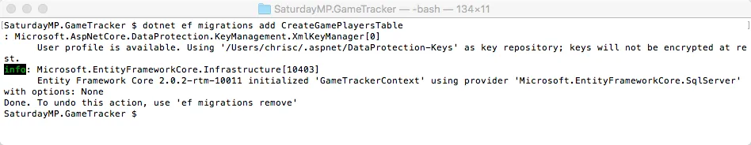
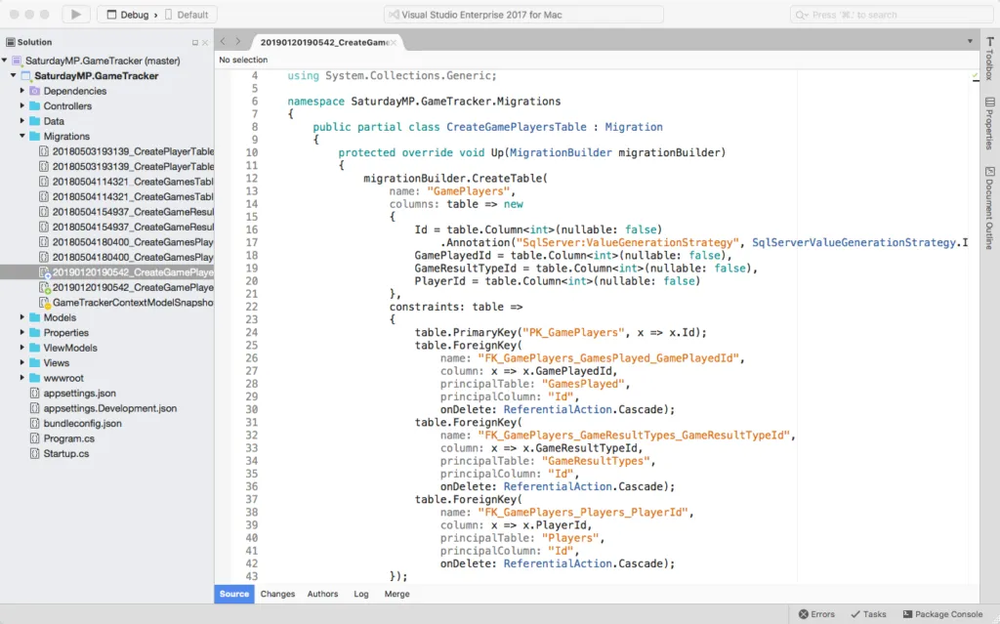
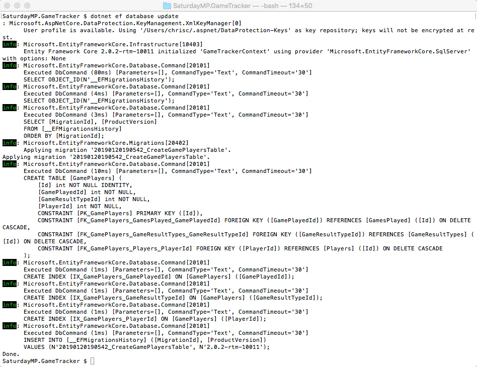
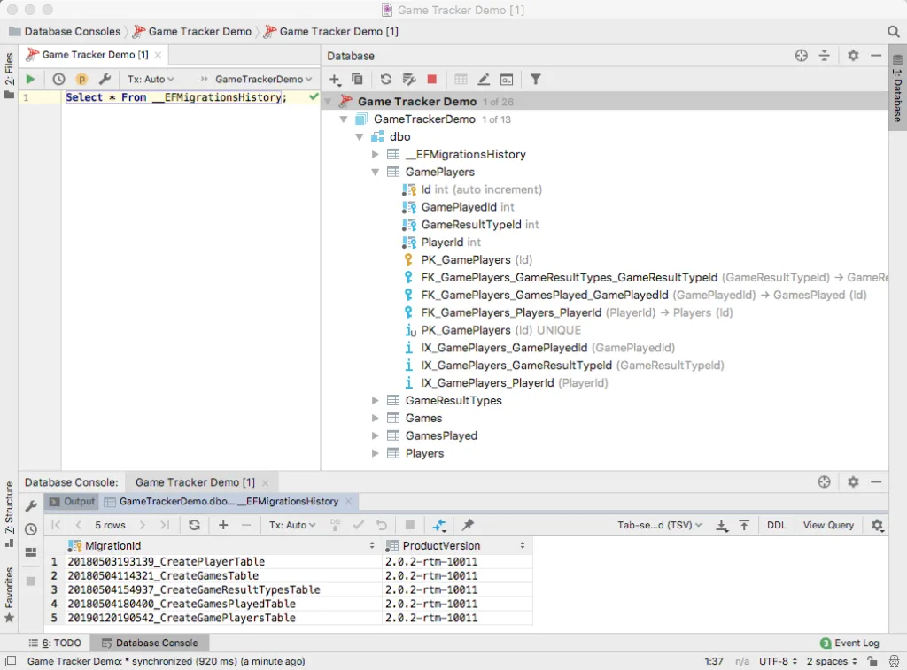

_I gave the [Introduction to ORMs for DBAs](https://github.com/saturdaymp/IntroductionToORMForDBAs) presentation at [SQL Saturday 710](http://www.sqlsaturday.com/710/eventhome.aspx) but it didn’t go as well as I would have liked (i.e. I had trouble getting my demo working).  Since the demo didn’t work live I thought I would show you what was supposed to happen during the demo.  You can find the slides I showed before the demo [here](https://github.com/saturdaymp/IntroductionToORMForDBAs/blob/master/Slides/Introduction%20to%20Object-Relational%20Mapping%20for%20DBAs.pdf)._

_The goal of this demo is create a basic website that tracks the games you and your friends play and display wins and losses on the home page.  I used a MacBook Pro for my presentation so you will see Mac screen shots.  That said the demo will also work on Windows._

_In the [previous post](https://nftb.saturdaymp.com/introduction-to-orms-for-dbas-part-6-create-games-played-table-and-crud/) we created the GamesPlayed table and CRUD methods.  The GamesPlayed table stores when a game was played but it does not store who played the game.  In this post we will create the GamePlayers table to store who played the game and, more importantly, who won._

_If you skipped the previous post but want to follow along open up [07-Create Game Players Table.](https://github.com/saturdaymp/IntroductionToORMForDBAs/tree/master/Source/07-CreateGamePlayersTable) Then run the migrations to create the Player, Games, GameResultTypes, and GamesPlayed tables in the database.  Your database similar to the below screen shot.  The migration IDs can be different but the tables should exist._



In this post we will create the last table the GamePlayers. It's the table that tracks which players where involved with a game and if they won or loss.


As usual we start with the model. The only thing different about this model is it joins three other tables so had three foreign keys. Remember to add a foreign key in Entity Framework you add the ID and the Class.

```csharp
using System.ComponentModel.DataAnnotations.Schema;

namespace SaturdayMP.GameTracker.Models
{
    [Table("GamePlayers")]
    public class GamePlayer
    {
        public int Id { get; set; }

        public int GamePlayedId { get; set; }
        public GamePlayed GamePlayed { get; set; }

        public int PlayerId { get; set; }
        public Player Player { get; set; }

        public int GameResultTypeId { get; set; }
        public GameResultType GameResultType { get; set; }
    }
}
```



You also need to add the other side the foreign key to the existing models. First the GamePlayed model:

```csharp
public ICollection<GamePlayer> GamePlayers { get; set; }
```



Then the Game model:

```csharp
public ICollection<GamePlayed> GamesPlayed { get; set; }
```



Finally the GameResultType model: ....Actually we won't add the reference relationship to the GameResultType. This is to prevent a common mistake with ORMs where we accidentally load a bunch of records.

Say we did add the GameResultType->GamePlayer then in our code called that relationship:

```csharp
myGamePlayed.GamesPlayed.Count
```

The above would load all the games played for the given type. Not a problem when your application is young and you only have a couple of games played. What happens when you have hundred or thousands of games played? Then it becomes a problem.

When we do need to filter by the game results, such as who won, we would write it from the perspective of the player. For example:

```csharp
var wins = _context.Players
  .Where(p => p.Id == 1)
  .Select(p => new
  {
    PlayerName = p.Name,
    Wins = p.GamesPlayers.Where(gp => gp.GameResultType.KeyCode == 10).Count(),
  })
  .First();
```

With that out of the way, let us get back to coding and add the new model to the context:

```csharp
public DbSet<GamePlayer> GamePlayers { get; set; }
```



Now that the models are setup we can create the migration:

```text
dotnet ef migrations add CreateGamePlayersTable
```



Check the migration file to make sure it looks reasonable:



Now that the migration exists and looks correct we can run the migration on the database. Once the migration is complete you should be view the new GamePlayers table in the database.

```text
dotnet ef database update
```





_Good work. That was our most complicated table yet. This seems like a good time to stop and take a break. In the next post we will create the Game Players CRUD methods._

_If you got stuck you can find completed Part 7 [here](https://github.com/saturdaymp/IntroductionToORMForDBAs/tree/master/Source/08-CreateGamePlayersCRUD).  If you have any questions or spot an issue in the code I would prefer if you opened a [issue](https://github.com/saturdaymp/IntroductionToORMForDBAs/issues) in GitHub but you can e-mail (chris.cumming@saturdaymp.com) me as well._
