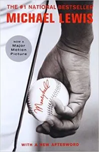

**Book:** [Moneyball: The Art Of Winning An Unfair Game](https://www.amazon.ca/Moneyball-Art-Winning-Unfair-Game/dp/0393324818/ref=sr_1_1?ie=UTF8&qid=1547467657&sr=8-1&keywords=moneyball)  
**Author:** Michael Lewis  

Both the [movie](https://www.youtube.com/watch?v=RAG74hfW4pM) and book are great and truth be told I watched the movie well before reading the book. In both cases they do a great job of showing how statics can find undervalued baseball players. Lots of time spent focusing on what stats actually win baseball games such as the famous "[he gets on base](https://www.youtube.com/watch?v=DtumWOsgFXc)" quote.

However, that was not my takeaway from reading this book. I already know I should take actions that, statistically speaking, maximize my chances of a positive outcome. The problem is that is easier said then done. Statics only work if you are consistent over time and emotions are not consistent.

So my takeaway from Moneyball is more a reminder. Don't let emotions derail my long term plans. Stick with actions that, statically speaking, that are likely to lead to positive outcomes and minimize negative outcomes. Don't let one negative outcome derail my long term plan. Play the long game.
