_A working example can be found [here](https://github.com/saturdaymp-examples/create-react-rails-app-example) in the [Saturday MP Examples](https://github.com/saturdaymp-examples) GitHub._

First thing you need to do is create a basic Rails app as outlined in my [previous](https://nftb.saturdaymp.com/today-i-learned-how-to-generate-a-erd-for-rails-application/) post.  My setup is the same as creating Rails app: Ubuntu 18.04 LTS host using Docker to containerize my development environment.

Once your basic Rails app is up and running you can add React.  This example uses [React-Rails](https://github.com/reactjs/react-rails).  First, you need to update the Docker file to install Node JS and Yarn.  Open up the DockerFile and change it so it looks like the below.

```text
FROM ruby:2.5.3

# To install a later version of Node JS and Yarn.
RUN curl -sL https://deb.nodesource.com/setup_10.x | bash -
RUN curl -sS https://dl.yarnpkg.com/debian/pubkey.gpg | apt-key add -
RUN echo "deb https://dl.yarnpkg.com/debian/ stable main" | tee /etc/apt/sources.list.d/yarn.list

# Install the needed software.
RUN apt-get update -qq && apt-get install -y build-essential libpq-dev nodejs yarn

# Create the website folder and map the Gemfiles.
RUN mkdir /website
WORKDIR /website
COPY Gemfile /website/Gemfile
COPY Gemfile.lock /website/Gemfile.lock

# Update the bundler then install the gems.
RUN gem install bundler
RUN bundle install

# Copy our files to the website.
COPY . /website
```

[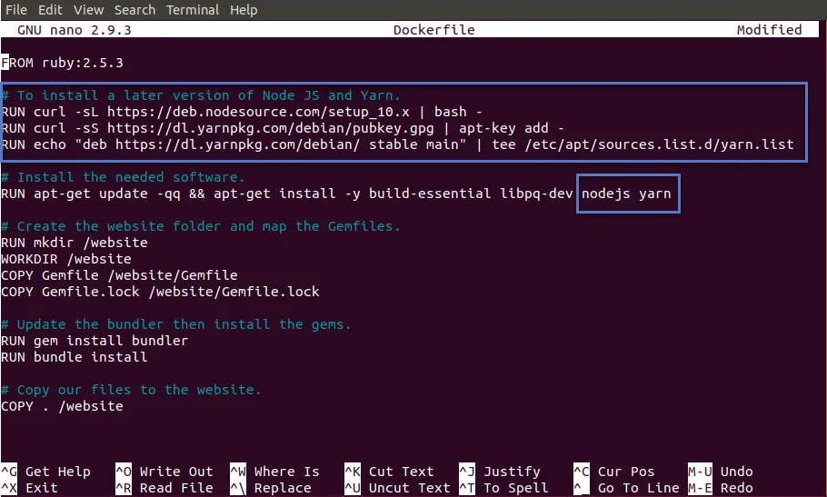](https://nftb.saturdaymp.com/wp-content/uploads/2018/12/Updates-to-Docker-File.png)

Actually only the top of the file is changed, the bottom is the same just with better layout and comments.  The top we add a reference to the Node and Yarn repositories then added nodejs and yarn to the install list.

Next add the required Gems: [webpacker](https://github.com/rails/webpacker) and react-rails:

```text
# React
gem 'webpacker'
gem 'react-rails'
```

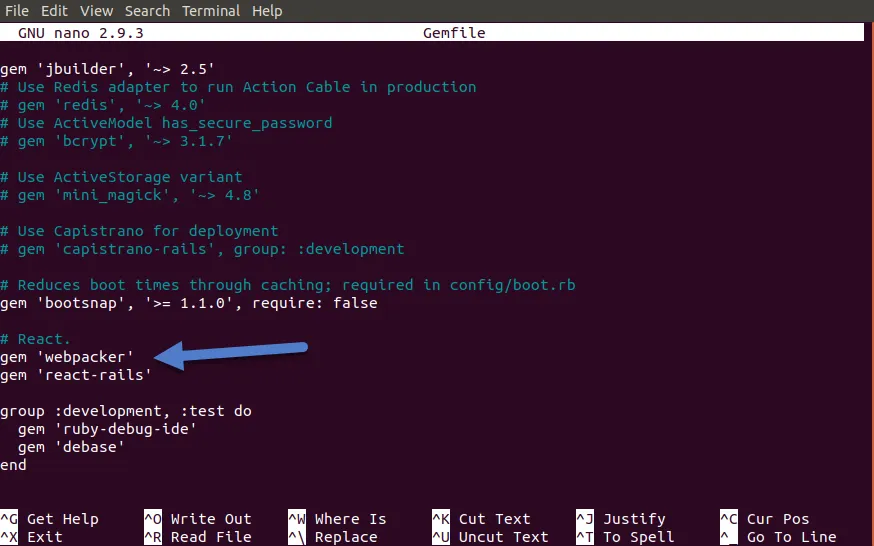

Now that the Docker and Gemfile is updated we can rebuild the container:

```text
docker-compose build web
```

[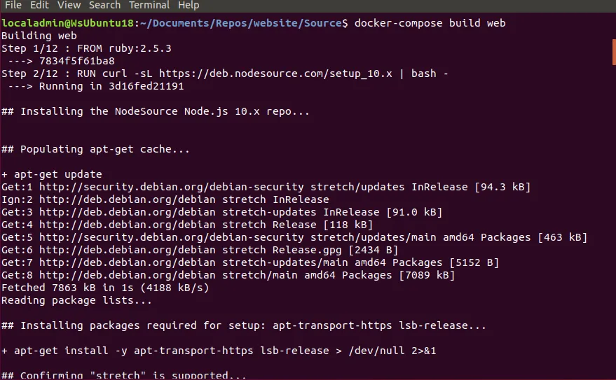](https://nftb.saturdaymp.com/wp-content/uploads/2018/12/Rebuilding-Docker-container-with-Node-and-Yarn.png)

A couple final steps.  Run the newly build container and run the following commands:

```text
docker-compose run web bash

rails webpacker:install
rails webpacker:install:react
rails g react:install
```

[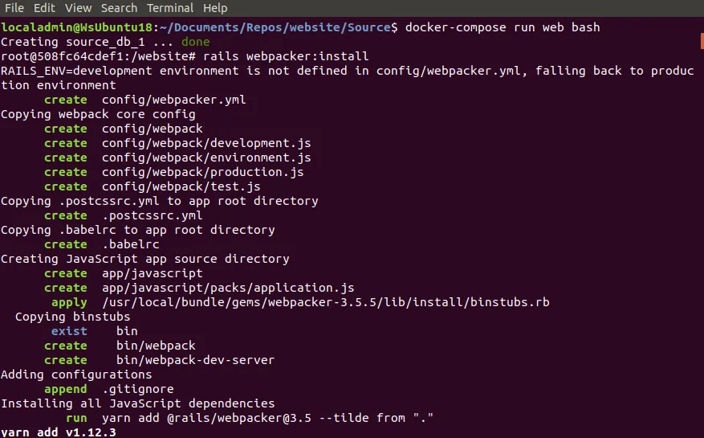](https://nftb.saturdaymp.com/wp-content/uploads/2018/12/Installing-webpacker.png)

[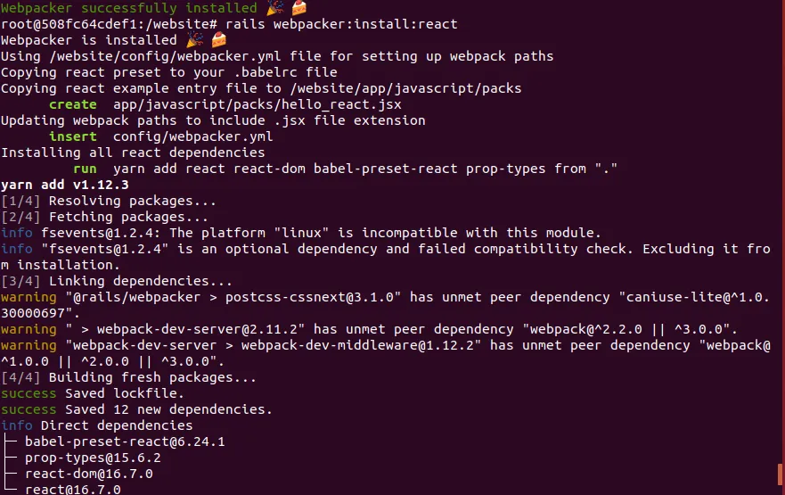](https://nftb.saturdaymp.com/wp-content/uploads/2018/12/Installing-webpacker-react.png)

[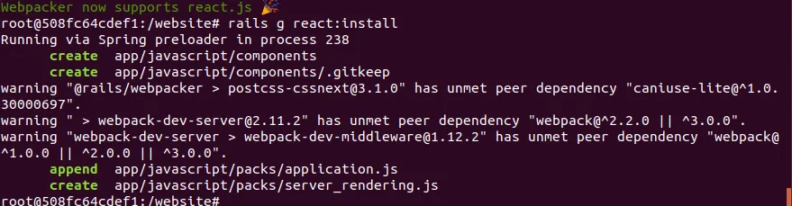](https://nftb.saturdaymp.com/wp-content/uploads/2018/12/Generating-React.png)

The Rails app should be React ready.  To smoke test we need a view and controller.  If you already have a page in your app you can skip this step.

Generate the home controller by executing the following:

```text
rails g controller Home index
```

[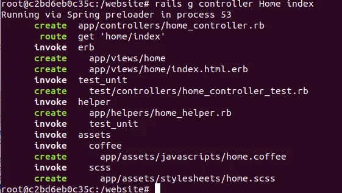](https://nftb.saturdaymp.com/wp-content/uploads/2018/12/Generate-home-page..png)

Then generate a basic React component:

```text
rails g react:component HelloWorld greeting:string
```

[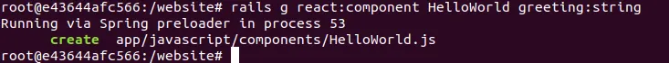](https://nftb.saturdaymp.com/wp-content/uploads/2018/12/Generate-React-Hellow-World-component.png)

Then add the following line to the application layout file:

```html
<%= javascript_pack_tag 'application' %>
```

[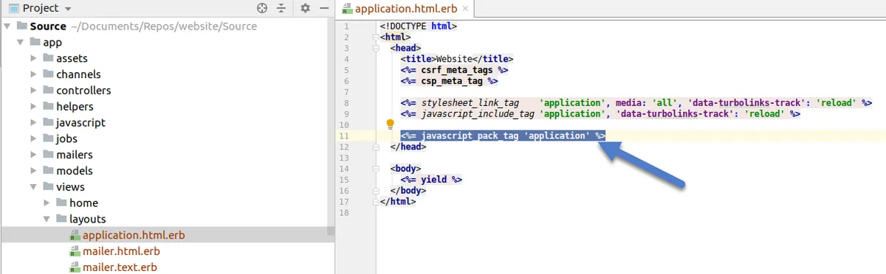](https://nftb.saturdaymp.com/wp-content/uploads/2018/12/Add-React-to-Layout.png)

Finally add the following line to the home view:

```html
<%= react_component("HelloWorld", { greeting: "Hello from react-rails." }) %>
```

[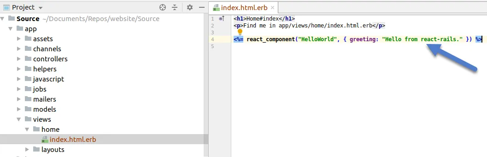](https://nftb.saturdaymp.com/wp-content/uploads/2018/12/Add-React-component-to-home-page.png)

Now run the add and navigate to the http://localhost:3000/home/index and you should see the React message:

[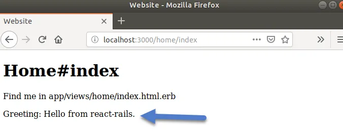](https://nftb.saturdaymp.com/wp-content/uploads/2018/12/Greetings-from-React-message.png)

In [memory](https://twitter.com/WalkOffTheEarth/status/1079528087333814273?s=20) of [Walk of the Earth's](https://www.walkofftheearth.com/) [Beard Guy](https://www.youtube.com/watch?v=NeYMQaL7pUw) I present one my favourite songs Walk of the Earth songs:

_You gotta hold on to what you got, babe  
It ain't always greener on the other side, you know  
We ain't rich but we're worth a lot, babe  
I wanna see the world with your hand in mine, you know_


