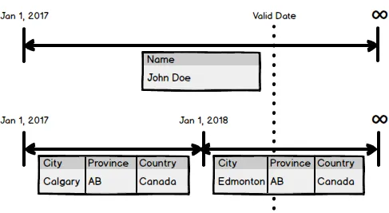

Thank you to everyone who attended my [SQL Saturday 840](https://www.sqlsaturday.com/840/eventhome.aspx) "[Create a Time Travelling Database](https://www.sqlsaturday.com/840/Sessions/Details.aspx?sid=90086)" presentation. I enjoyed your questions and the discussion after the presentation.

If you have any further questions feel free to reach out to me at chris.cumming@saturdaymp.com or [@saturdaymp](https://twitter.com/saturdaymp). I can also be found on the [DevEdmonton](https://devedmonton.com/) and [Legacy Code Rocks](https://www.legacycode.rocks/) Slack channels.

More resources about temporal databases:

- Slides, outline, and examples from the [presentation](https://github.com/saturdaymp-examples/create-a-time-travelling-database).
- [Lighting version](https://github.com/saturdaymp-examples/a-brief-history-of-the-creation-of-a-time-traveling-database) of the SQL Saturday 840 presentation.
- [Work in Progress](https://nftb.saturdaymp.com/temporal-database-design/) writing about temporal databases.
- Book that inspired me: [Developing Time-Oriented Database Applications in SQL](https://www2.cs.arizona.edu/~rts/tdbbook.pdf)
- MS SQL Server [Temporal Tables](https://docs.microsoft.com/en-us/sql/relational-databases/tables/temporal-tables?view=sql-server-2017).

P.S. - It was toss up between the below song and Rocky Horror Picture Show [Time Warp](https://www.youtube.com/watch?v=umj0gu5nEGs). Guess I'm in a melancholy mood on this snowy day. Yes it is [snowing](http://climate.weather.gc.ca/climate_data/daily_data_e.html?StationID=27214) on April 30th in Edmonton.

_But there never seems to be enough time  
To do the things you want to do, once you find them  
I've looked around enough to know  
That you're the one I want to go through time with_


