_I gave the [Introduction to ORMs for DBAs](https://github.com/saturdaymp/IntroductionToORMForDBAs) presentation at [SQL Saturday 710](http://www.sqlsaturday.com/710/eventhome.aspx) but it didn’t go as well as I would have liked (i.e. I had trouble getting my demo working).  Since the demo didn’t work live I thought I would show you what was supposed to happen during the demo.  You can find the slides I showed before the demo [here](https://github.com/saturdaymp/IntroductionToORMForDBAs/blob/master/Slides/Introduction%20to%20Object-Relational%20Mapping%20for%20DBAs.pdf)._

_The goal of this demo is create a basic website that tracks the games you and your friends play and display wins and losses on the home page.  I used a MacBook Pro for my presentation so you will see Mac screen shots.  That said the demo will also work on Windows._

_In the [previous post](https://nftb.saturdaymp.com/introduction-to-orms-for-dbas-part-7-create-gameplayers-table/) we created the GamePlayers table.  The GamePlayers table stores who played a game and if they won or lost.  In this post we will start creating the CRUD method pages for the GamePlayers table._

_If you skipped the previous post but want to follow along open up [08-](https://github.com/saturdaymp/IntroductionToORMForDBAs/tree/master/Source/08-CreateGamePlayersCRUD)_[Create Game Players CRUD](https://github.com/saturdaymp/IntroductionToORMForDBAs/tree/master/Source/08-CreateGamePlayersCRUD)_[.](https://github.com/saturdaymp/IntroductionToORMForDBAs/tree/master/Source/07-CreateGamePlayersTable) Then run the migrations to create the Player, Games, GameResultTypes, GamesPlayed, and GamePlayers tables in the database.  Your database should be similar to the below screen shot.  The migration IDs can be different but the tables should exist._

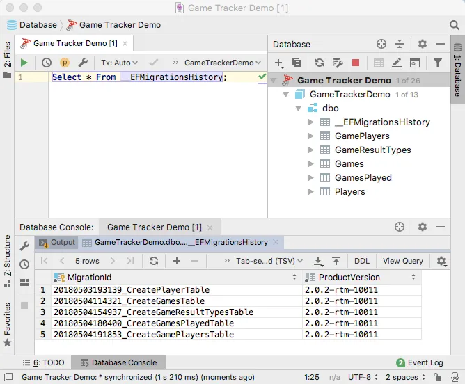

Previously when adding CRUD methods we used commands to create scaffolding for index, create, view, edit, and delete pages. This makes sense when you have a simple model, such as players or games and don't require a fancy interface. For games a player has won or lost it would be nice to have a fancier interface. Actually, it would be nice if you could edit the players that took part in a game in the Games Played page. Some like:

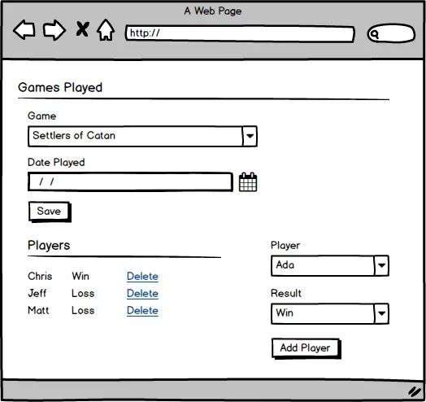

We can't use scaffolding to build this interface, we have to do it the old fashioned way. We will keep our workflow simple. When a user choose the create a new Game Played we take them to the Game Played Create page where they can enter the game and date it was played.

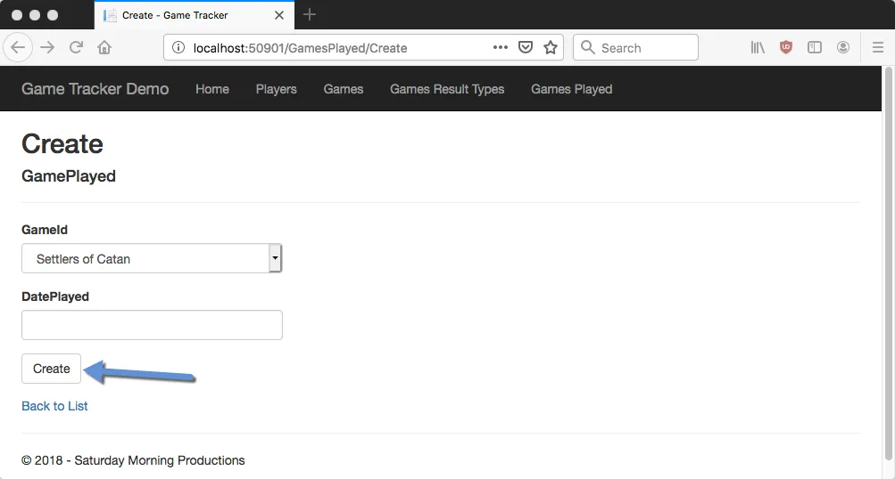

When the user clicks the Create Button instead of redirecting them to the Games Played Create Page we will direct them to the Gamed Played Edit page where they can add players to the game and who won or lost. To do this we need to open up the GamesPlayedController and find the Post Create method which looks like the below.

```csharp
[HttpPost]
[ValidateAntiForgeryToken]
public async Task<IActionResult> Create([Bind("Id,GameId,DatePlayed")] GamePlayed gamePlayed)
{
    if (ModelState.IsValid)
    {
        _context.Add(gamePlayed);
        await _context.SaveChangesAsync();
        return RedirectToAction(nameof(Index));
    }
    ViewData["GameId"] = new SelectList(_context.Games, "Id", "Name", gamePlayed.GameId);
    return View(gamePlayed);
}
```

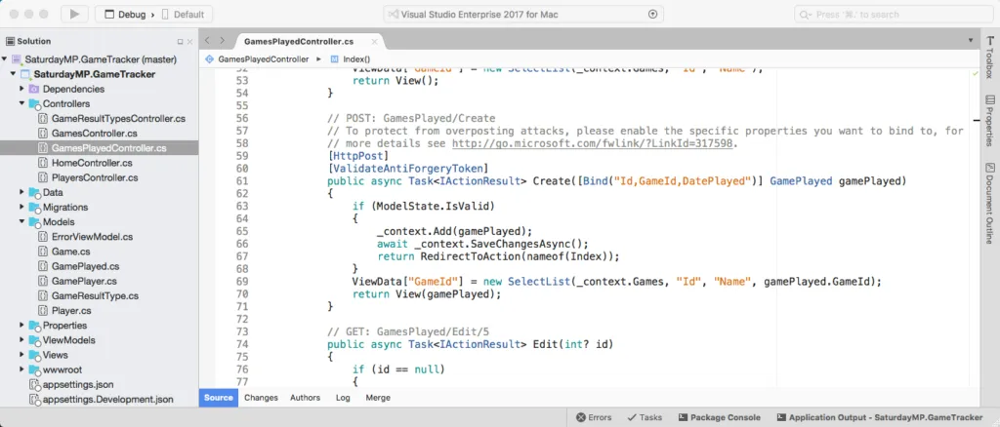

Update the redirect so it goes to the Edit page instead of the Index. Instead of:

```csharp
return RedirectToAction(nameof(Index));
```

Change it too:

```csharp
return RedirectToAction(nameof(Edit), new {id = gamePlayed.Id)};
```

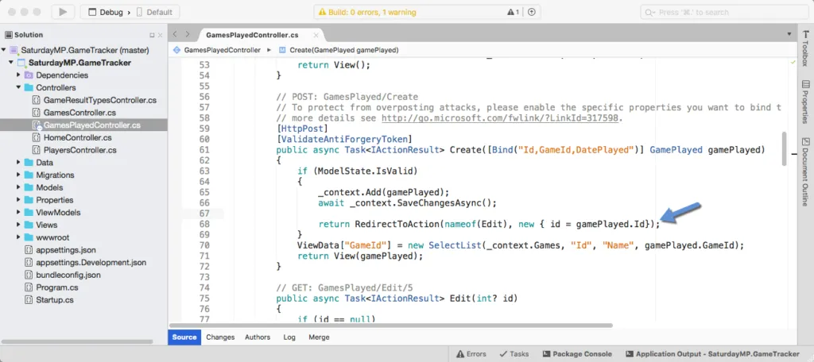

Test by running the application and clicking on the button and you should be redirected.

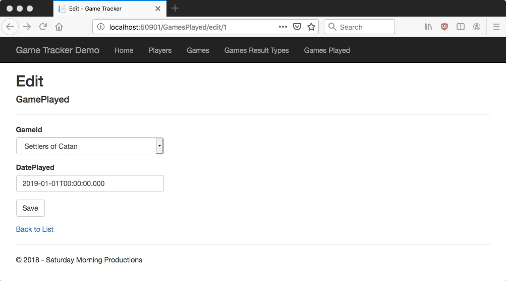

That works. The next step is let the user enter some players as outlined in our mockup at the top of this post. Let's start by adding the controls to add players to an existing game. Do this by opening the Games Played Edit page (Views/GamesPlayed/Edit.cshtml) and adding the following:

\[csharp\]

Player

Results

\[/csharp\]

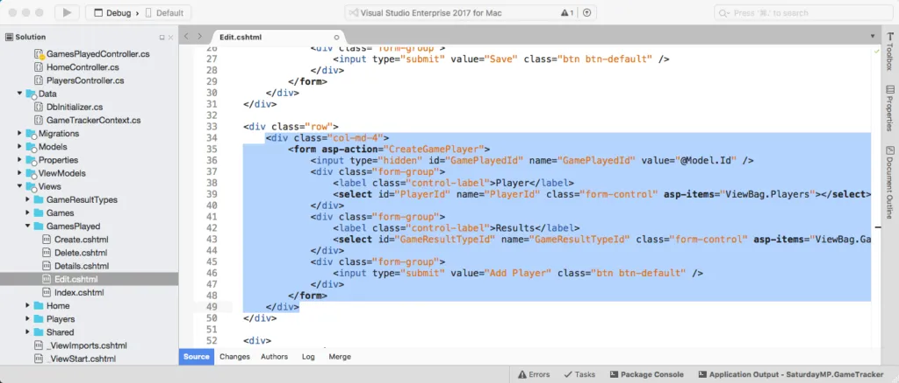

If you run the application now you will see the controls but no data in the drop-down lists. Also the player controls will be on the left when we want the on the right. That will be fixed later.

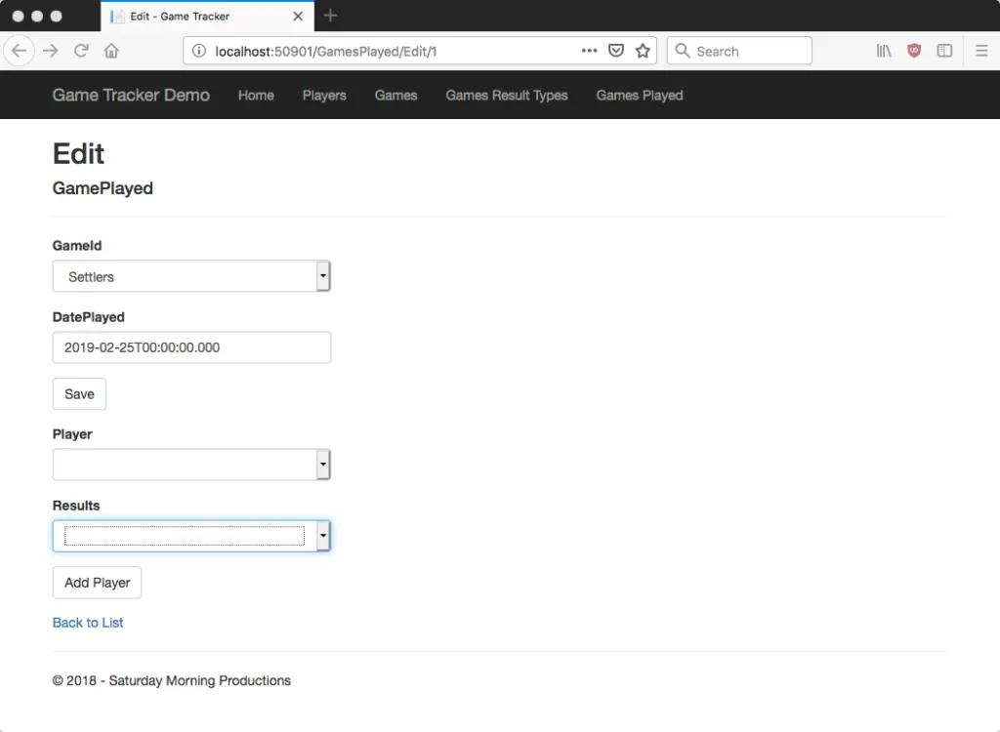

Lets get some data in the drop-downs. If you look at the code in the Games Played Edit there are placeholders for the drop-down data in the ViewBag called `ViewBag.Players` and `ViewBag.GameResults`. To get data into the ViewBags open up the GamesPlayedController and find the Get Edit method.

Notice we already load data for the Game drop-down? It's this line:

\[csharp\] ViewData\["GameId"\] = new SelectList(\_context.Games, "Id", "Name", gamePlayed.GameId); \[/csharp\]

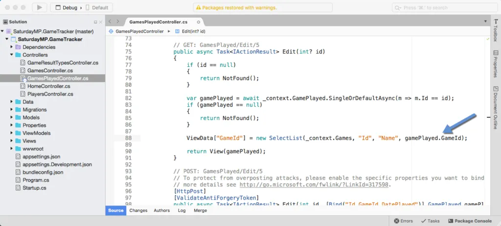

Let's add a couple more lines to load the data for the Player and Results drop-downs. If we where writing SQL statements the queries would be simple. Get all the players and all the game result types (i.e. win, lose, etc).

\[sql\] Select \* From Players; Select \* From GameResultTypes; \[/sql\]

Since we are using Entity Framework ORM we write a query to get all records from a table as:

\[csharp\]\_context.Players\[/csharp\]

We combine the ORM lookup with a helper method to populate the drop-down and we get:

\[csharp\] ViewData\["Players"\] = new SelectList(\_context.Players, "Id", "Name"); ViewData\["GameResults"\] = new SelectList(\_context.GameResultTypes, "Id", "Type"); \[/csharp\]

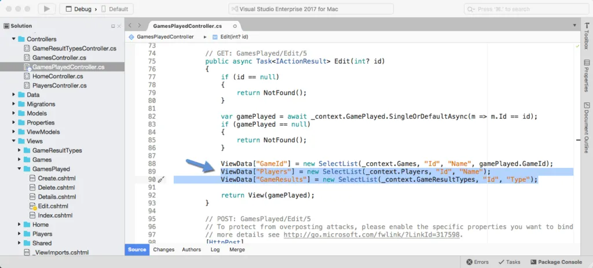

Now when you run the app the drop-downs should be populated.

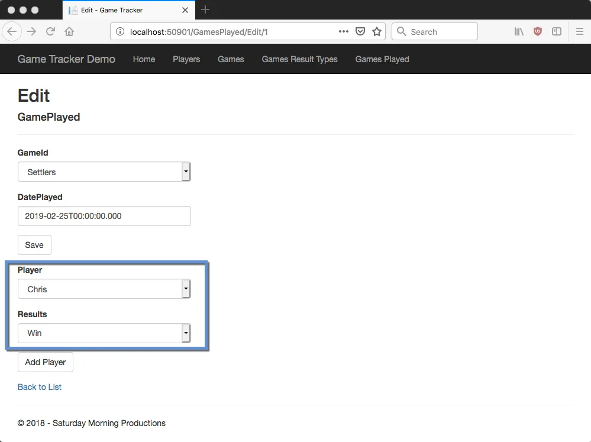

The Add Player button still does nothing so lets fix that. Notice the in code we added to Games Played Edit view there is a form tag. In the form tag is the action that will executed when the Add Player button is clicked. In this case the CreateGamePlayer method will be called on the GamesPlayedController. The button does nothing because that method does not exist yet so lets create it.

\[csharp\] \[HttpPost\] public async Task CreateGamePlayer(\[Bind("GamePlayedId,PlayerId,GameResultTypeId")\] GamePlayer gamePlayer) { \_context.Add(gamePlayer); await \_context.SaveChangesAsync();

return RedirectToAction(nameof(Edit), new { id = gamePlayer.GamePlayedId}); } \[/csharp\]

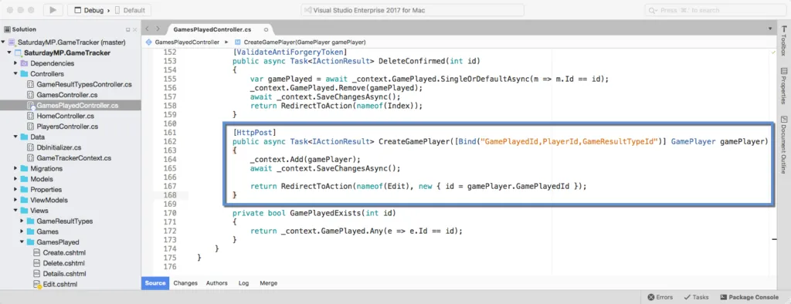

The `Bind("GamePlayedId,PlayerId,GameResultTypeId")`populates the gamePlayer argument with only the listed arguments. That prevents malicious users from submitting parameters we might not want, such as the ID field.

The first two lines of the method insert the new GamePlayer record. The first statement queues new GamePlayer record to inserted.

\[csharp\]\_context.Add(gamePlayer);\[/csharp\]

The second line saves all the changes contained in the context. In this case it's just the new GamePlayer record.

\[csharp\]await \_context.SaveChangesAsync();\[/csharp\]

The final line redirects us back to the Games Played Edit page.

\[csharp\] return RedirectToAction(nameof(Edit), new { id = gamePlayer.GamePlayedId });\[csharp\]

Try it out and make sure new results are added to the database. Since we currently don't show adding new game players on the page we need to check the database.

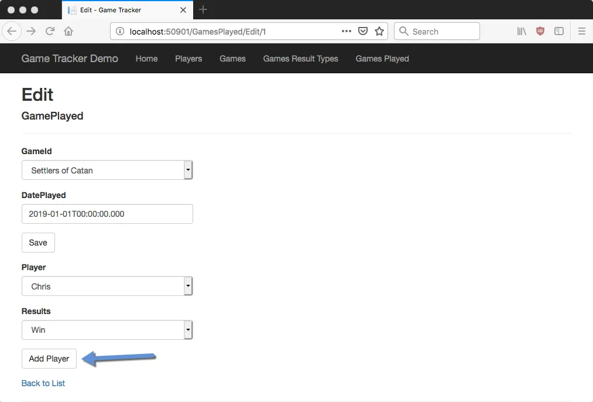

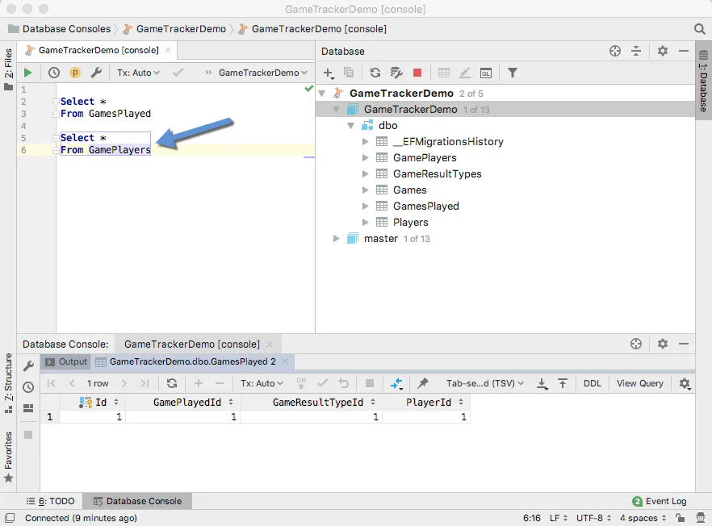

_This post is getting long and this seems like a good place to stop. In the next post we will finishing creating the user interface and CRUD methods._

_If you got stuck you can find completed Part 8 [here](https://github.com/saturdaymp/IntroductionToORMForDBAs/tree/master/Source/09-CreateHomgPageGrid).  If you have any questions or spot an issue in the code I would prefer if you opened a [issue](https://github.com/saturdaymp/IntroductionToORMForDBAs/issues) in GitHub but you can e-mail (chris.cumming@saturdaymp.com) me as well._
