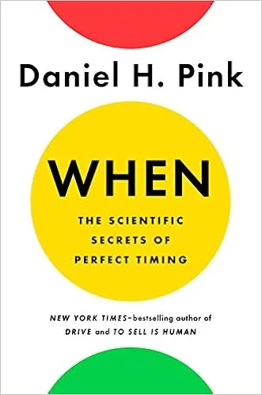

**Book:** [When: The Scientific Secrets of Perfect Timing](https://www.danpink.com/books/when/)  
**Author:** [Daniel H. Pink](https://www.danpink.com/)

Any book that promotes napping is a win for me. These days it's easy for me to catch a couple ZZZs as I work from home. When I was an employee or working at a clients site I would sometimes have an "errand" to run in the afternoon. An "errand" that involved driving to secluded place, tilting the seat back, and inspecting the inside of my eyelids for 20 minutes.

Aside from taking more naps my main takeaway from this book is to force start, middle, and ends. At least the good parts of starting, ending, and reaching the half-way points. You know, the old advice about breaking up a long project or task into smaller bits. Not something I didn't already know but still good to be reminded of.

When also brought up the importance of the middle. Not just middle life but also the middle of a project or a task. Acknowledging the middle could be useful when you are stuck but it does not make sense to force and end/start. According to When most of the work on task gets done after the halfway mark and this holds true for short or long tasks.

Finally the last thing from When I'll try to incorporate into my life is starting something important on good start days. Days like the start of the month, start of the week, after a holiday, anniversary of a life event, etc.
