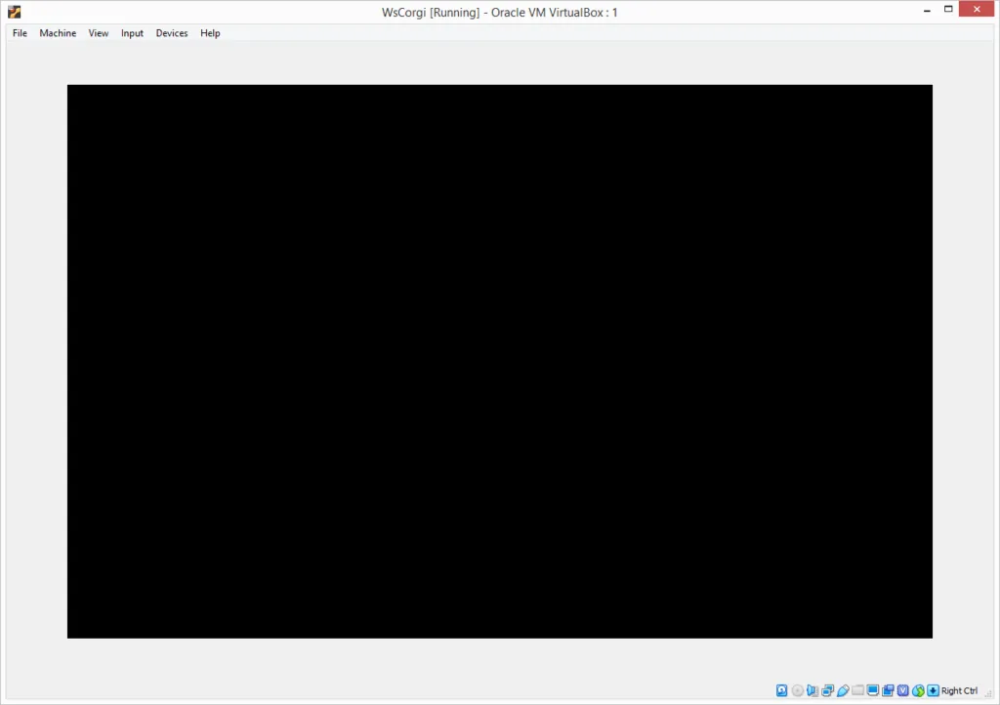
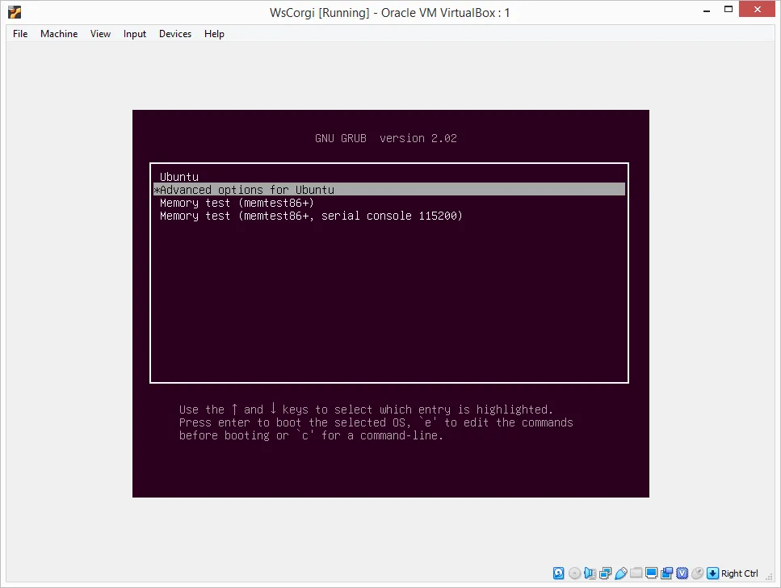
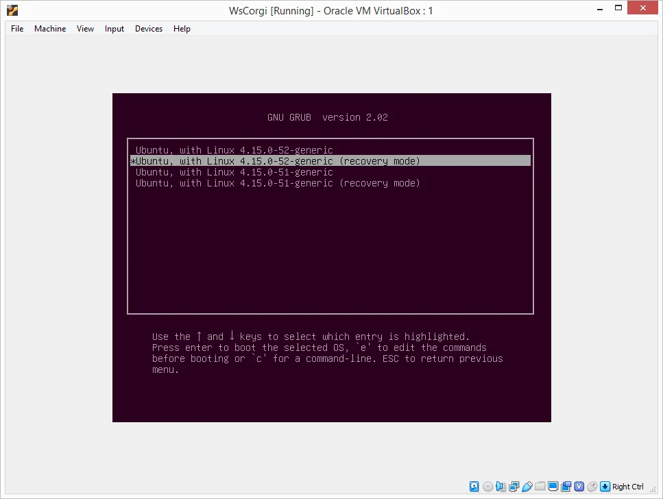
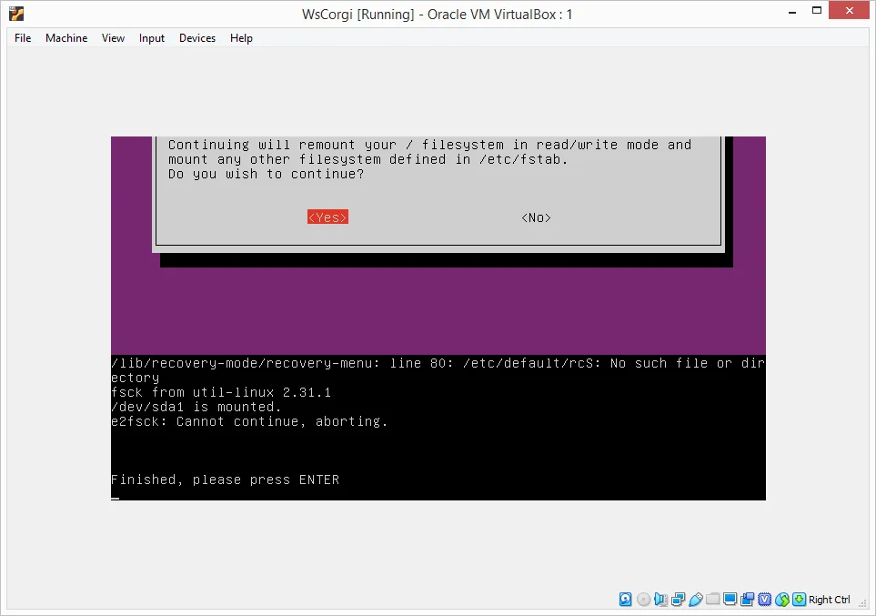
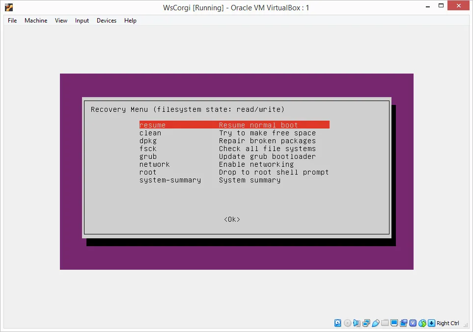
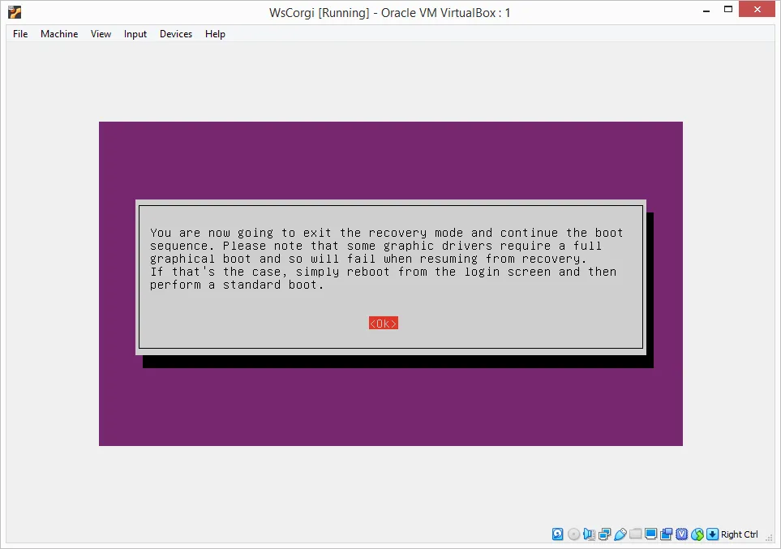
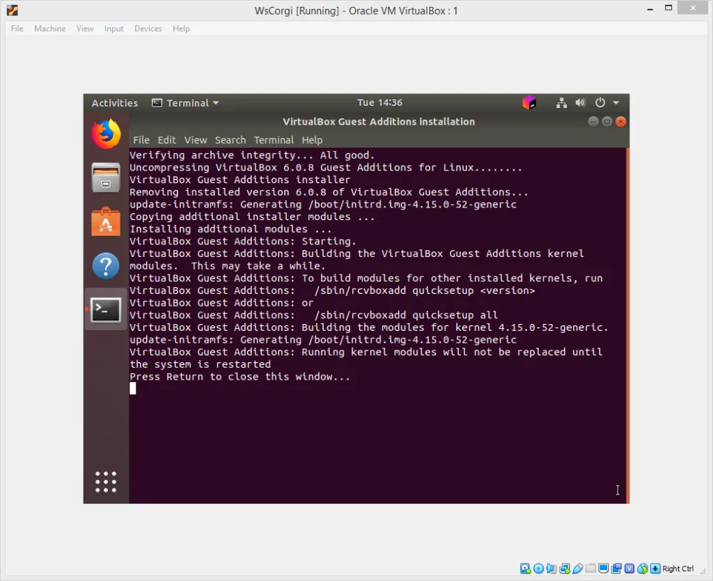
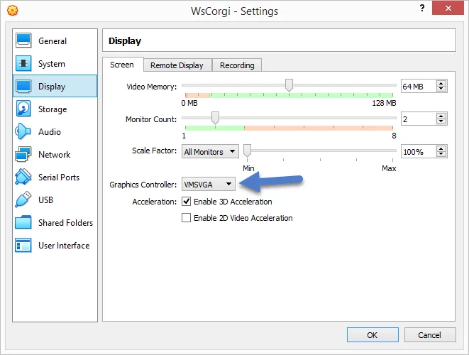
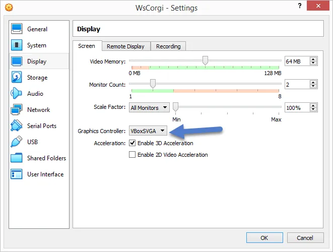
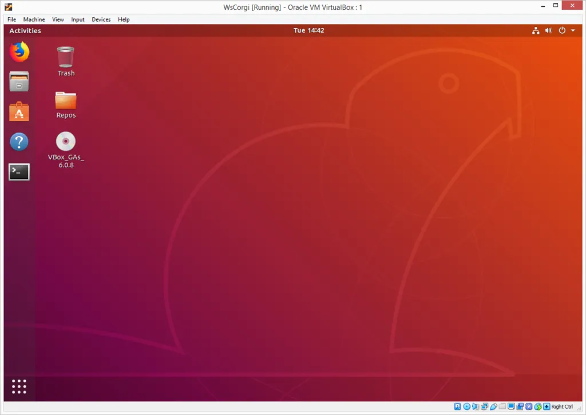

Some notes so I remember how to fix this problem if it happens again and I don't waste a bunch of time figuring it out right before a customer production release. Not a great start to my day.

This issue happened to me many moons ago when I first upgraded to VirtualBox 6 and Ubuntu 18. This is the second time so I better write down what I did so I hopefully remember if it happens a third time.

The problem is my Ubuntu VM boots but freezes before getting to the login screen. It will either stay purple but sometimes goes black.

The problem occurred after upgraded the Ubuntu 18.04 guest to kernel 4.15.0-52. I also installed updates on my Windows 8.1 host (I know, I need to upgrade to Windows 10, it's on the list) but I don't think that had anything to do with the problem. No recent updates to VirtualBox.

The first step in trying to fix this problem is to boot in safe mode. If you don't know to boot into [safe mode](https://askubuntu.com/questions/172319/how-can-i-start-ubuntu-in-safe-mode) in Ubuntu hold down the `left-shift` key.

You won't be able to run any of the diagnostics because VirtualBox can't remount the file systems as read only.

Just choose resume to continue booting in safe mode which will hopefully show the login screen but with the VirtualBox Guest Additions graphic drivers disabled. This means you will get a 800 x 600 screen that can't be resized.

Now try to re-install the VirtualBox Guest Additions.

Shut down and restart the VM and see what happens. If it boots then you are good to go. If it does not boot, which it didn't for me, you can change the VirtualBox graphics controller. Do this by opening up the settings for your VM and select Display.

Most likely your graphics controller will be VMSVGA if you are running a newer version of Linux. Change it to VBoxSVGA and reboot. If it's already at VBoxSVGA try VMSVGA instead. You can read about the differences between the settings [here](https://superuser.com/questions/1403123/what-are-differences-between-vboxvga-vmsvga-and-vboxsvga-in-virtualbox).

Start up the VM and hopefully it won't hang.

I'm assuming this graphics driver problem will be fixed by a future release of Ubuntu and/or VirtualBox but since this is the second time it's happened to me it would not surprise me if it happens again.

I currently don't notice any difference between VMSVGA and VBoxSVGA but it's only been an hour or so.

P.S. - I haven't seen [Into the Spider-verse](https://www.youtube.com/watch?v=tg52up16eq0) movie yet but my daughter has and really enjoyed it. I really like the animation style, assuming the music video uses clips from the movie.

_Then you're left in the dust, unless I stuck by ya  
You're a sunflower, I think your love would be too much  
Or you'll be left in the dust, unless I stuck by ya  
You're the sunflower, you're the sunflower_


