Recently I created a [CI build](https://nftb.saturdaymp.com/today-i-learned-how-to-setup-azure-pipelines-ci/) for the [Introduction to ORM for DBAs](https://github.com/saturdaymp/IntroductionToORMForDBAs) presentation example code. One of the reasons I picked this code base was so I could try out [Dependabot](https://dependabot.com/) for the security alerts I'm getting.

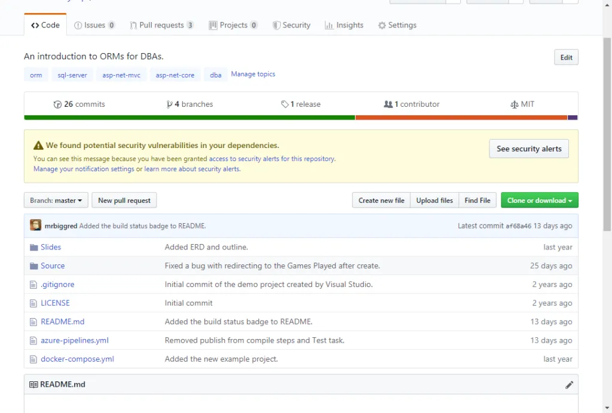

The security alert is for the ASP.NET Core NuGet package. The same issue is listed multiple times because the code is duplicated several times for the various steps in the example.

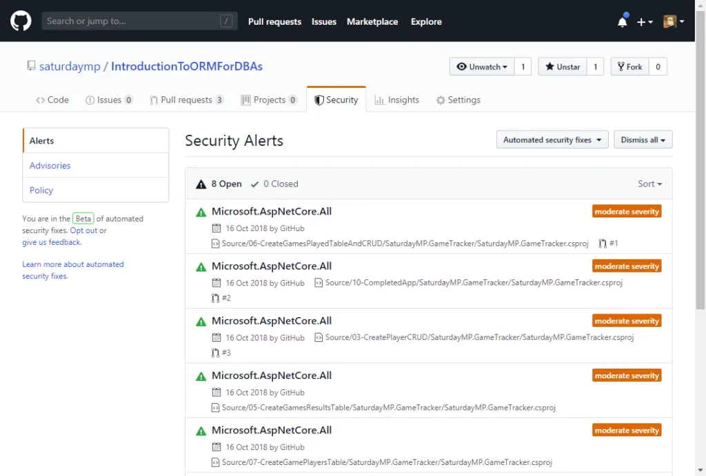

Viewing more details about the error I see it recommends upgrading the package to 2.0.9 or later.

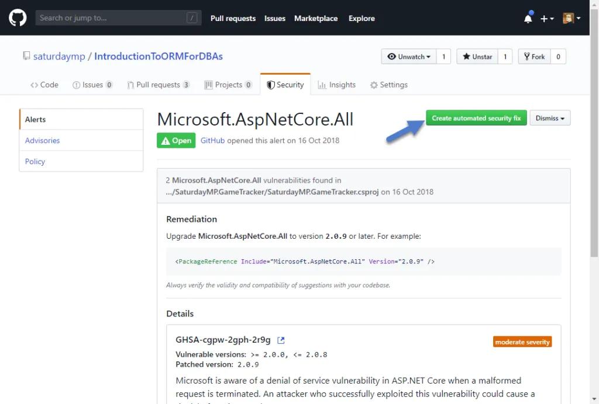

Let's try the automatic fix and see what happens.

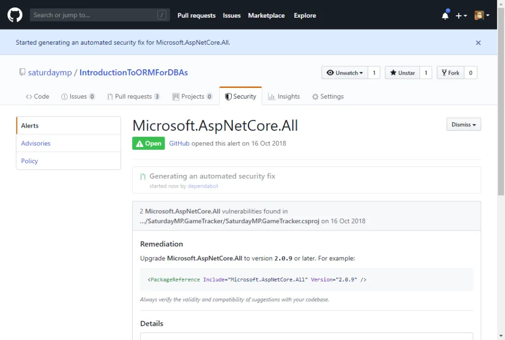

This will create a pull request and kick off an automated build in the Azure [Pipeline](https://dev.azure.com/saturdaymp/Introduction%20to%20ORM%20for%20DBAs/_build?definitionId=1) for this project.

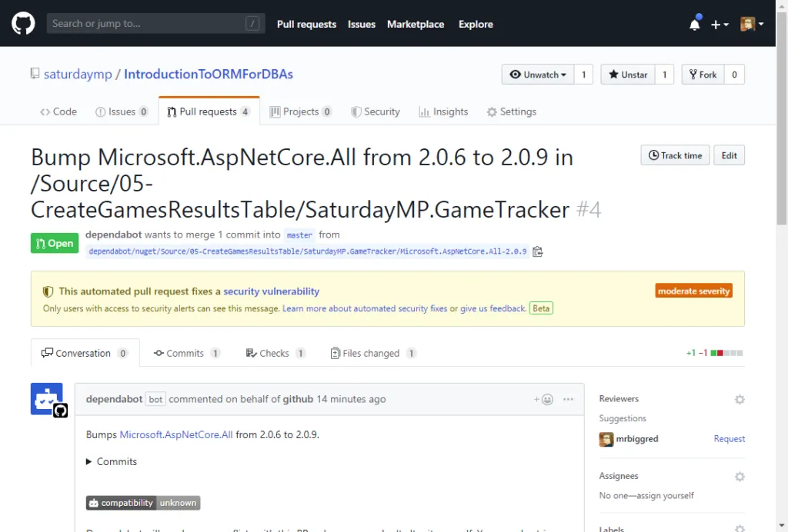

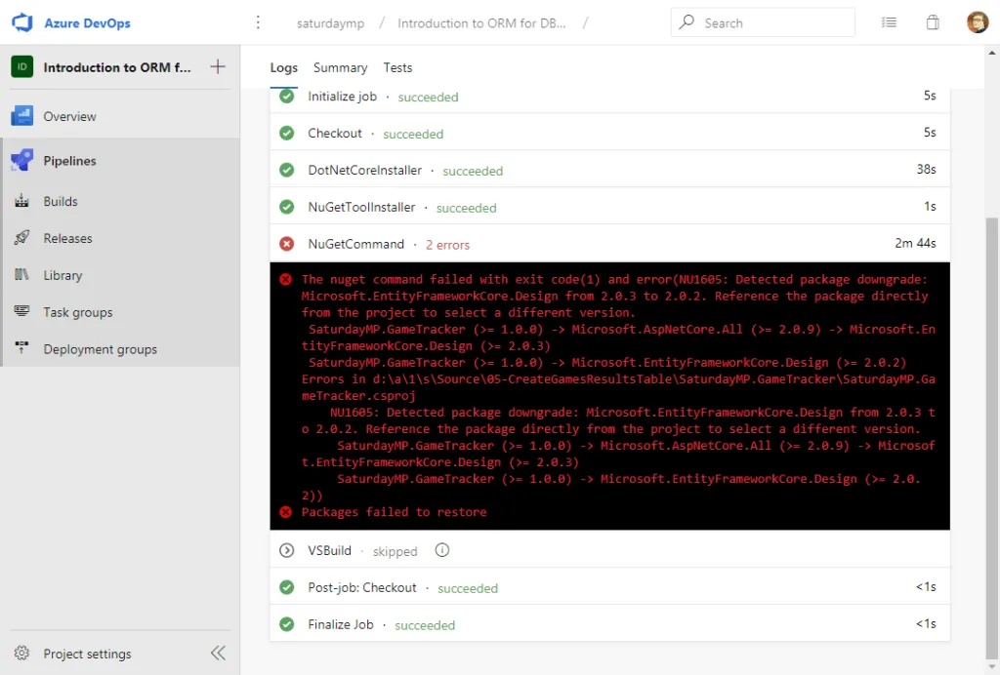

That is no good. It appears that I have a direct reference to `EntityFrameworkCore.Design` in my project. Let me go look.

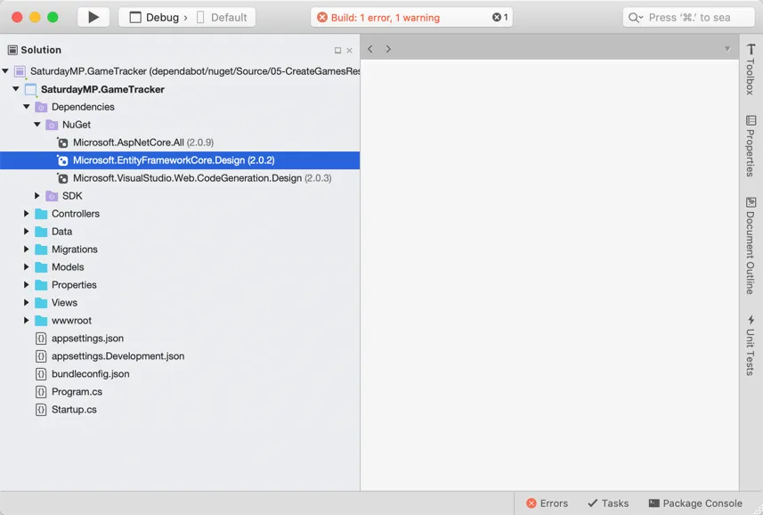

There it is. Let's update it to the latest version of 2.0.x. Now that I think about it I wonder if we can just remove it? Let's save that for a later commit.

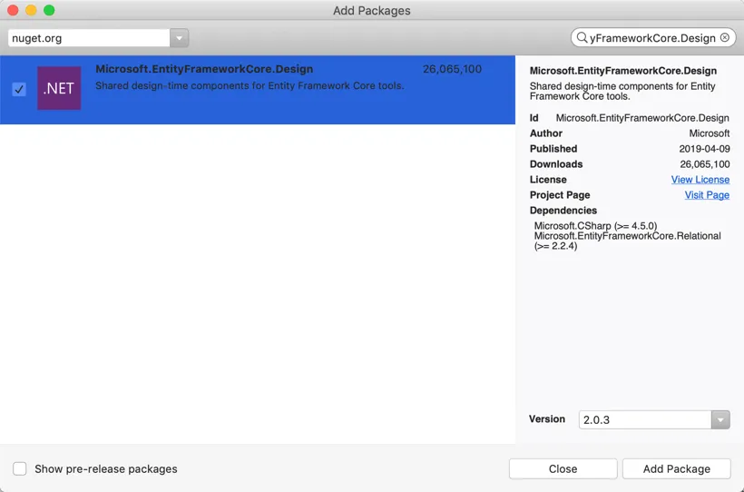

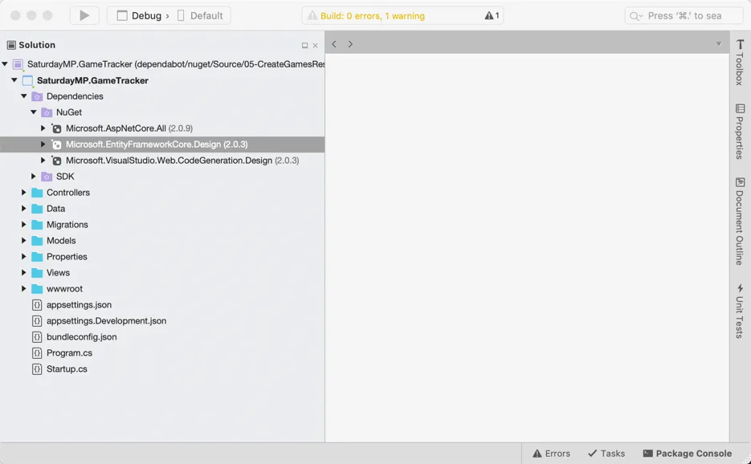

It builds and run on my local machine. Commit out changes and see what the CI build says.

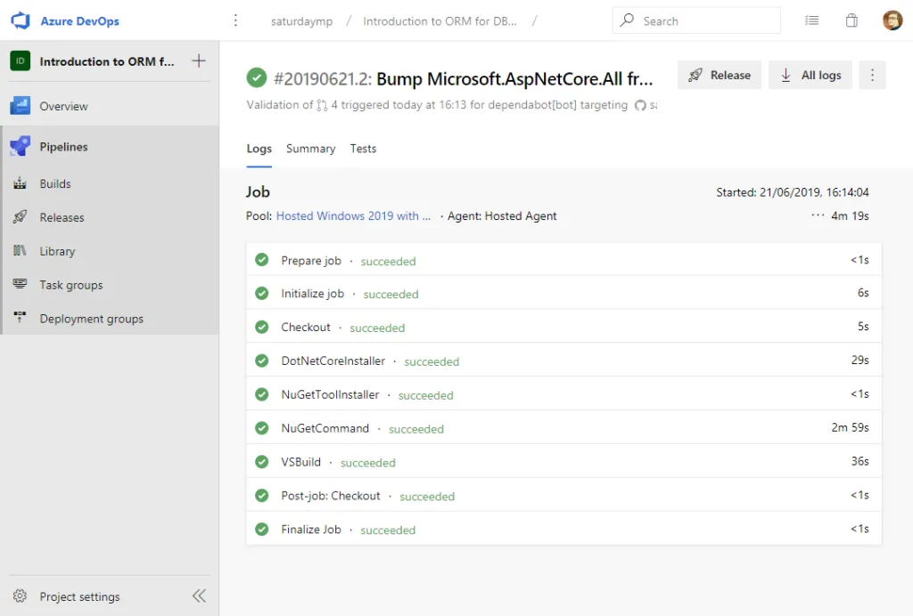

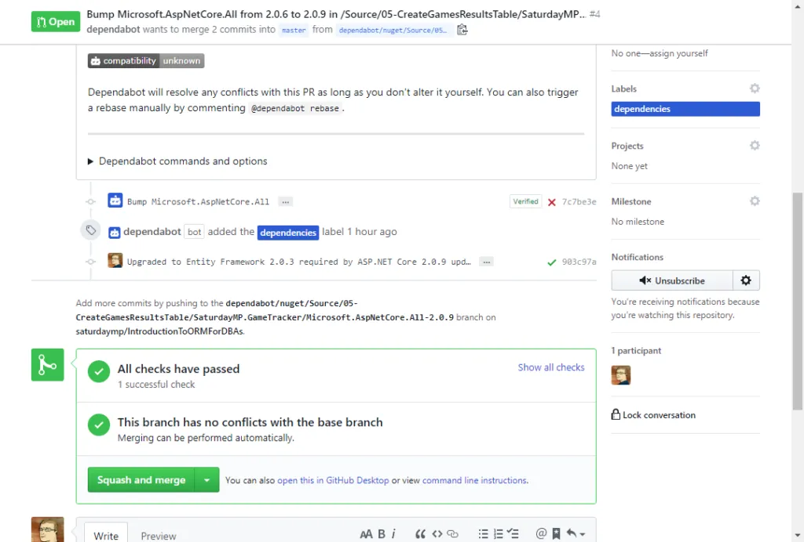

Now we can squash and merge this commit and we are all done. At least for example 1 of 10. I was really hoping Dependabot would auto-magically fix all the broken dependencies but it appears I have some manual work to do. Oh well. Maybe it will work better next time.

P.S. - Robot Rock.


