Our last EDMUG [meetup](https://www.meetup.com/Edmonton-NET-User-Group/events/261026195/) was an excellent presentation about [Azure DevOps](https://azure.microsoft.com/en-ca/services/devops/). Azure DevOps reminds me of GitLab where it is more then just continuous integration (CI). It includes issues tracking, repositories, and continuous delivery. All pretty standard stuff.

However, one thing did jump out at me. The fact it had build built in [images](https://docs.microsoft.com/en-us/azure/devops/pipelines/agents/hosted?view=azure-devops) you could use to run the build on. Build images with Visual Studio pre-installed. They also have [macOS X Mojave](https://devblogs.microsoft.com/devops/hosted-pipelines-announcements-vs-2019-mojave-and-more/)! No need to create you own build runner, either VM or Docker, like you do with so many other CI tools.

I don't think using a 3rd party build image is the answer for everything. There are cases where I would want more control over the build image but for the example code I use for presentations the default image is good enough. No need for me to create and maintain a build image.

For this example I'm going to use my [Introduction to ORM for DBAs](https://github.com/saturdaymp/IntroductionToORMForDBAs) presentation code. It's a good project to start with as the presentation code is simple and does not have many dependencies. I also want to get an automated build working before trying GitHub's [Dependabot](https://github.blog/changelog/2019-05-23-dependabot-automated-security-fixes/) to auto-magically update dependencies for the presentation code.

Once I created my Azure DevOps account I then created the Introduction to ORM for DBAs project. For this new project the first thing I do is disable all the features but the Pipelines as I only need CI, not Git, bug tracking, etc.

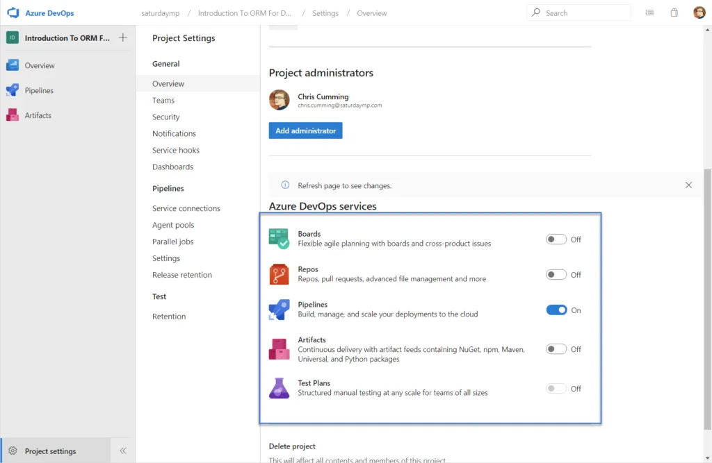

Next I created the Pipeline.

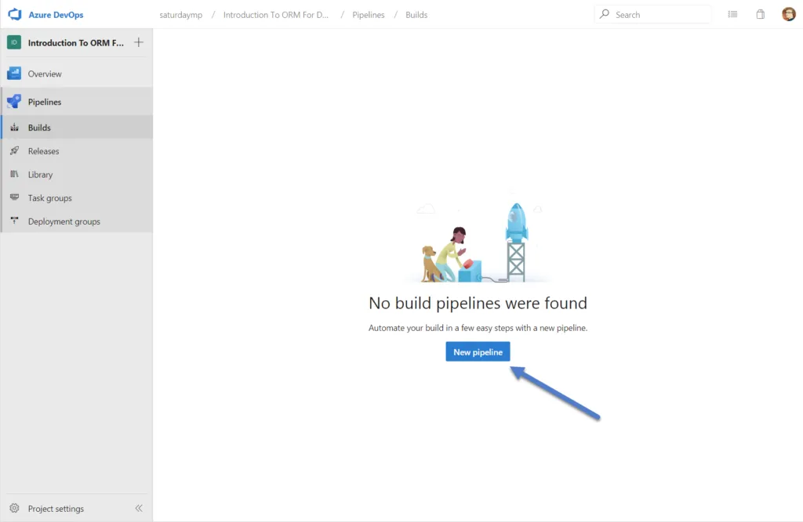

I was prompted where the code is stored. In my case it's stored in GitHub. I also was prompted to give Azure Pipelines access to GitHub which I did.

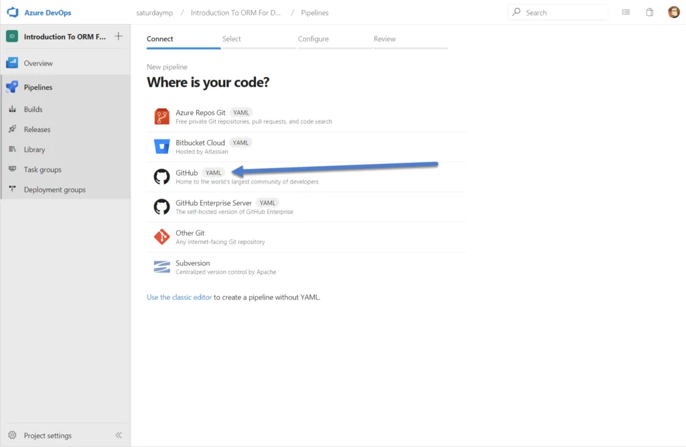

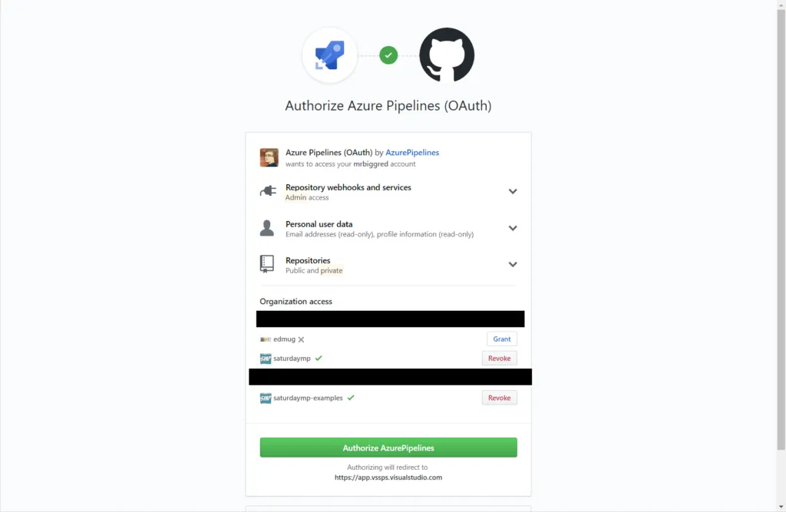

Now need to pick the repository and allow Azure Pipelines to access that repository.

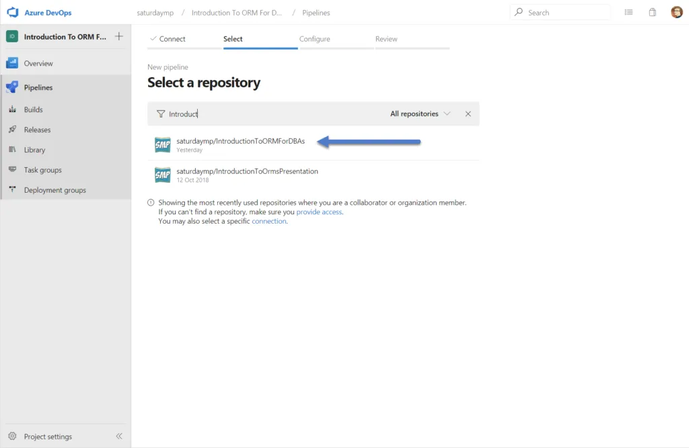

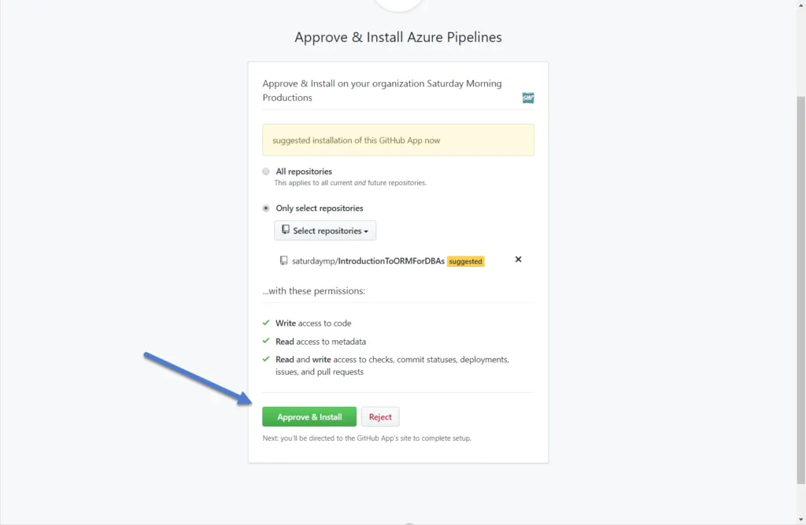

Pipelines now presents some default builds. I picked the ASP .NET Core.

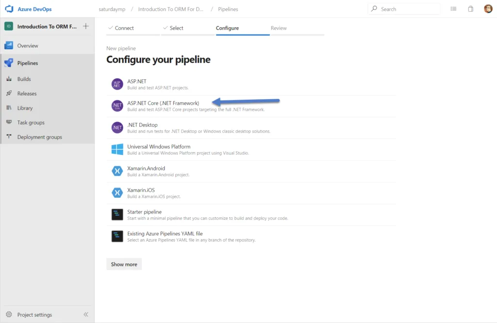

Then generates a reasonable default build file. This file will be stored in the root of you project with the name `azure-pipelines.yml`.

```
# ASP.NET Core (.NET Framework)
# Build and test ASP.NET Core projects targeting the full .NET Framework.
# Add steps that publish symbols, save build artifacts, and more:
# https://docs.microsoft.com/azure/devops/pipelines/languages/dotnet-core

trigger:
- master

pool:
  vmImage: 'windows-latest'

variables:
  solution: '**/*.sln'
  buildPlatform: 'Any CPU'
  buildConfiguration: 'Release'

steps:
- task: NuGetToolInstaller@0

- task: NuGetCommand@2
  inputs:
    restoreSolution: '$(solution)'

- task: VSBuild@1
  inputs:
    solution: '$(solution)'
    msbuildArgs: '/p:DeployOnBuild=true /p:WebPublishMethod=Package /p:PackageAsSingleFile=true /p:SkipInvalidConfigurations=true /p:DesktopBuildPackageLocation="$(build.artifactStagingDirectory)\WebApp.zip" /p:DeployIisAppPath="Default Web Site"'
    platform: '$(buildPlatform)'
    configuration: '$(buildConfiguration)'

- task: VSTest@2
  inputs:
    platform: '$(buildPlatform)'
    configuration: '$(buildConfiguration)'
```

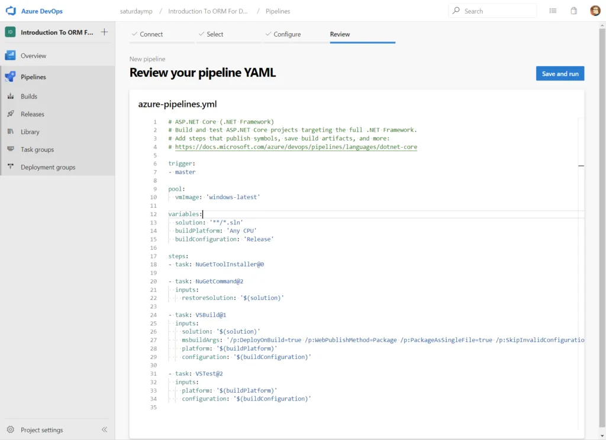

Overall I like the defaults that where picked. Let's examine this scrip in more details and see what it is doing. First it triggers a build on any changes to the `master` branch. I wonder if it will also build on pull requests?

```
trigger:
- master
```

Next it lists the image the build will be preformed on. The '[windows-latest](https://docs.microsoft.com/en-us/azure/devops/pipelines/agents/hosted?view=azure-devops)' is VS 2019 on Windows Server 2019. Works for me.

```
pool:
  vmImage: 'windows-latest'
```

Next it defines some variables to use in the actual build. I like the fact it finds all the solution files as the example project has [10 separate solutions](https://github.com/saturdaymp/IntroductionToORMForDBAs/tree/master/Source) for each of the steps.

```
variables:
  solution: '**/*.sln'
  buildPlatform: 'Any CPU'
  buildConfiguration: 'Release'
```

Next are the actual build steps with the first being install the NuGet packages. Nothing special here.

```
- task: NuGetToolInstaller@0

- task: NuGetCommand@2
  inputs:
    restoreSolution: '$(solution)'
```

After that is the step to compile. In this case compile is done using Visual Studio. I wonder why Visual Studio was picked instead of just building using .NET Core command line? Maybe so it can produce the deploy packages?

I think I can remove building the deploy packages as this build is just for an example and will never be released. For now let's just leave it and see what happens.

```
- task: VSBuild@1
  inputs:
    solution: '$(solution)'
    msbuildArgs: '/p:DeployOnBuild=true /p:WebPublishMethod=Package /p:PackageAsSingleFile=true /p:SkipInvalidConfigurations=true /p:DesktopBuildPackageLocation="$(build.artifactStagingDirectory)\WebApp.zip" /p:DeployIisAppPath="Default Web Site"'
    platform: '$(buildPlatform)'
    configuration: '$(buildConfiguration)'
```

The final step is running the tests. I don't have any tests for my example so I'll be removing this step but for now just leave it and see what happens with the first build.

```
- task: VSTest@2
  inputs:
    platform: '$(buildPlatform)'
    configuration: '$(buildConfiguration)'
```

Let's try to build with the default file and see what happens.

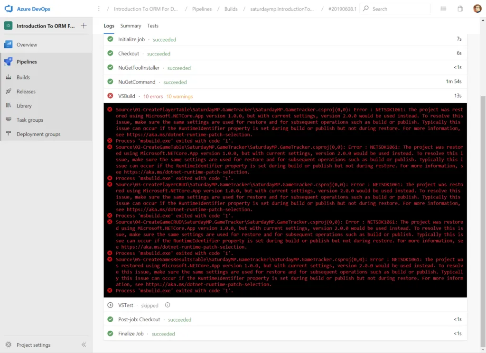

That is no good. Digging into the error message it appears that my application uses .NET Core 2.0 but it's not installed on the image. We can fix this by installing .NET Core 2.0 using the [DotNetCoreInstaller](https://github.com/microsoft/azure-pipelines-tasks/tree/master/Tasks/DotNetCoreInstallerV0) command as our first step.

When specifying the version of .NET Core it wants the SDK version, not the public .NET Core version. In my example I'm using the out of support .NET Core 2.0 but I would like to install the latest version of it. Using this handy [chart](https://github.com/dotnet/core/tree/master/release-notes/2.0) I can see it's SDK version 2.1.202.

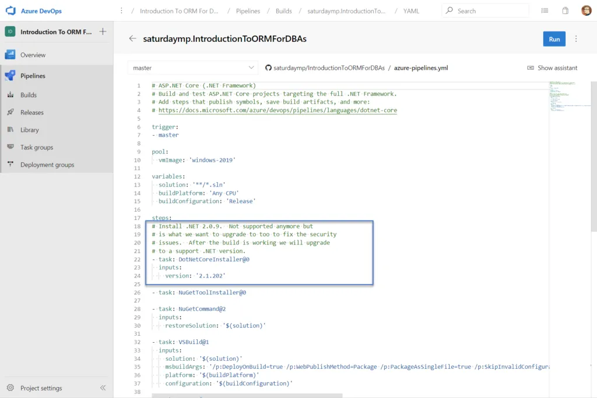

Let me try the build now and see what happens.

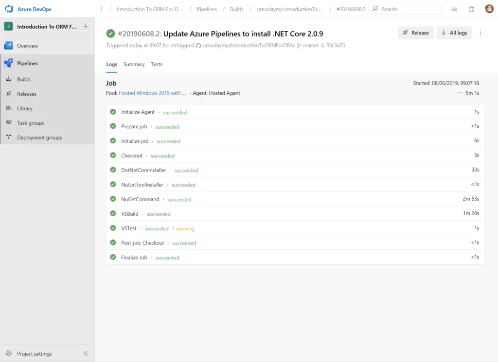

That looks better. The final couple steps is to remove the build steps we don't need, such as tests, and also don't bother creating the deployment packages. I also changed the image to `windows-2019` instead of latest which should prevent the build from magically failing if latest changes to VS 2020 or a different version of Windows. The final build script now looks like:

```
# ASP.NET Core (.NET Framework)
# Build and test ASP.NET Core projects targeting the full .NET Framework.
# Add steps that publish symbols, save build artifacts, and more:
# https://docs.microsoft.com/azure/devops/pipelines/languages/dotnet-core

trigger:
- master

pool:
  vmImage: 'windows-2019'

variables:
  solution: '**/*.sln'
  buildPlatform: 'Any CPU'
  buildConfiguration: 'Release'

steps:
# Install .NET 2.0.9. Not supported anymore but
# is what we want to upgrade to too to fix the security
# issues.  After the build is working we will upgrade
# to a support .NET version.
- task: DotNetCoreInstaller@0
  inputs:
    version: '2.1.202'

- task: NuGetToolInstaller@0

- task: NuGetCommand@2
  inputs:
    restoreSolution: '$(solution)'

- task: VSBuild@1
  inputs:
    solution: '$(solution)'
    platform: '$(buildPlatform)'
    configuration: '$(buildConfiguration)'
```

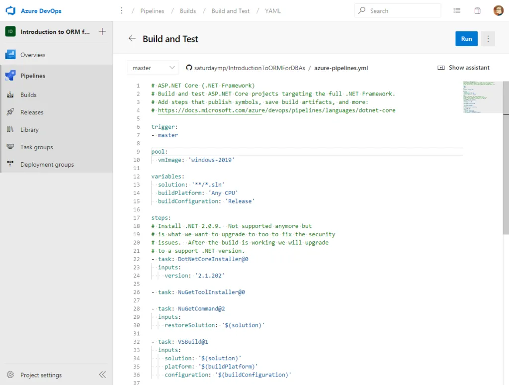

When this build runs there won't be any warnings for the tests because they have been removed.

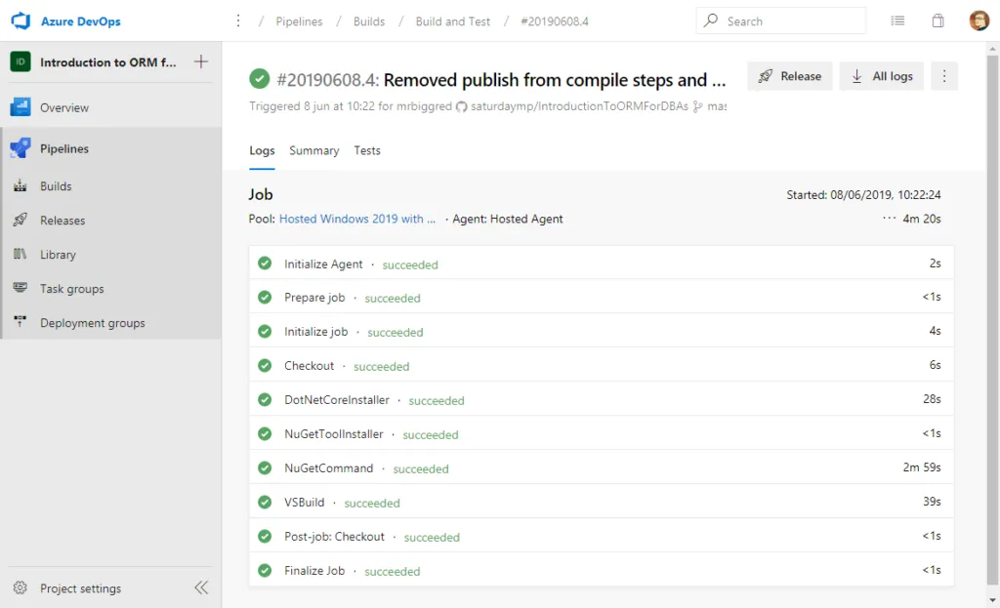

That was relatively painless. If you are curious you can find the public pipeline build [here](https://dev.azure.com/saturdaymp/Introduction%20to%20ORM%20for%20DBAs).

P.S. - For some reason I find [Angels and Airwaves](https://www.youtube.com/channel/UCQWZHOZjvESv0w2LCiYgL-w) great programming music for getting into the zone and their latest song, Rebel Girl, is no exception.

_D-d-do you wanna go back to where we started?  
Back before we were broken hearted?_

https://www.youtube.com/watch?v=zjh5XZsMb18
