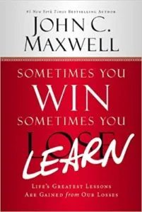

**Book:** [Sometimes you Win, Sometimes you Lean](https://store.johnmaxwell.com/Sometimes-You-Win-Sometimes-You-Learn-Hardcover_p_2785.html)  
**Author:** [John C. Maxwell](https://www.johnmaxwell.com/)

My takeaway from this book had nothing to do with it's premise: learning from your mistakes. Instead my takeaway had to do with writing. Specifically make sure your audience can relate to your example.

One of the first examples of making mistake in the book is when the author accidentally brings a loaded gun to the airport. You can read all the details [here](https://www.johnmaxwell.com/blog/stupid-is-as-stupid-does/) but in summary he was giving a handgun as a gift while on a trip. He flew home on a private plane where, after they landed, the pilot showed him how to load the gun (this part is only in the book). He put the gun in his briefcase and when he got home forgot about it. His next trip, on a public plane, he took the briefcase with the loaded gun to the airport. You can figure out what happened when he got to security.

After the incident the author appears to suffer no loss from the incident aside from some embarrassment. No charges, monetary loss, or loss of reputation. It is also hard to figure out what he learned from the incident.

I kept wondering who was the target audience for that example? It clearly was not for me but I couldn't even picture anyone I know relating to it. It's a shame that example was the at the beginning of the book as later examples are much better. Examples where I felt the lose of the person suffered and the lessons learned as they recovered from their loss.

So my takeaway is to make sure I keep my audience in mind when writing, especially for my examples. Will the reader be able to picture themselves in the example? If not themselves will can the picture someone else? Will the example trigger the emotion(s) I'm hoping for? If I'm writing a technical example what level of developer is it targeted too?

Now I just need to think about who I wrote this blog post for...
