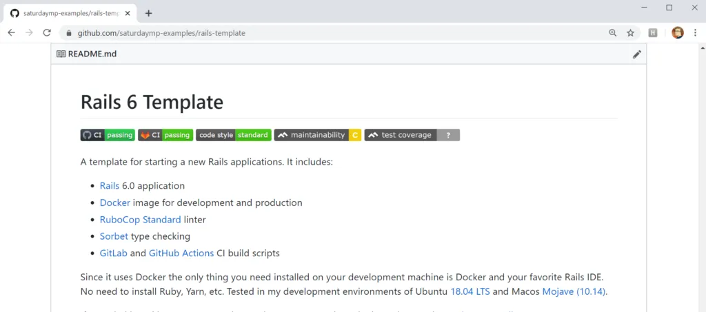

I appreciate people posting getting started examples and templates online. They are good for getting started and playing with a new technology. The problem is the templates are usually not production ready. They are also missing a bunch of the developer tools and best practices, such as linters and automated builds, that every project will eventually need.

So I created a Rails 6 [template](https://github.com/saturdaymp-examples/rails-template) that includes many of the tools I want on a Rails project. I wanted the template to be easy to use but also contain all the tools I wanted. This includes a [Docker](https://www.docker.com/) container, a [linter](https://github.com/testdouble/standard), a [type checker](https://sorbet.org/), and a build scripts. Actually the template has two build scripts, one for [GitHub Actions](https://github.com/features/actions) and one for [GitLab CI](https://gitlab.com/saturdaymp/rails-templates/pipelines). The Docker script will build both development and production images.

Finally the template is deployed with production settings to the new [Render](https://render.com/) hosting. You can see it [here](https://rails-templates.onrender.com/).

Let me know what you think, suggest improvements, or report a bug by opening an [issue](https://github.com/saturdaymp-examples/rails-template/issues). [Pull requests](https://github.com/saturdaymp-examples/rails-template/pulls) are also accepted.
