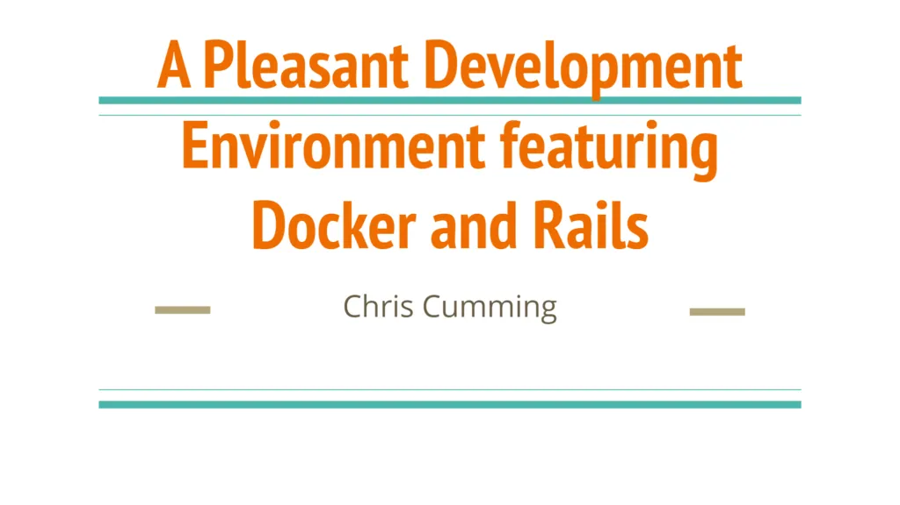

With the current virus issues I forgot to publicize that my presentation about creating pleasant development environments was [posted](https://www.youtube.com/watch?v=vpeJMJxkwbE) along with an [example](https://www.youtube.com/watch?v=nZkXQjFUIgs) of Dockerizing an existing Rails application. You can find the slides for the talk [here](https://github.com/saturdaymp-examples/a-pleasant-development-enironment-featuring-docker-and-rails). Finally you can find a ready to use existing Rails template that uses Docker [here](https://github.com/saturdaymp-examples/rails-template).

Thanks to [YEGRB](https://yegrb.com/) for allowing me to present and to Will for his awesome editing skills. Also thank you to [Corgibytes](https://corgibytes.com/) for feedback on draft presentation.
