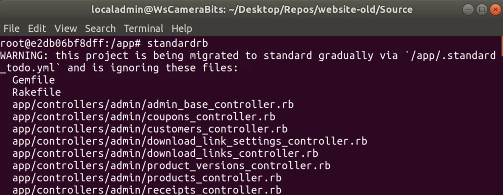
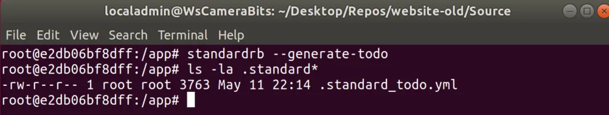
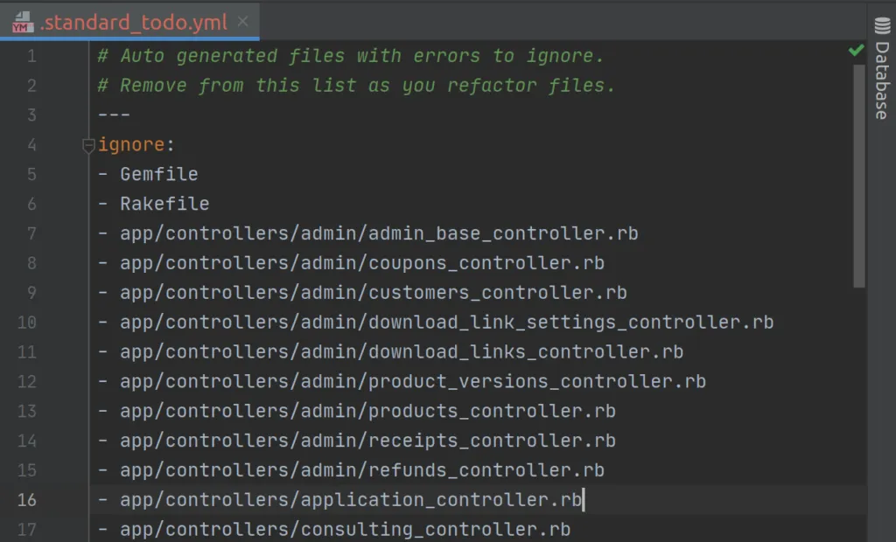
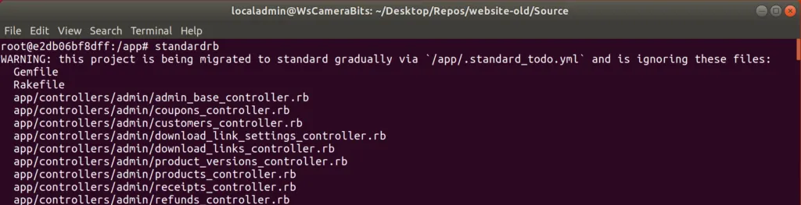

The older I get the more I appreciate code [linters](https://en.wikipedia.org/wiki/Lint_\(software\)). Something that can detect and often correct my formatting errors? Great! One less thing I have to worry about. Then I can spend my time on more important tasks such fixing the bug, adding a new feature, or [uniting/conquering](https://civilization.com/) the world.

The default linter for Ruby is [Rubocop](https://github.com/rubocop-hq/rubocop). It works great but I find it's default rules to restrictive. You can change the defaults but that is time consuming and confusing. At least confusing to me. While searching for a Rubocop config that I liked I came across [Standard](https://github.com/testdouble/standard).

[Standard](https://github.com/testdouble/standard) is a wrapper for Rubocop but had defaults that like. It's goal is to remove thinking about linting. Just install it and it works. No configuration setup and reasonable defaults. Great! Looks like everything I wanted.

Well, almost everything. Standard did not have a way to generate a Todo file. A file that lists all the errors in an existing project that we want to ignore until we get a chance to fix them.

Why would you want this? Well if you are working with [Corgibytes](https://corgibytes.com/) you end up working on legacy projects. Projects with poorly written code with little to no tests and no automated build.

The first thing we do when inheriting a legacy code base is to baseline it. Take note of code coverage, which automated tests are failing, known bugs, and of course what linting errors exist. Once we have the baseline numbers we make sure any changes only improve the code, not make things worse. For example, we always want the code coverage number to stay the same or go up, it should never go down. For linting errors the number should always be decreasing.

Now Standard [0.4.0](https://rubygems.org/gems/standard) has a way to generate a baseline in the form of a Todo file. Which means you can now incorporate Standard into the you build procedure. For example if you run Standard on my old website it will spit out lots of errors:



To create the baseline for the linter generate the Todo file run Standard with the following command:

```bash
standardrb --generate-todo
```



This will generate a `.standard_todo.yml` file that contains a list of all the files with errors in them. For my old website there are lots of errors.



Now when we run Standard we don't get any errors. That said we do still get a nice message reminding us to remove files from the Todo file.



So go ahead and try it out. If you have any feedback please let me know by opening an [issue](https://github.com/testdouble/standard/issues). Special thank to [TestDouble](https://github.com/testdouble) and [Searls](https://github.com/searls) for creating [Standard](https://github.com/testdouble/standard) and working with me on the [pull request](https://github.com/testdouble/standard/pull/155).

P.S. - Below song is not related to the post but the current state of Alberta. Rough couple of months for many due to the economic fallout from the virus shutdown and the price of oil. That I, like many, are missing travelling. Who would have thought I would miss driving?

_Hurtin' albertan with nothing more to lose  
Too much oil money, not enough booze  
East of the rockies and west of the rest  
Do my best to do my damnedest and that's just about all I guess_

https://www.youtube.com/watch?v=3k5AlNdJnE4
