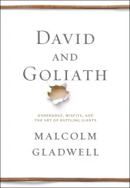
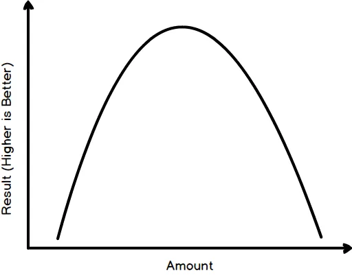

**Book:** [David and Goliath](https://en.wikipedia.org/wiki/David_and_Goliath_\(book\))  
**Author:** [Malcolm Gladwell](https://www.gladwellbooks.com/)

The subtitle for the book is "Underdogs, Misfits, and the Art of Battling Giants" and as you would expect it has many examples of an underdog beating a giant. Often the underdogs have to use unconventional approaches as facing the giant head one would result in their defeat.

An item that almost became my takeaway is that sometimes the underdog is not really the underdog. Instead sometimes the underdog is more powerful then they appear. A good example of this is the title story of David and Goliath as examined by Gladwell. He argues that David was armed with a superior weapon, the sling. The sling with it's much longer range and stopping power then the sword wielded by Goliath. Basically David brought a gun to a knife fight and unsurprisingly won.

My actual takeaway from this book is to watch for the inverted U curve.

If you are at one end of the curve, say the right side, the decreasing whatever the amount is by a little gets you better results. The problem is if you decrease the amount too much you actually get just as bad results as if you had too much.

The example in David and Goliath is classroom size. Large class sizes, say greater then 30, resulted in poor grades (results) and when the class size was reduced the students grades got better. The problem is if you make the class size too small, say less then 18, the students grades are just a worse if the class is too large. What you ideally want is the optimal class size of somewhere around 18 students. Enough for students to group and and interact but not too many to overwhelm the teacher.

My takeaway is to keep an eye out for the inverted U curve in my own life. Pay attention when I've reached the optimal amount of work, play, exercise, vegetables, etc. Also for my professional life. Like the optimal amount of blog posts per month?
