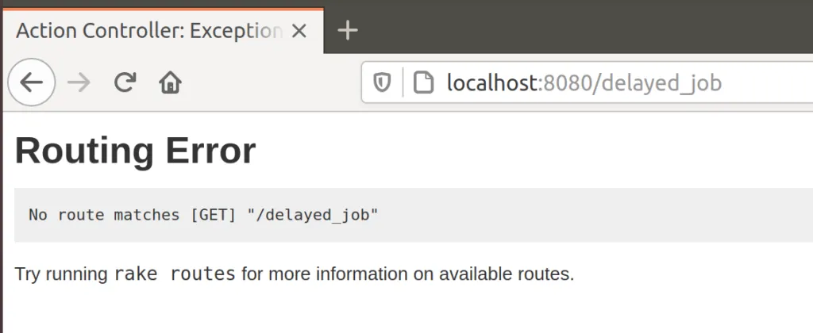
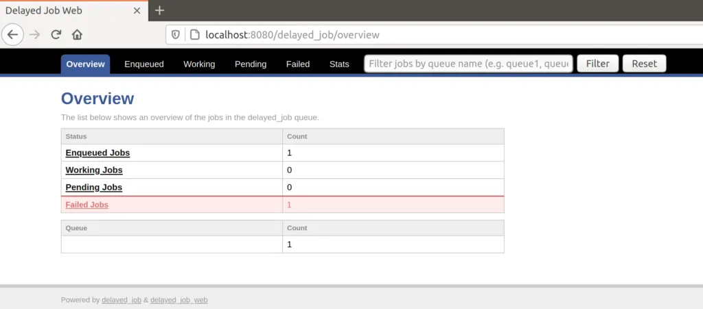

A client has an online store that is powered by an older version of [Spree](https://github.com/spree/spree). I'm in the process of upgrading it and adding features to it at the same time. It's a slow process as upgrading to newer versions of Spree, which also requires upgrading Ruby and Rails, is no easy task.

One customization the customer has is a [delayed job](https://github.com/collectiveidea/delayed_job) that fires when a order is complete. The delayed job preforms some tasks that can take a while hence why they are done in a separate process after the order is completed.

Recently there was some issues with the delayed job task that forced me look how the delayed jobs where setup and managed. I found a couple things should be [fixed](https://www.sitepoint.com/delayed-jobs-best-practices/), such as not deleting failed jobs. Not being able to find the error message for failed job was pain.

The most serious issue I discovered was in the page to view the delayed jobs, which used the [Delayed Job Web](https://github.com/ejschmitt/delayed_job_web) gem. Access to the page was restricted by a password (good) but was only done use [HTTP basic auth](https://en.wikipedia.org/wiki/Basic_access_authentication) (bad) and had a hard coded password from a previous developer (bad).

Reviewing the Delayed Job Web [documentation](https://github.com/ejschmitt/delayed_job_web#authenticating-with-devise-and-warden) I found that it does support authenticating with [Devise](https://github.com/heartcombo/devise). That was good as Spree also uses Devise for [authentication](https://github.com/spree/spree_auth_devise). After some research, trail and error I found that the following will work only allow Spree Admin's to access the delayed job page:

```ruby
# config/routes.rb

Spree::Core::Engine.routes.prepend do
  authenticated :spree_user, -> spree_user { spree_user.admin? } do
    mount DelayedJobWeb, at: "/delayed_job"
  end
end
```

Notice instead of using just `:user` we need to use `:spree_user`. Not if someone tries to view the delayed job page when not logged in or as an non-admin Spree user then a 404 error is returned.



If logged in as a Spree admin then you can view the page as normal.



I struggled to create unit tests for the above. At first I just created some RSpec route tests:

```ruby
# spec/routing/delayed_job_spec.rb

require 'rails_helper'

describe 'routes for delayed jobs', type: :routing do
  routes { Spree::Core::Engine.routes }

  context 'user not logged in' do
    it 'they cannot see the route' do
      expect(:get => "/delayed_job").to_not be_routable
      expect(:post => "/delayed_job").to_not be_routable
    end
  end

  context 'user logged in' do
    before(:each) do
      login_user
    end

    it 'they cannot see the route' do
      expect(:get => "/delayed_job").to_not be_routable
      expect(:post => "/delayed_job").to_not be_routable
    end
  end

  context 'user logged in as admin' do
    before(:each) do
      login_admin
    end

    it 'they can see the route' do
      expect(:get => "/delayed_job").to be_routable
      expect(:post => "/delayed_job").to be_routable
    end
  end
end
```

Unfortunately that failed with an error:

```
NoMethodError: undefined method 'authenticate?' for nil:NilClass
```

Turns out this is a known issue with Rails 3 and Devise as outlined [here](https://github.com/heartcombo/devise/wiki/How-To:-Test-controllers-with-Rails-\(and-RSpec\)#authenticated-routes-in-rails-3). So instead I created integration tests for the delayed job security using Cucumber.

```ruby
# features/delayed_job.feature

@javascript
Feature: Delayed Job

  @allow-rescue
  Scenario: I can't view Delayed Job page if I'm not logged in
    When I visit the delayed job page
    Then I get a 404 error

  @allow-rescue
  Scenario: I can't view Delayed Job page if I'm not an admin
    Given I am logged in as a user
    When I visit the delayed job page
    Then I get a 404 error

  Scenario: I can view Delayed Job page if I'm logged in as admin
    Given I am logged in as an administrator
    When I visit the delayed job page
    Then I can see the delayed job page
```

```ruby
# features/step_definitions/delayed_job_steps.rb

When(/^I visit the delayed job page$/) do
  visit "/delayed_job"
end

Then(/^I get a 404 error$/) do
  expect(page).to have_text('Routing Error No route matches [GET] "/delayed_job"')
end

Then(/^I can see the delayed job page$/) do
  expect(page).to have_text('The list below shows an overview of the jobs in the delayed_job queue')
end
```

While not unit tests having integration tests is better then nothing.

As I continue to upgrade the client's Spree store I'll eventually replace the unsupported `delayed_job` gem with something that is. Perhaps [Active Job](https://guides.rubyonrails.org/active_job_basics.html) or [Sidekiq](https://github.com/mperham/sidekiq).

P.S. - One of the first songs that come up when I searched for songs about jobs. Never heard it before but it made me chuckle.

_Take this job and shove it  
I ain't workin' here no more  
My woman done left and took all the reasons  
I was working for  
Ya better not try to stand in my way  
As I'm walkin', out the door  
Take this job and shove it  
I ain't workin' here no more_


