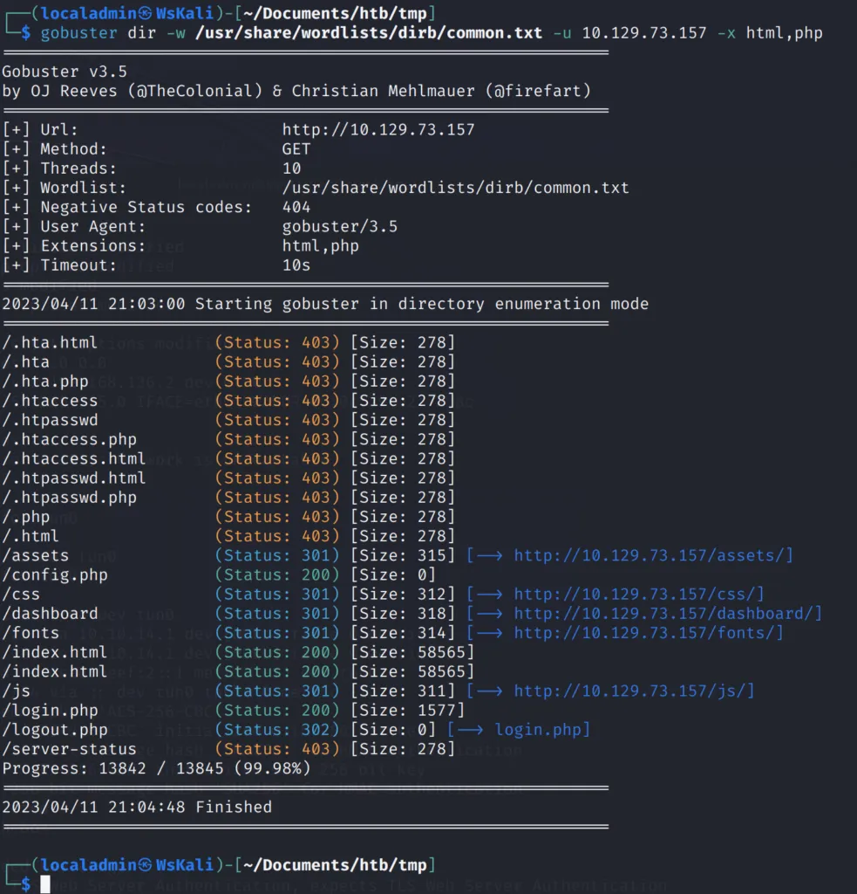

I've made it a goal for 2023 to increase my security knowledge. This was based on increase in security related questions from clients. Specifically related to website security as most of my current work is maintaining websites for clients.

One thing I was not expecting was the amount security tools that are available. To help me remember I figured I should write them down and what better place then the dusty old blog.

The tool I learned about today is [Gobuster](https://github.com/OJ/gobuster). It is a tool that lets you brute force directories and files on a website. At least that is all I've used it for so far but it can also be used to guess DNS subdomains, vhosts, etc.

Gobuster needs a wordlist which is a file of paths to try. If you are using [Kali Linux](https://www.kali.org/) you can find several at `/usr/share/wordlists`. If you aren't using Kali, or need additional wordlists try the [danielmiessler/SecLists](https://github.com/danielmiessler/SecLists).

An example of running Gobuster on a [Hack the Box](https://www.hackthebox.com/) website. The goal was to find the "hidden" `login.php` file so I could login to the website using credentials acquired via a open FTP directory.

I think Gobuster will be a useful tool to make sure a client is not exposing files they don't mean too. For example, an incorrectly configured Apache/Nginx server. Or maybe the client accidently added an file they shouldn't have to Git and now it shows up on their website.

P.S. - I searched for songs about finding things but that wasn't very fruitful so changed the search to secrets and found the one below. It has good advice about not caring about if others know your secrets but that only applies if you are human. Websites should keep their secrets secret.

_I don't care if the world knows what my secrets are  
Secrets are  
I don't care if the world knows what my secrets are  
Secrets are  
  
So, what?  
So, what?  
So, what?  
So, what?_


